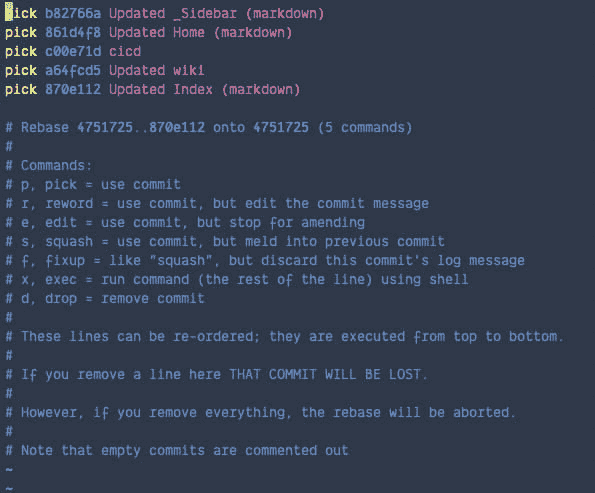
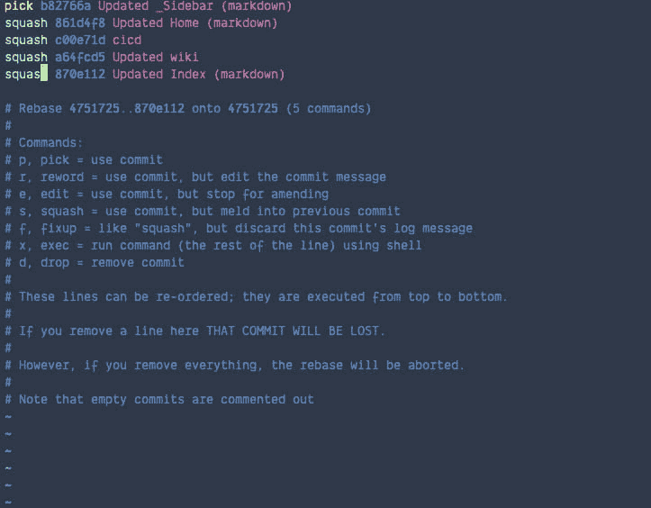
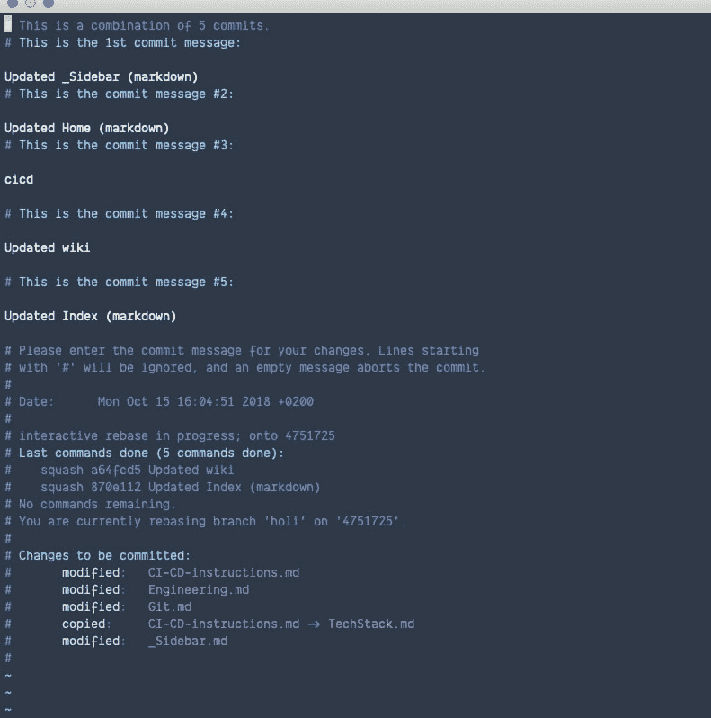
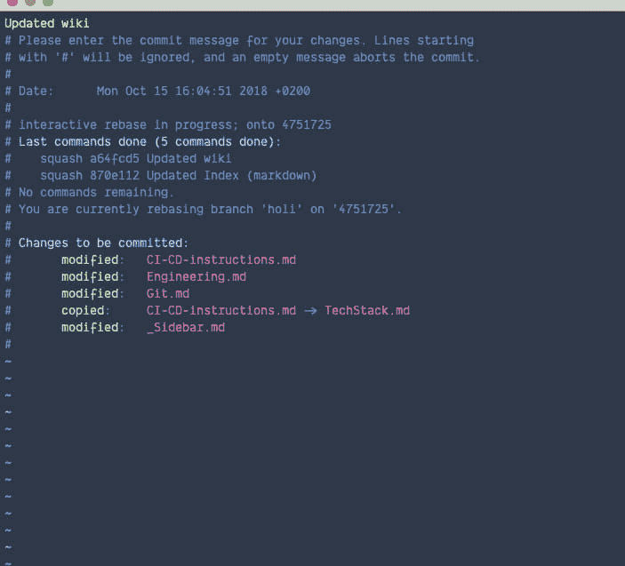
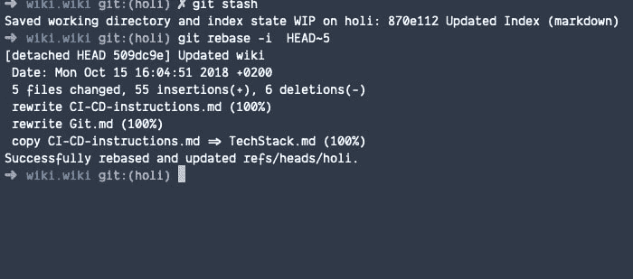
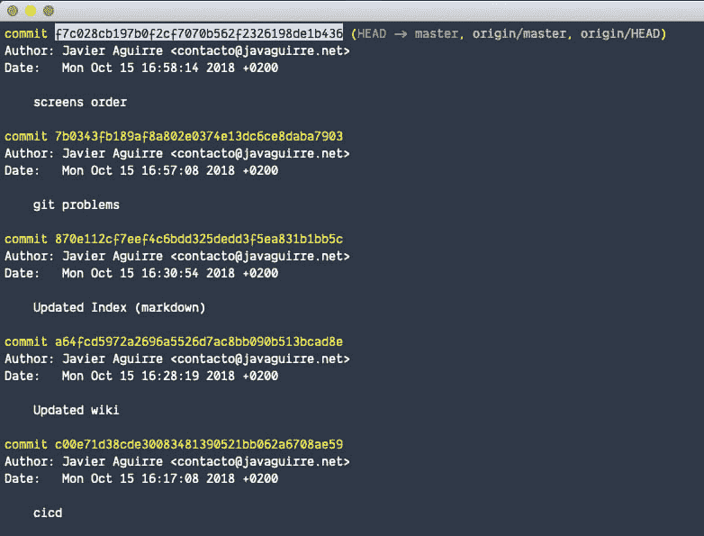

# 适用于所有家庭的常见 Git 问题和简单的增量解决方案

> 原文：<https://dev.to/wealize/common-git-problems-and-easy-incremental-solutions-for-all-the-family-10gd>

Git 是一种温和的野兽，但野兽是野生的，它们需要驯服，这里有一些技巧来解决 99%的 git 问题。

[](https://i.giphy.com/media/3oEduIpnblLzPwzJPG/giphy.gif)

与不同经验水平的开发人员一起工作让我意识到，我们应该有一个简单合适的方法来解决在 git 项目中所有可能出现的问题，这就是我最初写这篇教程的原因。

在我的公司，我们遵循 [git 流](https://es.atlassian.com/git/tutorials/comparing-workflows/gitflow-workflow)的一个小变体，这里没有**开发**分支，而是一个**发布**一个
，它在每次 sprint 中与**主**合并，并在下一次 sprint 中被重新创建，直到我们再次合并，自动部署到生产中。

我们做了这种变化，因为我们发现当公司中有不同水平的 git 知识时，保持**开发**分支整洁和干净是具有挑战性的。

我们使用 **git fetch** 来本地更新我们的 git 数据库，所以我们有最新的变化。如果有疑问，我们总是从**起点**重新设定基础并创建分支，从不从本地分支创建，因为我们可能会搞砸。

当开发一个特性时，我们总是使用 **rebase** 来更新来自**发布**的当前特性。我们将**特性**分支压缩到一次提交中，因此一旦特性被审查并准备合并，就很容易回滚。

```
# Being on the feature/my-tasty-feature branch

git fetch origin
git rebase origin/release 
```

Enter fullscreen mode Exit fullscreen mode

创建特征分支:

```
# Being on master or release or any other branch different from the one created

git fetch origin
git checkout -b feature/my-tasty-feature origin/release 
```

Enter fullscreen mode Exit fullscreen mode

## 第一个问题及解决方案

我们需要用**版本**更新我们的代码，因为我们没有最新的变化。在我们的特色分支我们可以做:

```
# Being on the feature/my-tasty-feature branch

git fetch origin
git rebase origin/release
git push -f feature/my-tasty-feature 
```

Enter fullscreen mode Exit fullscreen mode

`-f`只能用于未合并的个人分行。它意味着*强制*，并且它重写了 git 历史，所以我们在使用它的时候需要非常小心。

## 第二题及解法

我们必须从 **release** 重新开始，我们有许多提交，我们需要解决不同提交的几个冲突，我们需要将我们的分支变更为一个！

首先，我们需要知道我们想要添加多少提交到 **release** 并挤压它们。

```
# Being on the feature/my-tasty-feature branch

git rebase -i HEAD~5 # where five is the number of commits 
```

Enter fullscreen mode Exit fullscreen mode

我们替换所有第一行**选择**进行**挤压**除了第一行并保存。

[](https://res.cloudinary.com/practicaldev/image/fetch/s--jHklIpZl--/c_limit%2Cf_auto%2Cfl_progressive%2Cq_auto%2Cw_880/https://thepracticaldev.s3.amazonaws.com/i/h5xfptmpnqrcsacl3ujn.png)

[](https://res.cloudinary.com/practicaldev/image/fetch/s--xgIIRwWx--/c_limit%2Cf_auto%2Cfl_progressive%2Cq_auto%2Cw_880/https://thepracticaldev.s3.amazonaws.com/i/arxr6ftdute5fun5va7w.png)

我们可以更改提交名称并添加相关内容，保存文件。

[](https://res.cloudinary.com/practicaldev/image/fetch/s--m6SMoBc_--/c_limit%2Cf_auto%2Cfl_progressive%2Cq_auto%2Cw_880/https://thepracticaldev.s3.amazonaws.com/i/i7qlkxyvbuhqv4co9k0c.png)

[](https://res.cloudinary.com/practicaldev/image/fetch/s--tU4JtHAi--/c_limit%2Cf_auto%2Cfl_progressive%2Cq_auto%2Cw_880/https://thepracticaldev.s3.amazonaws.com/i/99kcy65673fnm9jhvkkr.png)

搞定了。

[](https://res.cloudinary.com/practicaldev/image/fetch/s---eQY-Bcd--/c_limit%2Cf_auto%2Cfl_progressive%2Cq_auto%2Cw_880/https://thepracticaldev.s3.amazonaws.com/i/1h6sjduvwot1x6gtsz6k.png)

现在我们需要解决这个冲突:

```
# Being on the feature/my-tasty-feature branch

git rebase origin/release 
```

Enter fullscreen mode Exit fullscreen mode

我们在我们最喜欢的编辑器上修复冲突并添加文件，然后

```
# Being on the feature/my-tasty-feature branch

git rebase --continue
git push -f feature/my-tasty-feature 
```

Enter fullscreen mode Exit fullscreen mode

## 第三题及解答

在我们的 GitHub pull 请求中，我们有不属于我们分支的提交，但是来自 **release** ，这可能有两个原因:

*   因为我们没有做*第一解*
*   因为我们更新了**主**分支，一些提交散列已经改变(这应该很少发生)。

如果你想了解更多关于`rebase`如何运作的信息，请点击链接。

在这种情况下，最好的方法(或者最直接的方法)通常是重建我们的分支。首先，我们需要知道有多少提交我们想要添加到**发布**中并挤压它们，所以我们将完全执行*的第二个解决方案*。

完成第二个解决方案后，我们将执行以下操作。

```
# We are on the feature/my-tasty-feature branch

git fetch origin

git checkout -b feature/my-backup-branch origin/feature/my-tasty-branch

# We delete the branch we're going to rebuild locally

# We are on feature/my-backup-branch
git branch -D feature/my-tasty-branch
git checkout -b feature/my-tasty-branch origin/release

git log feature/my-backup-branch

# We are on feature/my-tasty-branch
# We copy the last commit hash (see screenshot below)
git cherry-pick the-hash-we-have-copied
git push -f origin/feature/my-tasty-branch 
```

Enter fullscreen mode Exit fullscreen mode

[](https://res.cloudinary.com/practicaldev/image/fetch/s--csEMNrFQ--/c_limit%2Cf_auto%2Cfl_progressive%2Cq_auto%2Cw_880/https://thepracticaldev.s3.amazonaws.com/i/5swzgk561fnx3941dpm8.png)

搞定了。

这些是我给刚加入我的团队的人的建议，当他们遇到 Git 的问题时，你觉得怎么样？你会改变什么吗？有推荐吗？