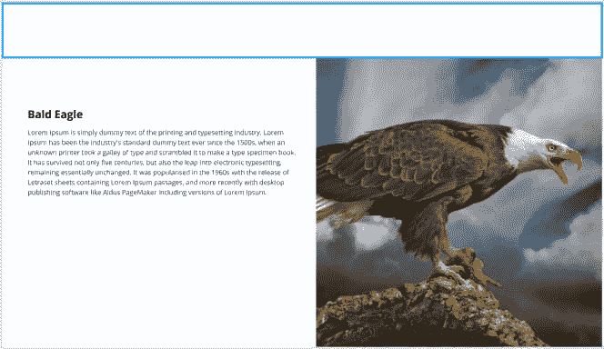

# 如何处理离网图像放置？

> 原文：<https://dev.to/raisaugat/how-to-deal-with-off-grid-image-placement-4id1>

有没有一种简单的方法可以轻松实现这种类型的设计？
[T3】](https://res.cloudinary.com/practicaldev/image/fetch/s--1xr1A0Nm--/c_limit%2Cf_auto%2Cfl_progressive%2Cq_auto%2Cw_880/https://thepracticaldev.s3.amazonaws.com/i/i2eah2su8o5c4h1nw03l.png)

布局的整体宽度为 1440 像素。内容放置在 1330px 以内(假设)。有什么方法可以让我在 1330px 的容器内工作？