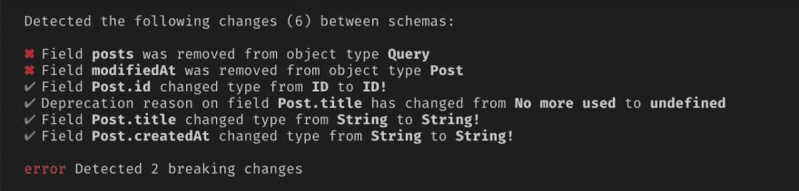
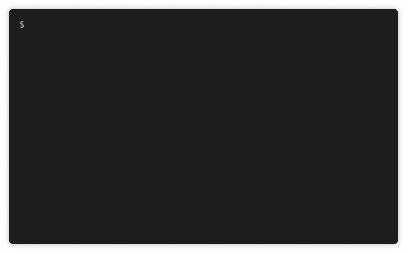
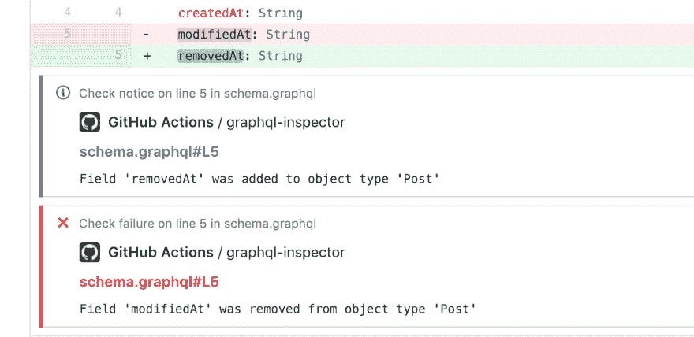

# GraphQL 代码检查器

> [https://dev . to/graph qle editor/graph QL 代码检查器-4143](https://dev.to/graphqleditor/graphql-code-inspector-4143)

GraphQL 实际上是关于协作的，那些能够在他们的 GraphQL API 上无缝协作的团队会走得更远。

这个想法是众所周知的[成员公会](https://github.com/the-guild-org)知道从开源惊人的 graphql 工具。其成员不断致力于新的解决方案，旨在自动化&提高我们 GraphQL 项目的类型安全性。在开源了像 [GraphQL 代码生成器](https://graphql-code-generator.com/)或者 [GraphQL 模块](https://graphql-modules.com/)这样的工具之后，他们的下一个作品 [GraphQL inspector](https://graphql-inspector.com/)

[GraphQL Inspector](https://graphql-inspector.com/) 是由 [Kamil Kisiela](https://github.com/kamilkisiela/) 发布的工具，它可以检测变化、相似或重复的类型，根据模式验证文档，并查找不推荐的用法。

**主要功能/命令:**

*   [diff](https://graphql-inspector.com/docs/essentials/diff) -检测中断或危险变化，
*   [validate](https://graphql-inspector.com/docs/essentials/validate) -根据模式验证文档&搜索不推荐的用法，
*   [similar](https://graphql-inspector.com/docs/essentials/similar)-列出相似的类型，以便找到重复的，
*   [覆盖率](https://graphql-inspector.com/docs/essentials/coverage)——根据客户端的片段&操作，找到 GraphQL 模式中未使用的部分。

该工具可通过以下方式获得:

*   [CLI 工具](https://graphql-inspector.com/docs/installation)
    T3T5】

*   [Github 应用](https://github.com/apps/graphql-inspector)
    

    ##### 来源: [GraphQL 检查员](https://graphql-inspector.netlify.com/)

还有一个[编程 API](https://graphql-inspector.com/docs/api/schema) 可供使用，以防你想在它的基础上自己构建一些东西。