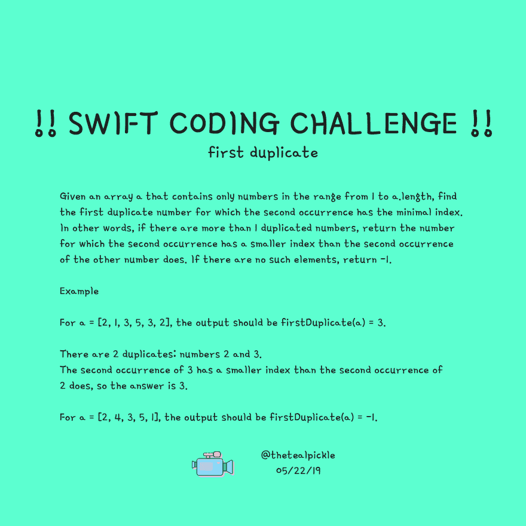
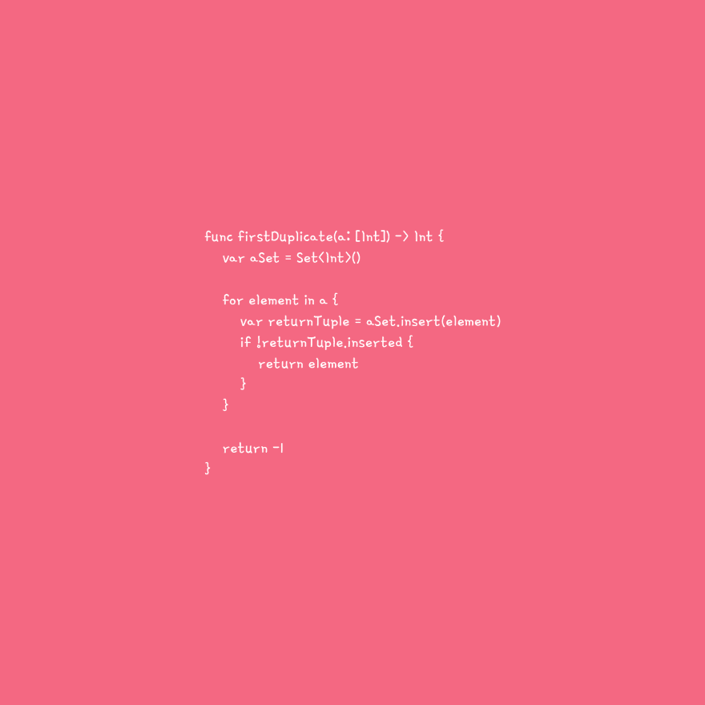

# 第一个副本！！Swift 编码挑战！！

> 原文：<https://dev.to/thetealpickle/first-duplicate-swift-coding-challenge-2f79>

Swift 编码挑战！！
第一份副本。给定一个数组 a，它只包含从 1 到 a.length 范围内的数字，找出第二个匹配项具有最小索引的第一个重复数字。

😛级别:简单😛
[T3】](https://res.cloudinary.com/practicaldev/image/fetch/s--NcZP3G_h--/c_limit%2Cf_auto%2Cfl_progressive%2Cq_auto%2Cw_880/https://thepracticaldev.s3.amazonaws.com/i/gyhdqryflq1ev1wyteg1.png)

我已经包括一个解决方案的视频！！这个视频让我了解了我是如何解决这个问题的。在查看解决方案视频和解决方案代码之前，不要忘记尝试解决问题😉 😉

如果你有一个你想让我解决的编码挑战，请随时留言或给我发信息！！😊 😊我们去找斯沃💪🏾 💻 💻