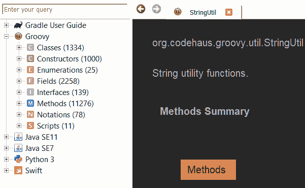

# 编程语言快速参考

> 原文：<https://dev.to/thefern/programming-languages-quick-reference-3omg>

我们都曾在某个地方见过语言文档。偶尔你会发现自己在一个地方，你需要查找一些东西，没有互联网接入或没有离线保存。

显然，如果都失败了，首先要看的是源代码，或者其他工具，如 xcode，有内置的文档，但并不是所有语言/工具都是如此。

这就是[热情](https://zealdocs.org/)发挥作用的地方，它受到了[冲刺](https://kapeli.com/dash)的启发。这是一个很棒的应用程序，你可以下载文档集，方便离线使用任何语言。老实说，我不知道这种工具存在了这么久。我希望它对你的探索有用。

**注意:** Zeal 版本对 linux 和 windows 是免费的。Dash 是为 mac 设计的，dash 可以免费使用，但是会让你不停地购买，如果你有钱，请支持他们。(非 Dash 赞助:)

让我知道其他类似的工具，或者你浏览语言文档的其他方式。

