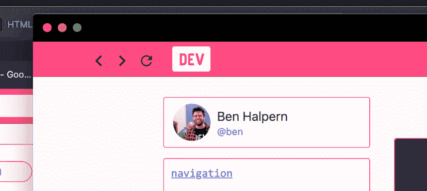

# 有什么方法可以在 PWAs(特别是桌面 PWA)中检测用户是否“可以返回”

> 原文：<https://dev.to/ben/is-there-any-way-to-detect-if-a-user-can-go-back-in-pwas-desktop-pwa-most-specifically-203j>

首先，感谢昨天的讨论:

 [## 如何处理桌面 PWA 中的出站链接？

### 本·哈尔彭 5 月 21 日 191 分钟阅读

#discuss #help #webdev #pwa](/ben/how-to-handle-outbound-links-in-desktop-pwa-3o4n)

我听取了反馈，并制定了一些公关策略:

# [ 添加 PWA 目标空白功能 #2921](https://github.com/thepracticaldev/dev.to/pull/2921) 

 **[benhalpern](https://github.com/benhalpern)** posted on [<time datetime="2019-05-21T16:28:03Z">May 21, 2019</time>](https://github.com/thepracticaldev/dev.to/pull/2921)

## 这是什么类型的公关？(勾选所有适用选项)

*   [ ]重构
*   [x]功能
*   [ ]错误修复
*   [ ]文档更新

## 描述

如果页面是由一个*桌面* PWA 渲染的，就在锚标签上添加`target="_blank"`。这似乎是电脑设备的合适功能，但触摸屏应该在*虚拟浏览器*中保持打开。

在我们试验 PWA 功能时快速解决。

[View on GitHub](https://github.com/thepracticaldev/dev.to/pull/2921)

现在我对另一个我还没有找到的 PWA 特性感到好奇。

我们已经在开发桌面 PWA 中实现了导航按钮，如下所示:

*团队粉红模式*💕

他们使用`window.history.back();`很容易工作，但是现在，他们没有“开/关”状态，因为我不确定如何确定用户“可以后退或前进”。我知道这在典型的窗口 API 中是不可用的，但是考虑到我们自己在 PWA 中负责后退按钮，我想知道是否有任何公开的东西可以帮助确定这一点？