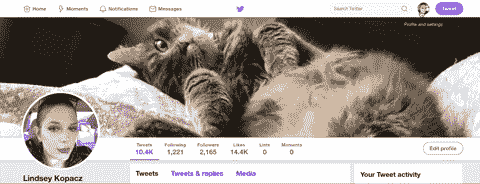

# 让你的推文更容易被人理解的 7 种方法

> 原文：<https://dev.to/lkopacz/7-ways-to-make-your-tweets-more-accessible-4c67>

*最初发布于[www.a11ywithlindsey.com](https://www.a11ywithlindsey.com/blog/7-ways-tweets-more-accessible)。在那篇文章中，我加入了一些视频，告诉屏幕读者听起来是怎样的，但是因为它们不在 youtube 上，所以我不能在这里链接它们。查看他们的原始博客帖子！*

不久前，我写了一篇 tweet 帖子，开始谈论在我们使用的平台(如 Twitter)上保持可访问性的方法。有时我们无法控制我们使用的平台，我们能做的最好的事情就是确保我们的内容是可访问的。这条推文得到了相当多的关注，但不幸的是，事情很容易在 Twitterverse 中丢失。我决定写一篇博文，详细阐述我提出的每个关键点，同时也确保你能更容易地找到它们。

## 小心使用你的表情符号

> 感谢👏你们👏肯特。(也不要做拍手的事情，这是屏幕阅读器的巨大痛苦)
> 
> — Marcy Sutton ([@marcysutton](https://dev.to/marcysutton) ) [January 9, 2019](https://twitter.com/marcysutton/status/1083074150749503488?ref_src=twsrc%5Etfw)

Marcy 在这里指出拍手对于屏幕阅读器来说实际上是一种痛苦。

如果你打开屏幕阅读器，它会显示如下:“谢谢拍手者，你拍手者，肯特。”你能想象如果在一个长句子的每个单词之间都这样做吗？我看到热情的人总是这样做，尤其是当他们想就社会问题发表意见的时候。我在两个世界之间左右为难，因为我知道这对屏幕阅读器来说有多糟糕，但通常情况下，我支持推文背后的信息。

总的来说，我们应该小心使用表情符号。为了这篇博文，我创建了一条推文。如果我们只用表情符号而没有文字来塞满一条推文，听起来就像文字呕吐。

我喜欢表情符号，但我们不要滥用它们。我们应该多使用词语！

## 不要在你的句柄或推文中使用特殊字符

我在以前的帖子中已经提到过这条推文，但我将重复一遍:

> 你𝘵𝘩𝘪𝘯𝘬它是𝒸𝓊𝓉ℯ𝘄𝗿𝗶𝘁𝗲你的推文和用户名𝖙𝖍𝖎𝖘 𝖜𝖆𝖞.但是，你有𝙡𝙞𝙨𝙩𝙚𝙣𝙚𝙙到什么它𝘴𝘰𝘶𝘯𝘥𝘴 𝘭𝘪𝘬𝘦与辅助技术一样，𝓥𝓸𝓲𝓬𝓮𝓞𝓿𝓮𝓻？[pic.twitter.com/CywCf1b3Lm](https://t.co/CywCf1b3Lm)
> 
> — Kent C. Dodds ([@kentcdodds](https://dev.to/kentcdodds) ) [January 9, 2019](https://twitter.com/kentcdodds/status/1083073242330361856?ref_src=twsrc%5Etfw)

如果你听他的视频，能听出多少没有任何意义吗？它可能不那么可爱或花哨，但通常不要尝试使用平台上不支持的字体是一个好主意。Twitter 没有给你选择字体的能力，所以你不应该在没有测试的情况下尝试确保它适用于所有人。

## 在您的推文中启用替代文本

并实际使用它们！如果您在台式电脑上，您可以通过以下方式启用它们:

1.  点击您的个人资料图片，进入“设置与隐私”
2.  转到左侧栏的可访问性部分
3.  选中“撰写图像描述”

看，我还给你录了！

一旦你启用了这个，你应该可以在你的图片上看到一个“添加描述”。还有，Twitter，为什么默认不启用这个？

## 测试您个人资料的页面对比度

你曾经测试过你的 Twitter 个人资料主题的颜色对比吗？在检查了我的 Twitter 个人资料上的默认主题后，我发现它们的对比度差得惊人。我使用 [Webaim 颜色对比度检查器](https://webaim.org/resources/contrastchecker/)来查看对比度。大文本的最小对比度是 3:1，小文本是 4.5:1。以下是对比色:

1.  **橙色主题** -背景色为白色前景色上的`#FE6A1F`，对比度为 2:88:1。(失败)
2.  **黄色主题** -背景色为白色前景色上的`#FAB81D`，对比度为 1.76:1。(失败)
3.  **淡薄荷色主题** -背景色为白色前景色上的`#7FDBB6`，对比度为 1.65:1。(失败)
4.  **薄荷色主题** -背景色为白色前景色上的`#19CE86`，对比度为 2.06:1。(失败)
5.  **长春花主题** -背景色为白色前景色上的`#91D1FA`，对比度为 1.65:1。(失败)
6.  **蓝色主题** -背景色为白色前景色上的`#1A94E0`，对比度为 3.30:1。(仅传递大文本)
7.  **灰色主题** -背景色为白色前景色上的`#ABB8C1`，对比度为 2.03:1。(失败)
8.  **深粉色主题** -背景色为白色前景色上的`#E81C4F`，对比度为 4.46:1。(仅传递大文本)
9.  **浅粉色主题** -背景色为白色前景色上的`#F58EA7`，对比度为 2.26:1。(失败)
10.  **紫色主题** -背景色为白色前景色上的`#981CEB`，对比度为 5.67:1。(传递大文本和小文本)

所以如果你计算一下，10 个主题中只有 1 个(！！)对大小文本都有一个短暂的对比。2 传递较大的文本。其余的失败了。这在 Twitter 上很糟糕，但是你也可以添加你自己的自定义十六进制颜色代码！我只是改变了我的颜色，让它成为我网站设计中的一种颜色。

## 用文字交流，而不是用符号造图

“今天的茶”似乎在 Twitter 上很受欢迎，但我无法停止思考这在屏幕阅读器上听起来是什么样的。

> 今日茶:
> (
> ())
> _(_ _ _ _ _ _ _)_ _ _ _ _ _ _(_ _ _ _ _ _ _(_
> \研究生/_
> \应/ |
> \薪宜居/_ _ _ _ _ _ |
> \工资换/
> \自己辛苦/
> \_ 工作 _/
> 
> — Jay Shelat (@jshelat1) [February 7, 2019](https://twitter.com/jshelat1/status/1093314977077911558?ref_src=twsrc%5Etfw)

因为我无法停止思考这个问题，所以我找到了一条推文，并打开了我的屏幕阅读器。我在我的博客上发布了一个视频[关于它的声音。](https://www.a11ywithlindsey.com/blog/7-ways-tweets-more-accessible)

所以，呃，是的。除了不做之外，不知道如何解决。

## 转录模因和 gif

在撰写本文时，还没有办法向 gif 添加替代文本。每当我添加 gif 时，我通常会在正文中键入`[gif alt: Descriptive phrase]`。有时候我看到人们用 gif 信息和 gif alt 回复我，这让我的心在歌唱。你应该对迷因做同样的事情，尤其是当你使用上面的提示在你的照片上启用了替代文本之后。(来源:[一个盲女的生活:6 种方法让你的社交媒体帖子能被有视觉障碍的人看到](https://lifeofablindgirl.com/2018/10/31/6-ways-to-make-your-social-media-posts-accessible-for-people-with-a-visual-impairment/))

## 将标签中的单词大写

这个对我来说是新的，但是很有意义。如果没有它，它会让许多屏幕阅读器将文字混在一起，听起来就像一团乱麻。(来源:[一个盲女的生活:6 种方法让你的社交媒体帖子对有视觉障碍的人可用](https://lifeofablindgirl.com/2018/10/31/6-ways-to-make-your-social-media-posts-accessible-for-people-with-a-visual-impairment/))

## 结论

我要感谢那些写博客的人，就像上面提到的最后两节的来源。如果你还没有，我会读那篇文章，因为有我想包括的项目，但这篇文章开始变得太长了。即使作为一个易访问的人，我仍然有很多关于这些平台的知识要学习。我也从伟大的科技倡导者那里学到了很多，比如马西·萨顿、T2、黛博拉·爱德华兹-奥诺罗和 T4·塔蒂亚娜·麦克！可访问性不仅仅是关于编码，而是关于使用已经成为日常使用和司空见惯的产品的真实的人。

记得发微博之前先思考一下。你可能会拒绝哪些人阅读你的 Twitter 内容？如果你对这篇文章有任何想法，请随时联系我，你猜对了， [Twitter](https://twitter.com/LittleKope) 。