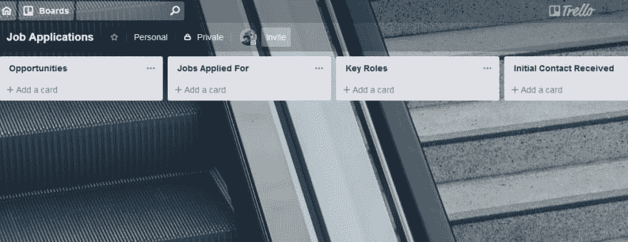
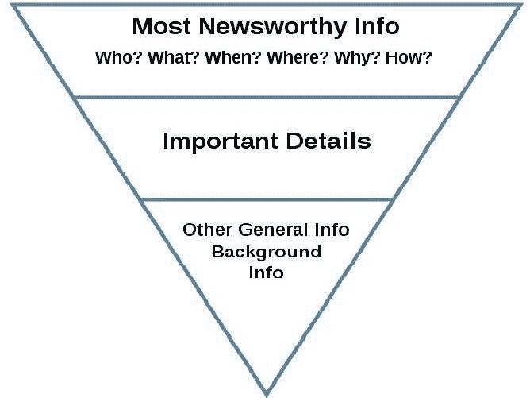

# 被聘为科技行业的开发人员

> 原文：<https://dev.to/kendalmintcode/getting-hired-as-a-developer-in-the-tech-industry-472o>

作为神话般的学习资源“编码蔻驰”的导师(由鼓舞人心的“T2”艾玛·韦德金德创建)，我遇到了许多正在寻找他们作为开发人员的第一份工作的学员。

我也试着积极参与本地(和非本地)的开发圈，这个主题不断出现；许多新的和第一次开发人员正在寻找他们的第一份工作，并开始他们的职业生涯。

偶尔，更有经验的开发人员也想继续前进，找到新的工作或在他们的阶梯上迈出下一步——也许是高级职位或开发经理。

所以，我想帮助我的开发伙伴和开发人员走上他们的道路，并分享一些迄今为止在我的旅程中帮助我的事情:

*   技巧和诀窍——变得有条理，用一个过程去寻找那份工作。
*   我自己旅途中的建议和趣闻。
*   技术测试指南——这是开发面试过程中令人沮丧但又常见的一部分。
*   一些开发人员求职神话，并试图消除它们。

这是一篇精彩的博文，所以这里有一个方便的目录来帮助你切入正题:

*   [第一步:制定游戏计划](#step1)
*   [第二步:申请开发人员职位](#step2)
*   [第三步:处理面试流程](#step3)
*   [第四步:处理拒绝](#step4)
*   [资源和链接](#resources)

## 你为什么要听我的？

我不是世界上最好的开发人员:我仍然会犯错误，我仍然会学习、成长和适应，就像我们行业中的其他人一样。然而，我在这个行业已经工作了超过 15 年，也做过不少工作。我非常擅长面试，我已经看到了我的精彩面试过程和恐怖故事，所以我可以分享我的经验，给你一些实用的建议和意见，告诉你如何改善自己的求职游戏。

如果你想了解更多信息，我还有一篇关于在技术行业找工作的简短热门文章。

## 第一步:制定游戏计划

在你开始点击申请按钮，像《x 战警》的 Gambit 一样向雇主投简历之前，我认为后退一步，想一想在面试过程中对你绝对有帮助的几件事是有帮助的。

### 做好心理准备，把求职框定为一个过程

找工作可能是一个费力不讨好的过程。想想看，胜算并不总是对你有利。你不仅要找到一份你喜欢的工作，在一家你喜欢的公司，和你喜欢的人一起工作，你还要和其他和你一样想得到这份工作的人一起提交一份简历。

然后，你必须等待反馈，进行面试(是的，复数)，也许是技术测试，并希望你已经做了足够多的工作来获得那份有价值的工作...

这不应该被解读或认为是悲观的，但提前知道这一点很实际:你更有可能申请更多的工作，而不是获得更多的聘用。

将你的求职之旅设计成一个销售过程，有助于停止那些关于“不够好”或“再次被拒绝”的烦人想法。把它想象成一次销售:你在向公司推销自己，如果他们不买，并不是因为你不够好。这与很多因素有关:时机、性格、文化、技术技能等等。

如果你能改变你的思维方式，思考如何处理找工作的问题，你就能更顺利地处理反馈和拒绝，并继续寻找下一个机会。

### 获得一个适合你的过程

人们找工作的方式非常不同。例如，我有一个朋友喜欢慢慢来，一次申请一个或两个角色，看他们如何成功，小心不要让自己不知所措。

另一方面，我更喜欢攻击它，申请多个引起我兴趣的角色，使用 [Trello](https://trello.com) 处理和跟踪一切。我玩数字游戏，把求职过程视为一个大项目，可以分解成小部分来处理——有点像短跑板，但对乔布斯来说。

如何处理自己的求职过程取决于你自己。然而，我建议使用项目管理工具来跟踪您的应用程序。我用 Trello，但是 [Asana](https://asana.com/) 或者 [Evernote](https://evernote.com/) 也可以。**基本上，任何可以让你将一份工作标记为处于申请过程中某个特定点的东西。**

我发现这非常有价值，因为你很少一次申请一份工作，工作申请是非常不同步的事情，诸如人员、日期和任务等信息很容易在铺天盖地的电子邮件、电话等中丢失。

以这种方式处理你的申请过程在很多方面都有帮助:

*   跟踪你在任何一家公司的旅程中的位置——最初的简历发送、电话面试、技术测试等。
*   记下关键人物的名字和他们在这个过程中的角色——招聘人员、首席技术官、招聘经理等等
*   管理面试日期，记录下接下来的事情
*   为关键日期或即将到期的反馈/回复或必须完成的工作添加提醒
*   添加谈话要点。

### 一个使用 Trello 的例子

以下是我在 Trello 上的典型求职公告板:

我从几个专栏开始，介绍我所做的应用程序的状态。大概是这样的:

*   提交初始对话或申请
*   已安排电话面试
*   计划进行技术测试
*   安排了面对面的面试
*   黑名单应用程序(例如，在 7、14、20 天后没有回复的角色)
*   申请失败
*   申请成功

在这里，我将为每个角色添加卡片，每个卡片都包含一些重要信息，如该角色与谁在一起、我与谁交谈过、我对这份工作的感受以及任何重要的日期。

当我完成一个步骤时，我会将卡片移到下一个逻辑列，这取决于相关公司如何处理申请。

## 第二步:申请开发人员职位

你已经准备好了，你已经准备好了，让我们开始申请工作吧！

### 调查一些你想为之工作的公司

这听起来似乎是一个显而易见的举措，但最好的开始是研究一些你愿意为之工作的公司。这可能是地方机构或开发公司，也可能是大型的全球性公司。不管你的理由或动机是什么，一定要记下你为什么想在那里工作的*为什么*。

是文化、人、你要做的工作，还是别的什么？

通过很好地掌握你想工作的地方的质量，这将帮助你缩小在哪里花时间申请角色和传递哪些角色的范围。

求职申请采用分散的方式并不是一个好主意。拓宽求职面，缩小求职范围！

### 建立关系网

当我一直在寻找角色时，有一样东西绝对 100%地帮助了我，那就是我的关系网。你的联系网络可能包括几个不同的方面——我知道我的也是！—但要利用你所能利用的，并诚实地说出你从中需要什么。

我发现 LinkedIn 是一个很好的资源，可以联系各种各样可以互相帮助的人:

*   招聘人员和内部招聘经理
*   同事(现任和前任)
*   同行业志同道合的人

这是一个缓慢的过程，包括定期参与对话和分享有用的内容。这有助于人们对你和你的技能建立一个印象，例如，当你需要大声喊出来或者在找工作时，这反过来会给你带来好处。

但是记住要保持平衡:不要从你的关系网中拿走任何东西，也不要放回任何东西。一定要培养良好的关系，尽可能地回报他人，向那些需要你帮助的人提供你自己的建议和支持。

### 撰写杀手简历(resume)

当然，任何工作通常都是从提交简历开始的。然而，并不是所有的简历都是一样的。很容易在里面放太多或不够的信息，而被工作忽略，仅仅是因为它没有抓住读者的注意力。

简历是你的销售工具。它需要突出你和你的技能(包括硬技能和软技能),并且本质上传递一件事:**它应该让阅读它的人想亲自见到你。**

> 一份简历不一定要包含你做过的所有事情，也不一定要在“XYZ”有 100 年的工作经验。给人们一些有趣的东西，让他们邀请你去了解更多的细节

说到写一份有趣的简历，我推荐使用新闻稿倒金字塔技术。

这里的诀窍是把重要的/有新闻价值的信息放在最前面——想想你的成就、成就、有趣的事实和数据。

在此基础上，根据你迄今为止所做的工作，包括你以前的角色或项目的关键总结——例如，那些寻求第一个初级角色的人可能会从他们的学习旅程中获得更多的项目经验，而不是工作经验。最后，插入任何其他相关信息。

例子总是好的，所以这是我的:

*   [在线查看罗布·肯德尔的简历](https://www.visualcv.com/rob-kendal-dev/)

总有改进的空间，我的简历也不例外，所以它绝不是一个灵丹妙药。然而，我一直在努力重复它，使用反馈和有用的评论来找到平衡，目前的版本无疑帮助我更多次地进入面试阶段。

诚实，真诚，但是不要害怕大声宣扬你的成就。让自己与你申请的公司相关联。

### 组合与否？

我被问到的一个常见话题是投资组合:你是否应该有一个投资组合，它应该是什么样子，里面应该有什么，等等。？

我的建议总是这样...

> 任何有助于你获得竞争优势的东西都不是坏事！

你不必有一个全唱全跳的开发组合的闪亮灯塔，但越来越多的人在招聘时会转向例子来支持申请人的讨论，并评估技能水平和编码方法。

根据我的经验，最好的公司倾向于个人适合，而不是完全的技能水平，所以拥有一个你已经参与的大规模工作组合并不是全部(或者说，完全需要)。

然而，建立一个数字足迹来突出你的工作从来没有这么容易过，任何能在面试时给你加分的东西都会有所帮助。

有很多方法可以在你进行的过程中建立一个投资组合，而不必惊慌失措地把它作为一个大型的、单一努力的项目来建立:

*   为开源项目做贡献
*   在诸如 [CodePen](http://codepen.io/) 的平台中构建代码方面的示例(例如数组)
*   为您在学习期间构建的项目创建 GitHub repos
*   使用类似于 [GatsbyJS](https://www.gatsbyjs.org/) 的东西建立你自己的网站，并为人们提供一个博客来跟踪你的编程进度和思维方式

### 迈出第一步(奖金回合！)

如果你很难得到你申请的公司的回复，或者觉得你没有足够的经验，那么不用担心，还有一些其他的方法可以让你得到关注。

从我与之交谈过的成功人士那里，有一些很好的方法可以让你进入开发工作的大门:

*   接触公司的招聘经理和决策者。对你的意图和经历要诚实。看看是否有工作经验可供选择，或者他们是否知道何时招聘。建立关系，帮助他们在下一次雇佣员工时记住你。
*   **看实习**。在英国，不支付报酬是违法的，所以这是一个获得经验和学习的好方法，同时还能获得报酬。
*   **探索自愿选项**。我的第一个 IT 角色是在一所学校，我志愿担任服务台代理，处理支持查询。我每周志愿工作 4 小时，以获得一些宝贵的现实生活经验。这最终得到了回报，因为我的下一份工作是在这个类似的角色的支持下赢得的(以及我愿意免费放弃我的时间！).
*   与招聘人员交谈招聘人员可能是不可避免的祸害，但我通过他们获得了大部分职位。优秀的、有经验的招聘人员是优秀的销售人员，他们会双向工作:向你推销工作，同时向他们的客户推销你是这个职位的合适人选。你可以和他们坦诚交谈，如果他们认为你很适合这个角色，他们肯定会为你尽最大努力。
*   参加当地的编码会议有很多这样的会议。仅在约克郡，我们就有 100 个主题可供选择，从 Ruby 到敏捷，到 JavaScript 和前端，到 C#和. Net。它们是学习新技能、与行业同行建立联系的宝贵途径，更不用说会见可能刚刚有工作机会的高级公司成员了！

## 第三步:处理面试流程

你已经有了行动计划，你已经整理好了简历，你已经申请并获得了面试机会，太棒了！现在怎么办？

别慌，还有更多的建议来了！

### 亲自面试

啊，传统的面对面采访，经典！你会紧张，但没关系——信不信由你，面试官也会紧张。

最好的办法就是放松。我知道，我知道，说起来容易做起来难，但是花些时间参加休闲活动或者和家人朋友呆在一起，任何能让你忘记实际面试的事情，都会帮助你集中注意力，不会想太多或者压力太大。

在面试过程中，有几件事可能会帮到你:

*   **呼吸**...说真的，深呼吸几次你会感觉好点。
*   **表现出兴趣，提出问题**！与普遍的看法相反，你不必记住公司的历史和所有员工的名字，但通过对他们告诉你的事情感兴趣，并询问关于你将做什么的问题，公司的方方面面，你将与谁一起工作，真的可以帮助你在面试官的心目中脱颖而出。
*   **要诚实**。如果你不知道什么，就说出来。没有人试图抓住你或绊倒你，信不信由你，大多数公司会重视一个诚实的“我不知道”，而不是有人试图虚张声势来逃避问题。如果他们*试图绊倒你，那么你无论如何也不要去惹他们！*

### 技术测试

如果你申请的是技术、开发类的职位，你很有可能会参加技术测试。我非常讨厌他们。事实上，我写了一整篇关于技术测试在当今招聘环境中的相关性的文章。

但是你不能把你的假人吐出来却不去做...大多数时候。我认为可以给予相当多的宽容，不管这有多么令人沮丧。但是你必须现实地对待自己，你有多少时间可以利用，你愿意给一个向你发送技术测试的应用程序多少时间。

例如，我做过一些小的测试，比如问题和答案，写一个项目简介，或者甚至是一个小项目(即不超过 2 小时的工作)。

然而，我的底线是基于大型项目的测试需要 4 个多小时的工作。就我个人而言，我觉得仅仅为了进入下一阶段的面试而要求某人无偿工作半天是不公平的。我敢打赌，招聘公司不会在客户身上花那么多钱。既然如此，你为什么要这么做呢？

从纯实践的角度来看，如果你申请了许多角色，并且每个角色都有一个 4-5 小时的项目，那么你将需要比你可能需要的更多的时间来完成它们，这是不健康的。

> 此外，技术测试的内在价值对招聘公司来说是微乎其微的，因为它们几乎总是以人为的例子告终，与你将在一个多学科团队中工作的真实世界脱节。

也就是说，如果你参与其中，那么不要过多考虑你的解决方案。首先最重要的是让它工作。在顶部加上铃铛和闪亮的哨子(如果你有时间的话)，并仔细检查你的工作。

## 第四步:处理拒绝

你将面临拒绝。那只是事实。你可能会有一个休息日。你可能感觉不到。见鬼，你可能不像其他候选人那样合适。

但是如果你没有从这篇文章中得到任何东西，那么记住这一点:

> 一份工作申请的拒绝并不能衡量你的价值，你的价值。这只不过是错误的“适合”。现在，不管什么原因，你都不适合这个角色。像这样框定拒绝，然后继续前进。

我不能强调这对我有多大的帮助。

被拒绝后向公司寻求建议和反馈。如果这是你可以改进和努力的事情，那会给你一个积极的方向。如果这是一个简单的“你很好，但他们更好”的情况，那么你已经无能为力了，生活有时就是这样。

把精力集中到下一个应用上，不要回头！

## 资源和有用链接

我真诚地希望你能从这篇文章中找到有用的东西。如果你想要更多的信息和有用的建议，下面我有一些有用的资源:

*   [在可视简历上查看我的简历](https://www.visualcv.com/rob-kendal-dev/)
*   [在 LinkedIn 上与我联系，查看我的个人资料](https://www.linkedin.com/in/robkendal/)
*   [求职技巧和窍门](https://robkendal.co.uk/blog/job-hunting-in-the-tech-industry-tips-tricks-and-experiences/)
*   [编码蔻驰](https://codingcoach.io/)