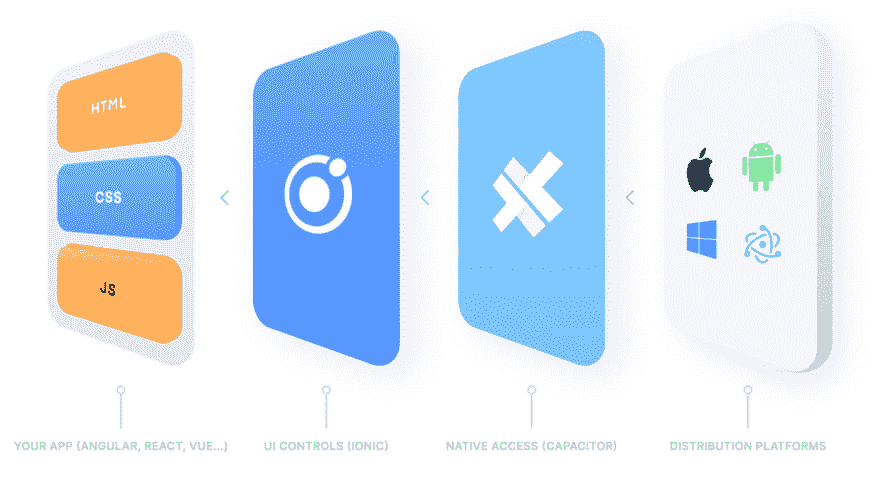
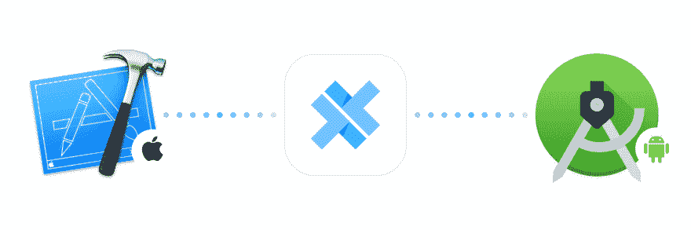

# 宣布电容器 1.0

> 原文：<https://dev.to/ionic/announcing-capacitor-1-0-24mj>

今天，我很高兴地宣布推出 1.0 版本的 [Capacitor](https://capacitor.ionicframework.com/) ，这是 Ionic 新的原生 API 容器，可以轻松构建在 iOS、Android、electronic 上运行的 web 应用程序，并作为渐进式 web 应用程序在 Web 上运行——完全访问每个平台上的原生功能。

Capacitor 将您的 Web 应用程序容器化，并为应用程序运行的每个平台提供对本机 API 的一致访问。这意味着，例如，在 iOS/Android 上访问相机使用的代码与在电子和网络上使用的代码相同。这使得构建一个在移动、桌面和 web 上运行的 web 应用程序变得非常容易！

Ionic 应用程序使用与 Cordova 非常相似的 Capacitor 来无缝地跨各种平台运行您的应用程序，而无需特定于平台的代码。然而，电容器给 Cordova 方法带来了一些显著的变化，您将在下面读到更多的内容。

随着这一版本的发布，我们距离使 Capacitor 成为每个新的 Ionic 应用程序的官方原生容器又近了一步，因此请继续阅读，了解这意味着什么以及它将如何影响您的 Ionic 开发:

## 电容器如何工作

想象一个典型的 web 应用程序:您可能有一些框架代码来让您的应用程序呈现和管理业务逻辑。它可能是使用典型的框架编写的，比如 Angular、React、Vue，或者类似于 [Stencil](https://stenciljs.com) 的东西。在此之下，你可能使用像 Ionic 这样的 UI 系统来获得高质量的 UI 控件。

对于许多 Web 应用程序来说，没有太多需要考虑的，因为您的应用程序通常在浏览器中运行，并且出于良好的安全原因，您只能访问浏览器中本地支持的 Web APIs 集。然而，当在移动和桌面的 Web 视图环境中运行时，情况就不一样了！

在这种情况下，因为您的应用程序运行在典型的浏览器沙箱之外，所以您的 web 应用程序没有理由不能访问给定平台上可用的所有本机 API。例如，使用生物认证并将数据存储在钥匙串中。

然而，要将一个 Web 应用程序放入一个本地 Web 视图控件中(而不是像 Chrome/Firefox/Safari 这样的完整浏览器),然后将 JavaScript 调用代理到本地代码，并在此过程中将数据返回到您的 Web 应用程序，这并不简单。

这就是电容器所做的:它将你的 web 应用容器化，并将其放入一个受管理的本地 Web 视图中(如果本地运行)，然后它以跨平台的方式向你的 Web 应用公开本地功能。然后，Capacitor 提供了一种简单的方式向您的 web 应用程序公开定制的本机功能(通过插件)，以及在命令行上使用 web 应用程序容器的工具。

## 电容和科尔多瓦有什么不同？

精神上，电容器和科尔多瓦很像。两者都管理 web 视图，并提供一种结构化的方式向您的 Web 代码公开本机功能。

两者都提供了现成的公共核心插件，用于访问相机和文件系统等服务。事实上，电容器的设计目标之一是支持 Cordova 插件开箱即用！虽然 Capacitor 不支持每个插件(有些只是不兼容)，但它通常支持 Cordova 生态系统中的大多数插件。

然而，在每一步，Capacitor 都采用了一种略有不同的方法，我们认为开发人员会喜欢这种方法，尽管有些人需要考虑权衡:

### 原生项目作为源工件

电容器一般期望你提交你的原生 app 项目(Xcode，Android Studio 等。)作为源神器。这意味着可以轻松地添加自定义本机代码(例如，集成需要在 iOS 上修改 AppDelegate 的 SDK)，构建“插件”以向您的 web 应用程序公开本机功能，而不必实际构建独立的插件，还可以采用适合该平台的最佳工具来调试和管理您的应用程序。

我们认为这是正确的平衡，因为堆栈溢出和典型的本机应用程序项目管理等资源的工作方式与该平台的本机开发人员完全相同。这有助于您在遇到特定于平台的问题时充分利用帮助资源，并使拥有本地和 web 开发人员的混合团队能够更好地合作。

然而，这种方法也有一些缺点。升级需要更多的手动工作，因为您必须带来您的原生项目。你不能只是吹走你的原生项目，然后重新创建它(除非你没有修改它)。安装插件不会修改您的项目，因此您需要手动修改 Info.plist 等偏好设置文件

然而，我们发现，随着项目的扩展，能够完全管理您的原生项目最终会成为一大解脱。

### 不再有`deviceready`

Capacitor 通过在页面加载之前加载所有插件 JavaScript 来终止`deviceready`事件，使每个 API 立即可用。与 Cordova 不同的是，插件方法是直接公开的，而不是通过 exec()函数调用。

这意味着不用再想为什么你的应用不工作，为什么`deviceready`没有启动。

### 拥抱 NPM &更轻松的插件开发

Capacitor 为项目中的每一个依赖项都提供了 NPM，包括插件和平台。这意味着你从来没有`capacitor install plugin-x`，你只是`npm install plugin-x`，然后当你同步你的项目电容器将检测并自动链接到你已经安装的任何插件。

考虑到这一点，让构建和共享插件变得容易是我们关注电容器的主要领域之一。Cordova 插件的开发人员知道，构建插件并不容易，如果不导入到现有的应用程序中，几乎不可能将它们作为独立的项目进行构建和测试，因为它们通常只是一组源文件，没有项目脚手架。

Capacitor 对插件的工作方式做了一些大的改变，这也使得插件更容易构建。首先，电容器要求你的插件是 iOS 的 Cocoa Pods 或 android 的典型 Android 库，而不是直接将插件文件复制到项目中。然后，capacitor 附带了一个`plugin:generate`命令来快速搭建插件项目，完成 Xcode 和 Android Studio 项目和单元测试。

我们希望这种对改进插件开发体验的关注意味着更多的插件将被构建，插件将随着时间的推移得到更好的维护。如果你对构建自己的电容器插件感兴趣，看看我们的[插件开发指南](https://capacitor.ionicframework.com/docs/plugins)。

### 更新插件 API

开发者可能会喜欢我们对核心插件所做的一些改变，比如文件系统插件，它更像节点，避免了现在已经失效的 Web 文件系统 API。

### 一流的电子和 PWA 支持

Capacitor 支持电子桌面功能，并增加了对 web 应用程序和渐进式 Web 应用程序的一流支持。

事实上，我们已经更进一步，为 Camera 等 API 构建了一系列 UI 体验，将用户期望的原生应用 UI 体验带到了渐进式 Web 应用中。我们称之为[渐进式网络应用操作系统](https://medium.com/@maxlynch/building-the-progressive-web-app-os-57daebcb69c1)。

最重要的是，构建提供 web 功能作为后备的插件就像在插件中添加一些文件一样简单！只有在本地实现不可用的情况下，Capacitor 才会使用您的 web 实现，因此用户可以在 iOS、Android、electronic 和 Web 上运行时使用完全相同的 API。

### 本地 CLI 体验

Capacitor 提供了一个微小的 CLI，安装在每个应用程序的本地。这意味着*不需要管理*的全局依赖性，并且很容易在您构建的每个应用程序中使用不同版本的 Capacitor。

### 但还没完，乡亲们！

我们对体验做了一些其他的改变，开发人员可能会注意到，电容器“感觉”与科尔多瓦有很大的不同。要了解更多信息，请遵循我们的[安装指南](https://capacitor.ionicframework.com/docs/getting-started)。

## 爱奥尼亚支持科尔多瓦呢？

虽然电容器意味着有一天取代科尔多瓦在每个离子应用程序，这并不意味着我们不再支持科尔多瓦！事实上，我们已经为 Cordova 开发了许多新的插件和特性，目标是在 Capacitor 中也支持它们。我们认为科尔多瓦是一个伟大的项目，是 Ionic 成功的关键资产，这就是为什么我们不急于取代它，并将在未来许多年内支持它！

也就是说，我们痴迷于用 Ionic 构建应用背后的开发者体验，并将电容器视为我们可以控制它的每个方面并更好地将原生层与 Ionic 的目标相结合的方式，因此我们确实计划随着时间的推移更加突出地推动电容器。

## 谁在用电容器？

电容器已经“淘汰”一年多了。从那时起，我们已经看到一些非常惊人的应用程序建立在它的基础上，随着一些主要的企业客户采用它的应用程序，你很可能有一天会使用它。

全球顶级快餐连锁店正在部署移动和桌面电容店内体验。像西南航空这样的公司正在基于电容器和离子构建所有新的[新员工入职体验](https://meetmaestro.com/work/southwest/)，而像 [Sworkit](http://sworkit.com/) 这样的流行消费应用已经基于电容器构建了它们最新最棒的版本(在这种情况下还有离子 4！).

这只是基于电容器构建的团队的一小部分样本。你打算用电容器开发你的下一个应用吗？让我们知道吧！如果您感兴趣，我们很乐意了解更多信息，甚至可以做一个案例研究。

## 入门

昨天，我们录制了一场特殊的[电容器发布网络研讨会](https://ionicframework.com/enterprise/resources/webinars/capacitor-version-one-launch-native-pwas-for-all)。在其中，我们演示了一些电容器 API，并展示了将电容器添加到当前使用 Cordova 插件的现有 Ionic 应用程序是多么简单。没成功吗？这段录音可以在[我们的 YouTube 频道](https://youtu.be/tDW2C6rcH6M?t=57)上找到。

也可以马上上手。很容易将电容器放入任何现有的现代网络应用程序(当然，包括 T2 的离子应用程序)。

## 谢谢

自 2017 年底我们开始探索创造科尔多瓦的替代品以来，电容器一直在工作。我们渴望对 Cordova 开创的方法做出一些重大改变，并满足全面支持桌面和 web 平台的需求，因为 Ionic 的使命扩展到帮助团队在任何地方构建优秀的应用程序。

从那以后，我们收到了来自社区的一些精彩的贡献，我想感谢每一个提交问题、提交 PRs 或只是传播项目消息的人。

现在电容器 1.0 已经推出，我们希望您能明白为什么我们在过去一年半的时间里投资这个新项目。我们才刚刚起步，所以预计未来会看到更多的电容器。

[立即开始使用电容器！](https://capacitor.ionicframework.com/)