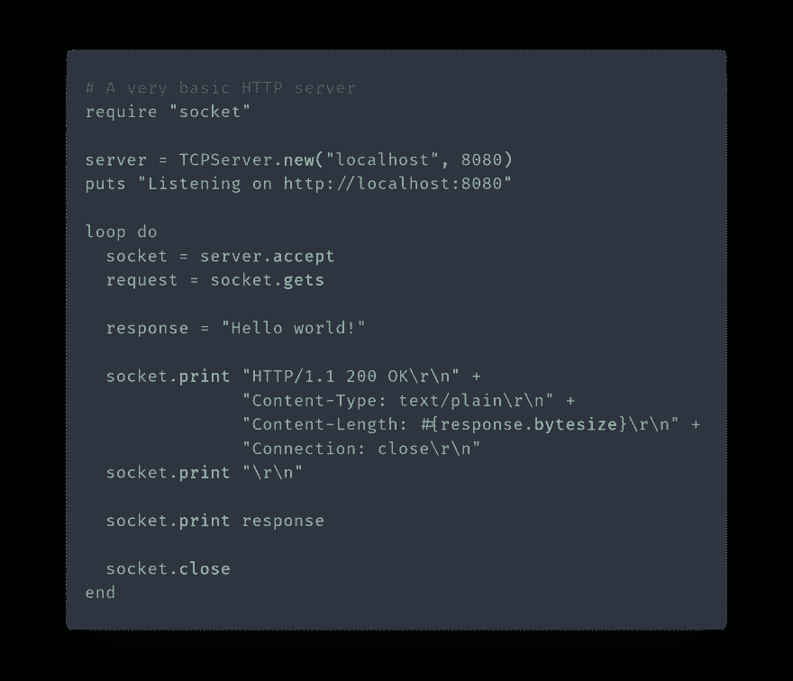
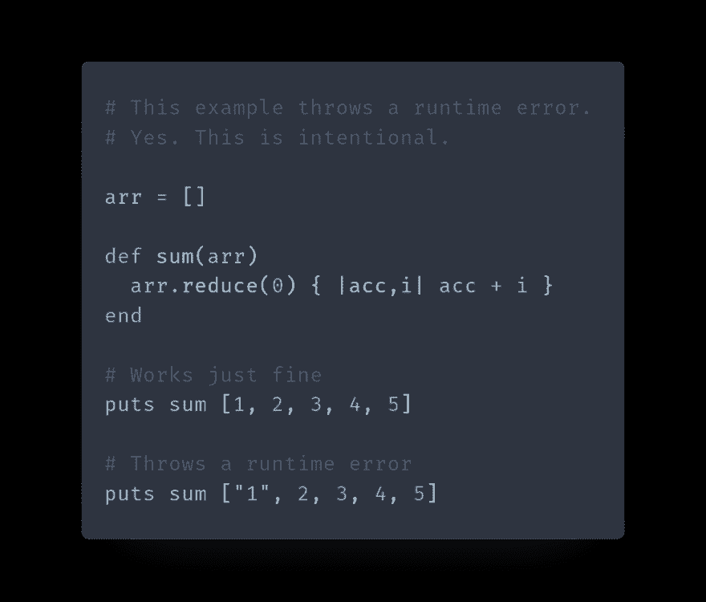
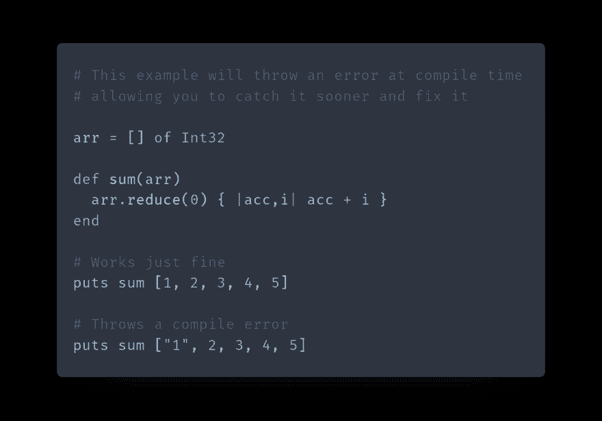

# 做水晶#1:红宝石比较

> 原文：<https://dev.to/watzon/doing-crystal-1-a-ruby-comparison-4g9c>

你好，世界，欢迎来到我命名为“做水晶”的系列博客。是的，这是一个冰毒笑话，是的，如果你想成为这个系列的一部分，你最好有幽默感。已经警告过你了。

在这一系列的博客文章中，我将带你穿越水晶的美丽世界，或者我喜欢称之为 Ruby 的超成就弟弟妹妹。如果你还没有和克里斯托打过交道，那你就等着享受吧，坐下来，系好安全带，享受旅程吧，宝贝。

那么什么是水晶呢？Crystal 是一种静态类型的、编译的、垃圾收集的语言，它的语法对于任何接触过 Ruby 的人来说都是非常熟悉的。它使用 LLVM 将漂亮的 Ruby 风格的代码编译成机器码，在基准测试中，它的速度始终比 Ruby 更接近 C++。Crystal 的开发始于 2014 年，因此它比 Ruby 年轻大约 20 年，并且在撰写本文时仍处于预发布状态，但这并不意味着您不应该关注它。相反，我认为水晶有惊人的潜力。

但是如果它比 Ruby 快那么多，这样的比较真的公平吗？当然是！我想向您展示如何获取看起来像 Ruby 的代码，使其类型安全，并使其速度提高 44 倍(基于)。Ruby 生态系统仍然更加发达，拥有 152，000 个可用的 Ruby 宝石，而不是 4，000 多个水晶碎片，但这是相隔 20 年的语言所期望的。

所以，事不宜迟，让我们言归正传，对比一下这两种神奇的语言。

## 水晶 vs 红宝石

首先让我们从包括我在内的许多人认为的任何编程语言中最重要的部分开始。语法。速度当然很好，但是如果你的快速代码最终看起来像一堆冒着热气的牛粪(我指的是你的 C++ ),那么你的项目的可维护性就会大大降低。

先说一个来自[水晶郎网站](https://crystal-lang.org)的例子，一个超级简单的 HTTP 服务器。

首先是红宝石样品:

[](https://res.cloudinary.com/practicaldev/image/fetch/s--FIMyY-aA--/c_limit%2Cf_auto%2Cfl_progressive%2Cq_auto%2Cw_880/https://i.ibb.co/dGpXbgR/http-server-rb.png)

用 Ruby 创建 HTTP 服务器很有趣。这一点都不直观，让生活变得有些困难。是的，在 Ruby 中，你也可以只使用 Sinatra 或任何其他 gem 来创建一个服务器，但是这个例子是关于在纯 Ruby 中这样做的。

现在是水晶:

[](https://res.cloudinary.com/practicaldev/image/fetch/s--lvkNKnqn--/c_limit%2Cf_auto%2Cfl_progressive%2Cq_auto%2Cw_880/https://i.ibb.co/P4dvFW0/http-server-cr.png)

等等，就这样？多简单啊。你从 http/server 而不是 socket 导入，你使用一个块来处理循环，这个块给你一个上下文。没有阻塞循环，不需要手动定义头，也没有真正的复杂性。

好吧，有些 API 被简化了，但是静态类型呢？让我们看另外两个例子。

首先是 Ruby 代码:

[](https://res.cloudinary.com/practicaldev/image/fetch/s--LP6VXuEH--/c_limit%2Cf_auto%2Cfl_progressive%2Cq_auto%2Cw_880/https://i.ibb.co/t3tCmcq/runtime-error-rb.png)

当然，任何优秀的 Ruby 开发人员都会在 sum 方法中进行类型检查，以确保只接受整数，但这是额外的工作，即使是最好的开发人员也会遗漏一些东西。

来点水晶怎么样:

[](https://res.cloudinary.com/practicaldev/image/fetch/s--CnbNvWuH--/c_limit%2Cf_auto%2Cfl_progressive%2Cq_auto%2Cw_880/https://i.ibb.co/SyhXCdk/compile-error-cr.png)

这仍然会抛出一个错误，但是不同的是。编译错误比运行时错误好得多，因为运行时错误通常会被最终用户发现。抛出的错误是:

```
no overload matches 'Int32#+' with type (Int32 | String)
Overloads are:
 - Int32#+(other : Int8)
 - Int32#+(other : Int16)
 - Int32#+(other : Int32)
 - Int32#+(other : Int64)
 - Int32#+(other : Int128)
 - Int32#+(other : UInt8)
 - Int32#+(other : UInt16)
 - Int32#+(other : UInt32)
 - Int32#+(other : UInt64)
 - Int32#+(other : UInt128)
 - Int32#+(other : Float32)
 - Int32#+(other : Float64)
 - Number#+()
Couldn't find overloads for these types:
 - Int32#+(String)
arr.reduce(0) { |acc,i| acc + i }
                              ^ 
```

Enter fullscreen mode Exit fullscreen mode

正如您所看到的，它不仅抛出了一个错误，而且还确切地告诉了您问题是什么。在这种情况下，问题是你不能把一个整数加到一个字符串上，即使是一个包含整数的字符串。

现在你可以看到 Crystal 的一些非常强大的类型系统。Crystal 中的所有东西都是类型化的，从数组到散列到变量。因为这种类型安全，编译器绝对不允许你在类型方面犯错误，这意味着运行时错误基本上不存在。

我不是说你不能在水晶里犯错。您仍然可以做一些愚蠢的事情，比如创建一个无限循环，而且堆栈溢出也不是不存在的。Crystal 毕竟还是预发布软件。但是与红宝石相比，你从水晶中获得的安全感是惊人的。

本期做水晶就到这里。请记得点赞、分享、订阅，因为没错，这是偷偷的 YouTube 视频，你的生活是个谎言。

点击查看本系列的下一篇文章[。](https://dev.to/watzon/doing-crystal-2-getting-started-with-crystal-13dk)

一些有用的链接:
[https://crystal-lang.org/](https://crystal-lang.org/)
[https://github.com/kostya/benchmarks](https://github.com/kostya/benchmarks)
[https://github.com/kostya/crystal-benchmarks-game](https://github.com/kostya/crystal-benchmarks-game)
[https://github.com/crystal-lang/crystal](https://github.com/crystal-lang/crystal)
在线找我:
[https://medium.com/@watzon](https://medium.com/@watzon)
[https://twitter.com/chrystal_coder](https://twitter.com/chrystal_coder)
[https://github.com/watzon](https://github.com/watzon)
[https://watzon . me](https://watzon.me)