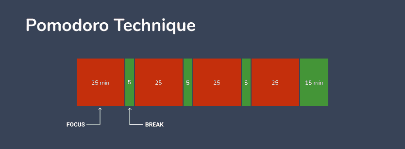
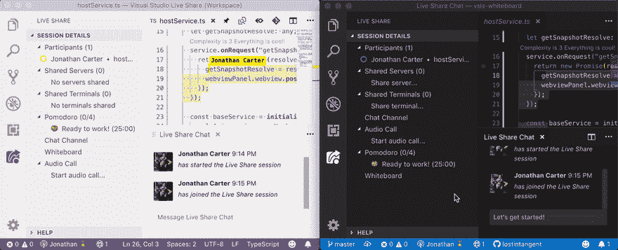
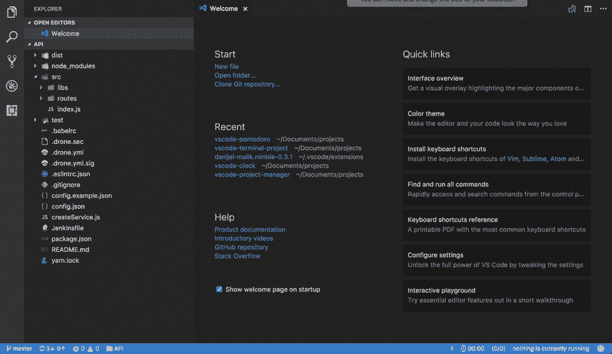
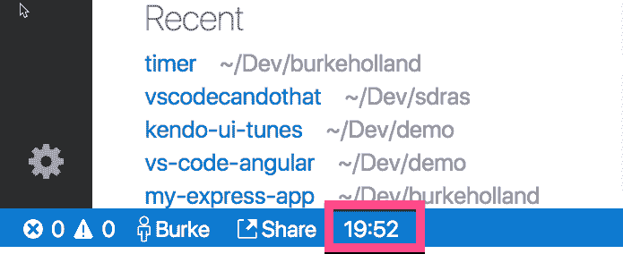
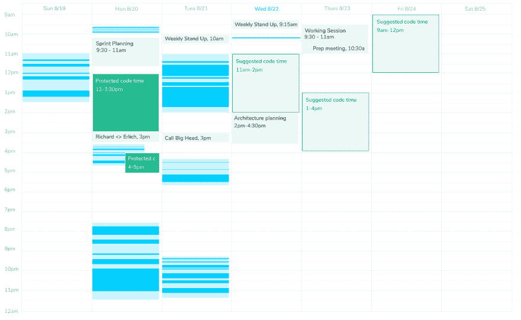
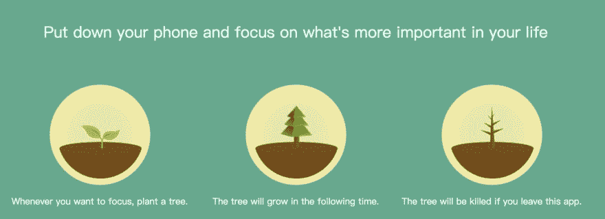
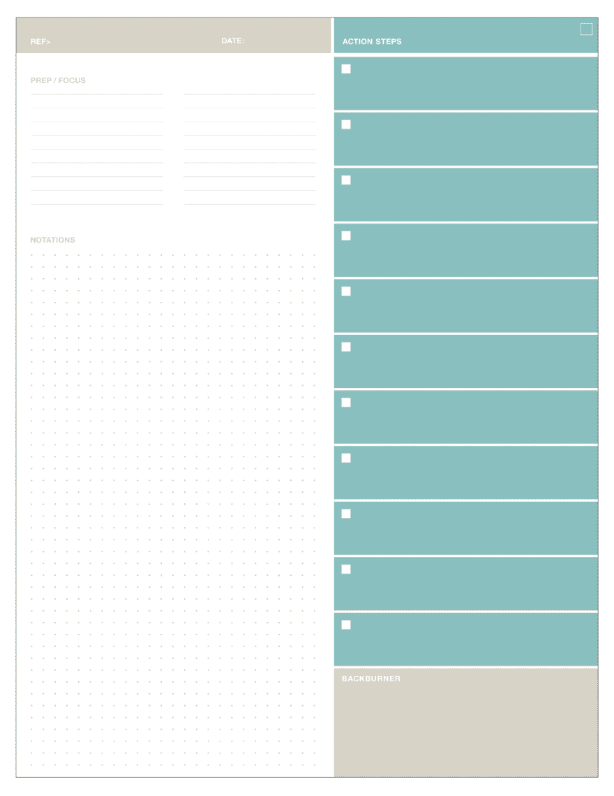
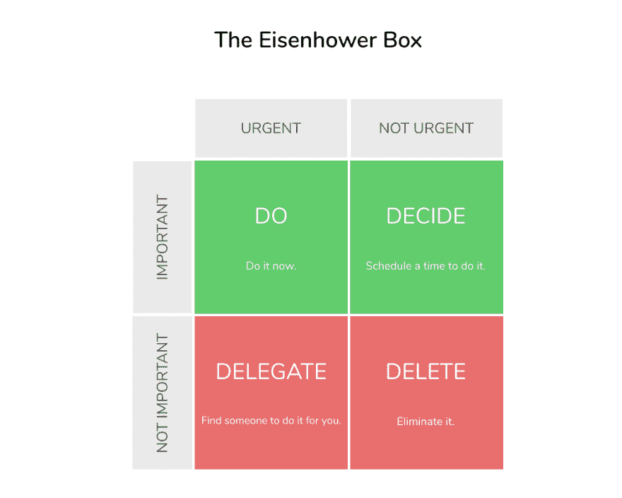

# 番茄工作法和其他方法来完成更多的工作(借助工具)

> 原文：<https://dev.to/thegeoffstevens/the-pomodoro-technique-and-other-methods-to-get-more-done-with-tools-to-help-p96>

发现和保持开发人员流是软件开发中的巨大挑战之一。

> “心流”是一种精神状态，在这种状态下，从事某项活动的人完全沉浸在一种精力充沛的专注感中，完全投入，并享受活动的过程。本质上,“心流”的特征是完全专注于自己所做的事情，并随之丧失对空间和时间的感觉。

我们如何实现心流？有哪些框架可以帮助我们毫不费力地进入心流状态？

提高注意力的策略很多。没有两个开发人员的工作是完全相同的。因此，随着时间的推移，许多新方法越来越受欢迎。

我将重点介绍一些你可以尝试的不同的生产力方法，包括它们如何应用于开发人员，以及它们的相对优势和劣势。

## 时间框有助于保持一致的注意力

保持注意力集中的最流行的技巧依赖于一种叫做时间盒的策略。

顾名思义，时间盒强迫你分配一定的、预先确定的时间来完成一项任务。你创造的每一段时间都致力于一个目标。

时间盒防止项目陷入无止境的时间陷阱。没有明确的界限，很容易忘记在每个项目上花了多少时间。众所周知，帕金森定律指出:工作扩大是为了填满完成工作的时间。

通过将你的工作日程分解成明确定义的时间段，任务不太可能不受控制地超出界限。

番茄工作法、90/30 技术和动力小时都是时间盒策略的例子。

### 番茄工作法

番茄工作法是最著名的利用深度工作力量的策略之一。

番茄工作法背后的概念很简单:在 25 分钟内专注于一项任务，然后休息 5 分钟。每四次休息时间会稍长一点，为 15 分钟。遵循番茄工作法将你的一天分成 130 分钟的间隔。

番茄工作法是一个强有力的策略，因为它鼓励单任务，而不是多任务。[研究已经证明](https://www.psychologytoday.com/us/blog/creativity-without-borders/201405/the-myth-multitasking)多任务处理实际上只是快速地(低效地)切换任务。番茄定时器旨在帮助你摆脱一心多用的错觉。

番茄定时器也能让你轻松规划一天的生活。将你的时间表整齐地组织成标准的时间块可以帮助你更有效地计划你的一天。随着时间的推移，每一个番茄钟倒计时的紧迫性都会给你额外的动力。

如果用 VS Code 的话，最受欢迎的番茄计时器是[VS Code-番茄计时器](https://marketplace.visualstudio.com/items?itemName=yahya-gilany.vscode-pomodoro)和[番茄计时器](https://marketplace.visualstudio.com/items?itemName=lkytal.pomodoro)。您还可以在与[实时分享番茄钟](https://marketplace.visualstudio.com/items?itemName=lostintangent.vsls-pomodoro)的实时分享会话中使用番茄钟定时器。

尽管广受欢迎，番茄工作法并不完美。对于许多开发人员来说，番茄工作法的 25 分钟可能感觉太短，频繁的 5 分钟休息可能会造成干扰。如果你在心流中，一个响铃的番茄定时器可能会很贵。

### [90/30·T1 技术](#9030-technique)

[90/30 技术](https://www.fastcompany.com/3013188/why-you-need-to-unplug-every-90-minutes)类似于番茄工作法，但将训练和休息时间分别延长至 90 分钟和 30 分钟。

每一天都将会有更少的时间，让你感觉更有凝聚力，更少的分散。更少的休息让你有机会更长时间地保持心流，更少担心过早结束一个富有成效的会议。

扩展 [vscode-pomodoro](https://marketplace.visualstudio.com/items?itemName=yahya-gilany.vscode-pomodoro) 允许你定制任务和休息时间，所以你可以配置它使用 90/30 技术。您也可以尝试看看哪种模式最适合您。

和番茄工作法一样，90/30 工作法也有缺陷。不间断地集中注意力 90 分钟是很困难的，尤其是当你在一个令人分心的环境或者一个熙熙攘攘的办公室工作的时候。此外，在繁忙的日子里，当你有 90 分钟或更长的空闲时间时，在日历上找时间也是一个挑战。

### 功率小时

[Power Hour](https://www.lifehack.org/articles/productivity/the-power-hour.html) 采用不同于番茄工作法和 90/30 工作法的方法来提高生产率。Power Hour 不是将你的一天分成固定持续时间的工作时段，而是旨在确保你每天至少有一个充满力量和富有成效的时段。

动力小时要求你每天找一个小时完全专注于一项任务，最好是一项特别有挑战性或令人生畏的任务。每天创造一个特殊的时间来帮助你战胜拖延症，减少分心。

如果你觉得你需要围绕着这些工作会议来计划你的一整天，番茄工作狂计时器会让你感到负担。动力时间采取了更有针对性的方法，将你的注意力集中在最困难和最重要的任务上。

VS 代码扩展[简单的定时器](https://marketplace.visualstudio.com/items?itemName=burkeholland.simple-timer)可以在你的状态栏中快速生成一个定时器，你想要多长时间都可以。使用命令面板可以轻松访问简单的定时器命令。

动力小时缺乏番茄工作法的结构——如果你喜欢在你的时间表中频繁重复，动力小时对你来说可能太灵活了。

## 时间——拆箱有助于启动你的心流

流动不一定受明确定义的时间间隔的约束。通常情况下，您会保持您的编码流程，直到您分心或屈服于精神疲劳。

一些生产率方法被设计成在没有明确的目标结束时间的情况下触发类似流动的状态。我称这个时间为拆箱。

10 分钟黑客，流动时间技术和游戏化可以让你更快更有效地实现流动。

### 10 分钟破解

[10 分钟攻略](https://lifehacker.com/the-10-minute-hack-5889332)是重新获得注意力和克服开始一个项目的最初挑战的有用工具。简单地开始可能会令人生畏——大型或复杂的项目可能会令人生畏，很容易让你分心于不太重要的工作。

10 分钟黑客迫使你设置一个 10 分钟的计时器，并在此期间专注于一项任务。

通过包含一个更短的时间限制，你消除了完成当前任务的长期目标的压力。你用需要开始一项任务的简单性代替了需要完成一项任务的压力。

十分钟后，你可能会发现自己想要继续工作。继续前进！一旦你开始运动，你会发现保持运动更容易。

我推荐使用上面提到的[简单计时器](https://marketplace.visualstudio.com/items?itemName=burkeholland.simple-timer)来计时。

开发人员可以从 10 分钟黑客行动中受益，因为它为你提供了一个采取具体行动完成任务的机会。举个例子，软件开发经常需要阅读大量的文档，10 分钟黑客是从研究过渡到编码的好方法。在一天中开始几个 10 分钟的计时器可以在你的工作中灌输一种行动的倾向。

### 流动时间技术

[流动时间技术](https://medium.com/@lightsandcandy/the-flowtime-technique-7685101bd191)是出于对番茄工作法严格的时间结构的厌恶，这种结构偶尔会打断原本高效的工作。

Flowtime 只是鼓励你跟踪你的开始、结束和休息时间，只要它们是自然发生的。一个要求是，你必须在每一段不同的时间内完成一项任务——也就是说，每一段时间的长短取决于你专注于一项任务的能力。

一旦你变得心烦意乱或希望改变到另一个项目，记录你的时间并休息一下。

你会开始更好地理解你一天中所做的环境转换。通过写下你的时间间隔，你会意识到你在做什么，你应该把时间集中在哪里。

你甚至可以使用[代码时间](https://www.software.com/)(我们一直在构建的开源代码编辑器插件)的日历功能来自动查看你每天何时编码。

### 游戏化

如果番茄定时器的紧迫性不足以让你保持专注，那么在你的日常安排中加入游戏化的元素可以带来更积极的体验。给自己一点小小的奖励，让自己一整天都保持心流状态，从而提升自己的动力。

像[森林](https://www.forestapp.cc/)和[甜甜圈狗](https://donutdog.club/)这样的应用程序可以帮助你追踪你的专注时间。Forest 是一个移动应用程序，但包括一个 Chrome 扩展，这样你就不需要查看手机来查看你的进度。这两款应用都非常适合防止分心和上下文切换。

你甚至可以将另一种方法，如动力小时，与奖励系统结合起来，如游戏化的习惯跟踪器 [Habitica](https://habitica.com/static/home) 。

游戏化是保持专注的有力方法，因为它给你的工作增加了积极的回报。这鼓励了参与，并使整体体验更加愉快。

主要的缺点是，对于开发者来说，游戏化可能比其他方法更难实现。虽然 Forest 和其他应用程序可以很好地减少手机上的干扰，但大多数开发工具都没有一个集成的方式来奖励自己。在编码过程中，你需要熟练使用移动应用程序。

## 以任务为中心的方法有助于你分清主次

将工作分成基于时间的会话当然可以帮助开发人员更有效率——然而，许多其他开发人员更喜欢根据基于任务的策略来组织他们的时间表。

番茄定时器和动力时间表对于知道什么时候工作很有用，但是它们不会告诉你应该做什么。你如何知道哪些任务应该先处理？

把事情做完、行动方法和艾森豪威尔盒子都是明确定义你每天优先事项的策略。

### 把事情做好

把事情做完是一种时间管理方法，它可以帮助你知道从哪里开始，这样你就可以少花些时间在争夺你注意力的杂耍任务上。

GTD 的工作方式是确保你总是有一套清晰的任务和目标。把计划好的任务和项目写下来，分成可操作的工作项目，把它们从脑海中移走。这样做，你可以专注于采取行动，而不是试图回忆任务。

GTD 遵循 5 个简单的步骤:

1.  捕捉:在记事本上写下所有引起你注意的事情。
2.  澄清:决定清单上的哪些项目是可行的，并决定下一步要采取的行动。搁置不可操作的项目。
3.  组织:将每个可操作的项目放入相似任务的组织列表中。
4.  反思:经常回顾清单，保持头脑清晰。
5.  参与:自信地完成任务。

通过建立对这个外部系统的信任，你可以确保你的大脑一次只专注于一项任务。

GTD 方法灵活且易于实施，因为你只需要一支笔和一个记事本就可以开始了。你也可以在 [Trello](https://trello.com/b/fbsKz8Uh/gtd-template) 和 [Evernote](https://evernote.com/blog/getting-started-with-gtd-templates/) 中使用 GTD 模板。我还建议尝试一下 ideal 中的 GTD 方法，这是一个非常受欢迎的帮助组织你的想法的生产力工具——看看这个博客上一个软件开发者在[ideal](https://tinney.dev/blog/gtd-notion)中对 GTD 的设置。

实施 GTD 有时会重复你安排工作优先级的其他方式。例如，在没有直接集成的情况下，管理 JIRA 的机票和你自己的 GTD 董事会可能会变得混乱。预先警告，GTD 可能不是每个软件开发人员和他们的待办事项列表的完美解决方案。

### 动作方法

最初由 Behance 开发的[行动方法](https://www.thebalancesmb.com/the-action-method-helps-creative-entrepreneurs-excel-1201142)是一个生产力框架，专注于编写完成任务的明确具体步骤。每个任务都是一个包含操作步骤的项目，也就是说，每个步骤都必须以一个动词开始，并包含上下文参考信息。

行动方法，类似于 GTD 方法，清理头脑中不可行动的任务和想法，这样你就可以消除进入心流的精神障碍。与 GTD 不同，行动方法更强调将项目分解成更小的部分，以帮助你完成每个项目。

Behance 出售一种[行动日志](https://actionmethod.com/products/action-book)，但是你可以很容易地格式化你自己的笔记本。他们网站上的一个例子:

action 方法对于开发人员来说是一个很好的选择，因为它可以帮助将特别复杂的编码项目分解成小任务。您可以更容易地考虑模块化组件中的代码以及它们应该如何互连。

不幸的是，像 GTD 方法一样，你可能需要管理几个待办事项列表，保持你的行动日志与你团队的其他工具同步是很重要的。

### 艾森豪威尔盒子

最后，[艾森豪威尔盒子](https://medium.com/the-mission/the-eisenhower-method-for-taking-action-how-to-distinguish-between-urgent-and-important-tasks-895339a13dea)是一个视觉工具，旨在帮助你区分紧急和重要的任务。

如果优柔寡断阻碍了你集中注意力的能力，那么开始用艾森豪威尔盒子把你所有的任务分类。既紧迫又重要的任务应该首先解决。所有其他任务都可以延迟、委派或取消。

艾森豪威尔盒子擅长帮助你区分任务的优先次序，这样你就可以自信地专注于最重要的任务。当你的思想较少被较低优先级的任务分心时，就更容易进入心流。

如果你正在寻找艾森豪威尔盒子的实现方案，那么 opinion 有一个[免费模板](https://www.notion.so/Eisenhower-Notion-3784cca6489844abbf6297914eb01682)可用。

对于开发人员来说，艾森豪威尔盒子可能特别强大，因为它鼓励在优化之前消除。除非你需要，否则不要写代码，专注于最重要的编码任务，让你更接近你真正的使命和目标——其他事情都可以等。

## 尝试并找到适合你的

正如我在开头提到的，没有两个开发人员的工作是完全一样的。作为一名软件开发人员，你能做的最好的事情之一就是更好地理解你是如何工作的，以及什么方法对你的快乐和生产力有积极的影响。

如果你喜欢这篇文章，看看我的时事通讯 [SRC](https://www.software.com/src) 。我每周都会报道软件开发中最重要的故事。