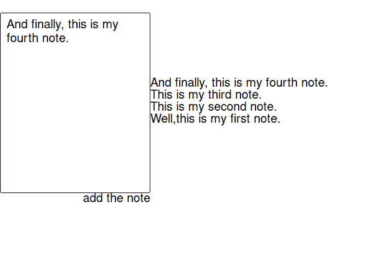
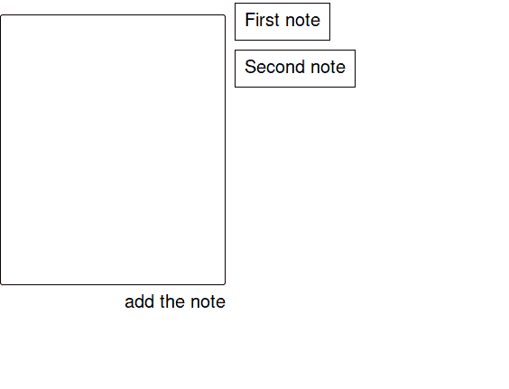

# 请注意，Elm +的应用程序实践也存在一些问题。

> 原文：<https://dev.to/antonrich/note-app-practice-with-elm-some-struggles-as-well-1g8p>

一个导师让我写这个 app。

我很犹豫，因为它是一个简单的笔记应用程序。

管它呢，我在心里抗议，但还是接受了。这是一项正在进行的工作。我的目标是让你了解我目前所取得的进步和面临的挑战。也让你知道我遇到的真正有趣的 bug。

应用程序的代码:[https://github.com/AntonRich/anton-joe-note-app](https://github.com/AntonRich/anton-joe-note-app)

让我们回到历史，看看应用程序的第一个截图是什么样子的:

截图名称写着:“注意 mvp 正在工作”。

你可以看到它是如何工作的。右列未对齐。

我真的不知道为什么会这样。首先我要告诉你我决定用什么做 css。

关于 css 部分，我有三个选择:基本的 elm css、rtfeldman/elm-css 或 elm-ui。

我选了 elm-ui。

我用我的内容在中间的第二列修复了这个错误。我把它对齐顶端。你可以看到它现在看起来更好了。

后来我发现了另一种奇怪的虫子。

我添加的注释越多，输入栏顶部和浏览器顶部之间的空间就越大。

还有一个 bug。哦，天啊。

当我添加注释时，字段输入不会自动清除。我必须处理这个。

* * *

我的目标是什么:

*   我有一个参赛项目。我希望能够通过 Ctrl + Enter 添加注释
*   修复我的错误
*   添加将 not 固定在列表顶部的功能。
*   添加仅编辑最后一条注释的功能。
*   添加删除注释的功能。
*   也许是别的什么，但是以后。

* * *

我的思维模式:

*   一遍又一遍从头开始。甚至当我还是个孩子的时候，如果我犯了一个错误，a 就会开始一个新的笔记本。从头重新思考。
*   即使没有必要，也要深潜。
*   倾向于关注心理学和元材料，而不是技术部分。我正致力于更多地关注技术部分。
*   资源不足，我需要更多...缺乏信心，也许是缺乏实践...但是可能还有另一个...缺乏联系。

一种生产力:

*   我注意到，即使像 stackoverflow 等专业网站也有很多我们关注的议程。stackoverflow 中的侧边栏非常分散注意力。有数以百万计的事情会分散我们对工作的注意力。正如丹·佩纳所说，“你会认为拥有一台电脑会让人类更有生产力。但实际上恰恰相反。我们比以往浪费更多的时间”。