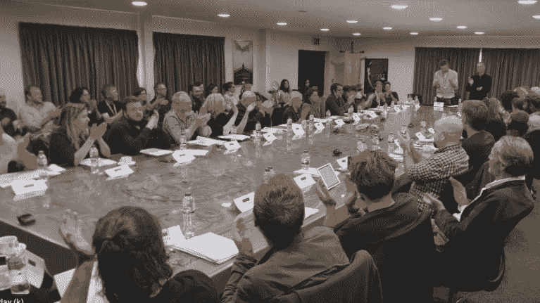
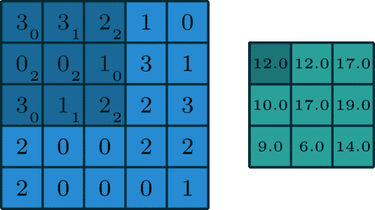
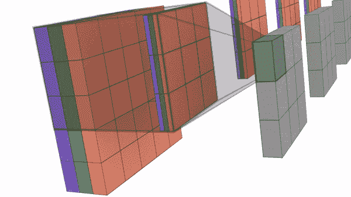
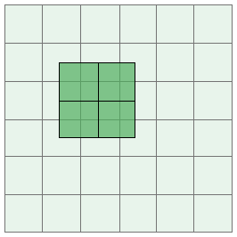

# 关于神经网络中的卷积的几个常见问题

> 原文：<https://dev.to/unography/a-few-frequently-asked-thought-about-questions-about-convolutions-in-neural-networks-3pih>

## 什么是卷积？

在回答这个之前，我们先了解一件事。电脑是愚蠢的生物。他们不知道单词是什么意思，比如猫或狗。他们不知道东西长什么样，像猫或狗。他们所理解的只是数字(嗯...稍微有些不正确，但是对于我们的情况来说它是有效的)。

现在我们来介绍几个术语~ ***内核******滤镜*** 和 ***通道*** 。

*过滤器*可以被认为是*内核*的集合。

但是什么是内核呢？

想象你在你最喜欢的电视节目的拍摄现场。我们暂时看《权力的游戏》,但任何剧都可以。内核是节目中的每个演员、作家、摄影师等。

*仁坐在桌子对面，试图决定赛季的进程*

由于计算机除了数字之外什么都不懂，所以内核对我们来说只是数字。每个内核都是一个数字矩阵。现在，如果《权力的游戏》一集类似于试图区分猫和狗的神经网络，那么内核就是帮助它做出决定的个体演员。

在卷积神经网络(CNN)的情况下，内核表现为*特征*T2】提取器。从数据中提取某些特征，并将其传递给下一层，这最终有助于做出决策。

将内核视为特征提取器会将我们带到通道。*频道*现在可以被认为是特色包。“包”包含相同的一组特征。

彩色图像通常有三个通道——红色、绿色和蓝色(RGB 图像)。红色通道包含描述图像“红色”的一组相似的图像特征。绿色和蓝色通道也是如此。

在《权力的游戏》中，渠道可以被认为是一个部门——声音部门可以被认为是一个渠道，类似地，视频部门、营销部门可以是其他渠道。

我们现在来看*。*

 *

*图 1:3x3x 1 内核对 5x5x1 数据的 2D 卷积的例子*

在卷积中，我们取一个尺寸(宽度、高度、通道)的核，例如 3x3x1，并将其滑过我们的数据，对其当前所在的输入部分执行元素乘法，并将结果相加得到输出元素。

在上图中，一个 3x3x1 内核正在对 5x5x1 输入数据进行卷积。这也被称为 2D 卷积

*注意:内核拥有的通道数需要与输入数据中的通道数相同。现在，基于我们使用的内核数量，输出数据的通道被决定。例如，如果我们的输入数据大小为 7x71，我们的内核必须有一个通道，如 3x3x1。现在，如果我们使用 32 个这样的内核，输出数据的大小将大约为 5x5x32(它将有 32 个通道)。如果我们进一步想要进行卷积，我们必须使用 32 个通道的内核，例如 3x3x32。*

*图 3:形状为 3x3x3 的 4 个核在大小为 5x5x3 的数据上的卷积，以获得形状为 3x3x4 的输出*

## 为什么我们不用像 2x2，4x4，6x6 这样的偶数形状的内核？

当我们有一个像 3x3 或 5x5 这样的内核时，内核位于一个像素的顶部，并且它有一个相邻像素的对称视图。这里有一个中心元素和围绕它的对称性。

*图 3:与 2x2 内核的卷积具有其下方像素的非对称视图。*

如果是任何均匀形状的核，我们就完全失去了这种对称性。内核不知道它正在提取哪个像素的局部特征。如果我们做一些类似边缘检测的事情，需要有一个中心元素，它的左边有一些东西，右边有一些东西——最好具有一致的相似性。如果它不存在，就会导致内核产生的输出失真。这就是为什么我们避免使用 2x2、4x4、6x6 等内核的原因。

## 为什么我们一般用 3x3 内核而不用 1x1，5x5，7x7 等？

在卷积神经网络中，我们通常认为内核是特征提取器。当我们使用 1x1 内核时，内核的“视图”非常有限——它只是内核下面的元素。从上面的图 1 中，我们看到当我们使用一个 3x3 的内核时，当它在一个像素之上时，它的“视图”是在它之下的 9 个像素。我们看到了更多的数据，这有助于我们提取更好的特征。

如果是 1x1 内核，它的行为就像一个身份函数，在提取特征的时候对我们没用。

下一个奇数形状的内核是 3x3(我们在上面讨论了为什么不使用偶数形状的内核)。

3x3 内核完美地表现为特征提取器。它有一个中心元素和围绕它的对称性。它覆盖了足够的区域，使局部知识对提取特征有用，所以它对我们有用。

5x5、7x7 等也具有像素对称性，但在卷积时，它们比用 3x3 内核卷积时有更多的参数，因此我们从 3x3 开始越大，计算效率就越低。当提取特征时，它覆盖的局部区域也比我们希望的要大。3x3 给了我们很好的像素覆盖率。

使用 3x3 内核的另一个优点是，我们可以获得与任何形状奇怪的 3x3 内核相同的效果。例如，我们可以使用两个 3x3 内核来获得与使用 5x5 内核(没有填充和步幅为 1)相同的效果。

所谓情感，我们指的是感受野，或者我们之前提到的“视野”。使用 2 个 3x3 内核给了我们与使用 1 个 5x5 内核相同的全局感受域，并且在这种情况下使用 3x3 在计算上更有效！

由于所有这些优势，像 NVIDIA 这样的 GPU 也在 3x3 大小的内核上优化了卷积。许多论文，如 Resnet 论文，在其代码中有 7x7 内核，但在优化此类网络的性能时，7x7 内核被转换为 3 个 3x3 内核。

所以当我们想要提取特征时，我们坚持使用 3x3 内核。

注意:我们在我们的网络中使用 1x1 卷积，但是我们不使用它们来提取特征。它们通常用于增加/减少通道的数量。我们可以使用 3x3 来改变通道的数量，但它也像普通卷积一样，因此也可以改变像素值。1x1，作为一个身份映射，不做通常的卷积，所以当我们只想改变通道的数量时，它是一个理想的内核。*