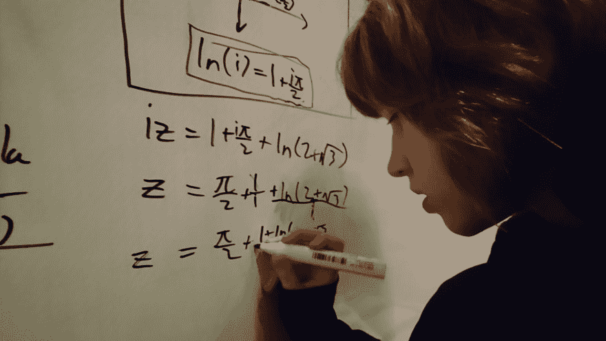
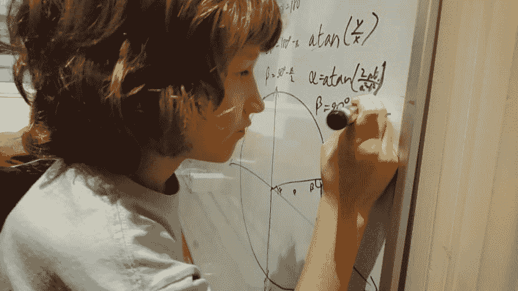

# 开发者聚焦:9 岁程序员西蒙·泰格

> 原文：<https://dev.to/katyadee/developer-spotlight-9-year-old-programmer-simon-tiger-3pon>

### 欢迎来到另一个**开发者聚焦**！

今天，我们(虚拟地)采访了 9 岁的比利时神童 [西蒙·泰格](https://simontiger.com/bio)和他的妈妈索菲亚。

Simon 分享了一个他建立的神经网络的回复后，引起了我们的注意。

事不宜迟，下面是我们的采访:

**[@katyadee](https://dev.to/katyadee)** :如果可以用一句话总结自己，你会怎么做？

**@simontiger** :这听起来有点绕，但我会说:“用一句话概括我:你无法用一句话概括我。”

**[@katyadee](https://dev.to/katyadee)** :我觉得那其实说明了很多！你真会说话——你真的只有 9 岁吗？

**@simontiger** :快 10 岁了。

**[@katyadee](https://dev.to/katyadee)** :哇。你在上学吗？

**@simontiger** :不，我在家上学。我们甚至不得不搬到比利时才能在家上学，因为在荷兰(我的家乡)学校是强制性的，这不太适合我。

**[@katyadee](https://dev.to/katyadee)** :你们能找到让它工作的方法真是太酷了。我真的很喜欢你妈妈的网站。它说你是一个数学家…我在想，这对你意味着什么？你在做研究吗？

**@simontiger** :嗯，这个问题很难。无论我往哪里看，我都能看到世界上的模式。我就是喜欢做数学，我每天都花很多时间做数学。就像我在写一本关于打结理论和打结实验的书。或者我想在我的编码中使用彭罗斯的光照问题。我制作数学视频。罗恩·格雷厄姆说他喜欢我关于格雷厄姆扫描算法的视频！

**[@katyadee](https://dev.to/katyadee)** :我被吹走了。[罗恩·葛拉罕](https://en.wikipedia.org/wiki/Ronald_Graham)——这可不是开玩笑的！说到编码，你是怎么开始的？

**@simontiger** :带 Arduino 和 Sparkfun。我通过[小比特](https://littlebits.com)发现了 Arduino。Arduino 是我如何发现[处理](https://learn.sparkfun.com/tutorials/connecting-arduino-to-processing/all)的，也是我如何发现[编码序列](https://codingtra.in)的。他总是看我的视频，成了我的朋友。而且我在 Slack 里也参加[编码训练直播会](https://youtu.be/LdWCL0pRD6M)。

**[@katyadee](https://dev.to/katyadee)** :哇！在阿杜伊诺之后你去了哪里？你的第一语言是什么？

**@SimonTiger** :奇怪，不是英语！这不是我的母语。我自学英语，主要是看编码视频。我的母语是荷兰语和俄语。

**[@katyadee](https://dev.to/katyadee)** :哦，我是说编程语言！对不起

C 语言之后，有一段时间我开始使用各种各样的语言，但现在我已经决定使用 JS、Java、Python，有时还有 Haskell。有时甚至是沃尔夫拉姆语！

**[@katyadee](https://dev.to/katyadee)** :什么风把你吹来了 Repl.it？

**@SimonTiger** :我最初只是想找一个在线 Python 编辑器，因为我的电脑内存曾经是(现在仍然是！)差不多满了。我首先找到了 onlinegdb.com，但是过了一会儿，我的代码不见了！然后我开始使用 Repl.it .现在我甚至不再只在 Repl.it 上使用 Python，还使用 JS。有一次我试图在 Repl.it 上使用 Haskell，但这并没有真正达到我的目的，因为浏览器运行在 JS 上，这是一种严格的语言，而 Haskell 是一种懒惰的语言。

**[@katyadee](https://dev.to/katyadee)** :你最喜欢在 Repl.it 上构建的东西是什么？

@SimonTiger :几乎我所有的回复都在进行中。这里有两种:

[光线追踪排序算法](https://repl.it/@simontiger/SortingAlgorithmsImproved)

**[@katyadee](https://dev.to/katyadee)** :最后问你一个问题。你对未来有什么计划？你的礼物很酷。

**@SimonTiger** :看你什么意思。更多的编码、数学和物理——如果这也算的话。

