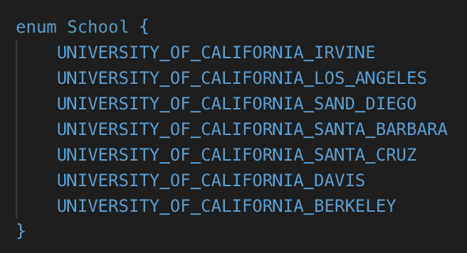
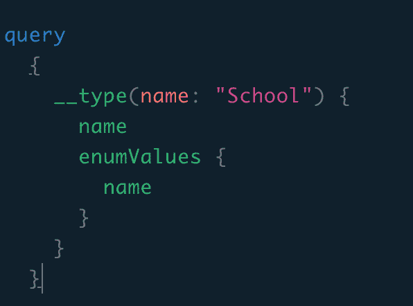
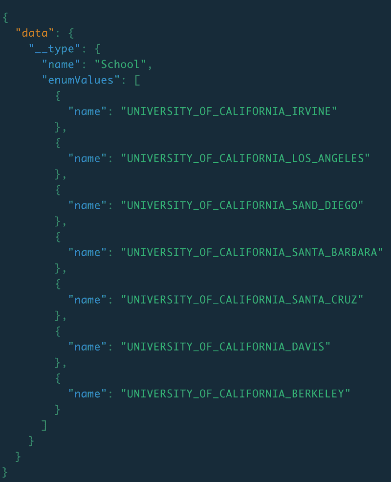
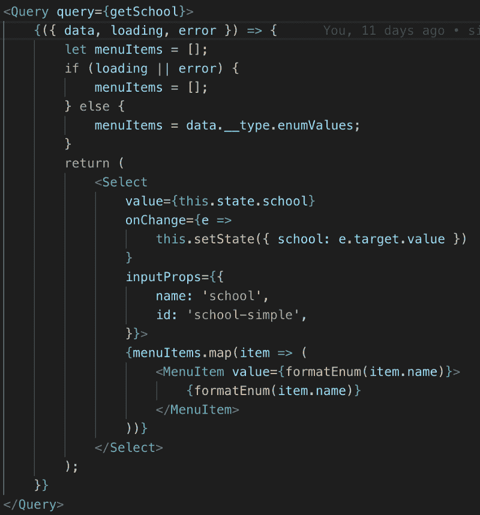
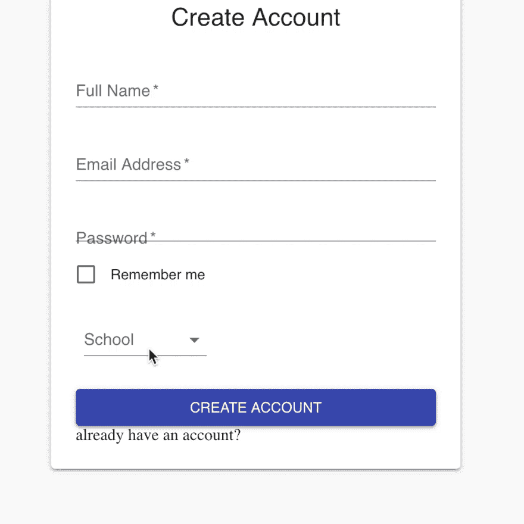

# 如何使用自省查询 GraphQL 的枚举

> 原文：<https://dev.to/novvum/how-to-query-enums-with-graphql-using-introspection-25e>

#### 为什么要用内省来查询枚举？

当您处理一个允许用户选择选项(如学校名称)的项目时，最好从数据库中查询这些值，而不是将它们存储在列表中。这是因为如果添加了新的选项，你就不必担心在前端更新列表。此外，如果需要在另一个文件中使用这些值，可以简单地调用 enum 查询。

#### 什么是自省？

[*自省*](https://graphql.org/learn/introspection/) *允许您向 GraphQL 模式询问有关它支持哪些查询的信息。*

在自检系统中，我们可以使用 __Schema、__Type、__TypeKind、__Field、__InputValue、__EnumValue、__Directive 等 6 种自检类型。若要查询枚举，您需要使用 __Type 查询解析器。

#### 使用 _ _ 类型

对于这个例子，我将使用一个存储 7 所大学名称的 enum。

‍
 
‍

以下是查询该枚举的方法:

‍
 
‍

__type 查询解析程序需要 name 参数。此参数允许您根据名称在模式中搜索项目，如对象和枚举。

运行该查询后，结果应该如下所示:

‍
 
‍

这将返回枚举的名称及其所有值。若要使用这些值，请在查询枚举时将它们存储在变量中。该语句应该如下所示:

*项目=数据。* *类型枚举值*

#### React 前端上的应用

这个例子说明了如何在用 [material-ui](https://material-ui.com/) 组件创建的下拉菜单上应用枚举查询。枚举项存储在 list menuItems 中，然后用 map 方法传递给 dropdown 组件。因此，每次用户与下拉菜单交互时，都会调用查询，并显示存储在 menuItems 中的所有值。

‍
 
‍

最终结果应该是这样的

‍
 
‍

#### 结论

使用自省很容易，而且是减少数据库中存储相同信息的变量数量的好方法。使用自省最大的好处是不需要对前端做任何修改就可以更新显示的列表。

如果您想了解更多关于自省的知识，我发现这篇文章很有帮助， [GraphQL 自省和自省查询](https://graphqlmastery.com/blog/graphql-introspection-and-introspection-queries)

如果你想了解更多关于 GraphQL 的知识，我发现了这些有用的概念， [36-GraphQL-concepts](https://github.com/Novvum/36-graphql-concepts) 。

###### 关于我们: [Novvum](https://novvum.io) 是一家专业从事工程、战略、&设计的现代软件开发机构。