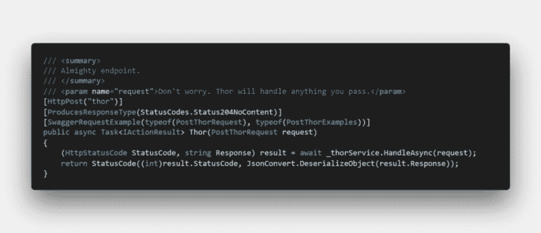
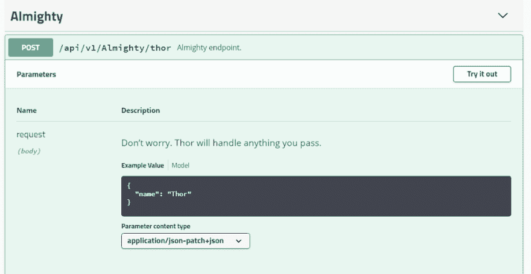
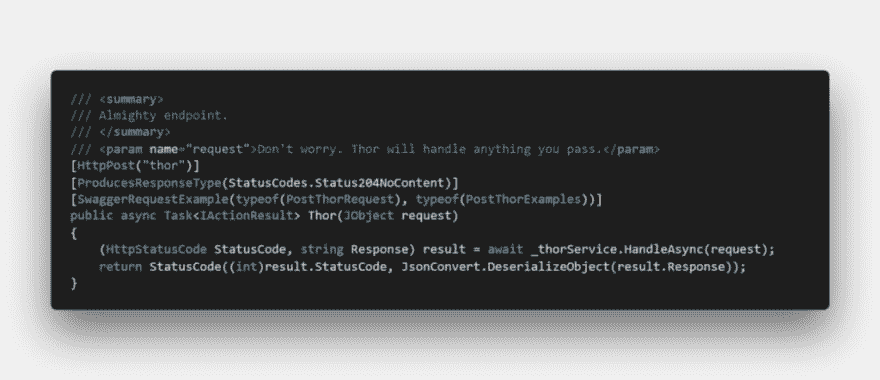
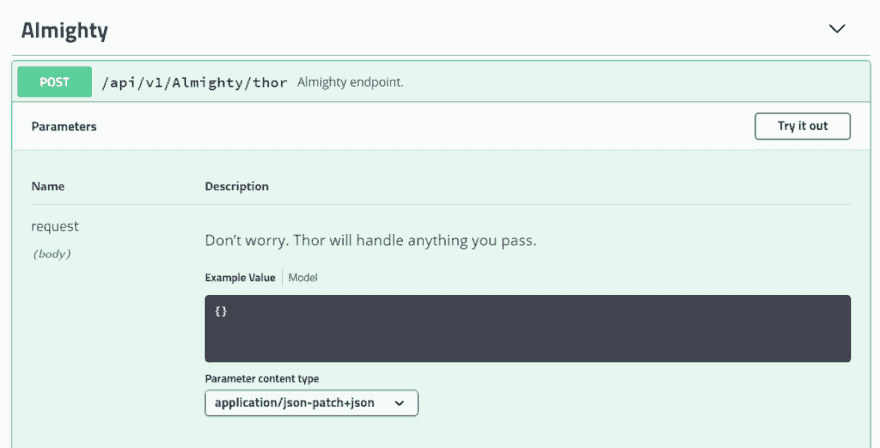
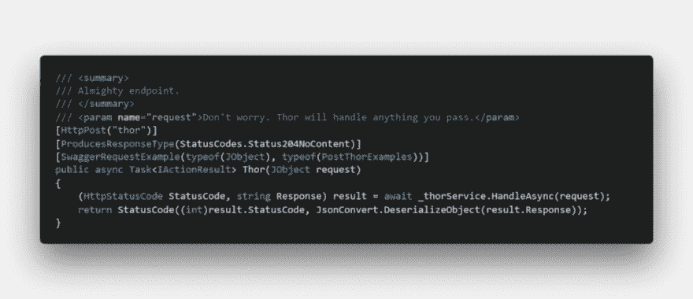
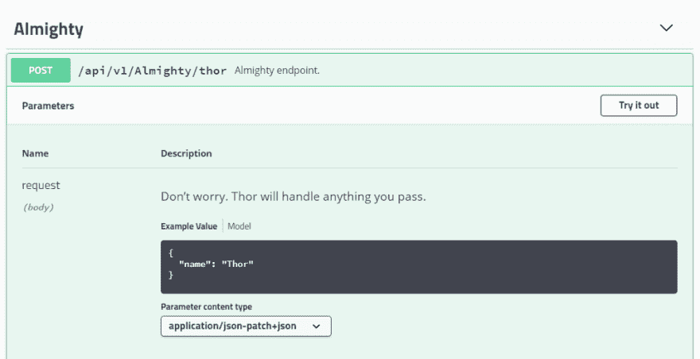

# 使用 Swashbuckle 生成 Swagger 示例动态请求有效负载

> 原文：<https://dev.to/joni2nja/generating-swagger-example-dynamic-request-payload-with-swashbuckle-4lej>

这篇文章最初出现在[媒体](https://medium.com/@joni2nja/generating-swagger-example-dynamic-request-payload-with-swashbuckle-77c09127392c)上

* * *

*新到 Swashbuckle？见本官* [*《霸王花和 ASP.NET 核心入门》*](https://docs.microsoft.com/en-us/aspnet/core/tutorials/getting-started-with-swashbuckle?view=aspnetcore-2.2&tabs=visual-studio)

我们可以用 Swashbuckle 生成 Swagger 示例请求，见[本帖](https://mattfrear.com/2016/01/25/generating-swagger-example-requests-with-swashbuckle/)。

假设我们有以下端点:

忽略这个奇怪的实现，它只是一个示例。关注方法签名。

这是 Swagger UI 页面:

*注意，这个帖子使用的是* [*霸气。AspNetCore 版*](https://github.com/domaindrivendev/Swashbuckle.AspNetCore/tree/v3.0.0) *。*

现在假设我们别无选择，只能让它接受动态有效负载——也许是由于客户的需求变化。所以我们把`PostThorRequest request`改成`Jobject request`，就像这样:

现在，当我们运行它时…

啊哦…看到那个，榜样价值没了！

如何解决这个问题？

将 SwaggerRequestExample 类型的第一个参数更改为 job object 似乎可以解决这个问题。

还有…

瞧啊。它回来了！

请注意，这可能只是可行解决方案的一种方式。虽然它确实有效，但就我个人而言，我不推荐这种面向公众的 API 的动态请求方法。