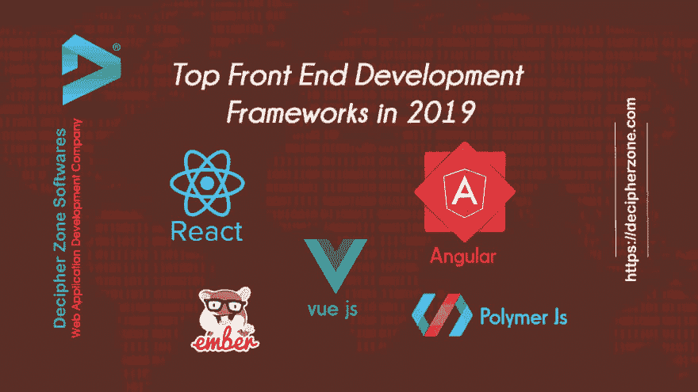

# 2019 年前五大前端开发框架

> 原文：<https://dev.to/decipherzonesoft/top-5-front-end-development-frameworks-in-2019-9ac>

**2019 年顶级前端开发框架**

**ReactJs**
React 是由脸书制作和创建的前端框架。这个团队热衷于通过构建一个引人注目的 UI 来获得优势。Jordan Walke 在 2011 年提出让这个库依赖于 XHP 和 JavaScript mix。

**React 的优点**

开源和权威

基于细分市场

改编一次，构建任意地点库

海量信息的理想选择是驱动型 web 应用程序

**React 的缺点**

适度长的期望吸收信息。

由于高速发展，缺少文档

**Angular**
Angular 由 Google 于 2010 年发布，搭建了第一个前端框架。Precise 是在 TypeScript 中实现的，它提供了大部分的首选项:bolt works、async/expected、class grammar 等等。对于来自 C#和 Java 等方言的转换者来说，对肯定理解的 OOP 排练的介绍使得改变变得简单了许多。

**Angular 的优点**

制作丰富的 web 应用程序的能力

除了 JavaScript 之外，用 MVC 设计模式构建客户端应用程序

每个程序的 JavaScript 代码的程序化处理

开放源代码，可以不受限制地使用

web 应用程序的 HTML 代码扩展

一个开放的 web 开发环境

**缺点**

从 AngularJS 到 Angular 交换继承框架

角度复杂性

学习困难

CLI 文档描述不充分

**EMBER JS**
作为一个开源的 JS web 框架，代码较少，自然刷新了隐藏的变化。此外，它还尝试了 MVVM 设计，使每个开发人员都能制作出令人震惊的、适应性强的单页面 web 应用程序。js framework 承担了结构化 web 的体面工作，就像制作易于使用、极其通用的工作区应用程序一样。

**Ember.js Pros** :在此阅读全文:[https://www . decipherzone . com/blog-detail/Top-Front-end-Development-Frameworks-in-2019](https://www.decipherzone.com/blog-detail/Top-Front-end-Development-Frameworks-in-2019)