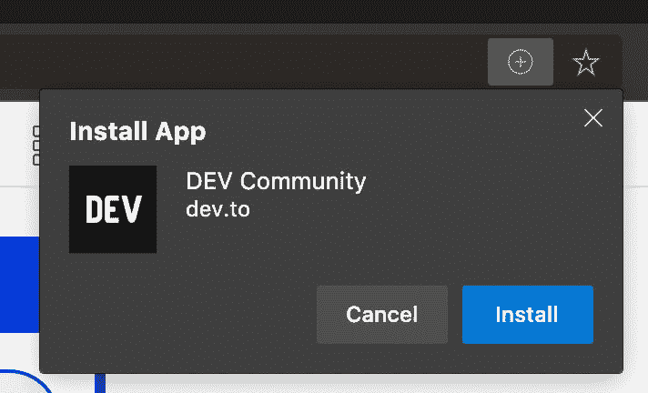

# 如何处理桌面 PWA 中的出站链接？

> 原文：<https://dev.to/ben/how-to-handle-outbound-links-in-desktop-pwa-3o4n>

如果你不知道，DEV 可以作为 PWA 安装在 Chrome 和其他支持它的浏览器中。新的微软 Edge 甚至将它作为一个`+`提示，如下所示:

从功能上来说，它工作得很好，但是没有`target=_blank`属性的外部链接(这是 DEV 上的大多数链接)，在一个笨拙的应用内伪浏览器中打开，没有导航。

我们应该如何“正确地”处理这个问题。

我们应该在所有出站链接中添加`target=_blank`吗？我们可以只为 PWA 动态地这样做。但是，有没有一种不同的“正确”方法来做到这一点呢？

另一个桌面应用程序，如 Slack，不会在应用程序中打开外部链接。它们会在浏览器中打开。所以这可能是合适的选择，但我不完全确定。

想法？