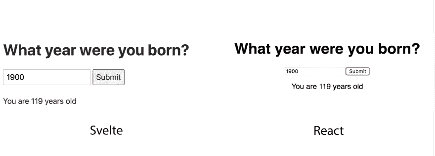

# 使用 Svelte 3.0 进行真正的反应式编程

> 原文：<https://dev.to/bnevilleoneill/truly-reactive-programming-with-svelte-3-0-5p9>

[](https://res.cloudinary.com/practicaldev/image/fetch/s---S2kJIjy--/c_limit%2Cf_auto%2Cfl_progressive%2Cq_auto%2Cw_880/https://cdn-images-1.medium.com/max/1024/1%2A2hDcp8VSEJk74trofc3JtQ.jpeg)

这个标题有点戏剧性，但话说回来，苗条和它背后的想法也是如此。如果你还不知道什么是苗条，那么系好安全带——你将见证一场革命，这将是一次旅程(苗条团队没有压力)😅)。

注意，这不是一个如何开始苗条身材的教程。已经有一个由 Svelte 团队开发的很棒的[一步一步的交互式教程](https://svelte.dev/tutorial/basics)，可以让你轻松进入反应式编程的世界。

**免责声明依次:**我不是编程摇滚明星，也不是什么都知道。我只是对每天都在进行的创新充满热情，并且我喜欢在可能的时候谈论它们——因此，这篇文章。对我说的一切都要持保留态度，如果我说了什么可笑的话，请告诉我。

好吧，让我们开始吧！

### 但首先，做出反应

在我开始解释为什么我认为苗条是如此具有破坏性之前，让我们先来看看丹不久前发的这条推文，并剖析它的实际含义:

> Guillermo▲@ RAU chg成功的流行语都是野心家的夸大其词
> 
> ⬩ Serverless 有 servers
> ⬩ AI 没那么智能
> ⬩ AR/VR 看人不真实17:47pm-04 2018 年 8 月[](https://twitter.com/intent/tweet?in_reply_to=1025800345983700993)[](https://twitter.com/intent/retweet?tweet_id=1025800345983700993)

> 丹阿布拉莫夫[@丹 _ 阿布拉莫夫](https://dev.to/dan_abramov)[@劳赫](https://twitter.com/rauchg)反应不完全反应2018 年 8 月 04 日 17:51[](https://twitter.com/intent/tweet?in_reply_to=1025801430668664833)[T25】14](https://twitter.com/intent/retweet?tweet_id=1025801430668664833)[](https://twitter.com/intent/like?tweet_id=1025801430668664833)236

**另一个免责声明:**本文无意以任何方式抨击 React。我只是决定使用 React 作为一个案例研究，因为大多数阅读本文的人都曾经使用过它。这是最好的例子来对比苗条。

Dan 是什么意思，这对我们目前编写代码的方式有什么影响？为了回答这个问题，让我给你一个 React 如何在幕后工作的简化视图。

当你渲染一个 React 应用时，React 会在一个叫做[虚拟 DOM](https://reactjs.org/docs/faq-internals.html) 的地方保存一份 DOM 副本。虚拟 DOM 充当 React 代码和浏览器绘制到 DOM 的内容之间的中间人。

然后，当你的数据改变时(可能你调用了 this.setState，useState)，React 做一些工作来决定如何在屏幕上重新绘制你的 UI。

它将虚拟 DOM 与真实 DOM 进行比较，以确定由于数据更新而发生了什么变化。然后，它只重画与虚拟 DOM 中的新副本不匹配的 DOM 部分，这样就不需要在每次发生变化时重画整个 DOM。

现在，这非常快，因为更新虚拟 DOM 比更新真实 DOM 便宜得多，React 只更新真实 DOM 中需要更新的部分。这篇文章更好地解释了这个过程。

但是对于这个实现，您可能已经注意到了一些东西。如果你不告诉 React 你的数据已经改变了(即通过调用 this.setState 或等效的钩子)，你的虚拟 DOM 不会改变，React 也不会反应(ba dum tss！🤓).

这就是丹所说的反应不是完全反应的意思。React 依靠你来跟踪你的应用程序的数据，并在数据发生变化时告诉它，这通常需要你做更多的工作。

[](https://logrocket.com/signup/)

### 好了，现在苗条了

Svelte 是一种全新的构建 UI 的方式，它以一种惊人的快速、高效和真正反应式的方式，完全不需要使用虚拟 DOM，使用的代码比使用任何其他框架或库都要少。

这听起来不错，但是你会问，它与其他无数的 JavaScript 库和框架有什么不同呢？我告诉你。

#### 1。真实反应性

Svelte 不是图书馆。苗条不是一个框架。相反，Svelte 是一个编译器，它接收您的代码，并发出本机 JavaScript，直接与您的 DOM 交互，不需要任何中介。

等等，什么？编译器？是的——一个编译器。这是一个非常好的想法，我不知道为什么直到现在才这么明显，我会告诉你为什么我认为它很酷。

下面是 Rich Harris 在 YGLF 2019 大会上的讲话:

> Svelte 3.0 将反应性从组件 API 移到了语言中。

那是什么意思？好了，我们已经看到 React(和大多数其他前端框架)如何要求您在它知道更新其虚拟 DOM 之前使用 API 来告诉它数据已经改变(再次通过调用 this.setState 或使用 useState)。

在 React(以及大多数其他 UI 框架和库)中调用 this.setState 的需要意味着您的应用程序的反应性现在被绑定到一个特定的 API，如果没有它，它将完全意识不到数据更改。

Svelte 对此采取了另一种方法。

它从运行代码的方式中获得了灵感。它不是从上到下运行代码，而是按照拓扑顺序运行。请看下面的代码片段，我们将按照拓扑顺序来解释它的含义。

```
1. (() => {
2.   const square = number => number * number;
3.
4.   const secondNumber = square(firstNumber);
5.   const firstNumber = 42;
6.
7.   console.log(secondNumber);
8. })(); 
```

现在，如果您从上到下运行这段代码，您将在第 4 行得到一个错误，因为 secondNumber 依赖于 firstNumber，而 first number 在那时还没有初始化。

如果您按照拓扑顺序运行相同的代码，您不会得到任何错误。怎么会这样编译器不会从头到尾运行这段代码；相反，它会查看所有的变量并生成一个依赖图(例如，谁先需要谁)。

在我们的例子中，这是一个关于编译器如何编译这些代码的可笑的简化视图。

```
1. Does this new variable 'square' depend on any other variable?
     - it doesn't, so I'll initialize it
2. Does this new variable 'secondNumber' depend on any other variable?
     - it depends on 'square' and 'firstNumber'. I already initialized 'square', but I haven't initialized 'firstNumber', which I will do  now.
3\. OK, I've initialized 'firstNumber'. Now I can initialize 'secondNumber' using 'square' and 'firstNumber'
     - Do I have all the variables required to run this console.log  statement?
     - Yes, so I'll run it. 
```

乍一看，代码似乎是自上而下运行的，但是仔细观察，您会发现它实际上做了一些跳跃。

当它到达第 4 行时，编译器发现它没有 firstNumber，所以它在那里暂停执行，并检查您的代码，看看您是否在任何地方定义了它。好吧，我们在第 5 行做了同样的事情，所以它先运行第 5 行，然后返回到第 4 行执行它。

> **TL；DR:** 如果语句 A 依赖于语句 B，那么不管声明的顺序如何，语句 B 都会先运行。

那么这如何适用于 Svelte 实现真实反应的方式呢？好吧，你可以在 JavaScript 中用一个标识符来标记一个语句，那个操作看起来像这样:$: foo = bar。所做的只是在 foo = bar 语句中添加一个名为$的标识符(如果之前没有定义 foo，这个操作在严格模式下会失败)。

所以在这种情况下，当 Svelte 看到任何前缀为$:的语句时，它知道左边的变量是从右边的变量中导出它的值的。我们现在有了一种将一个变量的值绑定到另一个变量的方法。

反应性！这意味着我们现在使用 JavaScript API 的核心部分来实现真正的反应，而不需要摆弄像这样的第三方 API。

实际情况是这样的:

```
1. // vanilla js
2. let foo = 10;
3. let bar = foo + 10; // bar is now 20
4. foo = bar // bar is still 20 (no reactivity)
5. bar = foo + 10 // now bar becomes 25
6. // svelte js
7. let foo = 10;
8. $: bar = foo + 10; // bar is now 20
9. foo = 15 // bar is now 25 because it is bound to the value of foo 
```

请注意，在上面的代码中，我们不需要将 bar 重新分配给 foo 的新值——或者通过 bar = foo + 10 直接这样做；或者通过调用这样的 API 方法. setstate({ bar = foo+10 })；。它会自动为我们处理。

这意味着当你把 bar 改为等于 15 时，foo 自动更新为 25，你不用调用 API 为你更新。斯维尔特已经知道了。

上面的苗条代码的编译版本看起来像这样:

```
1. ... omitted for brevity ...
2. function instance($$self, $$props, $$invalidate) {
3.   let foo = 10; // bar is now 20
4.   $$invalidate('foo', foo = 15) // bar is now 25 because it is bound to the value of foo
5.   let bar;
6.   $$self.$$.update = ($$dirty = { foo: 1 }) => {
7.     if ($$dirty.foo) { $$invalidate('bar', bar = foo + 19); }
8.   };
9.   return { bar };
10. }
11. ... omitted for brevity ... 
```

花点时间认真研究上面这段代码。真的慢慢来。

你看到 foo 上的更新是如何在 bar 被定义之前发生的吗？这是因为编译器是按照拓扑顺序而不是严格的自上而下的顺序解析细长的代码。

Svelte 正在对数据变化做出自己的反应。它不希望您担心跟踪什么时候改变了什么；它会自动知道。

**注意:**在第 4 行，bar 的值直到下一个[事件循环](https://www.youtube.com/watch?v=8aGhZQkoFbQ)之后才被更新，保持整洁。

这使您不必担心在数据发生变化时手动更新状态。你可以整天专注于你的逻辑，而 Svelte 帮助你将你的 UI 与你的最新状态相协调。

#### 2。短暂

还记得我说过 Svelte 允许你用更少的代码行做这么多事情吗？我是认真的。我将向您展示 React 中的一个简单组件及其在 Svelte 中的等效组件，您可以自己判断:

[](https://res.cloudinary.com/practicaldev/image/fetch/s--CmOIrjoK--/c_limit%2Cf_auto%2Cfl_progressive%2Cq_auto%2Cw_880/https://cdn-images-1.medium.com/proxy/1%2Ay8KNWov5UwulVryUPq6srw%402x.png) 

<figcaption>17 行代码 vs. 29 行代码</figcaption>

这两个应用程序在功能上完全相同，但你可以看到我们在 React.js 中要写多少代码——甚至不要让我开始使用 Angular😂。

[](https://res.cloudinary.com/practicaldev/image/fetch/s--L6-xFIzC--/c_limit%2Cf_auto%2Cfl_progressive%2Cq_auto%2Cw_880/https://cdn-images-1.medium.com/proxy/1%2A129rCsjvqwpczQ5Ld_U44A%402x.png) 

<figcaption>我是活着的最老的开发者😎</figcaption>

除了苗条的代码更悦目之外，它也更容易推理，因为它比 React 代码有更少的活动部分。我们不需要事件处理程序来更新输入元素的值——只需绑定值就足够了。

假设你刚刚开始学习 web 开发。哪个代码会让你更困惑？左边的那个，还是右边的那个？

虽然这似乎是一个微不足道的观点，但当您开始构建更大更复杂的应用程序时，编写更少的代码行是多么有用，这一点很快就会变得清楚。我个人发现自己花了几个小时试图理解我的队友编写的大型 React 组件是如何工作的。

我真诚地相信 Svelte 的简化 API 将允许我们更快地阅读和理解代码，提高我们的整体生产力。

#### 3。表演

好了，我们已经看到，苗条是真正的反应，让你少花钱多办事。性能呢？完全用瘦体编写的应用程序的用户体验是什么样的？

React 如此强大的原因之一是因为它如何使用虚拟 DOM 来更新应用程序 UI 的一些部分，从而消除了每次发生变化时重新绘制整个 DOM 的需要(这真的很昂贵)。

然而，这种方法的缺点是，如果组件的数据发生变化，React 将重新呈现该组件及其所有子组件，不管子组件是否需要重新呈现。这就是为什么 React 有 shouldComponentUpdate，useMemo，React 这样的 API。纯组件等。

如果使用虚拟 DOM 绘制状态变化的 UI，这个问题将会一直存在。

Svelte 不使用虚拟 DOM，那么它如何解决重绘 DOM 以匹配应用程序状态的问题呢？让我再次引用 Rich Harris 精彩的 YGLF 演讲:

> 框架不是组织代码的工具。它们是组织你思维的工具。

上面的引用让 Rich 想到框架可以是在构建步骤中运行的东西，消除了代码在运行时需要中介的需要。这个想法就是为什么 Svelte 是一个编译器而不是一个框架。

这个简单的想法就是为什么苗条真的很快。Svelte 将您的代码编译成一个高效的、低级的代码，直接与 DOM 交互。这当然很好，但是当数据改变时，Svelte 如何解决重画整个 DOM 的问题呢？

区别在于像 React 这样的框架知道什么改变了，而 Svelte 做同样的事情。我们已经看到 React 是如何依赖你调用一个 API 方法来告诉它你的数据何时改变，但是对于 Svelte，简单地使用赋值操作符=就足够了。

如果一个状态变量——比方说 foo——使用=操作符更新，Svelte 将只更新依赖于 foo 的其他变量，就像我们前面看到的那样。这允许 Svelte 只重画 DOM 中以某种方式从 foo 获得值的部分。

因为这篇文章已经够长了，所以我将省略它的实际实现。你可以看看里奇·哈里斯本人对此的解释。

### 最后的想法

Svelte 3.0 是软件开发领域最近发生的最好的事情之一。有些人可能会说这是夸大其词，但我不同意。Svelte 及其执行背后的概念将使我们能够做更多的事情，同时向浏览器发送更少的样板 JS。

反过来，这将允许更高性能、更轻量级的应用程序，并产生更易于阅读的代码。现在，Svelte 会很快取代 React、Angular 或任何其他成熟的前端框架吗？

目前，我可以说答案是否定的。与那些相比，苗条相对较新，所以它需要时间来成长、成熟，并解决一些我们可能甚至不知道存在的问题。

就像 React 的问世改变了软件开发一样，Svelte 也有可能改变我们对框架的看法，以及当我们创建新的思考框架时什么是可能的。

编码快乐！

* * *

### Plug: [LogRocket](https://logrocket.com/signup/) ，一款适用于网络应用的 DVR

[](https://logrocket.com/signup/)

<figcaption>[https://logrocket.com/signup/](https://logrocket.com/signup/)</figcaption>

LogRocket 是一个前端日志工具，可以让你回放问题，就像它们发生在你自己的浏览器中一样。LogRocket 不需要猜测错误发生的原因，也不需要向用户询问截图和日志转储，而是让您重放会话以快速了解哪里出错了。它可以与任何应用程序完美配合，不管是什么框架，并且有插件可以记录来自 Redux、Vuex 和@ngrx/store 的额外上下文。

除了记录 Redux 操作和状态，LogRocket 还记录控制台日志、JavaScript 错误、堆栈跟踪、带有头+正文的网络请求/响应、浏览器元数据和自定义日志。它还使用 DOM 来记录页面上的 HTML 和 CSS，甚至为最复杂的单页面应用程序重新创建像素级完美视频。

[免费试用](https://logrocket.com/signup/)。

* * *

帖子[用苗条的 3.0 真正反应式编程](https://blog.logrocket.com/truly-reactive-programming-with-svelte-3-0-321b49b75969/)首先出现在[日志博客](https://blog.logrocket.com)上。