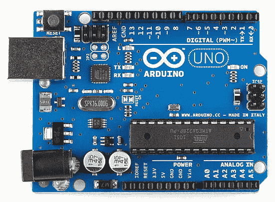
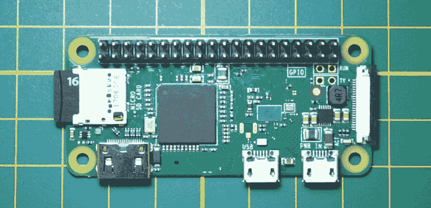
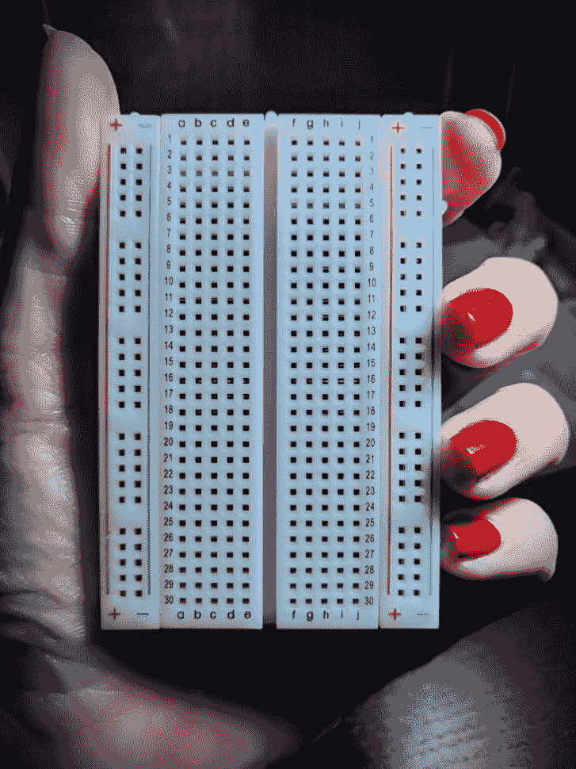
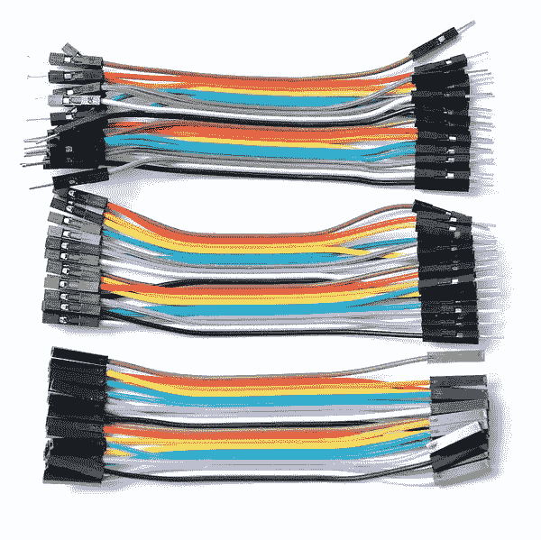
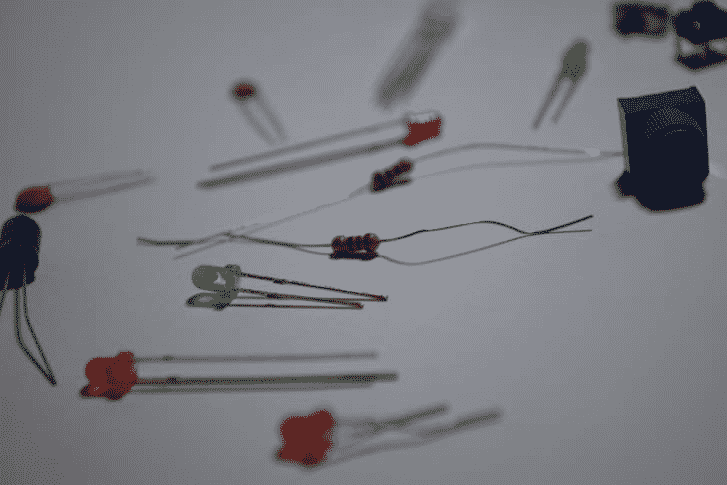
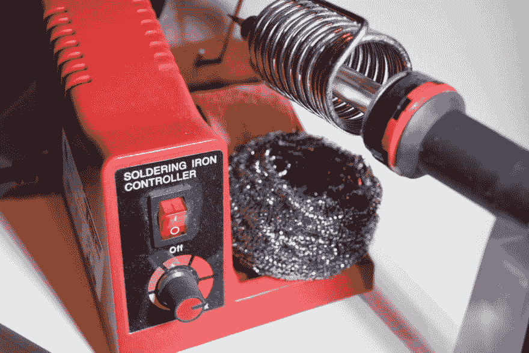
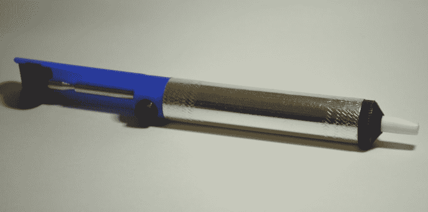
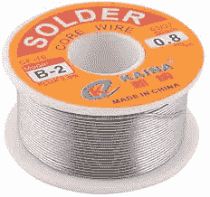
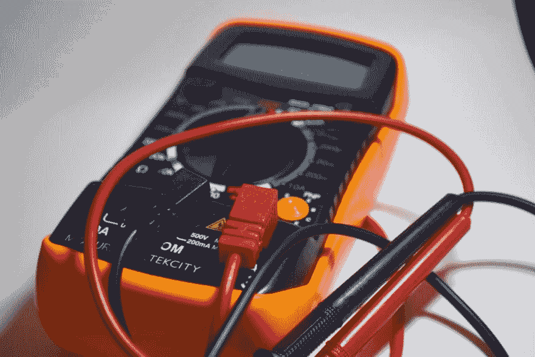

# 整理预算发明者的工具包

> 原文：<https://dev.to/erikaheidi/putting-together-a-budget-inventor-s-kit-p95>

与好的软件不同，使用硬件意味着处理实际的物理的东西。你需要元件，电路板，工具，你可以用自己的双手去使用。这难道不是一个很酷的改变吗？

有许多基本的电子套件，但它们往往要么不完整，要么很贵，有些组件你不会在你的第一个项目中使用。相反，创建你自己的预算发明者工具包可能是一个更好的主意，这是你不需要花太多钱就可以开始的必需品。

这篇文章将带你浏览一份建议物品清单，用来组装一个基本的电子设备套件，最高预算为 **$ 150.00** ，包括一个烙铁和一个数字万用表。

在这篇文章的最后，你会发现 TL；所有建议项目的 DR 列表，带有链接和价格作为参考**。

** *这些不是附属链接。它们仅供参考，因为有些商品可能无法运送到您的国家。*

## 单板微控制器

要在你的作品中加入一些大脑，你需要一个*微控制器*。与其直接使用微控制器，不如从微控制器板开始。无论是在物理层面还是在软件层面，这些通常都更容易处理。

现在最流行的原型平台是 Arduino。它不仅仅是一块板子；这是一个完整的开源原型开发平台，包括一个专用的 IDE 和定制的 C++库，便于为这些主板编程。

 
因为 Arduino 既是开源的，也是开放的硬件，所以你可以找到各种形状和大小的 Arduino 的廉价变体。您也可以使用自定义组件和库创建自己的 Arduino 版本。

覆盆子板也是开始原型制作的好方法。与 [Arduino](https://arduino.cc) 板卡不同，[树莓](https://www.raspberrypi.org/)板卡实际上是一个小板卡中的一整台电脑，有一个 I/O 引脚头，可以在那里连接组件。它运行 Linux (Raspbian ),所以你将在一个更高的层次上工作——例如，如果你已经有了 web 开发的经验，这是很好的。

 
好消息是:你可以花不到 15.00 美元得到一个有 WiFi 支持的树莓板。这比大多数 Arduinos 都便宜！树莓 Pi Zero W(上图)是一个微小的树莓，具有 HDMI 输出，microUSB 用于电源，专用 microUSB 用于输入(键盘/鼠标)。当然，还有其他版本拥有更多的资源，但是 Zero 对于测试平台和制作简单的 IOT 设备来说非常好。

我强烈建议你买一个 Arduino 和一个覆盆子(Pi Zero W)。尽管玩 Raspberry 非常有趣，但您是在操作系统级别工作，这可能会对项目的可靠性和性能产生重大影响。此外，深入底层是了解计算机底层工作原理的好方法。

## 试验板和跳线

 
在设计项目原型时，试验板是你最好的朋友。真的是必备！它允许你创建电路而不需要焊接。非常方便，有各种尺寸。尽管半尺寸和 1/4 尺寸的试验板非常可爱，并且适用于小项目，但是你至少应该有一个全尺寸的试验板。照片中的那个是半尺寸的试验板。

跳线是专门用于将元件连接到试验板的电线。它们有不同的颜色(有助于区分板上的元件)和公或母端子。男-男，女-女，女-男跳线混着用挺好的。

## 基本组件

你手头应该有一堆基本组件，以备不时之需(你会的)。LEDS，不同值的电阻器，按钮和其他你可能会感兴趣的东西！为了将它保持在最低限度，以下是我的建议:

*   常规发光二极管
*   rgb led
*   电阻器套件
*   按钮
*   门铃

## 烙铁及配件

 
烙铁有多种版本和价格。有温度控制的“站”(就像上面照片中的那个)通常是一个不错的选择，但是有更多预算友好的版本，对于像我们这样的业余爱好者来说也很好。

 
最后，但不是最不重要的，你需要焊料。焊料主要有两种，一种成分中含有*铅*，另一种是无铅版本。虽然无铅似乎是一个显而易见的选择，但含铅的选择很受欢迎，因为它通常更容易使用，而且便宜得多。

因为你不会每天都做大量的焊接工作，所以使用铅版完全没问题——只要确保你没有直接呼吸到蒸汽——保持打开窗户和/或附近有风扇。

## 万用表

 
万用表是数字电子设备最基本的调试工具。当事情变糟时，它可以帮你省下几个小时的痛苦。我肯定不是一个有经验的用户，但在我做了一些非常糟糕的焊接后，它救了我。[这一页来自 LadyAda](https://learn.adafruit.com/multimeters/overview) 解释了如何使用万用表以及如何选择购买万用表。

## TL；DR 购物清单

以下是这篇文章中讨论的全部内容，并附有链接**以供参考**:

*   Arduino Uno R3 或 [Arduino Micro with headers](https://www.amazon.com/Arduino-Micro-Headers-A000053-Controller/dp/B00AFY2S56/ref=sr_1_3?crid=1KKRHRRQ5A74B&keywords=arduino+micro&qid=1560846923&s=gateway&sprefix=arduino+micro%2Caps%2C237&sr=8-3) (我的最爱):约 20.00 美元
*   [树莓派 Zero W 基础套装](https://www.amazon.com/Raspberry-Zero-Argon-Forty-Barebones/dp/B075FRRVLR/ref=sr_1_7?keywords=raspberry+pi+zero+w&qid=1558366291&s=gateway&sr=8-7) ~ $ 25.00
*   [带跳线的试验板套件](https://www.amazon.com/Paxcoo-Breadboards-Arduino-Circboard-Prototyping/dp/B0727X6N9D/ref=sr_1_7?keywords=breadboard+kit&qid=1558432793&s=gateway&sr=8-7)～12.00 美元
*   [普通 LED 包](https://www.amazon.com/Diffused-Light-Emitting-Diode-Assortment/dp/B07G49PJLG/ref=sr_1_8?keywords=led+pack&qid=1558366543&s=gateway&sr=8-8) ~ $ 10.00
*   [RGB LED 包](https://www.amazon.com/microtivity-IL612-Diffused-Controllable-Common/dp/B006S21SQO/ref=sr_1_10?keywords=rgb+led+common+anode&qid=1558432968&s=gateway&sr=8-10) ~ $ 6.00
*   [电阻包](https://www.amazon.com/Cutequeen-750-Values-Resistor-25pcs/dp/B016NXK6QK/ref=sr_1_3?crid=2CXCHWEUY033H&keywords=resistor+pack&qid=1558366780&s=gateway&sprefix=resistor+pack%2Caps%2C246&sr=8-3) ~ $ 10.00
*   [按钮包](https://www.amazon.com/MakerSpot-Momentary-Tactile-Breadboard-Friendly/dp/B06XT3FLVM/ref=sr_1_6?keywords=push+button&qid=1558367326&s=gateway&sr=8-6) ~ $ 6.00
*   [压电蜂鸣器](https://www.amazon.com/GBSTORE-9-15V-Active-Electronic-Buzzer/dp/B01JU3SK1I/ref=sr_1_10?keywords=buzzer&qid=1558367391&s=gateway&sr=8-10) ~ $ 6.00
*   [焊接套件(包括烙铁、支架、焊料、焊料吸盘等)](https://www.amazon.com/ANBES-Soldering-Iron-Kit-Electronics/dp/B06XZ31W3M/ref=sr_1_4?keywords=soldering+iron&qid=1558440975&s=gateway&sr=8-4)～22.00 美元
*   [焊丝](https://www.amazon.com/WYCTIN-Solder-Electrical-Soldering-0-11lbs/dp/B071G1J3W6/ref=pd_bxgy_469_img_2/141-4763274-6234068?_encoding=UTF8&pd_rd_i=B071G1J3W6&pd_rd_r=92e97798-7bbd-11e9-a109-d74889de0019&pd_rd_w=ato52&pd_rd_wg=3tAmY&pf_rd_p=a2006322-0bc0-4db9-a08e-d168c18ce6f0&pf_rd_r=4MB3QZ0TZQQD0VGG8P9X&psc=1&refRID=4MB3QZ0TZQQD0VGG8P9X) ~ $ 6.00
*   [数字万用表](https://www.amazon.com/Etekcity-MSR-A600-Auto-Ranging-Multimeters-Capacitance/dp/B07DW681FQ/ref=sr_1_4?keywords=buttons+for+electronics+projects&qid=1558367016&s=industrial-intl-ship&sr=1-4) ~ $ 20.00

**总投资:～143.00 美元**

你怎么想呢?你会在这个工具包中包括什么？分享你的想法！

在这个系列的下一篇文章中，我们将看看**基本焊接**。