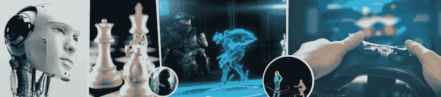

# 技术如何影响游戏产业

> 原文：<https://dev.to/juegostudios/how-technology-is-influencing-the-gaming-industry-2d78>

视频游戏风暴已经袭击了你的电脑、手机和客厅，以至于它几乎已经超越了一切。但一直都是这样吗？不完全是。自从乒乓时代以来，游戏领域已经有了很大的技术发展。这里列出了[技术影响游戏产业](https://www.juegostudio.com/gaming-entertainment)的方式。

**在线游戏是蛋糕上的樱桃**

随着在线游戏的到来，多人游戏得到了他们应得的认可。在某种程度上，在线游戏甚至成为了一个新版本成功的必备元素。毫无疑问，随着 [MMORPG(大型多人在线角色扮演游戏)](https://www.juegostudio.com/blog/the-best-mmorpgs-to-play-right-now)的发展，在线游戏如今已经成为一种完全不同的体验。

如今，无论玩家身在何处，他们都可以在网上与其他玩家一起玩游戏。有趣的是，这一领域无可匹敌的冠军——《魔兽世界》——拥有超过 800 万订户。这意味着大约 800 万人通过在线社区相互联系。你也可以和坐在世界其他角落的人玩老虎机游戏，比如 All Slots Casino。几天前这可能是不可能的，但今天这是现实。在线游戏在现在是一个完全不同的世界。

**第三次元看起来很神奇**

三维游戏在 80 年代就已经有了，比如有 Red Racer 这样的游戏。虽然，早期的平台看起来没有那么迷人，而且在某种程度上也很复杂。

现在大部分游戏都是三维游戏。随着图形软件的改进，它们甚至看起来更好。通往第三维度的道路已经从根本上改变了游戏的外观和感觉。

**图形升级提升如此之大**

我们实话实说吧。乒乓球不是一项漂亮的游戏。它没有当今所有现代游戏中常见的复杂纹理、着色器或精灵。随着时间的推移，在游戏平台上提供或呈现图形的方式已经有了重大的进步。

技术显然允许通过硬件升级来改进图形。另一方面，Pong 时代的处理器有限。因此，对于起伏不定的表现，没有多少办法可以消除。今天是高速硬件的时代，它允许更多的指令、像素和阴影——即使是在巨大的规模上。

**便携性使游戏变得有利**

在把一切都变得便携的执着中，我们怎么能把游戏抛在身后呢？游戏控制台变得可以轻松运输，结果是人们现在可以在任何时间任何地点玩游戏。你只需要简单地按下开关，剩下的就交给娱乐公司了。这意味着再也不用拖着电视机和游戏机和朋友玩游戏了。

便携式游戏背后的技术似乎已经落后了一段时间。但是能够随时随地玩游戏的独特性是毋庸置疑的。正是由于这一创新，手机和 mp3 播放器出现在公交车上。

**人工智能发展迅速**

即使是没有对手的 MMO 游戏也是一种枯燥乏味的体验。这就是人工智能发挥作用的地方。虽然，AI 从游戏行业最开始就已经存在了。这不是什么创造性的东西；你打乒乓球的时候它就一直在那里。但新的事实是，现在人工智能开始越来越多地模仿人类。

如今，在电子游戏中，敌人可能会选择侧翼包围这样的战术。当他们无法获得你的清晰视野时，他们可能会扔一枚手榴弹。这与现实生活中的战争很相似。人工智能一年比一年聪明。此外，它已经到了训练计算机控制的玩家像人一样行动的地步。人工智能肯定可以被称为视频游戏中的巨大技术进步，因为它是视频游戏存在的重要原因。

**结论**

电子游戏技术将走向何方？20 年前，技术似乎是即将到来的技术的前沿。或许同样的事情也会发生。虽然预测未来是不可能的，但公平地说，虚拟现实最近已经成为一个不断发展的话题。