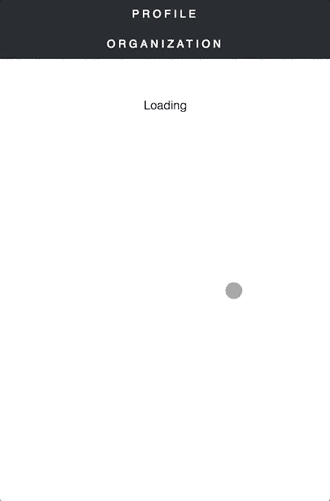
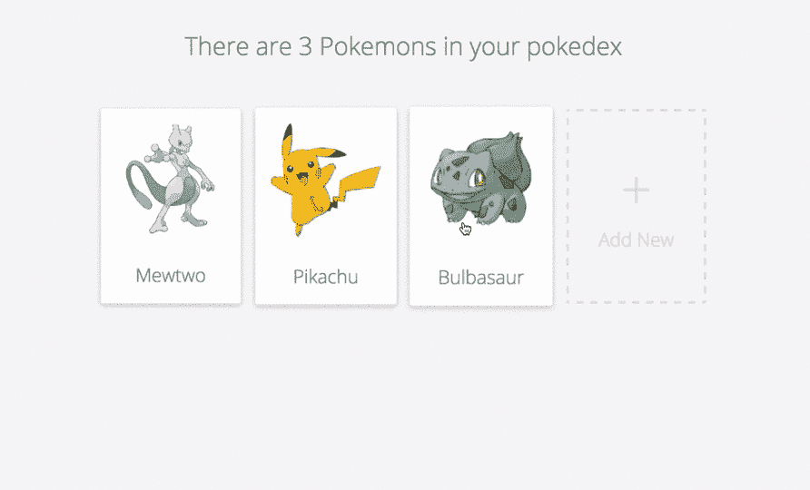
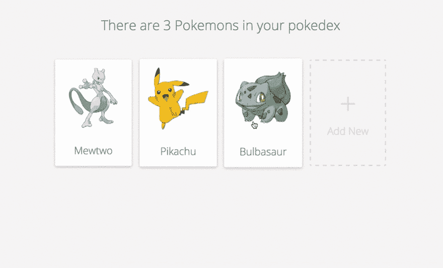
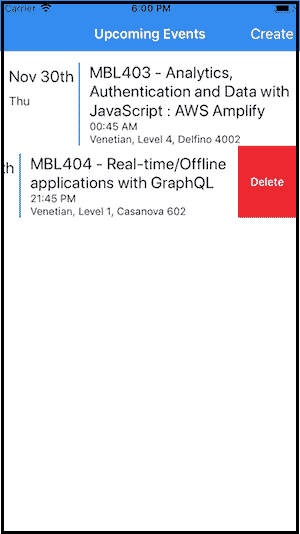

# React & GraphQL 入门第二部分

> 原文：<https://dev.to/robmatyszewski/getting-started-with-react-graphql-part-ii-532g>

这是 React & GraphQL 入门系列*的第二部分，包含最流行的初学者工具包和示例应用。让我们从一开始就探索人们喜欢和不喜欢每项技术的地方。以下数据来自 2018 年 js 调查。*

| **对喜欢的方面做出反应** | **对不喜欢的方面做出反应** |
| --- | --- |
| ⚙️优雅的编程风格和模式 | ⚙️笨拙的编程风格 |
| 🎁丰富的包装生态系统 | 🎈臃肿复杂 |
| 🏛️成熟的选择 | 👶艰难的学习曲线 |
| 📖良好的文档 | 👫对团队/公司的担忧 |
| ⚡快速性能 | 📖错误的文档 |
| 🔧强大的开发工具 | ⚖️变化快，经常坏掉 |

| ** GraphQL 喜欢的方面** | ** GraphQL 不喜欢的方面** |
| --- | --- |
| ⚙️优雅的编程风格和模式 | 🎈臃肿复杂 |
| 📉增长的势头/受欢迎程度 | ⚙️笨拙的编程风格 |
| 🔧强大的开发工具 | 👶艰难的学习曲线 |
| 🕹️功能齐全且强大 | 📖错误的文档 |
| 📖良好的文档 | 🔧缺少开发工具 |
| ⚡快速性能 | 🕹️有限公司&缺乏特色 |

# 议程

1.  阿波罗的广泛反应。
2.  反应图形 vanilla . js。
3.  将应用程序与本地状态管理进行反应。
4.  反应阿波罗嘲讽的例子。
5.  WhatsApp 克隆。
6.  反应原生“hello world”。
7.  Pokedex React 原生 App。
8.  实时、离线 AWS AppSync。
9.  Starter fullstack app.

# [1。丰富的 React 应用程序](https://github.com/rwieruch/react-graphql-github-apollo)

### 一个 React + Apollo + GraphQL 的 GitHub 客户端

##  [【路对图 QL】](https://github.com/the-road-to-graphql)/[【反应图 QL-github-Apollo】](https://github.com/the-road-to-graphql/react-graphql-github-apollo)

### 🚀一个 React + Apollo + GraphQL GitHub 客户端。您有机会在实际应用中了解这些技术。

<article class="markdown-body entry-content p-5" itemprop="text">

# React + Apollo + GraphQL GitHub 客户端

[](https://travis-ci.org/the-road-to-graphql/react-graphql-github-apollo)[](https://slack-the-road-to-learn-react.wieruch.com/)[](https://greenkeeper.io/)

[](https://user-images.githubusercontent.com/2479967/35777369-14a2d1ae-09ad-11e8-80c6-7a3ddeabb716.gif)

## 特征

*   使用创建-反应-应用程序反应 16
*   应答的
*   反应路由器 4
*   阿波罗与 GitHub GraphQL API
    *   使用渲染属性的查询和变化
    *   乐观的更新
    *   页码
    *   乐观提取(例如问题)
        *   但并非所有地方都是为了演示

## 装置

*   `git clone git@github.com:the-road-to-graphql/react-graphql-github-apollo.git`
*   cd 反应图 ql-github-apollo
*   在根文件夹的. env 文件中添加您自己的 [GitHub 个人访问令牌](https://help.github.com/articles/creating-a-personal-access-token-for-the-command-line/)
    *   您需要检查的范围/权限:管理:组织、回购、用户、通知
    *   REACT _ APP _ GITHUB _ PERSONAL _ ACCESS _ TOKEN = xxxXXX
*   npm 安装
*   npm 开始
*   访问`http://localhost:3000`

## 贡献的

*   请将[漂亮的集成](https://prettier.io/docs/en/editors.html)安装到您的编辑器中，并在保存选项中打开**格式。**
    *   [原子更漂亮](https://github.com/prettier/prettier-atom)
    *   【VSCode 更漂亮
    *   [EMACS 更漂亮](https://github.com/prettier/prettier-emacs)
    *   [VIM 更漂亮](https://prettier.io/docs/en/vim.html)
    *   [其他...](https://prettier.io/docs/en/editors.html)

## 想了解更多关于 React + GraphQL + Apollo 的知识？

*   不要错过[即将推出的教程和课程](https://www.getrevue.co/profile/rwieruch)
*   检查当前[反应过程](https://roadtoreact.com)

</article>

[View on GitHub](https://github.com/the-road-to-graphql/react-graphql-github-apollo)

[](https://res.cloudinary.com/practicaldev/image/fetch/s--XByOg583--/c_limit%2Cf_auto%2Cfl_progressive%2Cq_66%2Cw_880/https://thepracticaldev.s3.amazonaws.com/i/359i2n7b986j08jyrqfw.gif)

### 特性

*   使用创建-反应-应用程序反应 16
*   应答的
*   反应路由器 4
*   阿波罗与 GitHub GraphQL API
    *   使用渲染属性的查询和变化
    *   乐观的更新
    *   页码
    *   乐观提取(例如问题)
    *   但并非所有地方都是为了演示

# [2。React GraphQL vanilla.js](https://github.com/rwieruch/react-graphql-github-vanilla)

### 使用 GitHub 的 GraphQL API 和 vanilla JS 的 React GraphQL 示例

## /[react-graph QL-github-vanilla](https://github.com/the-road-to-graphql/react-graphql-github-vanilla)

### 一个使用 GitHub 的 GraphQL API 和 vanilla JS 的 React GraphQL 示例

<article class="markdown-body entry-content p-5" itemprop="text">

# 反应图 ql-github-vanilla

[](https://travis-ci.org/the-road-to-graphql/react-graphql-github-vanilla)[](https://slack-the-road-to-learn-react.wieruch.com/)[](https://greenkeeper.io/)

一个简单的 React 应用程序，通过普通的 HTTP 请求使用 GitHub GraphQL API。[在这里阅读更多信息](https://www.robinwieruch.de/react-with-graphql-tutorial)。

## 特征

*   使用创建-反应-应用程序反应 16
*   GitHub GraphQL API
*   使用普通 JS 使用 GraphQL
*   没有阿波罗/接力赛
    *   你对阿波罗好奇吗？

## 装置

*   `git clone git@github.com:the-road-to-graphql/react-graphql-github-vanilla.git`
*   cd 反应图 ql-github-vanilla
*   npm 安装
*   在中添加您自己的 REACT _ APP _ GITHUB _ PERSONAL _ ACCESS _ TOKEN。环境文件
    *   您需要检查的范围/权限:管理:组织、回购、用户、通知
*   npm 开始
*   访问`http://localhost:3000`

## 想了解更多关于 React + GraphQL + Apollo 的知识？

*   不要错过[即将推出的教程和课程](https://www.getrevue.co/profile/rwieruch)
*   检查当前[反应过程](https://roadtoreact.com)

</article>

[View on GitHub](https://github.com/the-road-to-graphql/react-graphql-github-vanilla)

### 特性

*   使用创建-反应-应用程序反应 16
*   GitHub GraphQL API
*   使用普通 JS 使用 GraphQL
*   没有阿波罗/接力赛

# [3。将应用程序与本地状态管理进行反应。](https://github.com/rwieruch/react-apollo-link-state-example)

### 一个 React 应用程序，使用带有 apollo-link-state 的 Apollo 客户端进行本地状态管理。

##  [【道路到图表】ql ](https://github.com/the-road-to-graphql) / [反应-阿波罗-链接-状态-实例](https://github.com/the-road-to-graphql/react-apollo-link-state-example)

### 一个 React 应用程序，使用带有 apollo-link-state 的 Apollo 客户端进行本地状态管理。

<article class="markdown-body entry-content p-5" itemprop="text">

# 反应-阿波罗-链接-状态-示例

[](https://travis-ci.org/the-road-to-graphql/react-apollo-link-state-example)[](https://slack-the-road-to-learn-react.wieruch.com/)[](https://greenkeeper.io/)

React 应用程序使用带有 [apollo-link-state](https://www.apollographql.com/docs/link/links/state.html) 的 Apollo 客户端进行本地状态管理。 **apollo-link-state(作为 React 的本地状态的替代，Redux 或 MobX)** 用于将列表中的选定项作为本地数据进行管理，其余的查询和变异用于远程数据。

## 装置

*   `git clone git@github.com:the-road-to-graphql/react-apollo-link-state-example.git`
*   CD react-Apollo-link-state-示例
*   npm 安装
*   在中添加您自己的 REACT _ APP _ GITHUB _ PERSONAL _ ACCESS _ TOKEN。环境文件
    *   您需要检查的范围/权限:管理:组织、回购、用户、通知
*   npm 开始
*   访问`http://localhost:3000`

## 想了解更多关于 React + GraphQL + Apollo 的知识？

*   不要错过[即将推出的教程和课程](https://www.getrevue.co/profile/rwieruch)
*   检查当前[反应过程](https://roadtoreact.com)

</article>

[View on GitHub](https://github.com/the-road-to-graphql/react-apollo-link-state-example)

React 应用程序使用带有 [apollo-link-state](https://www.apollographql.com/docs/link/links/state.html) 的 Apollo 客户端进行本地状态管理。 **apollo-link-state(作为 React 的本地状态的替代，Redux 或 MobX)** 用于将列表中的选定项作为本地数据进行管理，其余的查询和变异用于远程数据。

# [4。WhatsApp 克隆](https://github.com/srtucker22/chatty)

### React Native 和 Apollo 的 WhatsApp 克隆

##  [ srtucker22 ](https://github.com/srtucker22) / [健谈](https://github.com/srtucker22/chatty)

### 带有 React Native 和 Apollo 的 WhatsApp 克隆(教程)

<article class="markdown-body entry-content p-5" itemprop="text">

# 非正式的

## React Native 和 Apollo 的 WhatsApp 克隆版

*   [概述](https://raw.githubusercontent.com/srtucker22/chatty/master/#overview)
*   [步骤](https://raw.githubusercontent.com/srtucker22/chatty/master/#steps)
*   [安装](https://raw.githubusercontent.com/srtucker22/chatty/master/#installing)
*   [入门](https://raw.githubusercontent.com/srtucker22/chatty/master/#getting-started)
*   [投稿](https://raw.githubusercontent.com/srtucker22/chatty/master/#contributing)
*   [执照](https://raw.githubusercontent.com/srtucker22/chatty/master/#licence)

# 概观

查看这篇教程的媒体博客[这里](https://medium.com/react-native-training/building-chatty-a-whatsapp-clone-with-react-native-and-apollo-part-1-setup-68a02f7e11)。

本教程是使用 [tortilla](https://github.com/Urigo/tortilla) 创建的，这是一个构建教程的不可思议的框架。

从第一次提交开始，Chatty 中的每次提交都代表教程中的下一步。按照教程的指导浏览代码，或者研究 commit 以查看给定步骤中究竟更改了哪些代码。因为这是 git，你甚至可以在教程的任何一步下载这个应用——这多酷啊？！

# 步伐

1.  [设置](https://raw.githubusercontent.com/srtucker22/chatty/master//.tortilla/manuals/views/step1.md)
2.  [使用 ApolloServer 的 GraphQL 查询](https://raw.githubusercontent.com/srtucker22/chatty/master//.tortilla/manuals/views/step2.md)
3.  [用 React Apollo 进行 GraphQL 查询](https://raw.githubusercontent.com/srtucker22/chatty/master//.tortilla/manuals/views/step3.md)
4.  [GraphQL 突变&乐观 UI](https://raw.githubusercontent.com/srtucker22/chatty/master//.tortilla/manuals/views/step4.md)
5.  [GraphQL 分页](https://raw.githubusercontent.com/srtucker22/chatty/master//.tortilla/manuals/views/step5.md)
6.  [GraphQL 订阅](https://raw.githubusercontent.com/srtucker22/chatty/master//.tortilla/manuals/views/step6.md)
7.  [GraphQL 认证](https://raw.githubusercontent.com/srtucker22/chatty/master//.tortilla/manuals/views/step7.md)
8.  [GraphQL 输入类型](https://raw.githubusercontent.com/srtucker22/chatty/master//.tortilla/manuals/views/step8.md)

# 安装

```
npm install                       # install server dependencies
cd client && npm install          # install client dependencies
```

对于步骤 7 和更高，请输入您的…

</article>

[View on GitHub](https://github.com/srtucker22/chatty)

### 概述

这是一个构建这个例子的教程[这里](https://medium.com/react-native-training/building-chatty-a-whatsapp-clone-with-react-native-and-apollo-part-1-setup-68a02f7e11)。本教程是使用[玉米粉圆饼](https://github.com/Urigo/tortilla)创建的，这是一个构建教程的不可思议的框架。从第一次提交开始，Chatty 中的每次提交都代表教程中的下一步。按照教程的指导浏览代码，或者研究 commit 以查看给定步骤中究竟更改了哪些代码。因为这是 git，你甚至可以在教程的任何一步下载这个应用——这多酷啊？！

# [5。反应原生《hello world》](https://github.com/apollographql/frontpage-react-native-app)

## [apolographql](https://github.com/apollographql)/[front page-react-native-app](https://github.com/apollographql/frontpage-react-native-app)

### 📄Apollo“hello world”应用程序，用于 React Native

<article class="markdown-body entry-content p-5" itemprop="text">

# 阿波罗 React 原生 Hello World 应用

这是位于 dev.apollodata.com 的 React Native/Apollo 应用程序的简单示例。

## 装置

克隆存储库并运行`npm install`:

```
git clone https://github.com/apollostack/frontpage-react-native-app
cd frontpage-react-native-app
npm install 
```

## 启动应用程序

确保你已经安装了[React Native](https://facebook.github.io/react-native/docs/getting-started.html)。

这个应用程序与 hello world 服务器对话，可从这里获得:[https://github.com/apollostack/frontpage-server](https://github.com/apollostack/frontpage-server)

安装并启动该服务器后，使用以下命令启动此应用程序:

```
react-native run-ios 
```

它将打开一个 iOS 模拟器。

</article>

[View on GitHub](https://github.com/apollographql/frontpage-react-native-app)

这是位于 dev.apollodata.com 的 React Native/Apollo 应用程序的简单示例。

# [6。Pokedex React 原生 App](https://github.com/learnapollo/pokedex-react-native)

## [learnapollo](https://github.com/learnapollo)/[pokedex-react-native](https://github.com/learnapollo/pokedex-react-native)

### 一个 Pokedex 应用程序使用并教授 Apollo 与 React Native (Expo)

<article class="markdown-body entry-content p-5" itemprop="text">

# pokedex-react-native

Pokedex React 基于 CRNA 的原生 app & Expo 使用和教授 Apollo 和 GraphQL

> **现场试玩:[http://demo.learnapollo.com](http://demo.learnapollo.com/)T3】**

[](https://camo.githubusercontent.com/55add6eb6dafa52672470ab08622f2363d10a974/68747470733a2f2f692e6779617a6f2e636f6d2f61646363343637356364343636313935616466373237626138613332623534342e676966)

## 入门指南

如果你还没有做过，请查看[动手学习阿波罗教程](https://learnapollo.com/)。

```
git clone git@github.com:learnapollo/pokedex-react-native.git
cd pokedex-react-native
cd exercise-01
yarn
yarn start
```

## 工作流程

在学习 Apollo 教程的过程中，您将进行不同的编码练习。每个练习都有一个文件夹，你可以用来开始工作，还有一个解决方案文件夹，如果“学习阿波罗”上给出的说明不够清楚，你可以偷看一下。

完成该步骤后，您可以通过查看各自的文件夹，将您的结果与官方解决方案进行比较。如果您找到了与我们提议不同的解决方案，请随时[告诉我们](http://slack.graph.cool/)您的解决方案。<g-emoji class="g-emoji" alias="bulb" fallback-src="https://github.githubassets.cimg/icons/emoji/unicode/1f4a1.png">💡</g-emoji>

## 帮助与社区 [](https://slack.graph.cool)

如果您遇到问题或有疑问，请加入我们的 [Slack 社区](http://slack.graph.cool/)。我们喜欢和…

</article>

[View on GitHub](https://github.com/learnapollo/pokedex-react-native)

Pokedex React 基于 CRNA 的原生 app & Expo 使用和教授 Apollo 和 GraphQL

### 现场演示:【http://demo.learnapollo.com T2】

[](https://res.cloudinary.com/practicaldev/image/fetch/s--n-uce96---/c_limit%2Cf_auto%2Cfl_progressive%2Cq_66%2Cw_880/https://i.gyazo.com/adcc4675cd466195adf727ba8a32b544.gif)

# [7。实时、离线 AWS AppSync](https://github.com/aws-samples/aws-mobile-appsync-events-starter-react-native)

### GraphQL starter 应用程序，使用 AWS AppSync 实现实时和离线功能

## [AWS-samples](https://github.com/aws-samples)/[AWS-mobile-app sync-events-starter-react-native](https://github.com/aws-samples/aws-mobile-appsync-events-starter-react-native)

### 使用 AWS AppSync 的具有实时和离线功能的 GraphQL starter 应用程序

<article class="markdown-body entry-content p-5" itemprop="text">

# 介绍

这是一个 Starter React 本机应用程序，用于在构建 GraphQL API 时使用 AWS AppSync 控制台中的示例应用程序。示例应用程序创建一个 GraphQL 模式并提供 Amazon DynamoDB 资源，然后用解析器适当地连接它们。该应用程序使用 AWS AppSync 演示了 GraphQL 的变化、查询和订阅。您可以将其用于学习目的，或者修改应用程序或 GraphQL 模式以满足您的需求。

[](https://raw.githubusercontent.com/aws-samples/aws-mobile-appsync-events-starter-react-native/master/media/DeleteEvents.png)

## 特征

*   GraphQL 突变

    *   创建新事件
    *   创建对现有事件的评论
*   你想要什么

    *   获取所有事件(支持分页)
    *   通过 Id 获取事件
*   图形 SQL 订阅

    *   事件评论的实时更新
*   批准

    *   该应用程序使用 api 密钥作为授权机制

## AWS 设置

1.  使用 URL 导航到 AWS AppSync 控制台:[http://console.aws.amazon.com/appsync/home](http://console.aws.amazon.com/appsync/home)

2.  点击`Create API`并选择`Sample Schema`选项。输入您选择的 API 名称。点击`Create`。

## 反应自然

…</article>

[View on GitHub](https://github.com/aws-samples/aws-mobile-appsync-events-starter-react-native)

[](https://res.cloudinary.com/practicaldev/image/fetch/s--pC6u8jPC--/c_limit%2Cf_auto%2Cfl_progressive%2Cq_auto%2Cw_880/https://thepracticaldev.s3.amazonaws.com/i/2rkf6dkpytxc9d9hosw5.png)

### 特性

*   GraphQL 突变

    *   创建新事件
    *   创建对现有事件的评论
*   你想要什么

    *   获取所有事件(支持分页)
    *   通过 Id 获取事件
*   图形 SQL 订阅

    *   事件评论的实时更新
*   批准

    *   该应用程序使用 api 密钥作为授权机制

# [8。Starter fullstack 应用](https://github.com/graphql-boilerplates/react-fullstack-graphql/)

## [graph QL-样板文件](https://github.com/graphql-boilerplates)/[react-full stack-graph QL](https://github.com/graphql-boilerplates/react-fullstack-graphql)

### 基于 React & GraphQL 的全栈应用的启动项目。

<article class="markdown-body entry-content p-5" itemprop="text">

# 用于 React & Node.js 的 Fullstack GraphQL 样板文件

[](https://camo.githubusercontent.com/cb8e64e5802d8523883fed4fae290fa2853fcc62/68747470733a2f2f696d6775722e636f6d2f6f7573795161432e706e67)

**Bootstrap your fullstack GraphQL app within seconds**GraphQL boilerplates provide the perfect foundation for your GraphQL server, no matter if you're just getting started with GraphQL or aim to build a fully-fledged application.

## 特征

*   **快速搭建**:只需使用`graphql create`(从 [GraphQL CLI](https://github.com/graphql-cli/graphql-cli) 下载你想要的样板文件。
*   易于扩展:样板文件只提供最基本的设置，所以你可以根据你的用例定制 API。
*   **最佳实践**:每个样板文件都包含了 GraphQL 社区的最佳实践。

对于一个完全成熟的**反应&阿波罗教程**，访问[如何制图](https://www.howtographql.com/react-apollo/0-introduction/)。你可以在这里更多地了解 GraphQL 样板[背后的想法。](https://blog.graph.cool/graphql-boilerplates-graphql-create-how-to-setup-a-graphql-project-6428be2f3a5)

## 快速启动

选择一个样板文件，并按照所属自述文件中的说明开始操作:

*   [`minimal`](https://raw.githubusercontent.com/graphql-boilerplates/react-fullstack-graphql/master/./minimal) :具有基本“Hello World”功能的最小样本
*   [`basic`](https://raw.githubusercontent.com/graphql-boilerplates/react-fullstack-graphql/master/./basic) :基于简单数据模型的基本样板文件…

</article>

[View on GitHub](https://github.com/graphql-boilerplates/react-fullstack-graphql)

在几秒钟内启动您的 fullstack GraphQL 应用程序。无论您是刚刚开始使用 GraphQL 还是打算构建一个成熟的应用程序，GraphQL 样板都为您的 GraphQL 服务器提供了完美的基础。

### 特性

*   **快速搭建**:只需使用`graphql create`(从 [GraphQL CLI](https://github.com/graphql-cli/graphql-cli) 下载你想要的样板文件。
*   易于扩展:样板文件只提供最基本的设置，所以你可以根据你的用例定制 API。
*   **最佳实践**:每个样板文件都包含了 GraphQL 社区的最佳实践。