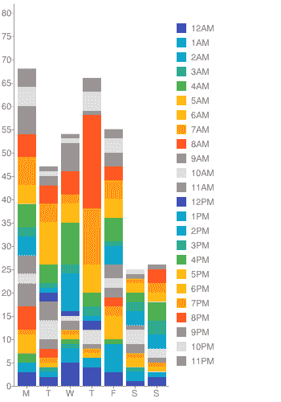
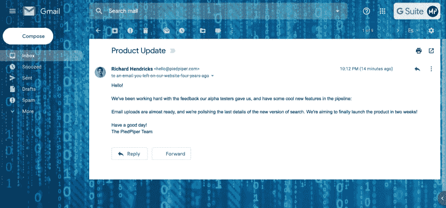
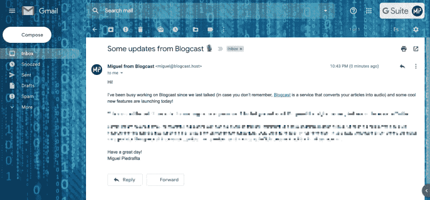

# 你是谁来着？

> 原文：<https://dev.to/m1guelpf/who-were-you-again-14op>

我每天都会收到很多不同的电子邮件，可能是因为我习惯把我的电子邮件留在任何我认为有点意思的网站上。自从我加入创客社区后，我感兴趣的网站数量迅速增加，给我留下了一个类似这样的收件箱:

<figure> 

<figcaption>上周收到的邮件明细。对一些人来说，每周 340 封邮件可能不算多，但对我来说，这是我能处理的极限。</figcaption>

</figure>

有了如此庞大的收件箱，我每周都会收到多封类似这样的邮件:

<figure> 

<figcaption>谢谢你的更新理查德，但我忘了两周前魔笛是什么</figcaption>

</figure>

不要误解我，我喜欢了解别人正在做的事情的最新进展。我的问题是，我没有办法将你的产品与我注册的其他 50 种产品区分开来，也没有简单的方法来获得更多的信息。仅仅因为你从开始工作起就把你的产品放在你的头上，并不意味着你的用户甚至记得它是关于什么的。

如果说我从收到大量电子邮件中学到了什么，那就是，除非你的用户每天都登录你的产品(比如 Slack 或 GitHub)，否则你必须在给用户发邮件时提醒他们你的产品是什么。

当你第一次提到产品的名字时，只需添加一个微妙的提醒(如果你链接到产品的话会加分)，你会为你的用户节省一些侦查时间。