# Azure 物联网中心和 MXChip 动手实验室

> 原文：<https://dev.to/azure/azure-iot-central-and-mxchip-hands-on-lab-328i>

这个实验也可以在 GitHub 上找到，格式稍微简单一点。

# Azure 物联网中心和 MXChip 动手实验室

[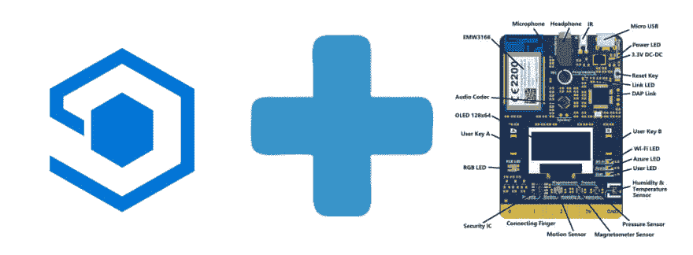](https://res.cloudinary.com/practicaldev/image/fetch/s--jr4uKz6m--/c_limit%2Cf_auto%2Cfl_progressive%2Cq_auto%2Cw_880/https://gloveboxes.github.io/iot-central-mxchip-hol/media/iot-central-mxchip-banner.png)

本动手实验是对“[将 MXChip IoT DevKit 设备连接到您的 Azure IoT Central 应用程序](https://docs.microsoft.com/en-us/azure/iot-central/howto-connect-devkit?WT.mc_id=devto-blog-dglover)”指南中的内容的重新利用。

本实验操作分为三个主要部分。

1.  [创建 Azure 物联网中央应用](#creating-an-azure-iot-central-application)

2.  [将 MXChip 物联网开发套件设备连接到您的 Azure 物联网中央应用程序](#connecting-an-mxchip-iot-devkit-device-to-your-azure-iot-central-application)

3.  [设置设备模板(高级)](#setting-up-a-device-template)

## 开始之前

要完成本动手实验的步骤，您需要一台 DevKit 设备。要购买 DevKit 设备，请访问 [MXChip IoT DevKit](https://microsoft.github.io/azure-iot-developer-kit/) 。

# 创建 Azure 物联网中心应用

[](https://res.cloudinary.com/practicaldev/image/fetch/s--Dj-3QzhG--/c_limit%2Cf_auto%2Cfl_progressive%2Cq_auto%2Cw_880/https://gloveboxes.github.io/iot-central-mxchip-hol/media/azure_iot_central.png)

作为一个*构建者*，你使用 Azure IoT Central UI 来定义你的微软 Azure IoT Central 应用。该快速入门向您展示了如何创建一个 Azure IoT Central 应用程序，其中包含一个示例*设备模板*和模拟的*设备*。

导航至 Azure IoT Central [应用管理器](https://aka.ms/iotcentral)页面。您需要使用 Microsoft 个人或工作或学校帐户登录。

要开始创建新的 Azure IoT Central 应用程序，请选择**新应用程序**。这将把您带到**创建应用程序**页面。

[](https://res.cloudinary.com/practicaldev/image/fetch/s--pVhK_oWi--/c_limit%2Cf_auto%2Cfl_progressive%2Cq_auto%2Cw_880/https://gloveboxes.github.io/iot-central-mxchip-hol/media/quick-deploy-iot-central/iotcentralcreate.png)

创建新的 Azure IoT Central 应用程序:

1.  选择**轨迹**付款计划:

    *   **试用**申请在到期前 7 天免费。它们可以在到期前的任何时候转换为现收现付。
    *   **现收现付**应用按设备收费，前 5 台设备免费。

    在 [Azure 物联网中央定价页面](https://azure.microsoft.com/pricing/details/iot-central?WT.mc_id=devto-blog-dglover)了解更多关于定价的信息。

2.  选择一个友好的应用程序名称，例如 **Contoso IoT** 。Azure IoT Central 会为您生成一个唯一的 URL 前缀。您可以将此 URL 前缀更改为更容易记住的名称。

3.  选择**示例开发工具包**应用程序模板。

4.  选择**创建**。

## 下一步

# 畅游 Azure 物联网中央 UI

本文向您介绍了微软 Azure 物联网中央 UI。您可以使用 UI 来创建、管理和使用 Azure IoT Central 解决方案及其连接的设备。

作为一个*构建者*，你使用 Azure IoT Central UI 来定义你的 Azure IoT Central 解决方案。您可以使用用户界面来:

*   定义连接到您的解决方案的设备类型。
*   为您的设备配置规则和操作。
*   为使用您的解决方案的*操作员*定制 UI。

作为一名*操作员*，你使用 Azure IoT Central UI 来管理你的 Azure IoT Central 解决方案。您可以使用用户界面来:

*   监控您的设备。
*   配置您的设备。
*   对设备问题进行故障排除和修复。
*   供应新设备。

## 使用左侧导航菜单

使用左侧导航菜单访问应用程序的不同区域。您可以通过选择 **<** 或 **>** 来展开或折叠导航栏:

[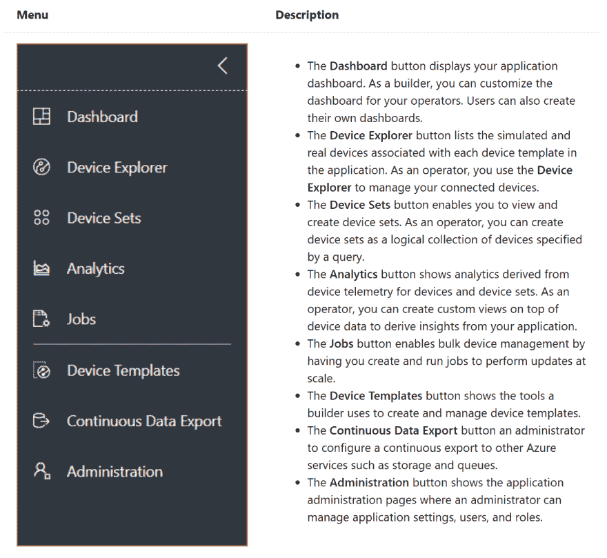](https://res.cloudinary.com/practicaldev/image/fetch/s--uq-QIgdq--/c_limit%2Cf_auto%2Cfl_progressive%2Cq_auto%2Cw_880/https://gloveboxes.github.io/iot-central-mxchip-hol/media/overview-iot-central-tour/navigationbar-description.png)

## 搜索、帮助和支持

顶部菜单出现在每个页面上:

[](https://res.cloudinary.com/practicaldev/image/fetch/s--np_QO7UW--/c_limit%2Cf_auto%2Cfl_progressive%2Cq_auto%2Cw_880/https://gloveboxes.github.io/iot-central-mxchip-hol/media/overview-iot-central-tour/toolbar.png)

*   要搜索设备模板和设备，输入一个**搜索**值。
*   要更改 UI 语言或主题，请选择**设置**图标。
*   要退出应用程序，请选择**帐户**图标。
*   要获得帮助和支持，请选择 **Help** 下拉菜单查看资源列表。在试用应用程序中，支持资源包括访问[实时聊天](https://docs.microsoft.com/en-us/azure/iot-central/howto-show-hide-chat?WT.mc_id=devto-blog-dglover)。

您可以为 UI 选择浅色主题或深色主题:

[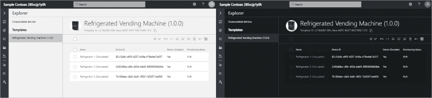](https://res.cloudinary.com/practicaldev/image/fetch/s--UBw7Kfa9--/c_limit%2Cf_auto%2Cfl_progressive%2Cq_auto%2Cw_880/https://gloveboxes.github.io/iot-central-mxchip-hol/media/overview-iot-central-tour/themes.png)

## 仪表盘

[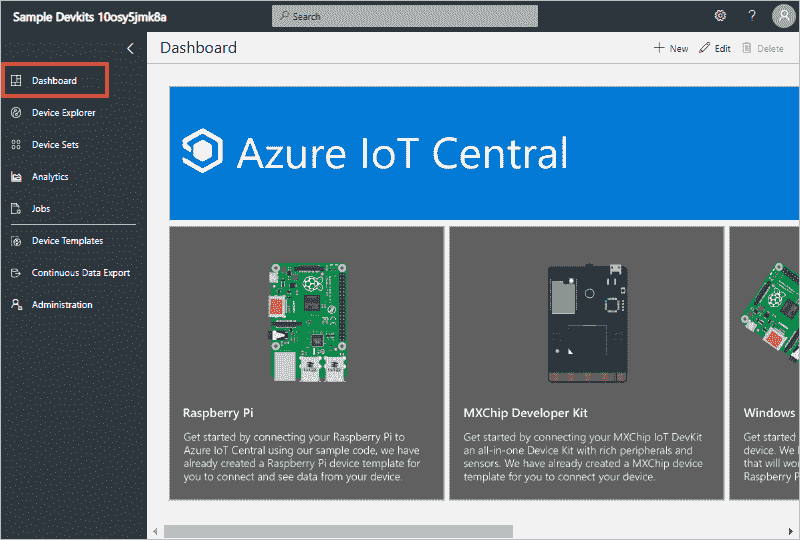](https://res.cloudinary.com/practicaldev/image/fetch/s--i4xIs3Cx--/c_limit%2Cf_auto%2Cfl_progressive%2Cq_auto%2Cw_880/https://gloveboxes.github.io/iot-central-mxchip-hol/media/overview-iot-central-tour/homepage.png)

仪表板是您登录 Azure IoT Central 应用程序时看到的第一个页面。作为构建者，您可以通过添加图块为其他用户自定义应用程序仪表板。要了解更多信息，请参见[定制 Azure IoT 中央操作员视图](https://docs.microsoft.com/en-us/azure/iot-central/tutorial-customize-operator?WT.mc_id=devto-blog-dglover)教程。用户还可以[创建自己的个人仪表盘](https://docs.microsoft.com/en-us/azure/iot-central/howto-personalize-dashboard?WT.mc_id=devto-blog-dglover)。

## 设备浏览器

[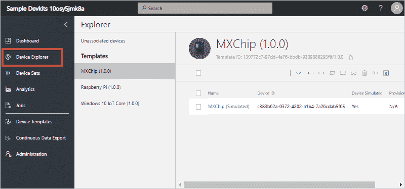](https://res.cloudinary.com/practicaldev/image/fetch/s--BPjVM8rm--/c_limit%2Cf_auto%2Cfl_progressive%2Cq_auto%2Cw_880/https://gloveboxes.github.io/iot-central-mxchip-hol/media/overview-iot-central-tour/explorer.png)

浏览器页面显示了您的 Azure IoT Central 应用程序中的*设备*，这些设备按照*设备模板*分组。

*   设备模板定义了可以连接到应用程序的设备类型。要了解更多信息，请参见[在 Azure IoT Central 应用程序](https://docs.microsoft.com/en-us/azure/iot-central/tutorial-define-device-type?WT.mc_id=devto-blog-dglover)中定义新的设备类型。
*   设备代表应用程序中的真实设备或模拟设备。要了解更多信息，请参见[向您的 Azure 物联网中心应用程序添加新设备](https://docs.microsoft.com/en-us/azure/iot-central/tutorial-add-device?WT.mc_id=devto-blog-dglover)。

## 设备组

[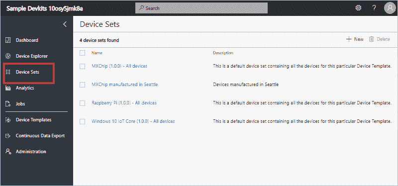](https://res.cloudinary.com/practicaldev/image/fetch/s--e0hDcyxZ--/c_limit%2Cf_auto%2Cfl_progressive%2Cq_auto%2Cw_880/https://gloveboxes.github.io/iot-central-mxchip-hol/media/overview-iot-central-tour/devicesets.png)

*设备集*页面显示由构建器创建的设备集。设备集是相关设备的集合。构建器定义查询以识别包括在设备集中的设备。当您在应用程序中自定义分析时，可以使用设备集。要了解更多信息，请参见 Azure IoT Central 应用程序文章中的[使用设备集。](https://docs.microsoft.com/en-us/azure/iot-central/howto-use-device-sets?WT.mc_id=devto-blog-dglover)

## 分析学

[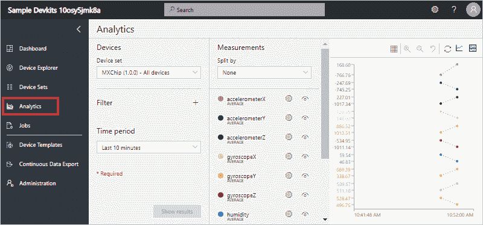](https://res.cloudinary.com/practicaldev/image/fetch/s--hIK2x3Hv--/c_limit%2Cf_auto%2Cfl_progressive%2Cq_auto%2Cw_880/https://gloveboxes.github.io/iot-central-mxchip-hol/media/overview-iot-central-tour/analytics.png)

分析页面显示图表，帮助您了解连接到您的应用程序的设备的行为。操作员使用此页面监控和调查连接设备的问题。构建者可以定义此页面上显示的图表。要了解更多信息，请参见[为您的 Azure 物联网中央应用程序创建自定义分析](https://docs.microsoft.com/en-us/azure/iot-central/howto-use-device-sets?WT.mc_id=devto-blog-dglover)文章。

## 岗位

[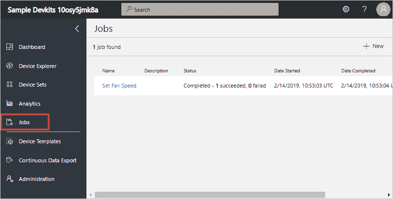](https://res.cloudinary.com/practicaldev/image/fetch/s--amZwStMV--/c_limit%2Cf_auto%2Cfl_progressive%2Cq_auto%2Cw_880/https://gloveboxes.github.io/iot-central-mxchip-hol/media/overview-iot-central-tour/jobs.png)

“作业”页面允许您对设备执行批量设备管理操作。生成器使用此页面更新设备属性、设置和命令。要了解更多信息，请参见[运行作业](https://docs.microsoft.com/en-us/azure/iot-central/howto-run-a-job?WT.mc_id=devto-blog-dglover)一文。

## 设备模板

[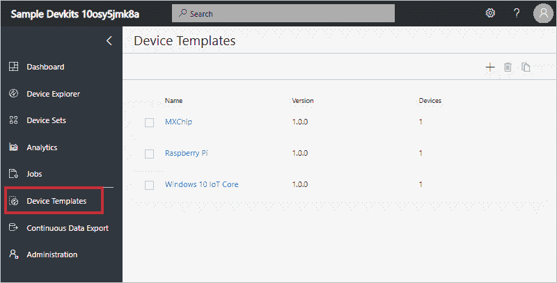](https://res.cloudinary.com/practicaldev/image/fetch/s--AGbn3uSw--/c_limit%2Cf_auto%2Cfl_progressive%2Cq_auto%2Cw_880/https://gloveboxes.github.io/iot-central-mxchip-hol/media/overview-iot-central-tour/templates.png)

“设备模板”页面是构建者在应用程序中创建和管理设备模板的地方。要了解更多信息，请参见 Azure 物联网中心应用程序教程中的[定义新设备类型](https://docs.microsoft.com/en-us/azure/iot-central/tutorial-define-device-type?WT.mc_id=devto-blog-dglover)。

## 连续数据导出

[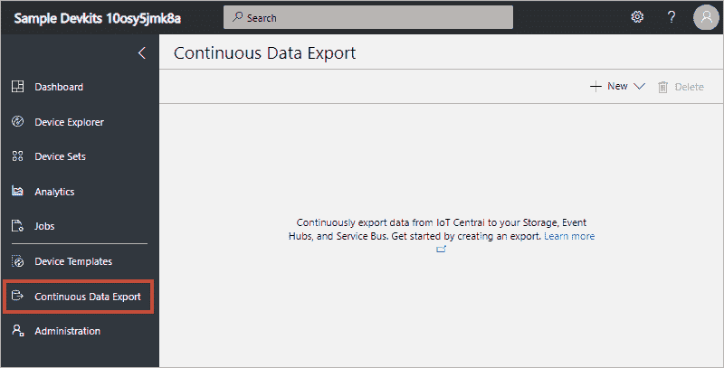](https://res.cloudinary.com/practicaldev/image/fetch/s--SiiN7Tli--/c_limit%2Cf_auto%2Cfl_progressive%2Cq_auto%2Cw_880/https://gloveboxes.github.io/iot-central-mxchip-hol/media/overview-iot-central-tour/export.png)

“连续数据导出”页面是管理员定义如何从应用程序导出数据(如遥测数据)的地方。其他服务可以存储导出的数据或将其用于分析。要了解更多信息，请参阅文章“在 Azure IoT Central 中导出您的数据”。

## 行政管理

[](https://res.cloudinary.com/practicaldev/image/fetch/s--1VwlGHzn--/c_limit%2Cf_auto%2Cfl_progressive%2Cq_auto%2Cw_880/https://gloveboxes.github.io/iot-central-mxchip-hol/media/overview-iot-central-tour/administration.png)

管理页面包含管理员使用的工具的链接，例如在应用程序中定义用户和角色。要了解更多信息，请参阅[管理您的 Azure IoT 中央应用程序](https://docs.microsoft.com/en-us/azure/iot-central/howto-administer?WT.mc_id=devto-blog-dglover)文章。

## 下一步

# 将 MXChip 物联网开发套件设备连接到您的 Azure 物联网中央应用程序

[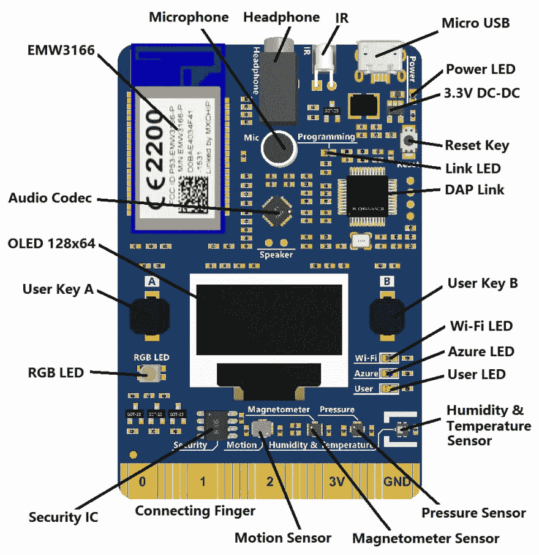](https://res.cloudinary.com/practicaldev/image/fetch/s--4lTiJ1CG--/c_limit%2Cf_auto%2Cfl_progressive%2Cq_auto%2Cw_880/https://gloveboxes.github.io/iot-central-mxchip-hol/media/mxchip.jpg)

本文描述了作为设备开发人员，如何将 MXChip IoT DevKit (DevKit)设备连接到您的 Microsoft Azure IoT Central 应用程序。

## 示例 Devkits 应用程序

从**示例 Devkits** 应用程序模板创建的应用程序包括一个 **MXChip** 设备模板，该模板定义了以下设备特征:

*   遥测测量**湿度**、**温度**、**压力**、**磁强计**(沿 X、Y、Z 轴测量)、**加速度计**(沿 X、Y、Z 轴测量)、以及**陀螺仪**(沿 X、Y、Z 轴测量)。
*   **设备状态**的状态测量。
*   按下按钮 B 的**事件测量。**
*   设置**电压**、**电流**、**风扇转速**和一个 **IR** 开关。
*   器件属性**管芯号**和**器件位置**，这是一个位置属性。
*   制造的云属性**。**
*   命令**回声**和**倒计时**。当一个真实的设备接收到一个**回应**命令时，它会在设备的显示屏上显示发送的值。当一个真实的设备接收到一个**倒计时**命令时，LED 会循环显示一个模式，设备会将倒计时值发送回 IoT Central。

有关配置的完整详细信息，请参见 [MXChip 设备模板详细信息](#mxchip-device-template-details)

## 添加真实设备

### 获取您的设备连接详情

在您的 Azure IoT Central 应用程序中，从 **MXChip** 设备模板添加一个真实设备，并记下设备连接的详细信息:**范围 ID、设备 ID 和主键**:

1.  添加一个**真实设备**从设备浏览器中，选择**+新建>真实设备**添加一个真实设备。

*   输入小写的**设备 ID** ，或者使用建议的**设备 ID** 。
*   输入一个**设备名称**，或使用建议的名称

    [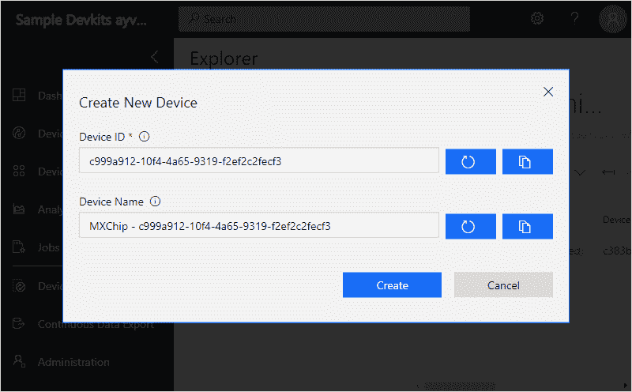](https://res.cloudinary.com/practicaldev/image/fetch/s--UJ4alqjO--/c_limit%2Cf_auto%2Cfl_progressive%2Cq_auto%2Cw_880/https://gloveboxes.github.io/iot-central-mxchip-hol/media/howto-connect-devkit/add-device.png)

1.  要获取设备连接详情、**范围 ID** 、**设备 ID** 和**主键**，在设备页面选择**连接**。

    [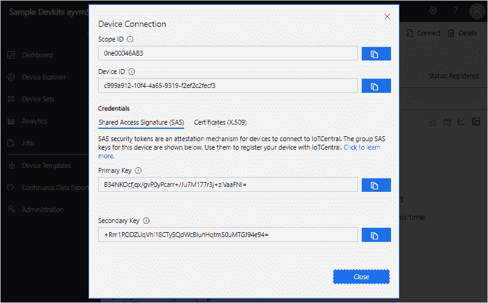](https://res.cloudinary.com/practicaldev/image/fetch/s--OmnHczUj--/c_limit%2Cf_auto%2Cfl_progressive%2Cq_auto%2Cw_880/https://gloveboxes.github.io/iot-central-mxchip-hol/media/howto-connect-devkit/device-connect.png)

2.  记下连接的详细信息。在下一步准备 DevKit 设备时，您会暂时断开与互联网的连接。

### 准备 DevKit 设备

如果您以前使用过该设备，并希望将其重新配置为使用不同的 WiFi 网络、连接字符串或遥测测量，请同时按下 **A** 和 **B** 按钮。如果不起作用，按下**复位**按钮再试一次。

#### 准备 DevKit 设备

1.  从 GitHub 上的[发布](https://aka.ms/iotcentral-docs-MXChip-releases)页面下载 MXChip 的最新预建 Azure IoT Central 固件。
2.  使用 USB 电缆将 DevKit 设备连接到开发机器。在 Windows 中，会在映射到 DevKit 设备上的存储的驱动器上打开一个文件资源管理器窗口。例如，驱动器可能被称为 **AZ3166 (D:)** 。
3.  将 **iotCentral.bin** 文件拖到驱动器窗口上。复制完成后，设备会使用新固件重新启动。

4.  当 DevKit 设备重新启动时，将显示以下屏幕:

```
 Connect HotSpot:
    AZ3166_??????
    go-> 192.168.0.1
    PIN CODE xxxxx 
```

如果屏幕显示任何其他内容，重置设备并同时按下设备上的 **A** 和 **B** 按钮以重启设备。

1.  设备现在处于接入点(AP)模式。你可以从电脑或移动设备连接到此 WiFi 接入点。

2.  在您的电脑、手机或平板电脑上，连接到设备屏幕上显示的 WiFi 网络名称。当您连接到此网络时，您无法访问互联网。这种状态是正常的，在配置设备时，您只能短时间连接到此网络。

3.  打开您的网络浏览器并导航至 [http://192.168.0.1/start](http://192.168.0.1/start) 。将显示以下网页:

    [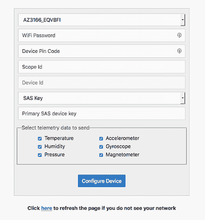](https://res.cloudinary.com/practicaldev/image/fetch/s--20xOEAYB--/c_limit%2Cf_auto%2Cfl_progressive%2Cq_auto%2Cw_880/https://gloveboxes.github.io/iot-central-mxchip-hol/media/howto-connect-devkit/configpage.png)

    在网页上，输入:

    *   您的 WiFi 网络的名称
    *   您的 WiFi 网络密码
    *   设备显示屏上显示的 PIN 码
    *   您设备的连接详情**范围 ID** 、**设备 ID** 和**主键**(您应该已经按照以下步骤保存了这些)
    *   选择所有可用的遥测测量
4.  选择**配置设备**后，您会看到这个页面:

    [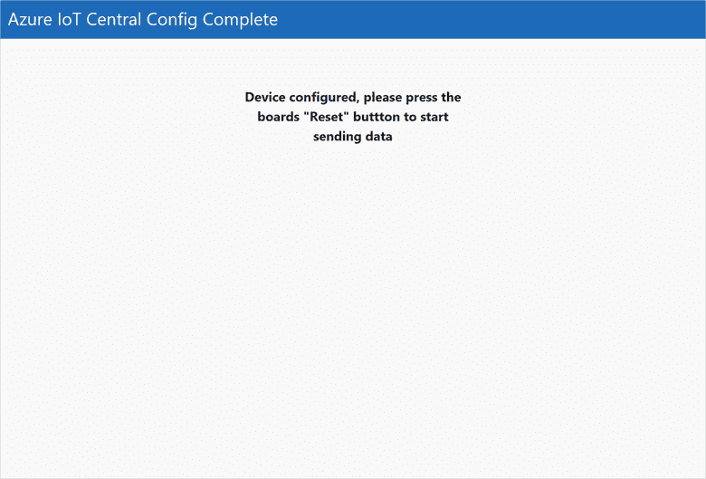](https://res.cloudinary.com/practicaldev/image/fetch/s--1_Ykd78l--/c_limit%2Cf_auto%2Cfl_progressive%2Cq_auto%2Cw_880/https://gloveboxes.github.io/iot-central-mxchip-hol/media/howto-connect-devkit/deviceconfigured.png)

5.  按下设备上的**重置**按钮。

## 查看遥测

当 DevKit 设备重启时，设备屏幕显示:

*   发送的遥测消息数量。
*   失败的次数。
*   收到的所需属性数和发送的报告属性数。

> 如果设备在尝试连接时出现循环，请检查设备是否在物联网中心被**阻止**，并且**解除阻止**设备，以便它可以连接到应用程序。

摇动设备以发送报告的属性。设备发送一个随机数作为**芯片号**设备属性。

您可以查看遥测测量和报告的属性值，并在 Azure IoT Central 中配置设置:

1.  使用**设备浏览器**导航到您添加的真实 MXChip 设备的**测量**页面:

    [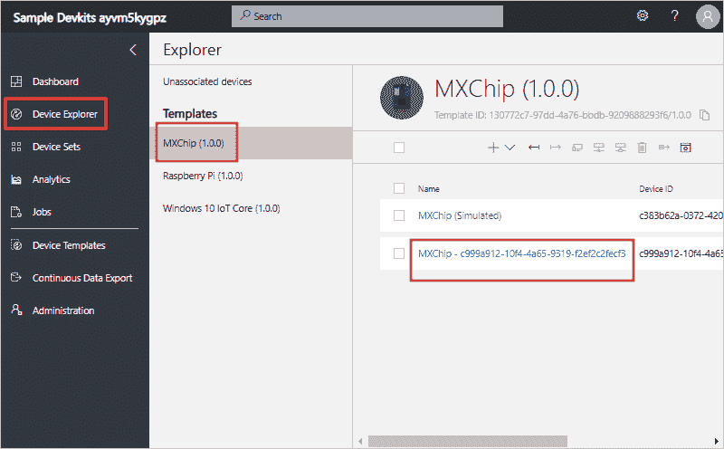](https://res.cloudinary.com/practicaldev/image/fetch/s--z38xukJk--/c_limit%2Cf_auto%2Cfl_progressive%2Cq_auto%2Cw_880/https://gloveboxes.github.io/iot-central-mxchip-hol/media/howto-connect-devkit/realdevicenew.png)

2.  在**测量**页面上，您可以看到来自 MXChip 设备的遥测数据:

    [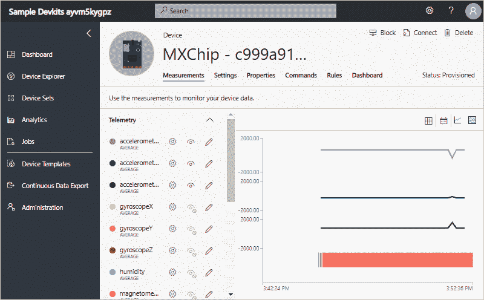](https://res.cloudinary.com/practicaldev/image/fetch/s--AD8txTui--/c_limit%2Cf_auto%2Cfl_progressive%2Cq_auto%2Cw_880/https://gloveboxes.github.io/iot-central-mxchip-hol/media/howto-connect-devkit/devicetelemetrynew.png)

3.  在**属性**页面，您可以查看器件报告的最后一个芯片号和器件位置:

    [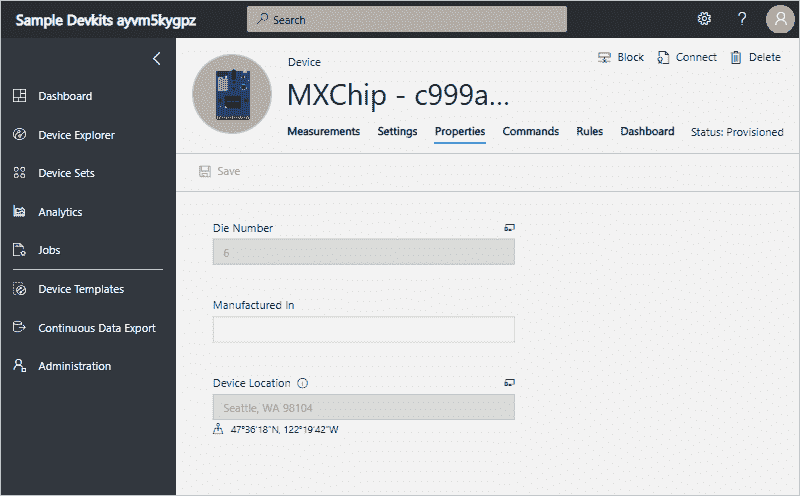](https://res.cloudinary.com/practicaldev/image/fetch/s--Vq04ss-g--/c_limit%2Cf_auto%2Cfl_progressive%2Cq_auto%2Cw_880/https://gloveboxes.github.io/iot-central-mxchip-hol/media/howto-connect-devkit/devicepropertynew.png)

4.  在**设置**页面，您可以更新 MXChip 设备上的设置:

    [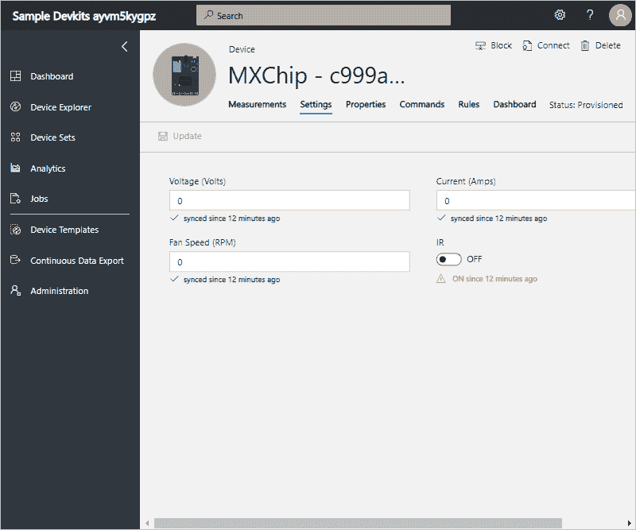](https://res.cloudinary.com/practicaldev/image/fetch/s--GxavjQCM--/c_limit%2Cf_auto%2Cfl_progressive%2Cq_auto%2Cw_880/https://gloveboxes.github.io/iot-central-mxchip-hol/media/howto-connect-devkit/devicesettingsnew.png)

5.  在**命令**页面，可以调用**回声**和**倒计时**命令:

    [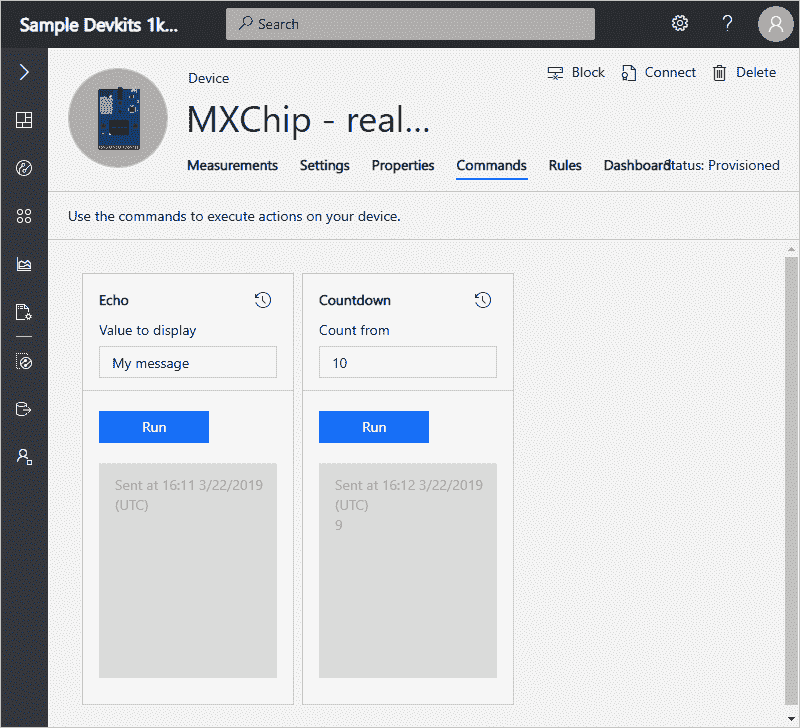](https://res.cloudinary.com/practicaldev/image/fetch/s--NHh_2Ivh--/c_limit%2Cf_auto%2Cfl_progressive%2Cq_auto%2Cw_880/https://gloveboxes.github.io/iot-central-mxchip-hol/media/howto-connect-devkit/devicecommands.png)

6.  在**仪表板**页面上，您可以看到位置图

    [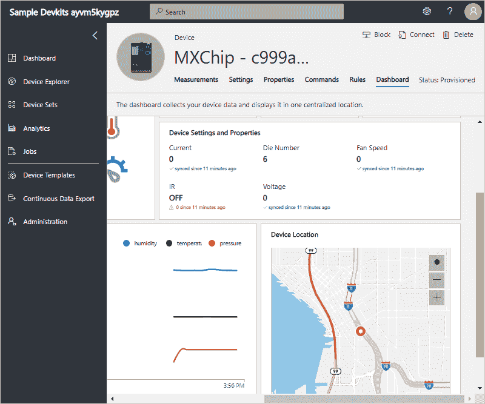](https://res.cloudinary.com/practicaldev/image/fetch/s--D_KSPs9l--/c_limit%2Cf_auto%2Cfl_progressive%2Cq_auto%2Cw_880/https://gloveboxes.github.io/iot-central-mxchip-hol/media/howto-connect-devkit/devicedashboardnew.png)

## 用 Visual Studio 代码开发 MXChip(高级)

[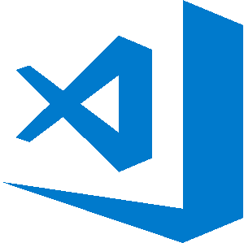](https://res.cloudinary.com/practicaldev/image/fetch/s--Zrj2GdS9--/c_limit%2Cf_auto%2Cfl_progressive%2Cq_auto%2Cw_880/https://gloveboxes.github.io/iot-central-mxchip-hol/media/vs-code.png)

如果你想探索和修改设备代码，可以从 GitHub 下载。如果您计划修改代码，您应该按照这些说明[为您的桌面操作系统准备开发环境](https://microsoft.github.io/azure-iot-developer-kit/docs/get-started/#step-5-prepare-the-development-environment)。

要下载源代码，请在您的桌面计算机上运行以下命令:

```
git clone https://github.com/Azure/iot-central-firmware 
```

前面的命令将源代码下载到名为`iot-central-firmware`的文件夹中。

> 如果您的开发环境中没有安装 **git** ，您可以从 https://git-scm.com/download 的[下载。](https://git-scm.com/download)

## 审核代码

使用 Visual Studio 代码打开`iot-central-firmware`文件夹中的`MXCHIP/mxchip_advanced`文件夹:

[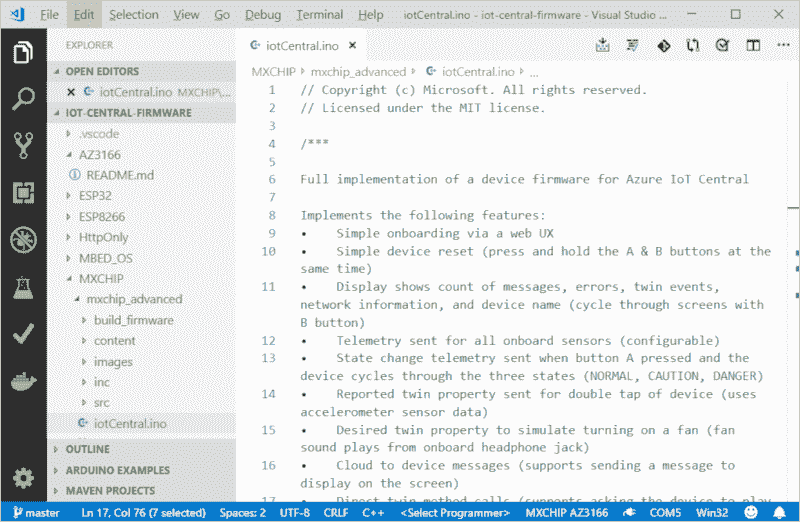](https://res.cloudinary.com/practicaldev/image/fetch/s---PU0bGAF--/c_limit%2Cf_auto%2Cfl_progressive%2Cq_auto%2Cw_880/https://gloveboxes.github.io/iot-central-mxchip-hol/media/howto-connect-devkit/vscodeview.png)

要查看遥测是如何发送到 Azure IoT Central 应用程序的，请打开`src`文件夹中的 **telemetry.cpp** 文件:

*   函数`TelemetryController::buildTelemetryPayload`使用设备上传感器的数据创建 JSON 遥测有效载荷。

*   函数`TelemetryController::sendTelemetryPayload`调用 **AzureIOTClient.cpp** 中的`sendTelemetry`将 JSON 有效负载发送到您的 Azure IoT Central 应用程序使用的 IoT Hub。

要查看属性值如何报告给 Azure IoT Central 应用程序，请打开`src`文件夹中的 **telemetry.cpp** 文件:

*   功能`TelemetryController::loop`大约每 30 秒发送一次**位置**报告的属性。它使用了 **AzureIOTClient.cpp** 源文件中的`sendReportedProperty`函数。

*   当设备加速计检测到双击时，函数`TelemetryController::loop`发送**di number**报告的属性。它使用了 **AzureIOTClient.cpp** 源文件中的`sendReportedProperty`函数。

要查看设备如何响应物联网中央应用程序调用的命令，请打开`src`文件夹中的**registered method handlers . CPP**文件:

*   **dmEcho** 函数是 **echo** 命令的处理程序。它在设备屏幕上显示有效载荷中的**显示值**。

*   **dmCountdown** 函数是**倒计时**命令的处理程序。它会改变设备 LED 的颜色，并使用报告的属性将倒计时值发送回物联网中央应用程序。报告的属性与命令同名。该函数使用了 **AzureIOTClient.cpp** 源文件中的`sendReportedProperty`函数。

**AzureIOTClient.cpp** 源文件中的代码使用来自[微软 Azure 物联网 SDK 和 C 库的函数](https://github.com/Azure/azure-iot-sdk-c)与物联网中心进行交互。

有关如何修改、构建和上传示例代码到您的设备的信息，请参见`MXCHIP/mxchip_advanced`文件夹中的 **readme.md** 文件。

## MXChip 设备模板详细信息

从示例 Devkits 应用程序模板创建的应用程序包括一个 MXChip 设备模板，该模板具有以下特征:

### 测量值

#### 遥测

| 字段名 | 单位 | 最低限度 | 最高的 | 小数位数 |
| --- | --- | --- | --- | --- |
| 湿度 | % | Zero | One hundred | Zero |
| 临时雇员 | C | -40 | One hundred and twenty | Zero |
| 压力 | 高功率放大器（high-power amplifier 的缩写） | Two hundred and sixty | One thousand two hundred and sixty | Zero |
| 磁力计 | 姆高斯 | -1000 | One thousand | Zero |
| 磁力计 | 姆高斯 | -1000 | One thousand | Zero |
| 磁力计 | 姆高斯 | -1000 | One thousand | Zero |
| 加速计 | 毫克 | -2000 | Two thousand | Zero |
| 加速计 | 毫克 | -2000 | Two thousand | Zero |
| 加速度计 z | 毫克 | -2000 | Two thousand | Zero |
| 陀螺仪 | mdps | -2000 | Two thousand | Zero |
| 陀螺仪 | mdps | -2000 | Two thousand | Zero |
| 陀螺仪 | mdps | -2000 | Two thousand | Zero |

#### 状态

| 名字 | 显示名称 | 常态 | 警告 | 危险 |
| --- | --- | --- | --- | --- |
| 设备状态 | 设备状态 | 格林（姓氏）；绿色的 | 柑橘 | 红色 |

#### 事件

| 名字 | 显示名称 |
| --- | --- |
| 按钮被按下 | 按下按钮 B |

### 设置

数字设置

| 显示名称 | 字段名 | 单位 | 小数位数 | 最低限度 | 最高的 | 最初的 |
| --- | --- | --- | --- | --- | --- | --- |
| 电压 | 设定电压 | 伏特 | Zero | Zero | Two hundred and forty | Zero |
| 目前的 | 设置当前 | 安培数 | Zero | Zero | One hundred | Zero |
| 风扇速度 | 风扇速度 | 每分钟转数 | Zero | Zero | One thousand | Zero |

切换设置

| 显示名称 | 字段名 | 在文本上 | 脱离文本 | 最初的 |
| --- | --- | --- | --- | --- |
| 红外辐射（Infrared Radiation） | activateur | 在…上 | 离开 | 离开 |

### 属性

| 类型 | 显示名称 | 字段名 | 数据类型 |
| --- | --- | --- | --- |
| 设备属性 | 模具编号 | 中间数 | 数字 |
| 设备属性 | 设备位置 | 位置 | 位置 |
| 文本 | 制造于 | 制造于 | 不适用的 |

### 命令

| 显示名称 | 字段名 | 返回类型 | 输入字段显示名称 | 输入字段名称 | 输入字段类型 |
| --- | --- | --- | --- | --- | --- |
| 回声 | 回声 | 文本 | 要显示的值 | 显示值 | 文本 |
| 倒数计秒 | 倒数计秒 | 数字 | 从...开始计数 | 计数从 | 数字 |

## 下一步

# 设置设备模板

设备模板是一个蓝图，它定义了连接到 Azure IoT Central 应用程序的一类设备的特征和行为。

例如，构建者可以为物联网风扇创建一个设备模板，该模板具有:

*   温度遥测测量

*   风扇电机错误事件测量

*   风扇运行状态测量

*   风扇速度设置

*   位置属性

*   发送警报的规则

*   为您提供设备总体视图的仪表板

通过该设备模板，操作员可以创建和连接真实的风扇设备，其名称为 **fan-1** 和 **fan-2** 。所有这些风扇都有度量、设置、属性、规则和一个仪表板，应用程序的用户可以对其进行监控和管理。

> 只有构建者和管理员可以创建、编辑和删除设备模板。任何用户都可以从现有的设备模板在**设备浏览器**页面上创建设备。

## 创建设备模板

1.  导航至**设备模板**页面。

2.  要创建模板，首先选择 **+New** 。

3.  要快速开始，请从现有的预建模板中进行选择。否则，选择**自定义**，输入名称，点击**创建**，从头开始构建自己的模板。

[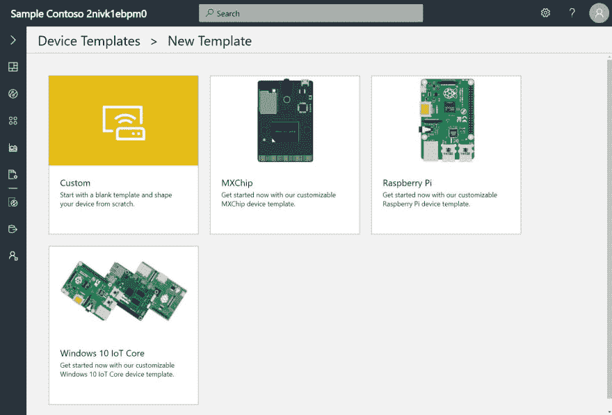](https://res.cloudinary.com/practicaldev/image/fetch/s--iWrDcZNv--/c_limit%2Cf_auto%2Cfl_progressive%2Cq_auto%2Cw_880/https://gloveboxes.github.io/iot-central-mxchip-hol/media/howto-set-up-template/newtemplate.png)

1.  创建自定义模板时，您会看到新设备模板的**设备详细信息**页面。当您创建设备模板时，IoT Central 会自动创建模拟设备。模拟设备允许您在连接真实设备之前测试应用程序的行为。

以下章节描述了**器件模板**页面上的每个选项卡。

## 测量值

测量值是来自您的设备的数据。您可以向设备模板中添加多个测量值，以匹配设备的功能。

*   **遥测**测量值是您的设备随时间推移收集的数字数据点。它们被描绘成一条连续的河流。温度就是一个例子。
*   **事件**测量值是代表设备上重要信息的时间点数据。严重程度代表事件的重要性。风扇电机错误就是一个例子。
*   **状态**测量值代表设备或其组件在一段时间内的状态。例如，风扇模式可以被定义为具有**操作**和**停止**作为两种可能的状态。

### 创建一个遥测测量

要添加新的遥测测量，选择 **+新测量**，选择**遥测**作为测量类型，并在表格上输入详细信息。

> 设备模板中的字段名必须与相应设备代码中的属性名相匹配，以便在连接真实设备时，遥测测量结果显示在应用程序中。在配置设置、设备属性和命令时，请执行相同的操作，并在以下部分中继续定义设备模板。

例如，您可以添加新的温度遥测测量:

| 显示名称 | 字段名 | 单位 | 福建话 | 最大 |
| --- | --- | --- | --- | --- |
| 温度 | 临时雇员 | degC | Zero | One hundred |

[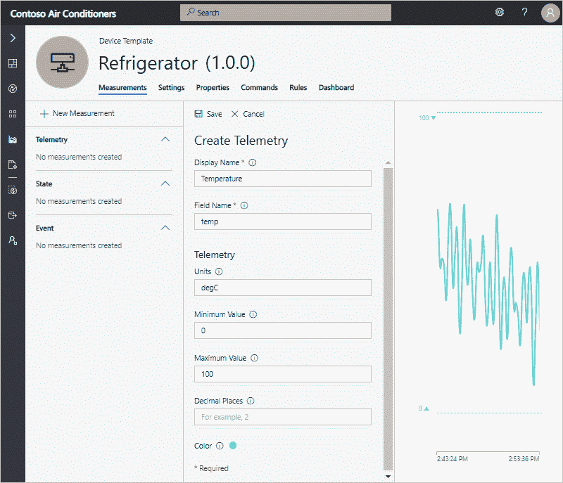](https://res.cloudinary.com/practicaldev/image/fetch/s--enR3Ge2V--/c_limit%2Cf_auto%2Cfl_progressive%2Cq_auto%2Cw_880/https://gloveboxes.github.io/iot-central-mxchip-hol/media/howto-set-up-template/measurementsform.png)

选择**保存**后，**温度**测量出现在测量列表中。不一会儿，您就会看到来自模拟设备的温度数据的可视化效果。

显示遥测时，您可以从以下聚合选项中进行选择:平均值、最小值、最大值、总和以及计数。**平均值**被选为图表上的默认聚合。

> 遥测测量的数据类型是浮点数。

### 创建一个测量事件

要添加新的事件测量，选择 **+新测量**，并选择**事件**作为测量类型。在**创建事件**表单上输入详细信息。

为事件提供**显示名称**、**字段名**和**严重性**的详细信息。您可以从三个可用的严重级别中进行选择:**错误**、**警告**和**信息**。

例如，您可以添加一个新的**风扇电机错误**事件。

| 显示名称 | 字段名 | 默认严重性 |
| --- | --- | --- |
| 风扇电机错误 | 风扇马达错误 | 错误 |

[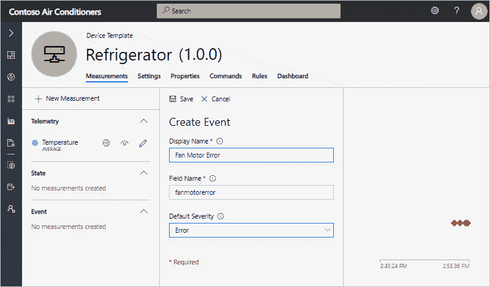](https://res.cloudinary.com/practicaldev/image/fetch/s--XCnMfJJF--/c_limit%2Cf_auto%2Cfl_progressive%2Cq_auto%2Cw_880/https://gloveboxes.github.io/iot-central-mxchip-hol/media/howto-set-up-template/eventmeasurementsform.png)

选择**保存**后，**风扇电机误差**测量出现在测量列表中。不一会儿，您就会看到来自模拟设备的事件数据的可视化效果。

要查看事件的更多详细信息，请选择图表上的事件图标:

[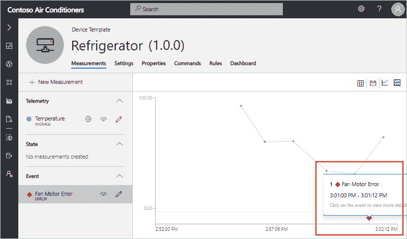](https://res.cloudinary.com/practicaldev/image/fetch/s--POom-ueO--/c_limit%2Cf_auto%2Cfl_progressive%2Cq_auto%2Cw_880/https://gloveboxes.github.io/iot-central-mxchip-hol/media/howto-set-up-template/eventmeasurementsdetail.png)

> 事件测量的数据类型是字符串。

### 创建测量状态

要添加新的状态测量，选择 **+新测量**按钮，并选择**状态**作为测量类型。在**创建状态**表单上输入详细信息。

提供状态的**显示名**、**字段名**、**值**的详细信息。每个值还可以有一个显示名称，当该值出现在图表和表格中时将使用该名称。

例如，您可以添加一个新的**风扇模式**状态，它有两个设备可以发送的可能值，**运行**和**停止**。

| 显示名称 | 字段名 | 价值 1 | 显示名称 | 价值 2 | 显示名称 |
| --- | --- | --- | --- | --- | --- |
| 风扇模式 | 风扇模式 | one | 操作的 | Zero | 停止 |

[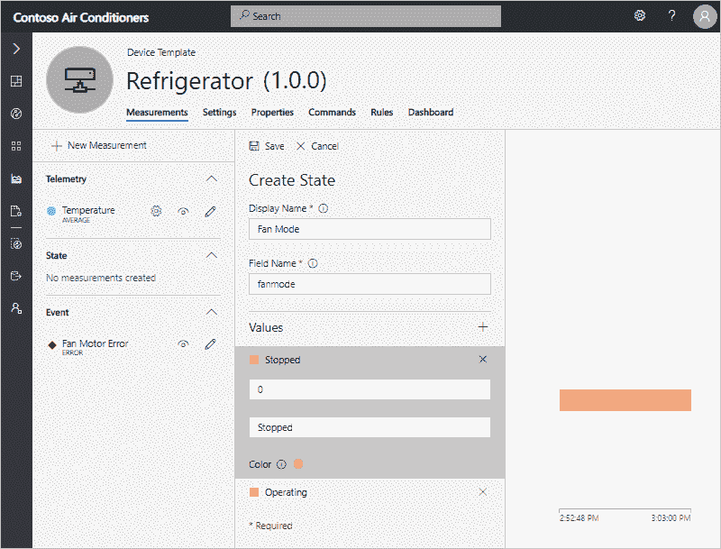](https://res.cloudinary.com/practicaldev/image/fetch/s--hogQqEPG--/c_limit%2Cf_auto%2Cfl_progressive%2Cq_auto%2Cw_880/https://gloveboxes.github.io/iot-central-mxchip-hol/media/howto-set-up-template/statemeasurementsform.png)

选择**保存**后，**风扇模式**状态测量出现在测量列表中。不一会儿，您就会看到来自模拟设备的状态数据的可视化效果。

如果设备在短时间内发送太多数据点，状态测量会以不同的视觉效果出现。选择图表以按时间顺序查看该时间段内的所有数据点。您还可以缩小时间范围，以查看图表上绘制的测量值。

> 状态测量的数据类型是字符串。

## 设置

设置控制设备。它们使操作员能够向设备提供输入。您可以将多个设置添加到您的设备模板中，这些设置在**设置**选项卡上显示为图块，供操作员使用。您可以添加多种类型的设置:数字、文字、日期、切换、拾取列表和区域标签。

设置可以是三种状态之一。设备报告这些状态。

*   **同步**:设备已经改变以反映设置值。

*   **待定**:设备当前正在更改设定值。

*   **错误**:设备返回一个错误。

例如，您可以通过选择**设置**并输入新的**号**设置来添加新的风扇速度设置:

| 显示名称 | 字段名 | 单位 | 小数 | 最初的 |
| --- | --- | --- | --- | --- |
| 风扇速度 | 风扇速度 | 每分钟转数 | Two | Zero |

[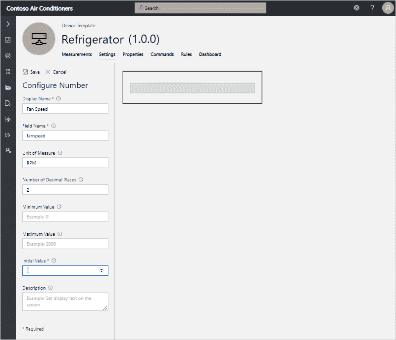](https://res.cloudinary.com/practicaldev/image/fetch/s--5lxgtb8J--/c_limit%2Cf_auto%2Cfl_progressive%2Cq_auto%2Cw_880/https://gloveboxes.github.io/iot-central-mxchip-hol/media/howto-set-up-template/settingsform.png)

选择**保存**后，**风扇速度**设置以平铺显示。操作员可以使用**设备浏览器**页面上的设置来改变设备的风扇速度。

## 属性

属性是与设备相关联的元数据，例如设备位置和序列号。将多个属性添加到您的设备模板，这些属性在**属性**选项卡上显示为图块。属性可以具有数字、文本、日期、切换、设备属性、标签或位置等类型。操作员可以在创建设备时指定属性值，并且可以随时编辑这些值。设备属性是只读的，从设备发送到应用程序。操作员不能更改设备属性。当一个真实的设备连接时，设备属性 tile 在应用程序中更新。

有两类属性:

*   *设备属性*设备向物联网中央应用报告的属性。设备属性是由设备报告的只读值，当连接实际设备时，会在应用程序中更新。
*   *应用程序属性*存储在应用程序中，可由操作员编辑。设备无法识别应用程序属性。

例如，您可以在**属性**选项卡上添加设备的上次维护日期作为新的**日期**属性(应用程序属性):

| 显示名称 | 字段名 | 基础资料 |
| --- | --- | --- |
| 上次维修 | 上次维修 | 01/29/2019 |

[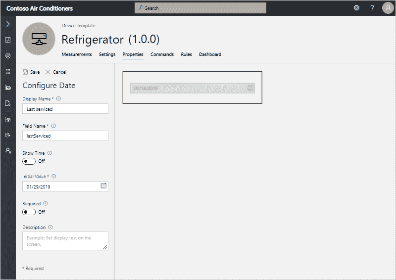](https://res.cloudinary.com/practicaldev/image/fetch/s--zfVX3KHs--/c_limit%2Cf_auto%2Cfl_progressive%2Cq_auto%2Cw_880/https://gloveboxes.github.io/iot-central-mxchip-hol/media/howto-set-up-template/propertiesform.png)

选择**保存**后，设备的上次维修日期会以平铺方式显示。

创建图块后，您可以在**设备浏览器**中更改应用程序属性值。

### 通过 Azure Maps 创建位置属性

您可以在 Azure IoT Central 中为您的位置数据提供地理上下文，并映射街道地址的任何经纬度坐标。或者可以绘制经纬度坐标。Azure Maps 在物联网中心实现了这一功能。

您可以添加两种类型的位置属性:

*   **位置作为应用属性**，存储在应用中。设备无法识别应用程序属性。
*   **位置作为设备属性**，设备向应用程序报告。

#### 添加位置作为应用属性

[](https://res.cloudinary.com/practicaldev/image/fetch/s--CaA1BcmO--/c_limit%2Cf_auto%2Cfl_progressive%2Cq_auto%2Cw_880/https://gloveboxes.github.io/iot-central-mxchip-hol/media/azure-maps.png)

您可以通过在 IoT Central 应用程序中使用 Azure Maps 来创建位置属性作为应用程序属性。例如，您可以添加设备安装地址:

1.  导航到**属性**选项卡。

2.  在库中，选择**位置**。

3.  配置位置的**显示名称**、**字段名**、(可选)**初始值**。

    | 显示名称 | 字段名 | 基础资料 |
    | --- | --- | --- |
    | 安装地址 | 安装地址 | 微软，华盛顿州雷蒙德市微软路 1 号，邮编 98052 |

[](https://res.cloudinary.com/practicaldev/image/fetch/s--WtFQOb7u--/c_limit%2Cf_auto%2Cfl_progressive%2Cq_auto%2Cw_880/https://gloveboxes.github.io/iot-central-mxchip-hol/media/howto-set-up-template/locationcloudproperty2.png)

添加位置有两种支持的格式:

*   **作为地址的位置**
*   **位置为坐标**

1.  选择**保存**。操作员可以在**设备浏览器**中更新位置值。

#### 添加位置作为设备属性

您可以创建位置属性作为设备报告的设备属性。例如，如果您想要跟踪设备位置:

1.  导航到**属性**选项卡。

2.  从库中选择**设备属性**。

3.  配置显示名称和字段名称，选择**位置**作为数据类型:

    | 显示名称 | 字段名 | 数据类型 |
    | --- | --- | --- |
    | 设备位置 | 设备位置 | 位置 |

> 字段名必须与相应设备代码中的属性名相匹配

[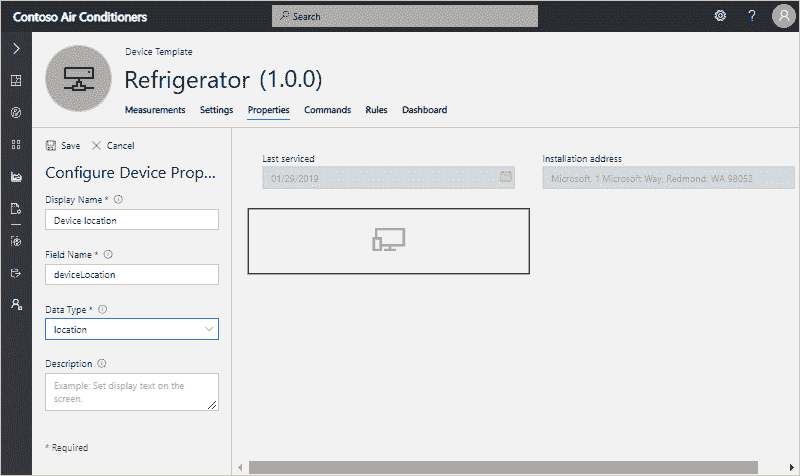](https://res.cloudinary.com/practicaldev/image/fetch/s--TqrlbCgQ--/c_limit%2Cf_auto%2Cfl_progressive%2Cq_auto%2Cw_880/https://gloveboxes.github.io/iot-central-mxchip-hol/media/howto-set-up-template/locationdeviceproperty2.png)

一旦连接了真实设备，您作为设备属性添加的位置就会用设备发送的值进行更新。现在您已经配置了您的位置属性，您可以[添加一个地图来在设备仪表板](#add-an-azure-maps-location-in-the-dashboard)中可视化位置。

## 命令

命令用于远程管理设备。它们使操作员能够在设备上运行命令。您可以将多个命令添加到您的设备模板中，这些命令在**命令**选项卡上显示为图块，供操作员使用。作为设备的构建者，您可以根据自己的需求灵活地定义命令。

命令和设置有什么不同？

*   **设置**:设置是您想要应用到设备的配置。您希望设备保持该配置，直到您更改它。例如，您想要设置冰箱的温度，并且即使在冰箱重新启动时也想要该设置。

*   **命令**:您可以使用命令从物联网中心远程即时运行设备上的命令。如果设备未连接，命令会超时并失败。例如，您想要重新启动设备。

例如，您可以通过选择**命令**选项卡，然后选择 **+新命令**，并输入新命令的详细信息来添加新的 **Echo** 命令:

| 显示名称 | 字段名 | 默认超时 | 数据类型 |
| --- | --- | --- | --- |
| 回声命令 | 回声 | Thirty | 文本 |

[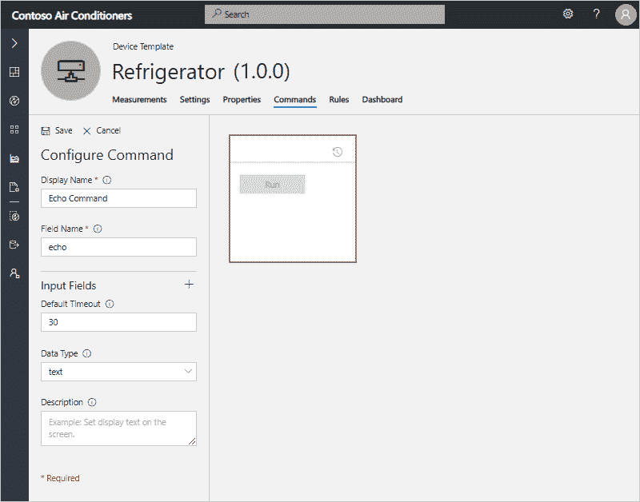](https://res.cloudinary.com/practicaldev/image/fetch/s--a_ZH7RCf--/c_limit%2Cf_auto%2Cfl_progressive%2Cq_auto%2Cw_880/https://gloveboxes.github.io/iot-central-mxchip-hol/media/howto-set-up-template/commandsecho.png)

在您选择**保存**之后，**回应**命令会以平铺的形式出现，并准备好在您的真实设备连接时从**设备资源管理器**中使用。命令的字段名称必须与相应设备代码中的属性名称相匹配，以便命令能够成功运行。

## 规则

规则使运营商能够近乎实时地监控设备。触发规则时，规则会自动调用发送电子邮件等操作。如今有一种规则可用:

*   **遥测规则**，当所选设备遥测超过指定阈值时触发。[了解更多遥测规则](https://docs.microsoft.com/en-us/azure/iot-central/howto-create-telemetry-rules?WT.mc_id=devto-blog-dglover)。

## 仪表盘

仪表板是操作员可以查看设备信息的地方。作为构建者，您可以在此页面上添加图块，以帮助操作员了解设备的运行情况。您可以向您的设备模板添加多个仪表板互动程序。您可以添加多种类型的仪表板切片，如图像、折线图、条形图、关键性能指标(KPI)、设置和属性以及标签。

例如，您可以添加一个**设置和属性**图块，通过选择**仪表板**选项卡和库中的图块来显示设置和属性的当前值:

[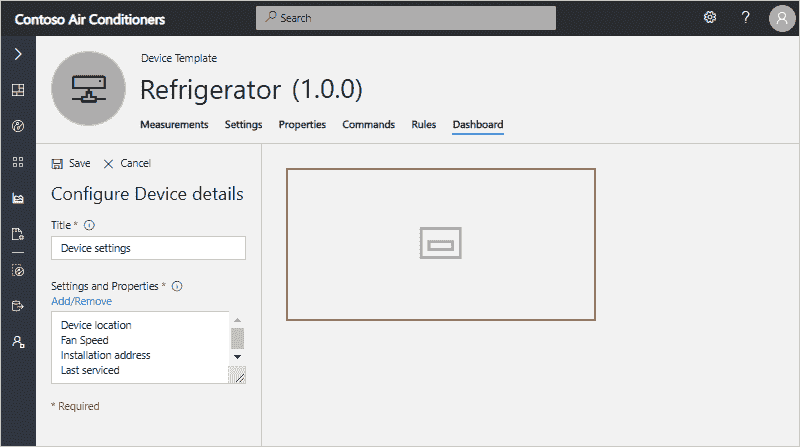](https://res.cloudinary.com/practicaldev/image/fetch/s--EW-xJ4AE--/c_limit%2Cf_auto%2Cfl_progressive%2Cq_auto%2Cw_880/https://gloveboxes.github.io/iot-central-mxchip-hol/media/howto-set-up-template/dashboardsettingsandpropertiesform.png)

现在，当操作员在**设备浏览器**中查看仪表板时，他们可以看到该图标。

### 在仪表盘中添加 Azure Maps 位置

如果配置了位置属性，则可以使用设备仪表板中的地图来显示位置。

1.  导航至**仪表板**选项卡。

2.  在设备仪表板上，从库中选择**地图**。

3.  给地图一个标题。下面的例子标题为**安装位置**。然后选择您之前在**属性**选项卡上配置的位置属性。在下面的例子中，选择了**安装地址**。

[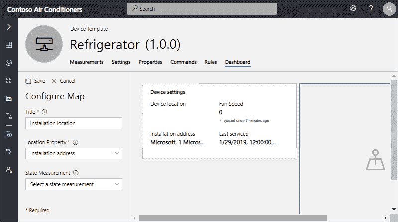](https://res.cloudinary.com/practicaldev/image/fetch/s--JPuxrJV3--/c_limit%2Cf_auto%2Cfl_progressive%2Cq_auto%2Cw_880/https://gloveboxes.github.io/iot-central-mxchip-hol/media/howto-set-up-template/locationcloudproperty5map.png)

1.  选择**保存**。地图框现在显示您选择的位置。

您可以将地图调整到您想要的大小。现在，当操作员在**设备浏览器**中查看仪表板时，您已经配置的所有仪表板图块，包括位置地图，都是可见的。