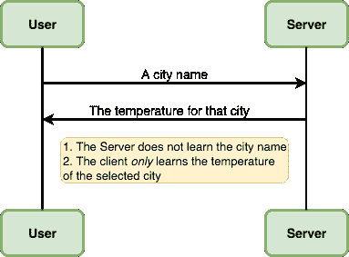
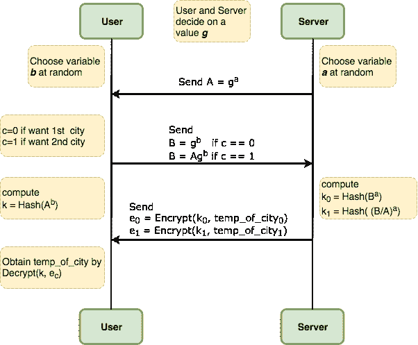

# MPC 第 1 部分:不经意传输

> 原文：<https://dev.to/_aafshar_/mpc-part-1-oblivious-transfer-3ebk>

考虑你手机上的一个天气应用。对于大多数用户来说，这个应用程序记录当前的 GPS 位置，将其发送到服务器，并接收和显示用户位置的温度。这意味着，如果服务器选择这样做，它可以创建用户位置历史的配置文件，并跟踪他们的移动，这是对大多数用户隐私的侵犯。因此，注重隐私的用户可能希望在不共享其位置的情况下获取天气信息。我们姑且称之为*用户安全属性*。

设计一个满足这个安全属性的应用程序是非常容易的。在固定的时间间隔内，服务器向用户的设备发送它所拥有的全世界所有城市和地区的天气信息，用户进行本地查找以找到他们感兴趣的天气信息。如您所见，使用这种方法，服务器无法知道用户的位置。不幸的是，这种方法有两个主要问题。

1.  发送到用户设备的数据量太大。
2.  更重要的是，用户了解所有的天气信息，这是服务器运行的业务的支柱。

因此，我们感兴趣的是一个能够在实践中使用的足够快速和高效的解决方案(这是一个非常主观的标准，取决于用例)。我们还对保护服务器隐私的解决方案感兴趣，该解决方案只发送用户要求的城市温度。让我们称这个*服务器安全属性*。

总而言之，我们有两方:服务器和用户。服务器有一个私人温度数据列表，用户有一个私人输入，指示用户感兴趣的城市。我们希望提供这种功能，以便满足*用户安全属性*和*服务器安全属性*，并且该解决方案比将所有服务器数据发送给用户更有效。

[](https://res.cloudinary.com/practicaldev/image/fetch/s--97uQsWPE--/c_limit%2Cf_auto%2Cfl_progressive%2Cq_auto%2Cw_880/https://arash-afshar.github.io/assets/ot_requirements.png)

[遗忘转移](https://crypto.stanford.edu/pbc/notes/crypto/ot.html)有助于实现这一目标。为了描述不经意传输(OT ),我们首先考虑一个简单的例子，其中服务器只保存关于 T2 两个 T3 城市的天气信息，用户选择其中一个城市。这个案例叫做*二选一 OT* 。在接下来的内容中，我将描述这个理论和一些代码片段，然后描述如何将它扩展到两个以上的城市。

# 理论

最简单的 OTs 之一(特别是如果你知道 Diffie-Hellman 密钥交换协议)是由 [Chou，Orlandi 2015](https://eprint.iacr.org/2015/267.pdf) 提出的。总体协议如下图所示。但是现在还不清楚那里正在发生什么，以及什么是`a`、`b`、`g`、`Hash`、`Encrypt`和`Decrypt`。

[](https://res.cloudinary.com/practicaldev/image/fetch/s--9QkgoyCX--/c_limit%2Cf_auto%2Cfl_progressive%2Cq_auto%2Cw_880/https://arash-afshar.github.io/assets/simple_ot.png)

## 什么是`g`？

`g`是素数阶`p`的“单群”的生成元。例如，考虑 Z <sub>11</sub> 的组，它是素数阶 11 的组，因此具有`11-1`成员`{1,2,...,10}`。如果你考虑`g=2`，这是一个循环群，因为你可以从 2 开始创建这个群的所有成员，然后一直乘以 2。换句话说{2 <sup>1</sup> ，2 <sup>2</sup> ，2 <sup>3</sup> ，...、2 <sup>10</sup> }模块 10 产生与`{1,2,...,10}`相同的组。

要亲自查看，请运行下面的程序。

```
def generate_group(g, p):
  # Using list to show that there are not duplications
  members = list()
  for i in xrange(1,p):
    members.append(g**i % p)
  return sorted(members)

generate_group(2, 11)
# => prints [1, 2, 3, 4, 5, 6, 7, 8, 9, 10] 
```

## [T3`a`和`b`是什么？](#what-are-raw-a-endraw-and-raw-b-endraw-)

`a`和`b`是从 Z <sub>11</sub> 中随机选取的两个整数。注意，这两个值都作为`g`的指数出现，因此 g <sup>a</sup> 和 g <sup>b</sup> 产生循环群的成员。

## [T3`Hash`和`Encrypt/Decrypt`是什么？](#what-are-raw-hash-endraw-and-raw-encryptdecrypt-endraw-)

在论文中可以找到`Hash`和`Encrypt`函数的正确定义，但是为了我们的目的，假设`Hash`是`SHA1`并且`Encrypt/Decrypt`是对称密钥加密方案，例如`AES`。

## 协议起作用吗？

为了表明这个协议正在做它声称的事情，让我们用一个例子来说明它。在本例中，我们使用相同的 Z 组 <sub>11</sub> 并以`g=2`作为其生成器。同时，假设`a=4`是[随机均匀选择的](https://xkcd.com/221/)，同样`b=7`也是随机均匀选择的。下面的代码计算用户获取 k 和服务器获取 k <sub>0</sub> 和 k <sub>1</sub> 所需的步骤。您会注意到如果用户设置`c=0`，那么 k 将与 k <sub>0</sub> 相同，如果用户设置`c=1`，那么 k 将等于 k <sub>1</sub> 。因此，用户可以根据自己的选择解密 e <sub>0</sub> 或 e <sub>1</sub> ，但不能同时解密两者。

```
# multiplies x to the inverse of y def div(x, y, p):
  xp = x % p
  yip = pow(y, p-2, p)
  return (xp * yip) % p

def examine_case_c_0(g, a, b, p):
  A=pow(g, a, p)
  B=pow(g, b, p)
  k=pow(A, b, p)
  k0=pow(B, a, p)
  k1=pow(div(B, A, p), a, p)
  print(k, k0, k1, k == k0)

def examine_case_c_1(g, a, b, p):
  A=pow(g, a, p)
  B=(A * pow(g, b, p)) % p
  k=pow(A, b, p)
  k0=pow(B, a, p)
  k1=pow(div(B, A, p), a, p)
  print(k, k0, k1, k == k1)

examine_case_c_0(2, 4, 7, 11)
# => (3, 3, 4, True) 
examine_case_c_1(2, 4, 7, 11)
# => (3, 5, 3, True) 
```

到目前为止，我们已经*证明了*该协议是正确的。为了实际上*证明*的正确性，你可以只写下公式，并通过数学。接下来，我们将讨论该协议的安全性，并试图证明它满足这两个安全性要求。

## 协议安全吗？

为了检查协议的安全性，假设您是攻击者，看看您能做些什么！比如，假设你是服务器，你的目标是找出用户对城市的选择。查看协议，您会注意到，作为服务器，您只收到一条消息。根据用户的选择，你要么得到 B=g <sup>b</sup> 要么得到 B=Ag <sup>b</sup> 。因此，如果你能以某种方式识别出你得到的是哪条信息，你就成功地进行了攻击。让我们考虑几种不同的攻击方式。换句话说，我们想找到违反用户安全属性的方法。我们的攻击将包括寻找或猜测。注意，用户和服务器都知道`g`。因此，如果我们能找到/猜出`b`，那么我们就可以计算 g <sup>b</sup> 并将结果与 b 进行比较，如果它们相同，我们就知道用户选择了城市 <sub>0</sub> 。我们(服务器)可以通过两种方式进行攻击。

1.  通过在生成`b`的方式中找到一个缺陷:如果用户随机选择`b`,并正确地实现随机 gen 代码，那么用户就可以安全地抵御这种类型的攻击。因此，我们定义

*用户安全要求 1:使用 secure random 选择“b”，不重用“b”*。

1.  通过尝试`b`的所有可能值(即蛮力攻击)。如果我们的循环群足够大，那么这个攻击将是不切实际的。因此，我们定义

用户安全要求 2:选择一个足够大的循环组，使得在“b”有效期间，强力“b”是不切实际的。。

我们也可以对满足*服务器安全属性*的要求进行同样的论证，我留给你去探索和思考。特别是，我鼓励你阅读关于[离散对数问题](https://crypto.stanford.edu/pbc/notes/crypto/factoring.html)的硬度特性，以及它与 Diffie-Hellman 问题的关系。

从上面的讨论中，我们已经认识到，为了满足*用户安全属性*，协议实现必须被配置为满足以下要求。

*   该实现必须每次都使用安全随机生成`b`。
*   该实现必须使用一个非常大的循环组来禁止暴力攻击。

现在，这些论证是否足以证明安全性，更重要的是，我们目前采用的方法是证明安全性的好方法吗？以上论点是非正式的，也是不准确的。例如，我们没有为循环群定义“足够大”的大小，也没有定义循环群中离散对数的“硬度”性质。此外，我们将随机数生成器描述为“安全的”,但没有具体说明它的含义。然而，这种证明安全性的方法是正确的，也是真实证明的样子。即检查一方接收到的每条消息，并证明该消息没有泄露关于各方的私人输入的信息。我将在一个单独的帖子中讲述证明模型，同时，您可以在 Yehuda Lindell 的简明教程中阅读它们，或者通过阅读 Oded Goldreich 的精彩书籍《密码学基础》第一卷和第二卷来获得更深入的知识。

# 回申请

我们的目标是创建一个天气预报服务，保护用户和服务器的隐私，并引入了不经意传输(OT)作为一个潜在的解决方案。然后，我们展示了如何为服务器只有两个城市温度，而用户选择其中一个(2 OT 中的 1 个)的情况设计 OT 协议。现在，我们希望**将**扩展为某个较大 n 的 1/n OT。一种简单的方法是创建一个 2/1 OT 网络，其中每对初始温度被馈送到一个 OT，然后创建另一层 OT，这样第一层的每对 OT 的输出被馈送到第二层的 OT，依此类推。这就形成了一棵二叉树，并且需要大约 n 个点。有更快的[解决方案](https://eprint.iacr.org/2016/799.pdf)可以用恒定数量的 1/2 OTs 实现这一点。

最后，下面的代码展示了使用 [libOTe](https://github.com/osu-crypto/libOTe) 实现这个应用程序。你可以在 [my repo](https://github.com/Arash-Afshar/secure_multiparty_computation_examples/blob/master/weather_app_with_ot) 上找到一个安装并运行这个程序的 docker 文件。

# 最后备注

与前一篇文章类似，仅仅实现一个安全协议是不够的，还需要考虑更多的事情。例如，关于保护用户的隐私，注意用户的位置可以通过源 IP 或网络延迟找到(或至少估计出)。此外，基于天气检查的频率和对服务器的请求，服务器可以猜测用户是否正在路上旅行。然而，使用安全的协议要比不安全的协议好得多。