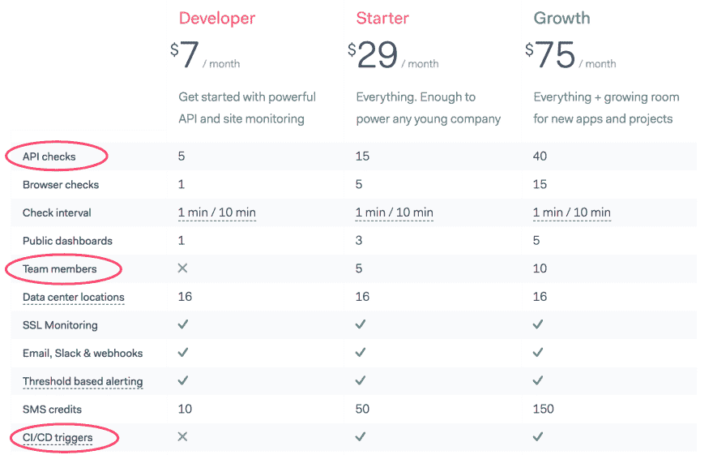
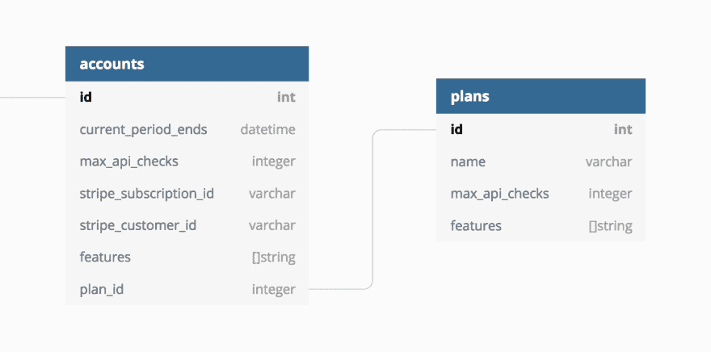

# 我们如何在 SaaS 应用程序中管理计划和功能

> 原文：<https://dev.to/checkly/how-we-manage-plans-features-in-our-saas-app-11a7>

你如何处理用户在 SaaS 应用程序中的账户上可以做什么？“启动”计划中的 Jane 在接近其计划的极限时可以创建另一个小部件吗？如果她是试用者呢？原来这是一个混合的东西

*   功能切换
*   清点东西
*   非常适合您的情况的定制 API 中间件

就像本系列上一篇文章中关于创建基本 SaaS 数据模型的主题一样，缺乏关于如何处理这个超级常见问题的清晰示例。

下面是我们如何在 [Checkly](https://checklyhq.com) 用 Node.js，Hapi.js 后端来做这件事。这可能会很好地转换到其他平台。

# 问题

让我们把它变得尽可能具体，就像俗话说的,**一页 SaaS 定价胜过千言万语。**
[T5】](https://res.cloudinary.com/practicaldev/image/fetch/s--V4yPph07--/c_limit%2Cf_auto%2Cfl_progressive%2Cq_auto%2Cw_880/https://blog.checklyhq.com/conteimg/2019/03/image-21.png)

我们有三个不同价格的计划:开发商，启动和增长。不同的计划允许不同的量和不同的特征。

在本例中:

*   API 和浏览器检查的数量有限。开发者计划得到 5，启动计划 15，增长计划 40。
*   团队成员功能可以启用，也可以不启用，启用时还会限制音量。
*   CI/CD 触发功能已启用或未启用。没有音量方面的东西。

在定价页面上看不到的是试用期间发生的事情。在我们 14 天的试用期间，我们不会给试用用户一个 SSL 安全的公共仪表板。由于技术和滥用的原因，这只有在你成为付费用户时才会生效。

此外，请记住，付费客户的信用卡可能会有问题，或者只是因为未知原因而停止支付。我们需要抓住这一点，但我们也希望谨慎行事，不要仅仅因为一些银行问题就惹恼客户。

让我们在我们的 SaaS 应用程序中将其归结为四类“我们必须以某种方式实施和跟踪的事情”。

1.  审判与非审判:仍在踢轮胎还是我们小俱乐部的荣誉成员？

2.  付费与失误:你过去会付钱给我们，但现在不会了...

3.  基于计划的功能切换:您的计划允许您访问此功能吗？

4.  基于计划的容量限制:你的计划允许你创造更多这样的东西吗？

# 审判与非审判

每个注册的用户都会被自动分配一个试用计划。数据模型如下所示。查看[我之前的一篇文章](https://dev.to/checkly/building-a-multi-tenant-saas-data-model-ac0)了解更多细节。

[](https://res.cloudinary.com/practicaldev/image/fetch/s--0ZjsAwca--/c_limit%2Cf_auto%2Cfl_progressive%2Cq_auto%2Cw_880/https://blog.checklyhq.com/conteimg/2019/03/image-23.png)

检查这一点很简单，只需使用您的语言变体:

```
if (account.plan.name === "trial") {
    // do trial things
} 
```

是否在试用中是一个非常二进制和布尔友好的事情。只要确保当用户开始付费时，你将他/她切换到其他计划。这就把我们带到了...

# 支付与违约

应该很容易吧？有人注册了付费计划，你就把旗子从`paying = false`翻到`paying = true`。但是“付钱”实际上是什么意思呢？如果他们停止支付呢？

总的来说，“支付”意味着您在 Postgres 数据库中的*账户*记录有一个不是`NUL` L 的`stripe_subscription_id`和一个未来的`plan_expiry`日期。在 Javascript 代码中:

```
const paying = account.stripe_subscription_id != null 
&& account.plan_expiry > Date.now() 
```

当一个 Stripe webhook 出现时，这两个字段都会被设置，表示订阅支付成功。这将自动跟踪过期付款和订阅取消。没有额外的代码来更新一个任意的“支付”字段。

**外卖**:“付款”不是你显式更新的布尔。这是一个依赖于一系列字段的计算属性。考虑付费用户/账户持有人在你的具体环境中意味着什么。如果这是每月/每年的 SaaS 事件，你可能需要检查不止一个字段的数据。

# 基于计划的特征切换

为了检查用户可以根据他们的计划访问哪些功能，我们在名为 features 的字段中为每个帐户存储了一组字符串常量。这建立在每个用户都可以使用的功能的基础层上。功能列表为空意味着您拥有基本计划。代码:

```
const features = ["CI_CD_TRIGGERS", "SOME_OTHER_FEATURE"] 
```

这组功能作为一个数组字段存在于用户链接的每个帐户记录中。此外，该字段对后端和前端都可用，当然只有后端可写。不要更新你自己的功能！该字段仅在两种情况下被填充或更新:

1.  用户注册试用。我们用试用特性填充特性字段。
2.  用户升级到付费账户。我们用相应平面图中的特征更新特征字段。

我们没有一个漂亮的界面来管理这些功能切换。这不是一些实验或黑暗的发射框架。Checkly 是一个由 Hapi.js API 后端支持的 Vue.js 单页应用。但是这可能在任何基于 SPA 或非 SPA 的系统上都有效。
下面是我们的控制器映射路线。

```
const a = require('../../models/defaults/access-rights')
const f = require('../../models/defaults/features')

  {
    method: 'POST',
    path: '/accounts/triggers/{checkId}',
    config: {
      plugins: {
        policies: [hasAccess([a.OWNER, a.ADMIN]), hasFeature(f.TRIGGERS)]
      },
      handler: TriggerController.createTrigger
    }
  }, 
```

这里有两个有趣的地方。

*   检查用户访问权限的`hasAccess`函数。
*   检查特征的`hasFeature`功能。

这两个功能都由 [mr. Horse 插件](https://github.com/mark-bradshaw/mrhorse)启用，允许将策略附加到任何 API 路由。您还可以看到，我们从一个集中的默认值列表中导入了访问权限和功能的规范列表。

在`hasAccess`和`hasFeature`函数中实际发生的事情很大程度上取决于您使用的语言/框架。

以下是我们如何实现访问权限和功能的简短代码版本。注意，它们都返回 http 路由器在 http 请求周期中注入的函数。

```
const hasAccess = function (accessRights) {

  // Define a function to check access based on request data.
  // in a previous authentication step, the account data was fetched
  // from the database.

  const hasSpecificAccess = function (request, reply, next) {
    if (accessRights.includes(access)) {
      next(null, true)
    } else {
      next(null, false)
    }
  }
  return hasSpecificAccess
} 
```

检查功能...

```
const hasFeature = function (feature) {
  const hasSpecificFeature = function (request, reply, next) {

    // match if the feature is enabled

    return features && features.includes(feature) 
      ? next(null, true) 
      : next(null, false)
  }
  return hasSpecificFeature
} 
```

# 计划基础容量限制

通过一种相当通用的方式来断言一个事物是“开”还是“关”,检查计划特性就变得非常简单。检查体积有点不同。为什么不一样？这是不同的，因为我们需要包括我们向客户提供的特定资源的状态，而不仅仅是帐户记录上的标志。

这意味着您必须主动轮询您的数据库，并对每个请求进行计数。是的，你可以缓存一点，差一点也不是世界末日。

在上面的定价页面示例中，您可以看到 Checkly 为一个计划提供了 5 个 API 检查，为另一个计划提供了 15 个。这就是我们如何在我们的后端 API
中声明这个音量限制

```
function getVolumeLimits (accountId, delta) {
  const checksCountQuery = Checks.query().where({ accountId }).count()
  const accountLimitsQuery = Account.query().findOne({ accountId })

  return Promise.all([checksCountQuery, accountLimitsQuery])
    .then(res => {
      const count = res[0].count
      const { maxChecks } = res[1]
      const newTotal = parseInt(count) + delta
      return newTotal <= maxChecks
    })
} 
```

1.  该功能在基本授权之后，但在任何实际工作完成之前执行。
2.  我们同时获取当前账户的当前金额支票和计划限额支票。这是一个非常 Javascript `Promise.all`的语句。
3.  我们将当前金额与新的总金额进行比较。在我们的具体例子中，用户可以一次创建多个检查，因此有了`delta`参数。在本例中，它是 1，但在现实生活中，它可以是大于`0`的任何数字。我们需要检查新的“要创造的东西”的总量是否符合计划。
4.  最后，如果`newTotal`小于或等于我们的计划限制`maxChecks`，我们就返回。

出于各种原因，在后端断言用户在他们的计划限制内确实很重要，但是我们如何在前端做到“善待它”，特别是在 SPA 类型的设置中？我们不希望出现这样的情况，用户高兴地创建一个新的东西，点击提交，然后出现一个“你超出了你的计划限制”的消息。

# 剩下的呢？

基于角色的访问控制怎么样？你是如何在前端处理这些东西的？
好问题！注册进入[我的博客](https://blog.checklyhq.com)，让这些文章成为媒体的热点！

这篇文章之前发表在 [Checkly 博客](https://blog.checklyhq.com)上

[](https://checklyhq.com)