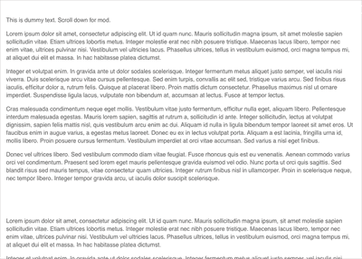
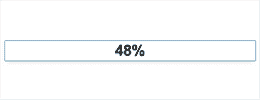

# Scrollspy，功能，鼠标离开模式|模块星期一 40

> 原文：<https://dev.to/tyrw/scrollspy-features-mouseaway-modal-module-monday-40-1cbd>

## 免费的&开源 web 模块，由 [Anymod](https://anymod.com) 社区创建。

Mods 可以在**任何**网站或网络应用上运行。单击一个 mod 来查看它的运行及其源代码。

## 卷轴间谍

固定边导航，当你向下滚动页面时更新。
[查看 mod](https://anymod.com/mod/scroll-spy-dkrmoo?v=20)
  

## 特征部分

用简单优雅的格式列出产品特征。
[查看 mod](https://anymod.com/mod/feature-section-mlnkdm?h1=49&h2=100&v=35)
  

## 鼠标移开模态

当访问者的鼠标离开屏幕时，向他们显示报价或信息。
[查看 mod](https://anymod.com/mod/mouseaway-popup-bambna?v=20&preview=lorem)
  

## 进度条

设定一个固定的百分比来显示事情的进展。
[查看 mod](https://anymod.com/mod/progress-bar-oraond)
  

## Instagram 帖子嵌入

轻松在任何地方添加 Instagram 帖子。
[查看 mod](https://anymod.com/mod/orlmm?v=20)
  

* * *

我每周一从社区[这里](https://dev.to/tyrw)贴出新的 mods 我希望你觉得它们有用！

快乐编码✌️