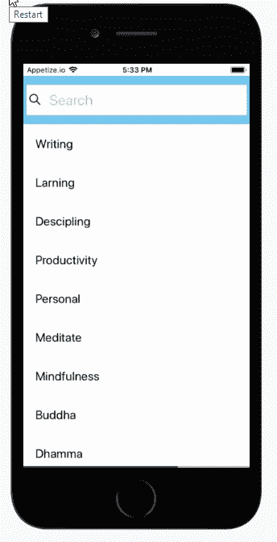
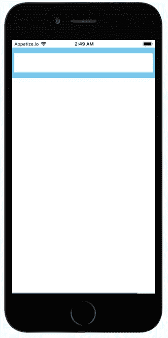
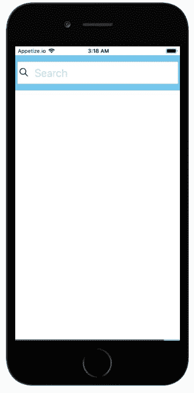
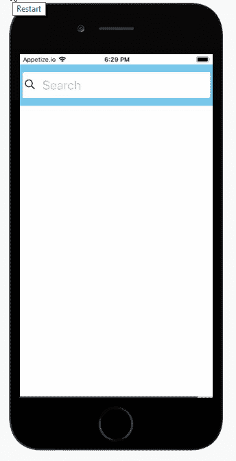
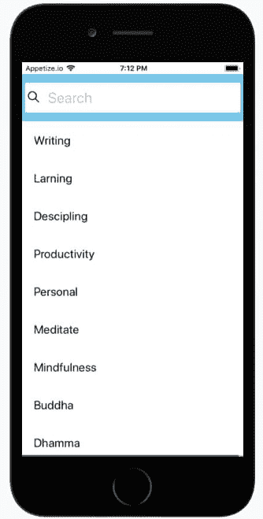
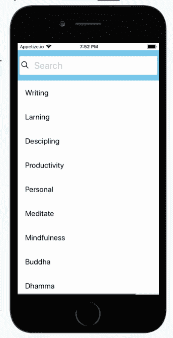
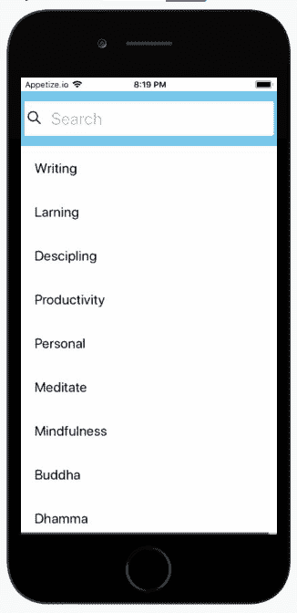
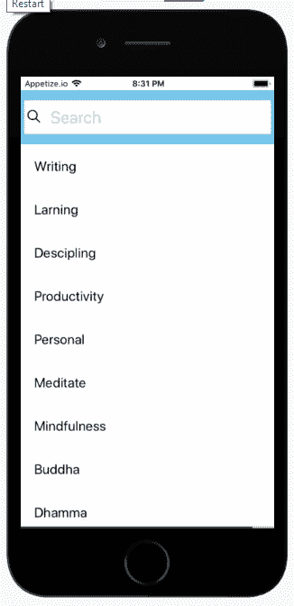

# 用 React Native 构建动画搜索栏

> 原文：<https://dev.to/kris/building-an-animated-search-bar-with-react-native-2424>

[](https://res.cloudinary.com/practicaldev/image/fetch/s--uuxcgTmX--/c_limit%2Cf_auto%2Cfl_progressive%2Cq_auto%2Cw_880/https://cdn-images-1.medium.com/max/1024/1%2AJvRpajoe3nwhNTqVh_kH_w.jpeg)

在这篇文章中，我们将学习使用基本的 React 本地动画，同时创建一个具有动画搜索栏的 rn 项目。为此，我们将使用 react-native-animatable 包。

在大多数应用中，动画是重复的滑动、滑动、反弹等；react-native-animatable 提供了预配置的动画组件，您可以使用这些组件，而无需自己重写常用的动画。该包为 React Native 提供了一组标准的易于使用的动画和声明性转换。

您可以在下面看到我们将要创建的模拟:

[](https://res.cloudinary.com/practicaldev/image/fetch/s--updnuAYp--/c_limit%2Cf_auto%2Cfl_progressive%2Cq_66%2Cw_880/https://cdn-images-1.medium.com/max/344/1%2AikyY95sPUgoIcdJJqVDXVg.gif)

### **为搜索创建视图**

在第一步中，我们为搜索组件创建一个视图。搜索视图和 CSS 样式的代码如下所示:

[https://medium . com/media/ff F2 ab 3d 61 c 506d 32360 fc 30 cf 02 bace/href](https://medium.com/media/fff2ab3d61c506d32360fc30cf02bace/href)

我们使用上面的代码创建一个带有搜索栏组件的视图。您可以使用自己的 CSS 样式为自己的搜索栏创建不同的设计。因此，您将会看到一个类似如下的搜索栏:

[](https://res.cloudinary.com/practicaldev/image/fetch/s--bYz4WbDN--/c_limit%2Cf_auto%2Cfl_progressive%2Cq_auto%2Cw_880/https://cdn-images-1.medium.com/max/331/1%2ARTSD7gwd2SowMD_RT7Xl9Q.png)

### 添加图标和搜索占位符

在这一步，我们将把搜索图标添加到我们的搜索栏中，这样用户就会知道搜索栏的功能。这里，我们还在搜索栏文本字段中添加了一个占位符“Search”。

您可以使用下面这段代码向您的搜索栏添加一个图标和占位符。下面第 13–19 行的代码是我们添加到上一个视图中的代码，以获得如下结果:

[https://medium . com/media/aa 73 aa 83 ddab 1697 ffaf 241174379 b 39/href](https://medium.com/media/aa73aa83ddab1697ffaf241174379b39/href)

因此，您可以在下面的搜索栏中看到带有放大搜索图标和“搜索”占位符的结果。这些元素应该让用户清楚这个工具条的目的是什么。

[](https://res.cloudinary.com/practicaldev/image/fetch/s--Vu6aPF8_--/c_limit%2Cf_auto%2Cfl_progressive%2Cq_auto%2Cw_880/https://cdn-images-1.medium.com/max/331/1%2AMpr2MTIF2moM4qMSUwEXRg.png)

> 移动开发的下一次革命？机器学习。不要错过这个新兴交叉路口的最新消息。[注册](https://www.fritz.ai/newsletter?utm_campaign=heartbeat-newsletter-fomo2&utm_source=heartbeat)获取我们的移动开发人员和机器学习者的每周更新。

### 添加您的第一个动画

接下来，我们将第一个动画添加到搜索栏。为此，我们需要将 react-native-animatable 包安装到 React Native 项目中。要做到这一点，我们可以简单地使用 NPM 或纱线。

在项目控制台中:

> npm 安装反应-本机-可动画-保存

或者

> 纱线添加反应-自然-动画

现在，要使用上面的包，我们需要将 react-native-animatable 包导入到项目视图中。

我们可以通过使用下面这段代码来做到这一点:

[https://medium . com/media/1873 DD 39 ca 61907464226 b 647 e 401055/href](https://medium.com/media/1873dd39ca61907464226b647e401055/href)

为了使搜索栏具有动画效果，我们必须使用类似于 animated . createanimatedcomponent 的 createAnimatableComponent 编辑器。

[https://medium . com/media/34968 EB 9 f 152 a 0940 a10 b 67 bfb 9 e 2 DBF/href](https://medium.com/media/34968eb9f152a0940a10b67bfb9e2dbf/href)

在导入之后，我们需要用*动画*包装器更新搜索视图。如果你有你自己的想要制作动画的组件，简单的用一个可制作动画的包装它。查看如下:

[https://medium . com/media/083 c 034 ffaf 98799629 e06c 1244 AC 528/href](https://medium.com/media/083c034ffaf98799629e06c1244ac528/href)

我们应该会看到如下模拟所示的结果:

[](https://res.cloudinary.com/practicaldev/image/fetch/s--pYtq_bH8--/c_limit%2Cf_auto%2Cfl_progressive%2Cq_66%2Cw_880/https://cdn-images-1.medium.com/max/344/1%2AdA4EhDgBft-tM7POTl2jVQ.gif)

### 为结果添加实体模型数据

在这一步，我们需要为我们的搜索栏结果添加模拟数据。下面给出了我们需要从 react-native 包导入的实例和模块。你可以简单的复制下面的代码:

```
import { View, Text, StyleSheet, TextInput, FlatList, Keyboard} from 'react-native'; 
```

然后，我们通过创建一个名为 listItems 的数组来播种数据，并用数据的模型列表填充数组。您可以根据需要使用自己的数组列表。

[https://medium . com/media/411333 f 406 db 848 B4 d 61149 db9a 08293/href](https://medium.com/media/411333f406db848b4d61149db9a08293/href)

在这里，我们将为 react-native 包导入的 FlatList 组件添加到我们的视图中，该视图包含我们的数据列表数组 listItems。您可以通过使用以下代码片段来实现这一点:

[https://medium . com/media/DC 1 daf 52394 b 79027 e5a 122 e 27 a 0 eecf/href](https://medium.com/media/dc1daf52394b79027e5a122e27a0eecf/href)

因此，您会得到如下结果，如下所示:

[](https://res.cloudinary.com/practicaldev/image/fetch/s--luCT4X2o--/c_limit%2Cf_auto%2Cfl_progressive%2Cq_auto%2Cw_880/https://cdn-images-1.medium.com/max/334/1%2AqYRgLaPXzLUa7pOAFYqD-g.png)

### 焦点搜索栏

在这一步中，我们修改搜索栏以产生搜索栏的焦点视图。因此，当用户单击搜索栏时，它会突出显示，以便与视图中的其他组件分开，这样使用起来就变得简单而高效。

为此，首先，我们需要创建一个状态来处理我们的搜索栏状态。您可以通过使用以下代码来实现这一点:

[https://medium . com/media/d 3 C5 f 664 cc 640 b 6 f 45845645 af 3 ea 862/href](https://medium.com/media/d3c5f664cc640b6f45845645af3ea862/href)

然后，我们将 CSS 样式添加到我们的 FlatList 组件结果中，方法是检查搜索栏的状态，看它是真还是假。为此，您可以使用以下代码:

[https://medium . com/media/2 BD E8 C4 ECF 04577 aa 6ba 6f 2e 417 ab 092/href](https://medium.com/media/2bde8c4ecf04577aa6ba6f2e417ab092/href)

因此，您将在模拟中看到以下结果:

[](https://res.cloudinary.com/practicaldev/image/fetch/s--crc2ZHj---/c_limit%2Cf_auto%2Cfl_progressive%2Cq_66%2Cw_880/https://cdn-images-1.medium.com/max/344/1%2Adih8p56D6SnViQapq7umDw.gif)

### 通过键盘处理焦点到搜索栏

在这一步中，我们使用 react-native 包中的键盘组件处理搜索栏焦点元素。

首先，从 react-native 包中导入键盘组件，如下所示:

[https://medium . com/media/34968 EB 9 f 152 a 0940 a10 b 67 bfb 9 e 2 DBF/href](https://medium.com/media/34968eb9f152a0940a10b67bfb9e2dbf/href)

然后，我们添加键盘监听器来处理搜索栏的聚焦，这样每次按下键盘上的一个键时，搜索栏都会被聚焦或高亮显示。下面这段代码可用于实现这一点:

[https://medium . com/media/3873 C5 CCB 373 CAE 506 d12d 45281175 f/href](https://medium.com/media/3873cc5ccb373cae506d12d45281175f/href)

我们应该得到以下结果:

[](https://res.cloudinary.com/practicaldev/image/fetch/s--UaRHtMBN--/c_limit%2Cf_auto%2Cfl_progressive%2Cq_66%2Cw_880/https://cdn-images-1.medium.com/max/326/1%2AgCGPA-3G0yTuJ2iLTAY9gw.gif)

### 当搜索栏聚焦时改变图标

这是一个简单的最后一步，当焦点对准时，我们将搜索栏图标改为向后箭头。向后箭头将用户从聚焦的搜索栏带回到主视图。

您可以通过向视图中添加以下代码来实现这一点:

[https://medium . com/media/84af 740 a5d 3756 B4 d 09 f 431 a 7 E4 d 86 af/href](https://medium.com/media/84af740a5d3756b4d09f431a7e4d86af/href)

最后，我们可以看到使用下面的 react-native-animatable 包制作的最终搜索动画:

[](https://res.cloudinary.com/practicaldev/image/fetch/s--pee4BRc9--/c_limit%2Cf_auto%2Cfl_progressive%2Cq_66%2Cw_880/https://cdn-images-1.medium.com/max/326/1%2AiO6ufPjc2XZ5fY4KsTkVWQ.gif)

### 重述

在本教程中，我们学习了如何使用 react-native-animatable 包在 React Native 项目中使用基本动画。步骤非常简单易懂。我们还研究了一个处理程序的简单实现，以关注搜索栏。使用同一个包，你也可以创建其他类型的动画，如滑动、弹跳等。可以在[零食](https://snack.expo.io/@krissnawat/c2Vhcm)上查看现场演示。

[https://medium . com/media/e 0629 ef 4d 281159 c 9 C5 f1 d 1017 ee 9 AE 1/href](https://medium.com/media/e0629ef4d281159c9c5f1d1017ee9ae1/href)

> 正在寻找提升移动应用用户体验的新方法？有了 Fritz，你可以教你的应用去看、去听、去感知、去思考。[了解如何使用免费帐户](https://www.fritz.ai/features/?utm_campaign=enhance1&utm_source=heartbeat)并开始构建。

*编者按:* [*加入 Heartbeat on Slack*](http://bit.ly/heartbeatslack) *并关注我们关于*[*Twitter*](https://twitter.com/fritzlabs)*和*[*LinkedIn*](https://www.linkedin.com/company/fritz-labs-inc/)*的所有最新内容、新闻，以及更多关于机器学习、移动开发以及两者交集的地方。*

[https://medium . com/media/05616 eace abf 5537 ffbda5b 6811 c 367 c/href](https://medium.com/media/05616eaceabf5537ffbda5b6811c367c/href)

* * *