# Solr 开源监控工具

> 原文：<https://dev.to/sematext/solr-open-source-monitoring-tools-39cn>

开源软件的采用持续增长。像 [Kafka](https://sematext.com/blog/monitoring-kafka-with-sematext/) 和 [Solr](http://lucene.apache.org/solr/) 这样的工具在小型创业公司中广泛使用，这些公司从一开始就使用云就绪工具，但也在大型企业中使用，在大型企业中，遗留软件通过合并新工具变得更快。在我们的 Solr 监控系列的第二部分中(参见讨论监控的 [Solr 指标的第一部分)，我们将探索一些可用于监控 Solr 节点和集群的开源工具。我们将借此机会了解如何以有意义的方式安装、配置和使用每个工具。](https://sematext.com/blog/solr-key-metrics-to-monitor/)

# Solr 监控的重要性

操作、管理和维护分布式系统并不容易。正如我们在监控 Solr 系列的第一部分中所探讨的，我们需要 40 多个指标来全面了解我们的 Solr 实例和整个集群。如果没有任何类型的监控工具，几乎不可能全面了解所有需要的部分，以确保集群的健康，或者在事情不顺利时做出适当的反应。

当搜索开源工具来帮助您跟踪 [Solr 指标](https://sematext.com/solr-api-metrics-cheat-sheet/)时，请注意以下品质:

1.  监控和管理多个集群的能力
2.  整个集群及其状态的简单概览
3.  关于关键绩效指标的清晰信息
4.  能够为事后分析提供历史指标
5.  结合了低级操作系统指标、JVM 指标和 Solr 特定指标
6.  能够设置警报

现在让我们探索一些可用的选项。

# 普罗米修斯与索尔出口商

Prometheus 是一个开源监控和警报系统，最初由 SoundCloud 开发。现在它是一个独立的开源项目，由最初创建它的公司独立维护。 [Prometheus](https://github.com/prometheus) 项目，于 2016 年加入[云原生计算基金会](https://www.cncf.io/)，成为继 Kubernetes 之后的第二个托管项目。

开箱即用的 Prometheus 支持基于 [TSDB](http://opentsdb.net/) 的多维数据模型之上的灵活查询语言，其中数据可以使用基于 HTTP 的协议提取:

[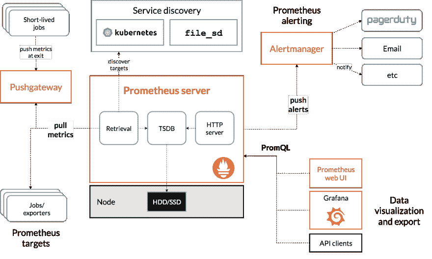](https://res.cloudinary.com/practicaldev/image/fetch/s--Fty2okj---/c_limit%2Cf_auto%2Cfl_progressive%2Cq_auto%2Cw_880/https://thepracticaldev.s3.amazonaws.com/i/v05vtsdx90q2d8cl32r4.png)

来源:https://prometheus.io/docs/introduction/overview/

为了让 Solr 能够向 Prometheus 发送指标，我们将使用一个名为 [Exporter](http://opentsdb.net/) 的工具。它从 Solr 获取[指标，并将它们翻译成普罗米修斯自己可以理解的格式。Solr Exporter 不仅能够将指标发送给 Prometheus，还能够响应请求，如从搜索结果中收集的](https://sematext.com/solr-api-metrics-cheat-sheet/)[集合 API](https://lucene.apache.org/solr/guide/7_7/collections-api.html) 命令、 [ping](https://lucene.apache.org/solr/guide/7_7/ping.html) 请求和[facet](https://lucene.apache.org/solr/guide/7_7/json-facet-api.html)。

Prometheus Solr Exporter 作为一个 contrib 模块随 Solr 一起提供，位于*contrib/Prometheus-Exporter*目录中。要开始使用它，我们需要获取位于*contrib/Prometheus-exporter/conf*目录中的 *solr-exporter.xml* 文件。它已经被预先配置为与 Solr 一起工作，我们现在不会修改它。但是，如果您对额外的指标感兴趣，向 Prometheus 发送额外的方面结果或更少的数据，您应该查看并修改提到的文件。

一旦我们配置了导出器，我们需要启动它。这很简单。只需转到*contrib/Prometheus-exporter*目录(或者您在生产系统中复制它的目录)并运行适当的命令，这取决于您正在运行的 Solr 的架构。

对于 Solr 主从部署，您将运行:

```
./bin/solr-exporter -p 9854 -b http://localhost:8983/solr -f 
./conf/solr-exporter-config.xml -n 8 
```

对于 SolrCloud，您将运行:

```
./bin/solr-exporter -p 9854 -z localhost:2181/solr -f 
./conf/solr-exporter-config.xml -n 16 
```

上面的命令在 *9854* 端口上运行 Solr exporter，Solr 主从有 8 个线程，SolrCloud 有 16 个线程。在 SolrCloud 的情况下，我们还将 exporter 指向 Zookeeper ensemble，它可以在 *localhost* 上的 *2181* 端口访问。当然，您应该调整命令以匹配您的环境。

该命令成功运行后，您应该看到以下内容:

```
INFO  - 2019-04-29 16:36:21.476; 
org.apache.solr.prometheus.exporter.SolrExporter; Start server 
```

我们运行了 Solr 主-从/SolrCloud，并且运行了 Solr 导出器，这意味着我们已经准备好进行下一步，配置 Prometheus 实例以从 Solr 导出器获取数据。为此，我们需要调整 prometheus.yml 文件并添加以下内容:

```
scrape_configs:
  - job_name: 'solr'
    static_configs:
      - targets: ['localhost:9854'] 
```

当然，在生产系统中，与 Solr 和 Solr 导出程序相比，我们的 Prometheus 将运行在不同的主机上——我们甚至可以运行多个导出程序。这意味着我们需要调整 targets 属性来匹配我们的环境。

经过所有的准备，我们终于可以看看普罗米修斯给了我们什么。我们可以从主 Prometheus UI 开始。

[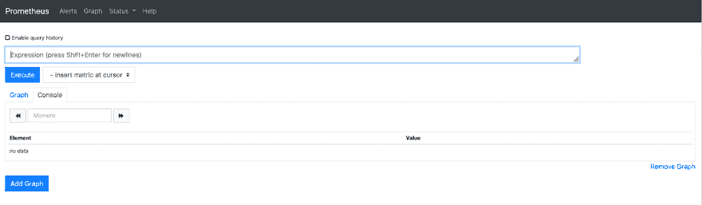](https://res.cloudinary.com/practicaldev/image/fetch/s--QeTR7YfF--/c_limit%2Cf_auto%2Cfl_progressive%2Cq_auto%2Cw_880/https://thepracticaldev.s3.amazonaws.com/i/lplgm7lyukpev5j3xfly.png)

它允许选择我们感兴趣的指标、绘制图表、发出警报等等。它的美妙之处在于 UI 支持完整的 Prometheus 查询语言，允许使用操作符、函数、子查询等等。

当使用 Prometheus 的可视化功能时，我们通过一个简单的下拉菜单获得可用指标的完整视图，因此我们不需要知道 Solr 提供的每个指标。

[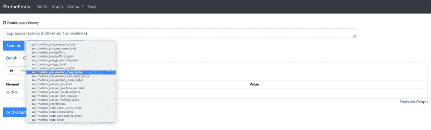](https://res.cloudinary.com/practicaldev/image/fetch/s--CrSzfnJw--/c_limit%2Cf_auto%2Cfl_progressive%2Cq_auto%2Cw_880/https://thepracticaldev.s3.amazonaws.com/i/7f4miljpgsez0ci9g8a6.png)

[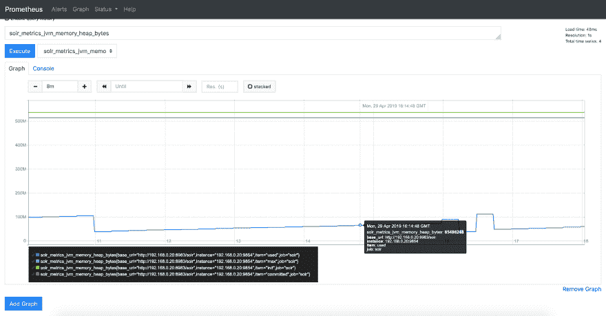](https://res.cloudinary.com/practicaldev/image/fetch/s--MQuFf5yb--/c_limit%2Cf_auto%2Cfl_progressive%2Cq_auto%2Cw_880/https://thepracticaldev.s3.amazonaws.com/i/kqi2iwemizyc35b90hcy.png)

关于 Prometheus 的好事情是我们不局限于默认的 UI，但我们也可以使用 [Grafana](https://grafana.com/) 进行仪表板、警报和团队管理。定义新的 Prometheus 数据源非常非常简单:

[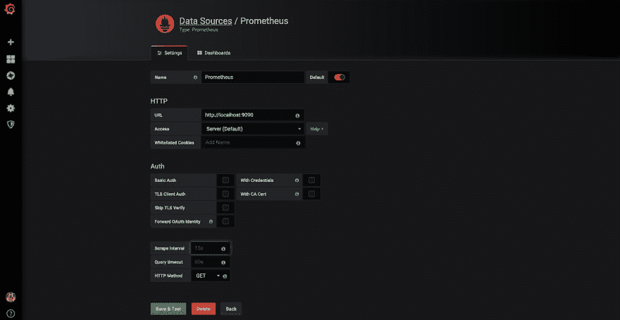](https://res.cloudinary.com/practicaldev/image/fetch/s--RifnLss7--/c_limit%2Cf_auto%2Cfl_progressive%2Cq_auto%2Cw_880/https://thepracticaldev.s3.amazonaws.com/i/pup8vugmg2icuzcoq4wo.png)

完成后，我们可以开始可视化数据:

[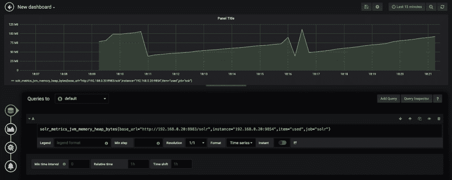](https://res.cloudinary.com/practicaldev/image/fetch/s--LpX202vA--/c_limit%2Cf_auto%2Cfl_progressive%2Cq_auto%2Cw_880/https://thepracticaldev.s3.amazonaws.com/i/o01kjrctg7cfoennvoqk.png)

然而，所有这些都需要我们自己构建丰富的仪表板。幸运的是 Solr 提供了一个例子[预先构建的 Grafana 仪表板](https://lucene.apache.org/solr/guide/7_7/monitoring-solr-with-prometheus-and-grafana.html#sample-grafana-dashboard),可以与 Prometheus 废弃的指标一起使用。示例仪表板定义存储在*contrib/Prometheus-exporter/conf/grafana-solr-dashboard . JSON*文件中，可以加载到 Grafana，提供 Solr 集群的基本视图。

[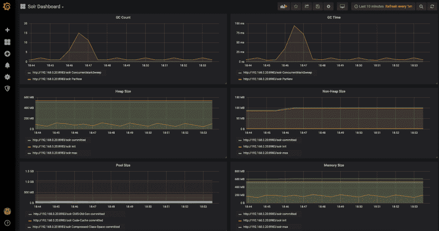](https://res.cloudinary.com/practicaldev/image/fetch/s--qiZKi0IL--/c_limit%2Cf_auto%2Cfl_progressive%2Cq_auto%2Cw_880/https://thepracticaldev.s3.amazonaws.com/i/r68um0la1lid77b7tu6h.png)

Grafana 所能做的并不全是带有指标的仪表板。我们能够建立团队和用户，为他们分配角色，设置指标警报，并在 Grafana 的一次安装中包含多个数据源。这使我们能够将所有东西都放在一个地方——来自多个来源的指标、日志、信号、跟踪以及我们需要和能够想到的任何东西。

# 石墨&石墨与格拉法纳

[Graphite](https://graphiteapp.org/) 是一款免费的开源监控软件，可以对数字时序数据进行监控和图形化。它可以实时收集、存储和显示数据，从而实现细粒度的指标监控。它由三个主要部分组成——[Carbon](https://github.com/graphite-project/carbon)，监听时间序列数据的守护进程，[Whisper](https://github.com/graphite-project/whisper)——存储时间序列数据的数据库和[Graphite web app](https://github.com/graphite-project/graphite-web)，用于随需应变的指标渲染。

要开始使用 Graphite 作为平台监控 Solr，我们假设您已经启动并运行了 Graphite，但是如果您没有，我们可以使用提供的 Docker 容器:

```
docker run -d
  --name graphite
  --restart=always
  -p 80:80
  -p 2003-2004:2003-2004
  -p 2023-2024:2023-2024
  -p 8125:8125/udp
  -p 8126:8126
  graphiteapp/graphite-statsd 
```

为了能够从 Solr 获得数据，我们将使用 [Solr metrics registry](https://lucene.apache.org/solr/guide/7_7/metrics-reporting.html#metric-registries) 以及 [Graphite reporter](https://lucene.apache.org/solr/guide/7_7/metrics-reporting.html#graphite-reporter) 。为了进行配置，我们需要调整 *solr.xml* 文件，并向其中添加指标部分。例如，为了监控关于 JVM 和 Solr 节点的信息，metrics 部分应该如下所示:

```
<metrics>
  <reporter name="graphite" group="node, jvm"
 class="org.apache.solr.metrics.reporters.SolrGraphiteReporter">
     <str name="host">localhost</str>
     <int name="port">2003</int>
     <int name="period">60</int>
  </reporter>
</metrics> 
```

因此，我们将 Solr 指向运行在端口 *2003* 上的*本地主机*上的 Graphite 服务器，并将数据写入周期定义为 60，这意味着 Solr 将每 60 秒推送一次 JVM 和 Solr 节点指标。

请记住，默认情况下，Solr 将使用纯文本协议进行编写。这比使用 pickled 协议效率低。如果您想在生产环境中配置 Solr 和 Graphite，我们建议在 reporter 配置中将 pickled 属性设置为 true，并将端口用于 pickled 协议，在我们的 Docker 容器中，端口为 2004。

我们现在可以很容易地导航到我们的石墨服务器，可在 *127.0.0.1* 的 *80* 端口上用我们的容器和图表显示我们的数据:

[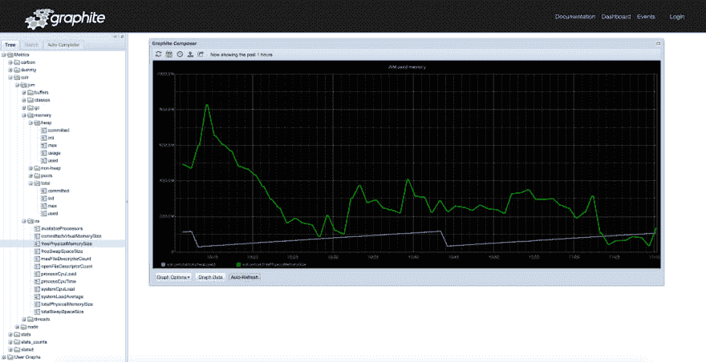](https://res.cloudinary.com/practicaldev/image/fetch/s--sgs8YSYl--/c_limit%2Cf_auto%2Cfl_progressive%2Cq_auto%2Cw_880/https://thepracticaldev.s3.amazonaws.com/i/3d4lni3uz0lyqce7cjlb.png)

所有指标都在左侧菜单中整理出来并易于访问，从而提供丰富的仪表板功能。

如果您正在使用 [Grafana](https://lucene.apache.org/solr/guide/7_7/metrics-reporting.html#graphite-reporter) ,很容易将 Graphite 设置为另一个数据源，并使用其图形和仪表板功能将多个指标关联在一起，甚至是来自不同数据源的指标。

[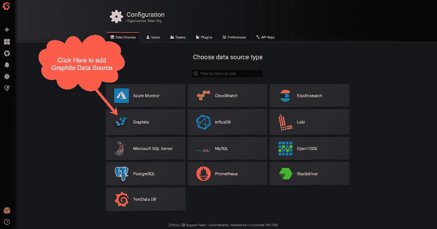](https://res.cloudinary.com/practicaldev/image/fetch/s--XCn6hkeC--/c_limit%2Cf_auto%2Cfl_progressive%2Cq_auto%2Cw_880/https://thepracticaldev.s3.amazonaws.com/i/vf5b89i281bondfeedd7.png)

接下来，我们需要将 Graphite 配置为数据源。这就像提供正确的 Graphite URL 并设置版本一样简单:

[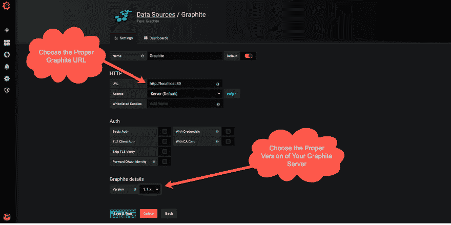](https://res.cloudinary.com/practicaldev/image/fetch/s--yGuE8t8_--/c_limit%2Cf_auto%2Cfl_progressive%2Cq_auto%2Cw_880/https://thepracticaldev.s3.amazonaws.com/i/j5d81cint3zjfmyblq5e.png)

我们已经准备好创建我们的可视化和仪表板，这非常简单和强大。有了度量标准的自动完成功能，我们不需要回忆任何名字，Grafana 就会显示出来。单个指标控制面板的示例如下所示:

[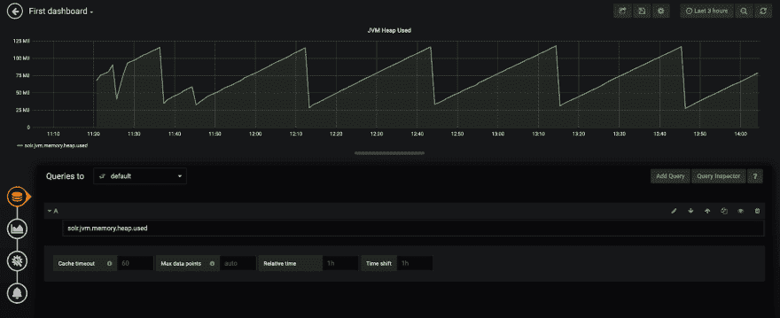](https://res.cloudinary.com/practicaldev/image/fetch/s--OEhrLWUK--/c_limit%2Cf_auto%2Cfl_progressive%2Cq_auto%2Cw_880/https://thepracticaldev.s3.amazonaws.com/i/obft0engio79jrjl2730.png)

# 神经节

[Ganglia](http://ganglia.info/) 是一个可扩展的分布式监控系统。它基于面向大量集群和节点的分层设计。它使用 XML 进行数据表示， [XDR](https://tools.ietf.org/html/rfc4506) 进行数据传输， [RRD](http://www.rrdtool.org/) 进行数据存储和可视化。它已被用于连接跨大学校园的集群，并被证明可以处理具有 2000 个节点的集群。

要开始使用 Ganglia 监控 Solr 主从集群或 SolrCloud 集群，我们将从在 *solr.xml* 配置文件中设置指标报告器开始。为此，我们在提到的文件中添加以下部分:

```
<metrics>
  <reporter name="ganglia" group="node, jvm"
class="org.apache.solr.metrics.reporters.SolrGangliaReporter">
    <str name="host">localhost</str>
    <int name="port">8649</int>
  </reporter>
</metrics> 
```

接下来，我们需要让 Solr 理解用于数据传输的 XDR 协议。我们需要下载 [oncrpc-1.0.7.jar](http://www.rrdtool.org/) jar 文件，并使用 lib 指令将它放在您的 Solr 类路径中，或者将它的路径包含在您的 *solrconfig.xml* 文件中。

完成上述所有工作后，假设我们的 Ganglia 运行在端口 *8649* 上的 *localhost* 上，这就是我们需要做的一切，准备好一切并开始发布 Solr 节点和 JVM 指标。

通过访问 Ganglia 并选择 Solr 节点，我们可以开始研究指标:

[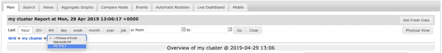](https://res.cloudinary.com/practicaldev/image/fetch/s--P_hTjTBM--/c_limit%2Cf_auto%2Cfl_progressive%2Cq_auto%2Cw_880/https://thepracticaldev.s3.amazonaws.com/i/hu0ease5z649rhnzws36.png)

我们可以立即跳转到图表，选择感兴趣的指标组，基本上可以立即看到我们感兴趣的大部分数据。

[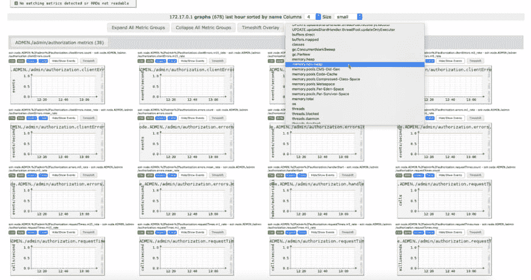](https://res.cloudinary.com/practicaldev/image/fetch/s--BBipt4tx--/c_limit%2Cf_auto%2Cfl_progressive%2Cq_auto%2Cw_880/https://thepracticaldev.s3.amazonaws.com/i/a41jex5hhd11oy6j25ei.png)

Ganglia 为我们提供了所有指标的可见性，但是开箱即用，它不支持我们正在寻找的关键特性之一——警报。有一个项目叫做 [ganglia-alert](http://www.rrdtool.org/) ，是用户贡献的对 ganglia 的扩展。

# 结论

正如您所看到的，有各种各样的工具可以帮助您监控 Solr。您需要记住的是，每一个都需要设置、配置和手动构建仪表板，以便获得有意义的信息。所有这些都需要对整个生态系统有深入的了解。

如果您正在寻找一种 Solr 监控工具，可以在几分钟内完成设置，并预先构建包含所有必要信息、警报和团队管理的仪表板，请查看 Solr 监控系列的第三部分，了解更多关于使用 Sematext 的[生产就绪 Solr 监控的信息。](https://sematext.com/blog/solr-monitoring-made-easy-with-sematext/)

如果您需要软件栈的全栈可观察性，请查看 [Sematext](https://sematext.com/) 。我们正在推动[开源我们的产品](https://github.com/sematext)并产生影响。