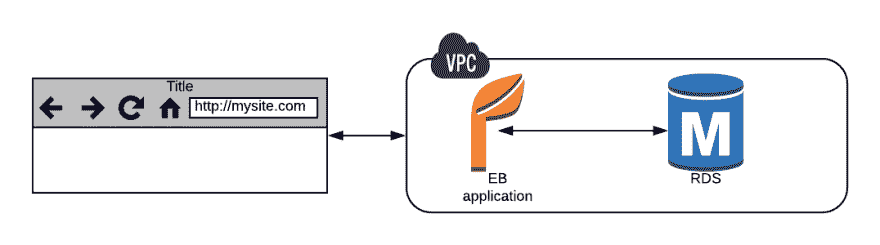
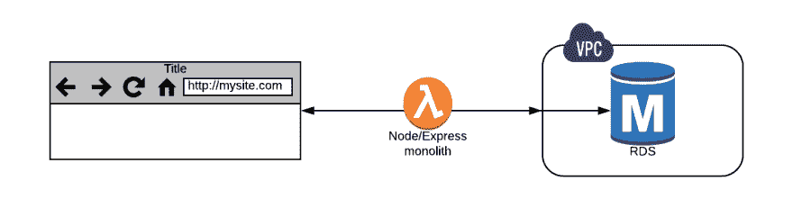
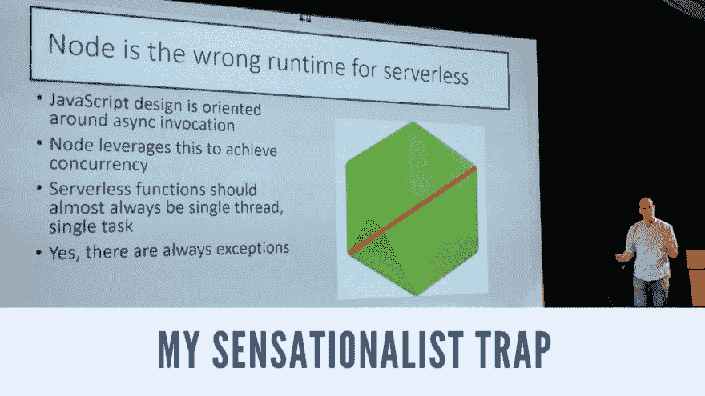
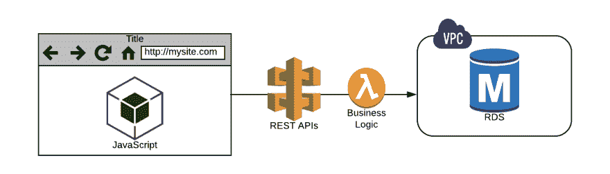
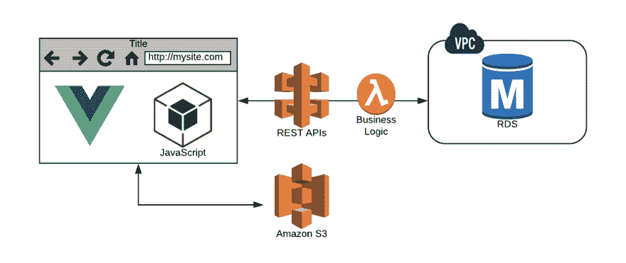
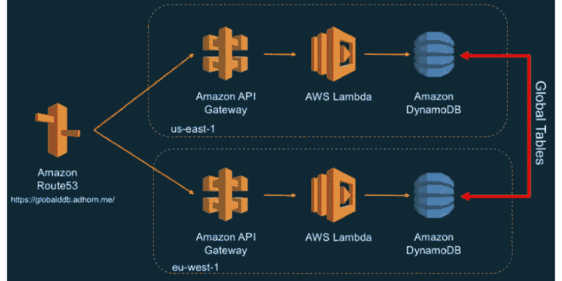
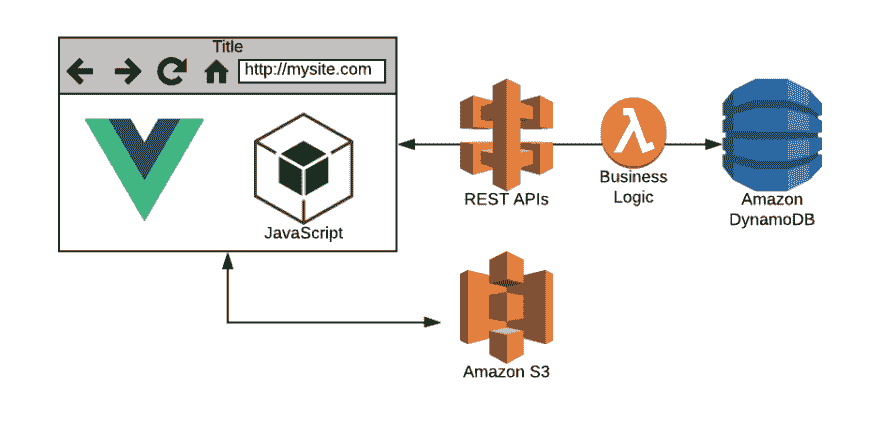
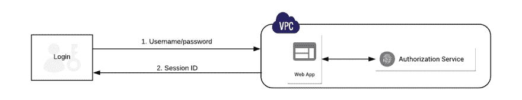
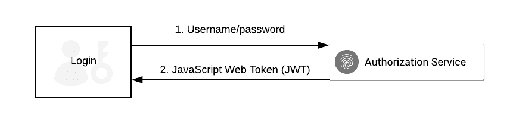
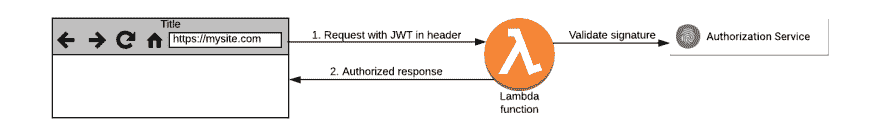

# 我头六个月从无服务器中学到了六件事

> [https://dev . to/oieduardorabelo/6——我在 6 个月前学到的东西——使用 serverless-1866](https://dev.to/oieduardorabelo/6-coisas-que-aprendi-nos-meus-6-primeiros-meses-usando-serverless-1866)

## 世界无服务器令人难以置信，只要找到正确的工具，去掉中间层

10 月份的[服务器故障巡回赛](http://serverlessconf.io)之后，我决定我的整个公司将使用无服务器。我花了头几个月把头撞到墙上试着把 Python Flask 应用程序迁移到 Lambda - [这个练习帮助我找到了一个更好的方法](https://read.acloud.guru/adventures-in-migrating-to-serverless-a63556b39042)。

六个月后，我们在无服务器交付我们的第四个大项目。下面我分享我们进化的方式——包括一路上形成的经验教训(和一些强烈的意见)。

# 第 1 课-放弃 Python

Flash 是一个很好的小型框架，适用于服务器控制的会话网站的旧请求响应模式。这很奇怪，但是在交互网络的新世界里，就像尝试用橡皮筋和轮子组装房子一样。

 
*旧方式:Python Flask 应用程序运行在弹性的 Beanstalk 上，保存 RDS* 中的数据

开始向客户端移动更多交互时，您没有选择，必须使用 JavaScript。这通常会导致 Python 模板中的代码联机，而技术债务守护进程会为您打开一个新的信用额度。

Flask 解决方案成为语言的一大混合。我们很快得出结论，这种做法是一种可怕的混乱——我不知道为什么我要使用 Python。

迁移到节点后，一切都更具可持续性和逻辑性，无需使用多种语言。通过简单的带有 webpack 的 Node/Express 配置，您可以使用 ES6 来消除由熟悉 Python 的开发人员造成的可怕的 JavaScript 构造。

在 zapa/flask 尝试同样的事情比交税更糟。但是大约 5 分钟后，您可以创建一个完整的 Node/Express 应用程序，在 Lambda 中运行起来就像 1040EZ(注:所得税表单)一样-没什么大不了的。所以我们放弃 Python，加入 JavaScript 阵营里的酷孩子们。

*lambda 函数为单体*

为什么我们要放弃？python 的人会在语言的所有有趣的功能上花些功夫，但这些只是和 JavaScript 异步魅力相比的玩具而已。现在，我们不再担心 Python 版本 2 或版本 3(是否已升级)？页:1。至少对于我们的项目来说，这是一个非常容易的变化。

当然， [Ben Kehoe](https://medium.com/@ben11kehoe) 提供了一个极具吸引力的替代性轰动性陷阱，它对如何将 Python vs Node 用于服务器无关性有着自己的看法和看法！

# 第 2 课-除去中间层

令人惊讶的是，我们花了很长时间才意识到无服务器模式的明显好处—这可能是因为我们习惯于开发 web 应用程序，也可能是因为我们老了。

我们早期的一些应用程序仍有一个 Node/Express 层，可以记住会话状态:

*   (一)意外地期望用户多次撞击同一 lambda 容器；或
*   2)由于设计悲剧，我们滥用 DynamoDB 来记住会话 id。

我们到底在干什么？

在“过渡”的第一阶段，我们的中间层充当了 Lambda 中的 web 服务器，这是错误的，也是可怕的。接下来，我们将使用 JavaScript rest API 填充 HTML 页面。这种做法令人难以置信的野蛮，绝望地站不住脚，很快变得脆弱——但我们杀死了中间层。在无服务器环境中，中间层必须离开！

 

 *# 第 3 课-欣赏美景

能把一切都放在前面真是太好了，但很快就会变成可怕的混乱。你只是因为不好意思分享你正在建造的 Rube Goldberg 机械魔法而停止验证代码。而且“不检查代码”对球队来说不是一个好目标。

进入单页应用程序(SPAs)世界使我重新认识到--创建用户界面最常用的方法。React 很好，但它附带了学习曲线，webpack/Babel 中的许多设置，以及 JSX 的推出。虽然这可能是我们最终会用到的东西，但对于我们眼前的需求来说太重了，所以我们探讨了其他的选择。

幸运的是，我们发现了[vista . js](https://vuejs.org/)，我的无服务器生活变成了绝对的幸福。这里有一个道理:你可以在一天之内学会 vista！

> 我很快改变了网站技术[【https://t . co/CK 6 SZ 39 ks 4】](https://t.co/Ck6sz39ks4)使用 vista . js、AWS Lambda、Travis CI 和 Github Pages。以前是 Heroku 的 Pug/Sass/Express。我把成本降到了零，然后回到 GitHub 上，这样我就可以强调代码有多糟糕。- [danhannigan 在推特](https://twitter.com/danhannigan/status/979477162393612288)

vista 的方法非常适合我们的精神模型-一切都是管理自己内容、设计和代码的组件。这使得管理我们的各种不同客户和团队项目变得非常容易，而且对于无服务器思维也非常有效。

vue . js 的生态系统提供了强大的调试工具、出色的组织和现成的 web 包编译，可节省时间。只要轻轻敲一下状态管理路由器和插件，就可以创建美丽的实时应用程序，就像您是 Facebook 工程师一样。谁会想到单页应用程序会这么容易？

从无服务器的角度来看，vista 将其全部善良汇编成文件 **index.html** 和 **bundle.js** ，准备发送到 S3。键入 **npm run build** 是新的编译命令。

请花一点时间考虑一下—在旧世界中，我们将通过弹性 Beanstalk 部署应用程序，并监控利用率、在需要时自动扩展以及管理合理的基础架构部分。

spa 的真正魔力在于您“部署”应用程序。您只需将**index . html、bundle . js**和某些文件依赖项复制到 CloudFront 分发中的前端 S3 存储桶即可。这提供了稳定的部署和加载行为，并允许管理多个版本和您选择的任何部署方法-仅管理文本文件。

就规模而言，我们确实拥有无限的权力，而且我们只需付出我们所使用的东西—没有应用程序基础架构管理。

vista 允许您在浏览器中构建桌面应用程序-这意味着您可以显着改善用户体验。无需无休止的请求/响应流，即可在客户端管理整个状态。您可以使用标准用户界面技巧(如过渡效果)隐藏延迟，并且整个应用程序都可以正常工作。

# 第 4 课-学会热爱 DynamoDB

从许多方面来说，迁移到无服务器最困难的部分是真正熟悉 DynamoDB。你肯定在早期的迭代中犯了一些错误，很想放弃一切回到 RDS 那里，那里的一切都很熟悉和舒适。

SQL 一直是我的拐杖我承认我在数据库里放了很多商业逻辑。但 RDM 系统只是另一个整体性的系统—它们不能很好地扩展，也不支持有机进化的灵活系统的概念。

DynamoDB 是一种完全不同的动物。当您成功时，NoSQL 数据库提供了惊人的性能、巨大的规模，而且几乎没有管理开销。但你真的需要花时间去探索它是如何运作的——早期阶段充满了陷阱。

> 亚马逊 Web 服务@ AWS cloud如何使用亚马逊 DynamoDB 全局表、AWS Lambda & API 网关来构建一个无服务器的多区域、主动-主动后端——全部在一个小时内完成！[amzn.to/2KhA9QF](https://t.co/gPbjITSOWa)2018 年 4 月 27 日 12 点 17 分277177

Dynamo 表字段不能包含空字符串。时间点备份不是自动的。如果您取了一个分区并对错误的密钥进行排序，则必须使用表从头开始。如果您尝试非常接近地模拟 SQL 查询，则可能不会有太多表格可供使用。从 RDS 那边传来的声音听起来很奇怪。

经过许多练习，尝试，失败，最终通过 DynamoDB，我了解到:

*   **你需要了解 DynamoDB 的工作方式**。花一些时间了解索引策略以及您打算如何查询数据。不知道你需要知道的一切就很容易进入它，很多人在错误的时间燃烧并返回 RDM。犯错误，但要通过他们，继续前进！
*   **您可以使用串流**将程式码附加至表格事件。关于 DynamoDB 讨论最少的一点是流的工作方式 sql 中的**触发器**可以做任何事情。这些是非常强大的。我们使用的一个非常简单的模式始终是将表更新发送到 SNS 主题，在该主题中，更改可以由另一个尚未编写的无服务器代码处理。
*   **不要忘记 DynamoDB 可以为其他存储系统**供电。RDM、Redshift 或纯文本文件，可用于平滑峰值流量或保护另一个包含大量数据的数据库。DynamoDB 具有 TTL 功能，允许您超时行-这对于存储要发送到其他位置的数据非常有用。

# 李桑 5 -使用无服务器框架

我最初对 Lambda 的体验是一个令人尴尬的话题，我的编码直接在 AWS 控制台上，我感到沮丧的是，要做一些琐碎的事情，我必须花费大量的工作和错误信息。连接 IDE 和生产环境的桥梁丢失。

嗯，我错过了，直到你发现了‘t0’框架无服务器’，老实说，多年来我发现的最令人兴奋的事情！

一个简单的 **sls** 拥有巨大的力量，将它珍贵的代码组合在一起，直接传送到亚马逊的大脑云上。如果您需要检查日志，因为您的代码行为不良，只需键入“**SLS logs-f nomad uncao-t”**，无需打开浏览器即可查看您的云观察日志。

是啊。改变它。什么都行。**【无服务器】**背后的人们应该受到表扬，因为他们做了任何云服务提供商从一开始就应该做的事情。太棒了！

> 西门沃德利# EEA@ swar dley问及无服务器的影响。天哪，这太简单了。一套全新的新兴实践将改变我们发展业务的方式。2016 年 11 月 18 日上午 01:156893

# 第 6 课-授权是新警长

在传统应用程序中，您只需验证一次用户，然后按照会话代码跟踪该用户。我们喜欢这样，因为您只需做一次繁重的工作，然后 ID 允许您欺骗用户登录的生命周期，只要您愿意。

但这种做法有问题。只有当您将此服务器放在中间时，此功能才起作用-我们删除了中间层。它还会使您暴露在某些令人不快的攻击(如 cross-site request forries(csrf))之下，并且不允许您很容易地将身份传递给其他服务。所以这种方法基本上支持单纯性( *boooo！*。

我们讨厌 CSRF 攻击，正在解构独白——但我们喜欢我们的新朋友 JWT 令牌。当我了解到它是如何工作的时候，我曾一度欣喜若狂，但我需要一张图表来伸张正义。

步骤 1，获取 jwt，步骤 2，使用它与您编写的任何服务进行通信:

 
*步骤 1 -生成 JWT 令牌的家庭授权流程*

 
*步骤 2——凡发生魔法的地方，任何 lambda 函数都可以接受并验证令牌*

基本思想是，每个请求都经过身份验证，客户甚至可以与多个无服务器产品交谈。它是不正当的安全的，它是反垄断的，CSRF 不存在于 JWT 的土地上。serverless 代码只需要使用自定义授权器来验证标头中的 JWT 是否有效(使用标准代码)并准备就绪。

JWT 使所有其他类型的验证看起来非常复杂。我们把一切都改成了[【auth 0】](https://auth0.com/)(在某些情况下是)，从不回头看。无服务器认证既吸引人又疯狂，所以是的，让我们团队！

> 

* * *

# 是一个令人钦佩的新世界

虽然我和 AWS 共事很久了，但我从来没有离地面这么近过。即使在 EC2 的土地上，也有很多帮助，因为相比之下，我参加聚会迟到了。从云专家的服务器危机中走出来后，一切看起来都像是一个真正未被探索过的领域，在黑暗中发现了更多的东西。

> Serverlessconf@ Serverlessconf刚刚宣布...
> Serverlessconf 于 2018 年 7 月 29 日-8 月 1 日前往加州旧金山！请务必通过我们的网站 [sf.serverlessconf.io](https://t.co/vSkgMJUsPK) 注册，享受早期价格优惠。请继续关注我们的赞助商和演讲者“大声喊出来”！2018 年 4 月 23 日下午 14:5461108

在我们早期的实验中，我们在尝试使用现有工具和技术时出现了一些错误——结果并不理想。几个月后，我们正式开始以 100%无服务器的方式交付项目。我相信我们的迁移解决方案和最初的探索是值得的。

我们正在开发专门使用无服务器基础架构、可轻松扩展且成本低 70%到 90%的高级实时 SPA 应用程序。我对奖励感到高兴和震惊。

我从未再相信无服务器技术将彻底改变云应用程序交付。

结果是转型性的！

# [t1【学分】](#cr%C3%A9ditos-%EF%B8%8F)

*   [我在使用无服务器软件的前 6 个月里学到的 6 件事](https://read.acloud.guru/six-months-of-serverless-lessons-learned-f6da86a73526)，escrito origination por[James Beswick](https://twitter.com/jbesw)*