# 要监控的 Solr 关键指标

> 原文：<https://dev.to/sematext/solr-key-metrics-to-monitor-71i>

作为关于监控 Apache Solr 的三部分系列文章的第一部分，本文探讨了哪些 Solr 指标是需要监控的，以及为什么要监控。本系列的第二部分涵盖了 [Solr 开源监控工具](https://sematext.com/blog/solr-open-source-monitoring-tools/)，并确定了帮助您在生产中监控和管理 Solr 和 SolrCloud 所需的工具和技术。

# 两种架构

当第一次考虑安装 Solr 时，你通常会问自己一个问题——我应该选择[主从环境](https://lucene.apache.org/solr/guide/7_7/legacy-scaling-and-distribution.html)还是我应该献身于 [SolrCloud](https://lucene.apache.org/solr/guide/7_7/solrcloud.html) ？这个问题在这篇博文中还没有答案，但是我们想提到的是，知道你将监控哪个架构是很重要的。在处理 SolrCloud 集群时，您不仅要监控每个节点的指标，还要监控集群范围的信息以及与 Zookeeper 相关的[指标。](https://sematext.com/docs/integration/zookeeper/)

# 为什么要监控 Solr？

当运行 Solr 时，它通常是系统的关键部分。它被用作你的数据的搜索和分析引擎——部分或全部。整个体系结构的这一关键部分需要容错和高可用性。Solr 从两个方面着手。传统架构也称为主从架构，它基于负责索引数据的主服务器和负责提供搜索和分析结果的从服务器之间的明确区别。

当数据被推送到主服务器时，它会根据我们提供的配置转换成所谓的倒排索引。基于磁盘的倒排索引被分成更小的、不可变的片段，称为段，然后用于搜索。出于性能原因，这些片段也可以在称为[片段合并](https://sematext.com/blog/solr-optimize-is-not-bad-for-you-lucene-solr-revolution/)的过程中合并成更大的片段——片段越多，搜索速度越慢，反之亦然。

一旦数据以段的形式写入主磁盘，它就可以被复制到从服务器。这是在拉模型中完成的。从服务器使用 HTTP 协议从主节点复制二进制数据。每个节点独立完成这项工作，并通过网络分别复制已更改的数据。我们已经看到了十几个我们应该监控和了解的地方。

拥有单个主节点并不是我们所说的容错，因为存在单点故障。正因为如此，Solr 4.0 版本引入了第二种类型的架构——Solr cloud。它基于这样的假设，即数据分布在几乎无限数量的节点中，并且每个节点都可以执行索引和搜索处理任务。放置在所谓的[碎片](https://sematext.com/blog/handling-shards-in-solrcloud/)中的数据的物理副本可以以物理副本的形式按需创建，并以近乎实时的方式在它们之间复制，从而实现真正的容错和高可用性。然而，为了实现这一点，我们需要一个额外的软件-[Apache Zookeeper](https://zookeeper.apache.org/)cluster 来帮助 Solr 管理和配置它的节点。

[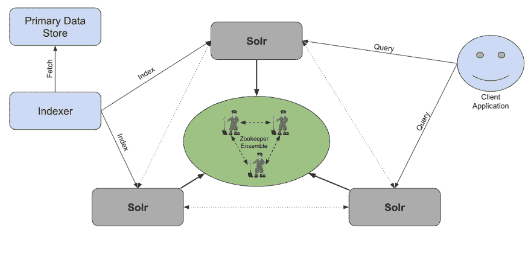](https://res.cloudinary.com/practicaldev/image/fetch/s--JahjNxpA--/c_limit%2Cf_auto%2Cfl_progressive%2Cq_auto%2Cw_880/https://thepracticaldev.s3.amazonaws.com/i/shzislaoxw0hv5hw5shq.png)

当数据被推送到集群中的任何 Solr 节点时，首先要做的是将数据转发到一个 leader shard。领导者将数据存储在名为[事务日志](https://lucene.apache.org/solr/guide/7_7/updatehandlers-in-solrconfig.html#transaction-log)的预写日志中，并根据[副本类型](https://sematext.com/blog/solr-7-new-replica-types/)，将数据发送给副本进行处理。然后，数据被编入索引，并以倒排索引格式写入磁盘。这可能会导致额外的 I/O 需求——因为数据索引可能还会导致[段合并](https://sematext.com/blog/solr-optimize-is-not-bad-for-you-lucene-solr-revolution/),最后需要刷新数据以便对搜索可见，这又需要一次 I/O 操作。

当您向 SolrCloud cluster 发送搜索查询时，最初被查询命中的节点[会将数据传播到需要查询的碎片](https://sematext.com/blog/solrcloud-large-tenants-and-routing/)，以便提供完整的数据可见性。每个分布式搜索分两个阶段完成——分散和聚集。分散阶段致力于发现哪些碎片具有匹配的文档、这些文档的标识符以及它们的分数。收集阶段致力于通过从索引碎片中检索所需的文档来呈现搜索结果。每个搜索阶段都需要 I/O 从磁盘读取数据，需要内存来存储执行搜索所需的结果和中间步骤，需要 CPU 周期来计算所有内容，还需要网络来传输数据。

现在让我们看看如何监控所有那些对我们的索引和搜索至关重要的指标。

# 通过 JMX 监控 Solr 指标

jconsole 是 Java 开发工具包自带的工具之一，当您需要快速、专门的监控时，它会派上用场。一个 GUI 工具，允许你获得关于你的 [JVM](https://sematext.com/java-monitoring/) 的基本指标，比如[内存使用](https://sematext.com/java-monitoring/)，CPU 利用率， [JVM 线程](https://sematext.com/java-monitoring/)，加载的类。除此之外，它还允许我们读取 Solr 本身以 JMX mbean 的形式公开的指标。Solr 创建者以这种形式公开的任何指标都可以使用 jconsole 读取。像给定搜索处理程序的平均查询响应时间、索引请求数或错误数这样的事情都可以通过[JMX mbean](https://sematext.com/java-monitoring/)读取。jconsole 的问题是它没有向我们展示测量的历史。

[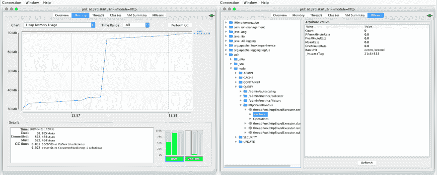](https://res.cloudinary.com/practicaldev/image/fetch/s--z8JE66qw--/c_limit%2Cf_auto%2Cfl_progressive%2Cq_auto%2Cw_880/https://thepracticaldev.s3.amazonaws.com/i/032s9ygwn3uko2hm47ck.png)

Jconsole 并不是解读 JMX MBean 值的唯一方式——还有其他工具可以做到这一点，比如开源的 [JMXC](https://github.com/sematext/jmxc) 或者我们的开源的 [Sematext Java 代理](https://github.com/sematext/sematext-agent-java)。与以文本格式导出数据的工具不同，我们的 Sematext Java 代理可以将数据发送到 [Sematext Cloud](https://sematext.com/cloud/) ，这是一个全栈可观察性解决方案，可以帮助您详细了解 Solr 指标。

[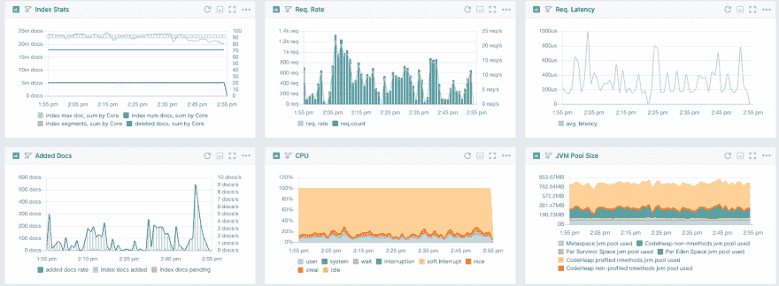](https://res.cloudinary.com/practicaldev/image/fetch/s--vpc_wUZt--/c_limit%2Cf_auto%2Cfl_progressive%2Cq_auto%2Cw_880/https://thepracticaldev.s3.amazonaws.com/i/yhvbl9pu70w6rj3hdl3x.png)

# 通过指标 API 监控 Solr 指标

收集 Solr 指标的第二个选项是 Solr 6.4 中引入的 API——[Solr 指标 API](https://sematext.com/blog/solr-new-metrics-api-solr-64/) 。它支持使用基于 HTTP 的 API 对核心、集合、节点和 JVM 进行按需指标检索。然而，API 的灵活性并不在于它是按需可用的，而是能够通过使用报告器将数据报告给不同的目的地。现在，开箱即可导出数据，只需稍加配置即可:

1.  JMX-JMX·mbean，我们已经讨论过了
2.  SLF4J -日志或 SLF4J 支持的任何目的地
3.  [石墨](https://graphiteapp.org/)
4.  [神经节](http://ganglia.sourceforge.net/)

我们将在这个由三部分组成的监控系列的第二部分中更详细地介绍开源 Solr 监控解决方案。

# 要监控的关键 Solr 指标

了解了如何监控 Solr 之后，现在让我们来看看我们应该关注的顶级 Solr 指标。

## 请求速率

Solr 中的每个处理程序都提供关于发送给它的请求速率的信息。了解 Solr 节点或集群总共处理了多少请求以及每个处理程序处理了多少请求，对于诊断操作是否正常运行至关重要。请求率的突然下降或上升可能表明系统的某个组件出现了故障。交叉引用请求速率指标和请求延迟可以让您了解在给定速率下您的请求有多快，或者显示当请求数量相同，但延迟开始增加时您遇到的潜在问题。

[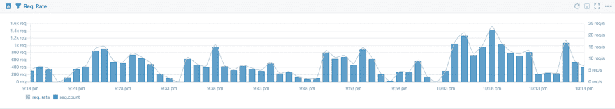](https://res.cloudinary.com/practicaldev/image/fetch/s--FI-82-5z--/c_limit%2Cf_auto%2Cfl_progressive%2Cq_auto%2Cw_880/https://thepracticaldev.s3.amazonaws.com/i/pcqas6vli0o88h8lwkqm.png)

## 请求等待时间

对请求速度的度量，类似于请求速率，可分别用于每个处理程序。这意味着我们能够很容易地看到我们的查询和更新请求的延迟。如果您有不同的搜索处理程序专门用于不同的搜索需求，即一个用于产品搜索，一个用于文章搜索，您可以很容易地测量每个处理程序的延迟，并查看给定类型数据的结果返回速度。将请求的延迟与垃圾收集器工作、JVM 内存利用率、I/O 利用率和 CPU 利用率等指标进行交叉引用，可以轻松诊断性能问题。

[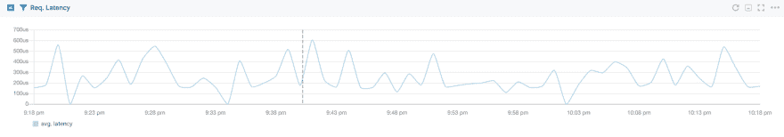](https://res.cloudinary.com/practicaldev/image/fetch/s--DTTCzMZa--/c_limit%2Cf_auto%2Cfl_progressive%2Cq_auto%2Cw_880/https://thepracticaldev.s3.amazonaws.com/i/k7wrpnb4f3mj31fntvz0.png)

## 提交事件

Solr 中的提交事件有多种风格。有手动提交，发送或没有索引请求。有[个自动提交](https://lucene.apache.org/solr/guide/7_7/updatehandlers-in-solrconfig.html#autocommit)——在满足特定标准后被触发——要么时间已过，要么文档数量大于阈值。它们为什么重要？他们负责数据持久性和数据可见性。硬提交将数据刷新到磁盘，并清除事务日志。软提交重新打开 searcher 对象，允许 Solr 看到新的数据段，从而为用户提供新的数据。然而，平衡提交的数量和它们之间的时间是至关重要的——它们不是自由的，我们需要确保我们的提交不会太频繁，也不会相隔太远。

[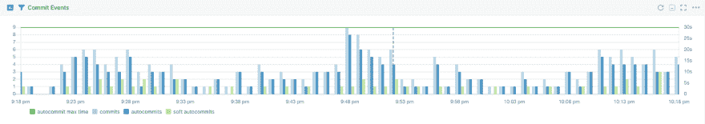](https://res.cloudinary.com/practicaldev/image/fetch/s--dNoHHtAR--/c_limit%2Cf_auto%2Cfl_progressive%2Cq_auto%2Cw_880/https://thepracticaldev.s3.amazonaws.com/i/zfwudc6hf09d41hr3kdw.png)

## 缓存利用率

[缓存](https://lucene.apache.org/solr/guide/7_7/query-settings-in-solrconfig.html#caches)在 Solr 性能中起着至关重要的作用，尤其是在 Solr 主从架构中。缓存的数据可以轻松访问，无需昂贵的磁盘操作。缓存不是免费的——它们需要内存，你想缓存的信息越多，就需要越多的内存。这就是为什么监控缓存的大小和命中率很重要。如果您的缓存太小，命中率将会很低，您将会看到大量的驱逐——从缓存中删除数据会导致 CPU 使用率和垃圾收集，从而有效地降低您的节点性能。另一方面，过大的缓存会增加 JVM 堆上的数据量，进一步推动垃圾收集器，再次降低节点的有效性能。您还可以交叉引用提交事件对缓存的利用——记住，每个提交事件都会丢弃缓存中的条目，从而导致缓存刷新和预热，这会占用 CPU 和 I/O 等资源。

以上是需要注意的关键 Solr 指标，尽管还有其他有用的 Solr 指标。

# 要监控的关键操作系统& JVM 指标

Apache Solr 是一个 Java 软件，因此很大程度上依赖于整个 Java 虚拟机及其部分的性能，例如[垃圾收集器](https://sematext.com/java-monitoring/)。JVM 本身并不是孤立工作的，它依赖于操作系统，比如可用的[物理内存](https://sematext.com/server-monitoring/)，CPU 内核的数量及其速度，以及 I/O 子系统的[速度。让我们看看我们应该了解的关键指标。](https://sematext.com/server-monitoring/)

## CPU 利用率

Solr 执行的大多数操作在某种程度上都依赖于 CPU 的处理能力。当您索引数据时，需要在将数据写入磁盘之前对其进行处理——分析配置越复杂，每个文档需要的 [CPU](https://sematext.com/java-monitoring/) 周期就越多。查询时间分析——facets 需要在一秒钟内处理大量文档，以便 Solr 能够及时返回查询结果。Java 虚拟机还需要 CPU 处理能力来进行垃圾收集之类的操作。将 CPU 利用率与其他指标(即请求速率或请求延迟)相关联，可能会揭示潜在的瓶颈或向我们指出潜在的改进。

[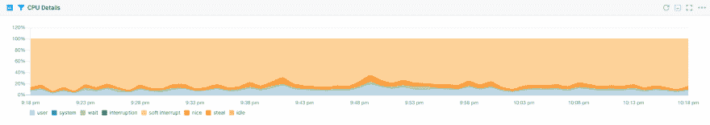](https://res.cloudinary.com/practicaldev/image/fetch/s--XErgQdt2--/c_limit%2Cf_auto%2Cfl_progressive%2Cq_auto%2Cw_880/https://thepracticaldev.s3.amazonaws.com/i/1mbhp1vbvrd11vf4fc8x.png)

## 内存，JVM 内存&互换

当你关心性能时，空闲内存和[交换空间](https://sematext.com/java-monitoring/)非常重要。当没有足够的物理内存可用，并且需要为应用程序分配更多内存时，操作系统会使用交换空间。在这种情况下，可能会交换内存页面，这意味着这些页面将从物理内存中取出，并写入硬盘上的专用交换分区。当需要来自这些交换内存页面的数据时，操作系统会将它从交换空间加载回物理内存。你可以想象这样的操作需要时间，即使是最快的固态硬盘也比 RAM 内存慢很多。意识到交换内存的含义后，我们现在可以很容易地说 JVM 应用程序不喜欢被交换——这会降低性能。正因为如此，你要避免你的 [Solr JVM 堆内存](https://sematext.com/java-monitoring/)被交换。您应该密切监视您的内存使用和交换使用，并将其与您的 Solr 性能相关联，或者完全禁用交换。

[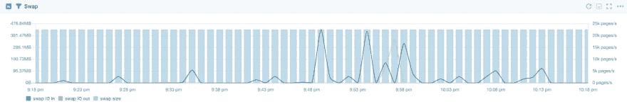](https://res.cloudinary.com/practicaldev/image/fetch/s--eHOkMeG6--/c_limit%2Cf_auto%2Cfl_progressive%2Cq_auto%2Cw_880/https://thepracticaldev.s3.amazonaws.com/i/le08d0sce6493ycyinhd.png)

除了监控系统内存，您还应该密切关注 JVM 内存及其各种池的利用率。让 [JVM 内存池](https://sematext.com/java-monitoring/)得到充分利用，尤其是旧的代空间，将导致大量的垃圾收集，并且您的 Solr 完全不可用。

[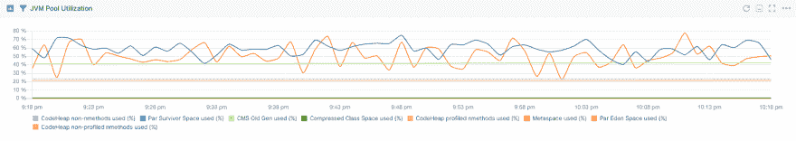](https://res.cloudinary.com/practicaldev/image/fetch/s--nLV2ZwiQ--/c_limit%2Cf_auto%2Cfl_progressive%2Cq_auto%2Cw_880/https://thepracticaldev.s3.amazonaws.com/i/l0ms6lsc6qha60vbdy0y.png)

## 磁盘利用率

Apache Solr 是一个非常基于 I/O 的应用程序——它在索引时写数据，在执行搜索时读数据。数据越多，I/O 子系统的利用率就越高，当然，I/O 子系统的性能与 Solr 性能有着直接的联系。将 I/O 读写指标与请求延迟和 CPU 使用相关联，可以突出显示系统中的潜在瓶颈，从而使您能够更好地扩展整个部署。

[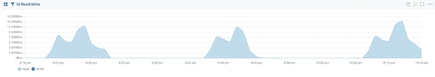](https://res.cloudinary.com/practicaldev/image/fetch/s--m2X3MmiP--/c_limit%2Cf_auto%2Cfl_progressive%2Cq_auto%2Cw_880/https://thepracticaldev.s3.amazonaws.com/i/kkesrtq8rzlitspqu3t9.png)

## 垃圾收集器统计

当数据在基于 JVM 的应用程序中使用时，它被放到堆中。首先进入较小的你的一代，后来转移到通常较大的老一代堆空间。将对象分配到适当的堆空间是垃圾收集器的职责之一。我们最感兴趣的主要职责是清理不用的物品。当 Java 代码中的对象不再被使用时，可以在垃圾收集过程中将其从堆中取出。这个过程是不时运行的，比如年轻一代每秒运行几次，老一代时不时运行一次。我们需要知道它们有多快，多长时间一次，以及是否一切正常。

如果您的垃圾收集过程没有停止整个应用程序，并且老一代垃圾收集不是恒定的——这很好，这通常意味着您有一个健康的环境。请记住，将垃圾收集器指标与内存利用率和性能度量(如请求延迟)相关联可能会揭示内存问题。

[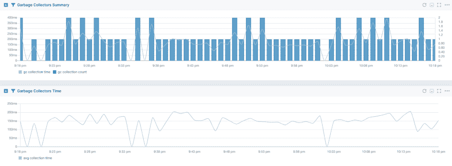](https://res.cloudinary.com/practicaldev/image/fetch/s--do6OWP2d--/c_limit%2Cf_auto%2Cfl_progressive%2Cq_auto%2Cw_880/https://thepracticaldev.s3.amazonaws.com/i/u7wutyuinq9x05ziabfu.png)

# 乌云和动物园管理员

运行 SolrCloud 集群时，拥有一个健康的 Zookeeper 系综至关重要。它负责保存集合配置、SolrCloud 集群工作所需的集合状态、帮助选举领导者等等。当 Zookeeper 遇到麻烦时，你的 SolrCloud 集群将无法接受新数据，四处移动碎片或接受新节点加入集群——唯一可能工作的是查询，但只是在一定程度上。

因为健康的 Zookeeper 集群是每个 SolrCloud 集群的必要组成部分，所以拥有 Zookeeper 集群的完全可观测性是至关重要的。您应该关注以下指标:

1.  与动物园管理员建立的连接的统计
2.  请求延迟
3.  内存和 JVM 内存利用率
4.  垃圾收集器时间和计数
5.  CPU 利用率
6.  法定人数状态

[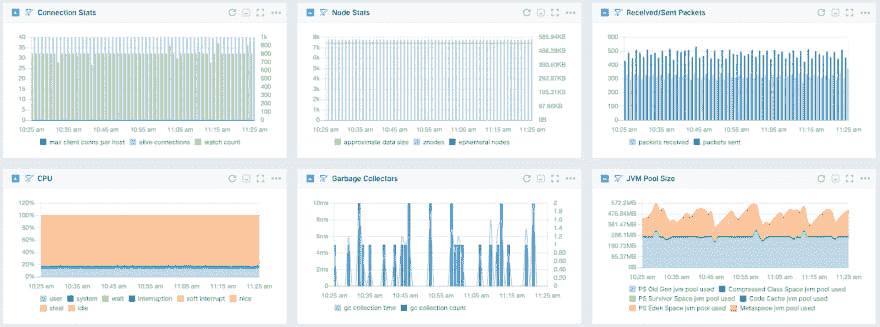](https://res.cloudinary.com/practicaldev/image/fetch/s--n5ffXDi0--/c_limit%2Cf_auto%2Cfl_progressive%2Cq_auto%2Cw_880/https://thepracticaldev.s3.amazonaws.com/i/8odia8rlxvb667rkalb9.png)

参见语义[文档](https://sematext.com/docs)中的[更完整的动物园管理员指标列表](https://sematext.com/docs/integration/zookeeper)。

# 结论

Solr 是一个令人敬畏的搜索引擎和分析平台，允许惊人快速的数据索引和检索。当使用正确的监控工具时，保持所有相关的 [Solr](https://sematext.com/integrations/solr-monitoring/) 和 [OS](https://sematext.com/server-monitoring/) 指标处于观察之下要容易得多。这就是为什么在 monitoring Solr 系列的第二部分中，当谈到使用开源工具监控 Solr 的[时，我们看一下可能的选项。本系列的最后一部分将介绍使用 Sematext](https://sematext.com/blog/solr-open-source-monitoring-tools/) 的[生产就绪 Solr 监控。](https://sematext.com/blog/solr-monitoring-made-easy-with-sematext/)