# 使用全栈来增加你的收入

> 原文：<https://dev.to/teodeleanu/use-full-stack-to-increase-your-income-274n>

这是选择堆栈的简单方法，并且能够由一个开发人员交付整个项目。一个真正的超级玩家。首先，选择语言。Javascript 显然是最容易学习的一整套东西。在下面的视频中，看看语言问题自 2008 年以来是如何演变的。

[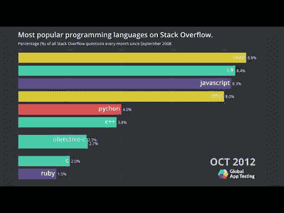](http://www.youtube.com/watch?feature=player_embedded&v=cKzP61Gjf00)

正如你可能注意到的，Python 引起了很大的兴趣。很多人已经知道这是因为 ML、数据特性和语法。我们将在另一篇文章中讨论 Python 库。

> 你可以在 [GitHub](https://github.com/rosoftdeveloper/appseed/tree/master/starter-flask) 上免费查看我们的烧瓶启动器。

我记得几年前，我交付了第一个没有 UI 的自由职业者后端项目。在那之前，我只是一名后端开发人员，在一家大公司的更大团队中工作，所有职位都有明确的定义。但这是我的第一个自由职业项目，我必须学习很多东西。
经过 3 个月的努力，从一个树莓皮中检索到了所有信息。但是我展示信息的方式与非技术人员无关。要做到这一点，你需要某种 UI(不管好不好)。

[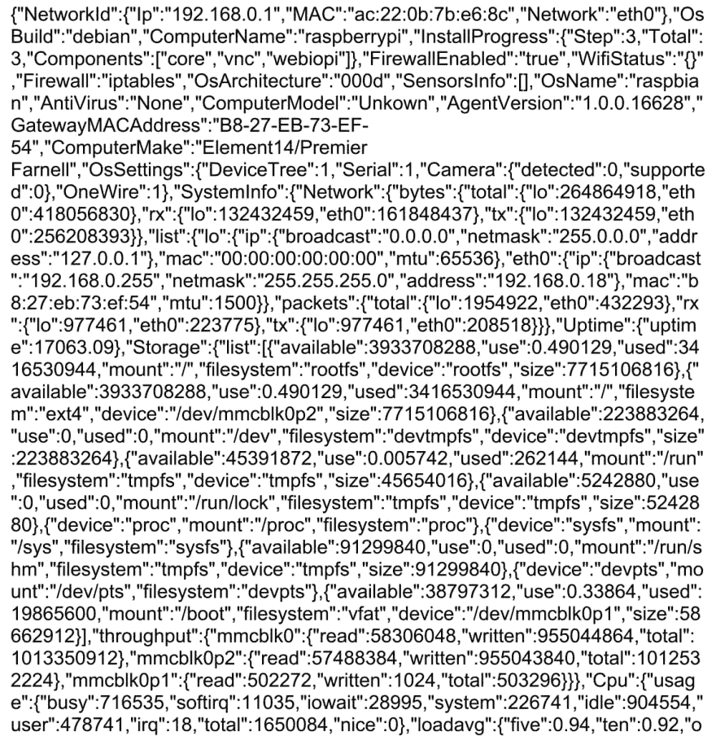](https://res.cloudinary.com/practicaldev/image/fetch/s--kaQPQdLC--/c_limit%2Cf_auto%2Cfl_progressive%2Cq_auto%2Cw_880/https://lh3.googleusercontent.com/Rw3muE779KjKUundGYWxs-JXJAkI9usNU1Nizp-1xVMRVHaRltDHpVYOX2F377S34winyLfTQPiS4oqmjJzWmlhWwcKlgLax8by3Db3CxzanYDfYjlI9jw3TL9cOMdC-1dGUu-OsT30)

但由于这是不可接受的，我们得到了 V2 升级。

[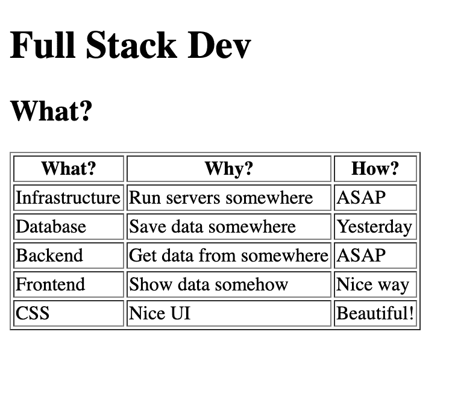](https://res.cloudinary.com/practicaldev/image/fetch/s--rRuVvQhr--/c_limit%2Cf_auto%2Cfl_progressive%2Cq_auto%2Cw_880/https://lh4.googleusercontent.com/wpo_4l2uByrpZaTepteTMpqiEtj8lx6ZkYTQSRSEta7GqxtqORPY7Rfm8vBX_RXyGAq1Fb7HjxEAXXpviuzFsQ4GosTkPAHBgeTBrL3SkfYWB-QyNKF09ehnGfyLoWVHShTxj8Gc_wg)

如你所见，这些信息实际上是可以阅读的，并且很容易发现信息。但仍然是一个丑陋的 HTML。这样做的好处是，我们可以看到为了得到一个完整的项目，我们需要学习什么。由于这对每个人都有一个好的概述很重要，我们将它与我最喜欢的全栈餐进行比较:汉堡(雅西和基希讷乌都有一些好地方可以吃，但这不在范围之内)！

让我们走出厨房，了解人们为什么喜欢满仓的人:

顾客想要什么？雇佣一个无所不能的自由职业者:基本上就是递送完整的汉堡。抱歉，全栈。
因此，他们能够创建基础架构并将其设置为安全的。
当需要高负载时，它们创建服务器并产生新的服务器。
这位全栈开发人员还能够创建和设计数据库。
之后，他们能够为我们的工具选择合适的包和库。
他们可以写后台。他们也可以做一点设计和前端。听起来像是一项艰苦的工作！但是今天我们有所有的工具去做它，也有学习它的材料。
让我们回到我们的目标:成为全栈开发者。

## 你认为现在有多少 Javascript 库？

尝试一个简单的猜测，测试一下你的估算能力也无妨。在心里定个数字就行了。可能是数百、数千或数百万？如今统计数字很容易找到。

[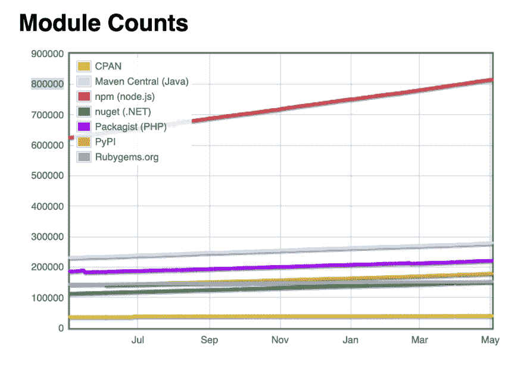](https://res.cloudinary.com/practicaldev/image/fetch/s--wAi9ePxu--/c_limit%2Cf_auto%2Cfl_progressive%2Cq_auto%2Cw_880/https://lh5.googleusercontent.com/BJ7zqCJykPLik_0kZ2ujKvtZPvpNmSGCTi5fBtb6az_mrSpa3oF9YLjv1pFndujpJMM3KD-jGFcSsqaMtbL5L5pIAC2zYMv3iSH5mu4IV1J2f5ZNQSboF9-j93siwFOGw1y-6ASq9mU)

我们将在 2019 年底达到 100 万个 npm 包。有大量的库可供选择。

[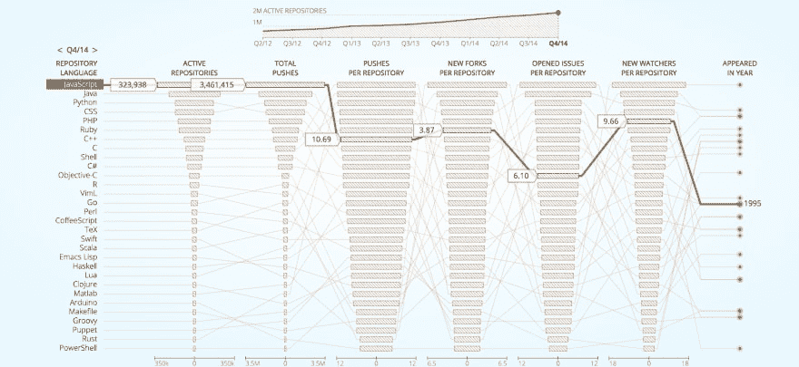](https://res.cloudinary.com/practicaldev/image/fetch/s--DhZ46-w9--/c_limit%2Cf_auto%2Cfl_progressive%2Cq_auto%2Cw_880/https://lh6.googleusercontent.com/2KOfcozNsZg3PC9W_JIgPrEidUhS2eN0EK7hMmdrwBY4fiJBpF_E_SZ7_2ycqsnkjqgClJB9xBrMCEfkS1wtp2W0AMIxu5UTj0RJ5UY27IY1BZujYI36AVmSFGWNyk_QgWwcB6YmBqE)

以及超过 32 万个 JS 活动存储库。所有这些都是所谓的 Javascript 疲劳背后的原因:可供选择的库和框架太多了。
又没有！不要！不要！Javascript 本身并不疲劳。当从这么多图书馆中选择时，我们开始厌倦了。

无数个小时来研究和阅读所有 Reddit、medium 和 dev.to 文章。如此多的选择要做，而仅仅 24 小时后我就要发送下一个项目评估。

我希望能够为我的下一个项目选择正确的产品，并且能够在生产环境中使用它们。

## 让我们从准备厨房开始吧！

我们需要下面基础设施中的各种工具。无服务器是一个很好的选择，但是在很多情况下，我们仍然需要一个服务器和更多的架构。

### Kubernetes

K8s 就像一个真正的厨房。你甚至有锁东西的机制来保证它们的安全。并且现在在 devops 中被广泛使用。

[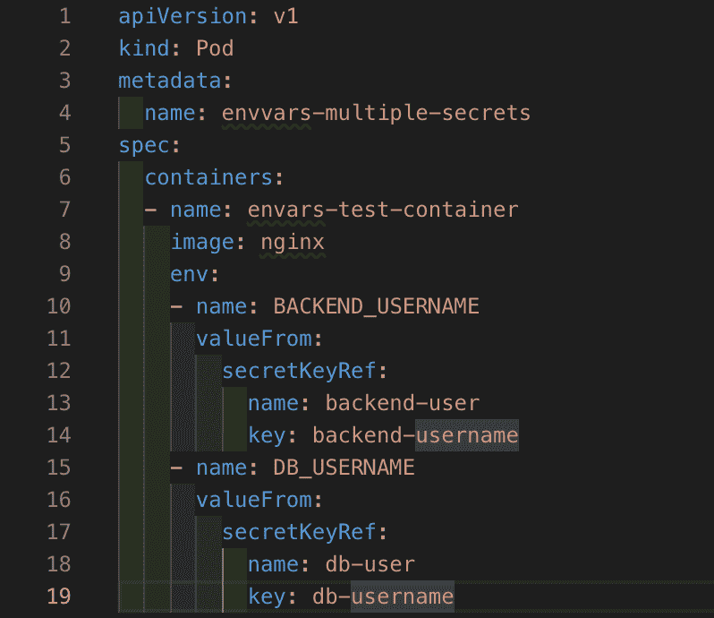](https://res.cloudinary.com/practicaldev/image/fetch/s--hQ9ThKcZ--/c_limit%2Cf_auto%2Cfl_progressive%2Cq_auto%2Cw_880/https://lh5.googleusercontent.com/0npziNZQWi2uBuR4Megdv6NJaSlIIT23E3qr4icUUIBC2nH4JPC5wk3tuhyCDFhyA_DP_S7_6Mq7XdeIlAhU0-Ur_7U6mHQI0ko5fRS6nF_bK0kXSeTKgTMvxPD-854IUi27LptVNBk)

使用 Kubernetes，您可以注入配置和秘密变量，并保持基础设施的安全。k8s 在 Google Cloud、Digital Ocean、Azure 和 AWS 上都有。

### 码头工人

让我们把它想象成烤肉或烤箱，以及厨房里制作汉堡所需的工具。Docker 是一个容器定义——基本上是一个你定义的 VM。
您有一个正在运行的数据库。噗:你有一个节点 js 后端运行。
当然，您必须编写 Node js 后端，但是在服务器上部署它比以往任何时候都容易。
数据库:mongo 或 Mysql。就看以后怎么选了。你的前端也是。

[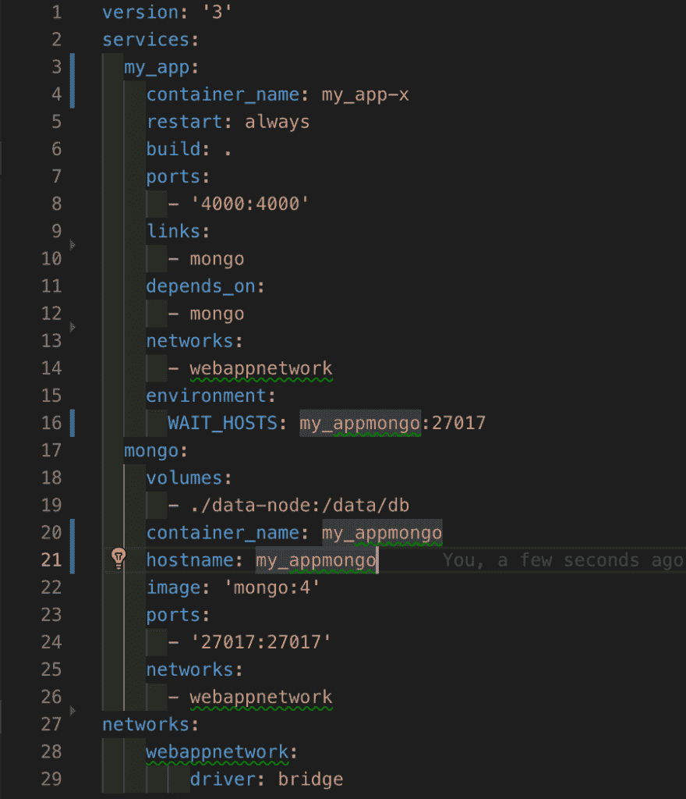](https://res.cloudinary.com/practicaldev/image/fetch/s--HI4AmnCh--/c_limit%2Cf_auto%2Cfl_progressive%2Cq_auto%2Cw_880/https://lh6.googleusercontent.com/U4JzLeXYn47Zs0lO9yL4bs7cRLDzC-aFPIWljT6oCp91QLvESU8D0LDZVSmseyX801mlssjOiVJ7HqdcGM55XWprKWaucsgOtgtOj5HxBGmTm4urcBDFxyOw0y_nKEpr48WWWjlIkdQ)

### 额外提示:在面试和编码挑战中使用 docker

你甚至可以为招聘的小测试或编码挑战这样做。我花了大约一个小时用 Mongo、Redis 和 Node Js 建立了一个 Docker 容器。很简单，直到变得复杂。
所以用 Node 来构建一个简单的例子。JS 和 mongo 我不得不使用脚本(来自 Github) WAIT_HOSTS。
基本上是等待一个数据库启动，然后启动 node js 容器。

## 但是...Javascript 在哪里？

嗯，我们需要厨房，这是准备一切的完美环境。现在我们有了基础设施、数据库和启动后端的方法，我们可以进入应用程序层了。

## 后端应该很容易

这是他们说的...

[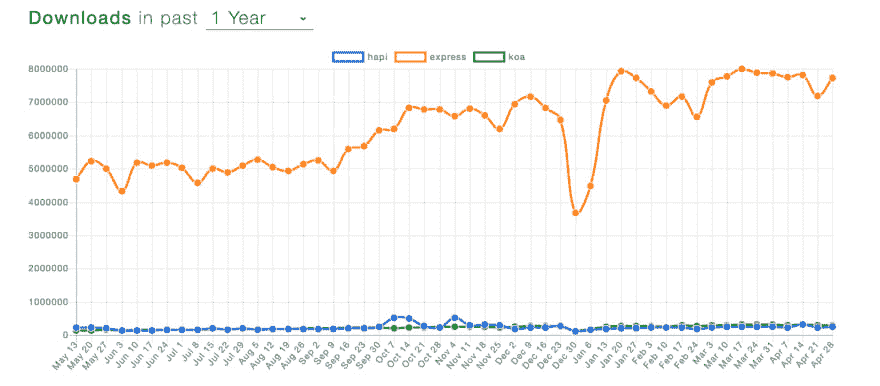](https://res.cloudinary.com/practicaldev/image/fetch/s--up2tXFEk--/c_limit%2Cf_auto%2Cfl_progressive%2Cq_auto%2Cw_880/https://lh4.googleusercontent.com/El0R-uJ2qUEOgsKXXXvdfZcJQWTQV0dm7Ds_BZHCiW2SF670rBo_Yl977XvaMG-ckk7xky0ISHdOzVyoZwUCo59NdZuaj5WkxJVNnHQbfNm46veTTPR2xt9fXmyFJ3DVTVSDr7HRwo4)

在 npm 趋势上，选择后端相当容易。Express 非常受欢迎，每天有 700 万次下载。它有中间件，您可以安装、导入并添加到您的应用程序中。
随大流的好处是你会发现很多例子。
所以你可以随大流或者选择别的。哈比神。JS 更多用于企业级 app。它有一个类似于中间件的插件系统。
最好的决定是什么？

## 选择框架上的 1 个以上的参数

我正在与 HAPI 的一个大客户合作，他有一个更大的 Rest API。在 HAPI 上开发东西比在 Express 上更容易。如果 API 更轻，需要的支持更少，我们可以选择 Express。如果你想要更多的异步等待模式，你可以选择 Koa。
顺便说一句，我曾经用 Async 来表达，它也能工作。

## 数据库和 ORM

[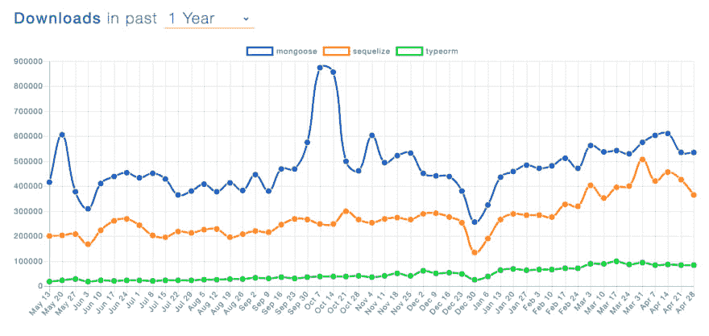](https://res.cloudinary.com/practicaldev/image/fetch/s--AYKm63nj--/c_limit%2Cf_auto%2Cfl_progressive%2Cq_auto%2Cw_880/https://lh6.googleusercontent.com/3rXEobZO_hIYHU88aiZGxfsD0zu6Wwryujs5bq1cXBBLntYsJU2MtJhx6dQ5L_BD3OI6KPRSOC6v5XUu9zbnDtA482vBVYY8KAETuTueKvyPo7bsvp2qU8Uu7LM48HFg0UtZnDFjC1I)

ORM(对象关系映射)或 ODM(用于文档)有助于简化数据库管理。Mongoose 是下载量最大的，但它只能在 Mongo 上使用。
Sequelize 是下载量第二大的软件，但它只适用于 SQL 数据库。
Type ORM 对两者都适用，但是是打字稿。

### 加分提示:面试用猫鼬！

客户最着急的时候我用了猫鼬。但是 6 个月或 12 个月后，他们希望在不编写新代码的情况下进行更多的跨表分析。最终，SQL 会对更多的人更好。如果你 100%确定你将使用 SQL go 进行 Sequelize。如果您想两者都用，请尝试 TypeORM，因为它涵盖了两者，并且可以在不更改代码的情况下简化迁移。在 JS 中使用 TypeORM 时，它的编码可能会有些慢，所以你必须学习一点 Decorator 和 Typescript。

## 什么是后端开发者？

我的朋友说有人害怕 CSS。

[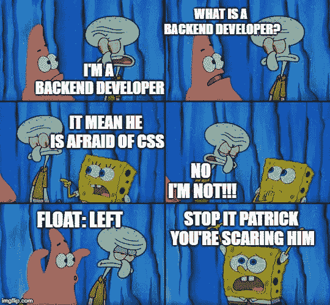](https://res.cloudinary.com/practicaldev/image/fetch/s--Zw385jSR--/c_limit%2Cf_auto%2Cfl_progressive%2Cq_auto%2Cw_880/https://lh6.googleusercontent.com/G0JbjvmZy40UmQlEQgQThhzZnYLq1jG3cx2IYAYabzR8pLJPDLsT2D5EHNruOp8QufFfnvtEJndQ7cqSku-igkZz5ojWLzdYzTH_kkBUOrJonS30U_plEHDxLsQ7V-X3wfqJSPFT7Lk)

或者讨厌它的人。无论哪种方式，你都不应该让感情影响你和 CSS。但是别担心，我们有合适的工具来处理这种感觉。

## 这里是前端！

JS 世界的每个人都在这个时候听说了 React。

[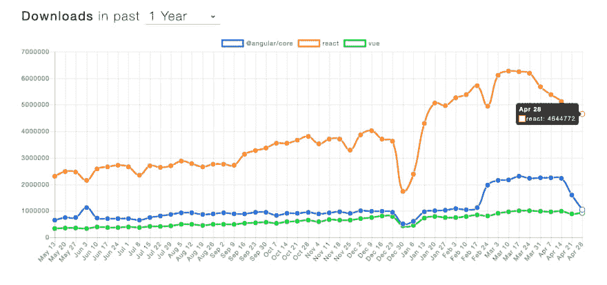](https://res.cloudinary.com/practicaldev/image/fetch/s--F6q2QFhF--/c_limit%2Cf_auto%2Cfl_progressive%2Cq_auto%2Cw_880/https://lh5.googleusercontent.com/YHH3frl0FOTDA_1peeR5HUYuNh1JHpj6Iy-9B6uyUZZrMPqqBcnymCKAab9ov32oItjtxVl0o7rQrOCQ7fQyXE2MT62sVST0shQwEckUQ1ck6Xyg2kByv4g0AxWWcEXClf-4JgAaykA)

React 大约有 500 万次下载。而 Vue 正在以每天 100 万次的下载量关闭 Angular。听起来 React 是一个简单的选择。

[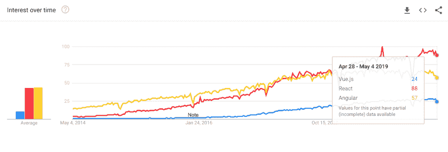](https://res.cloudinary.com/practicaldev/image/fetch/s--1DfDdnjG--/c_limit%2Cf_auto%2Cfl_progressive%2Cq_auto%2Cw_880/https://lh3.googleusercontent.com/sYypvFf-5b8YQR7U4cBioKvRocwTzE5LPb-2N17e6XQV1fhfcN3YNAWuQylowwVRJ1MfO87x-eYcaCsbrTO8QgyjJdsdPhM7Pd9HrPsL6AhB_k65cHwujSjFQbz8jj9uVpvTzMagq4U)

这是关于 Angular，React 和 Vue 的兴趣图。总的来说，对这三种技术的兴趣都有很大的增长。

## 棱角分明

Angular 是一个完整的厨房，它为你提供了所有必要的工具，让你可以制作你的网络应用程序。你可以用它做更多的汉堡，不推荐用于小项目。你还需要至少一个厨师经验丰富的开发商或建筑师来处理这个项目。

[棱角分明的厨师](https://lh4.googleusercontent.com/RWwN_lVUCciQsGALVOQW--_hwDH9CyE1CaUeXX-83ZtxFZLY_099eN_n9RFT3z2DXZwTTXCAlnP1AqFVZd0QMKLPHHBGScnBXHhT1vn8MWW2Di1yOWF2Im7GpS8c0MqjnJdmkGUie0Q)

您可以把 Angular 想象成一把瑞士军刀，它能够在 ng-cli 世界中做任何事情:创建项目、创建组件、测试它们、构建、开发。如果你的外包公司有多个客户，选择 Angular 是个不错的选择。这可以帮助您为整个团队提供相同的工具。
Angular 是一个框架，typescript 推荐，可以构建通用的 app 和大规模、功能丰富的 app。它使用 MVC，由 Google 维护。

[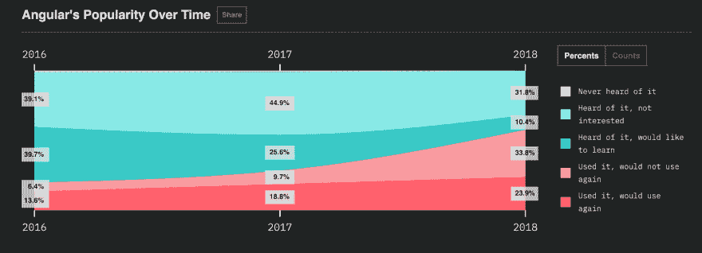](https://res.cloudinary.com/practicaldev/image/fetch/s--gvPd6dXd--/c_limit%2Cf_auto%2Cfl_progressive%2Cq_auto%2Cw_880/https://lh4.googleusercontent.com/S92mJCa3cudi8zGPRUnnuMS-v7Y1Q68UvTM3AC2uVjfrHO9X2h22pGkqRpGD9T2Lwve4joAEO3seWf-7d1efCZI_LIVOZtRHOkkHI7D70Vl7yeZ6Uj4e7r89Joj34V9lnaWtYb765_Y)

变得复杂会产生一些奇怪的统计数据。几乎 35%使用过 Angular 的用户表示不会再使用它。

## 做出反应

React 类似于专业烤箱。你可以用它来烹饪食物，但是你需要更多的工具来准备。所以基本上你需要其他的外部工具和库:用于构建的巴别塔，JSX，像 redux 这样的路由器。

[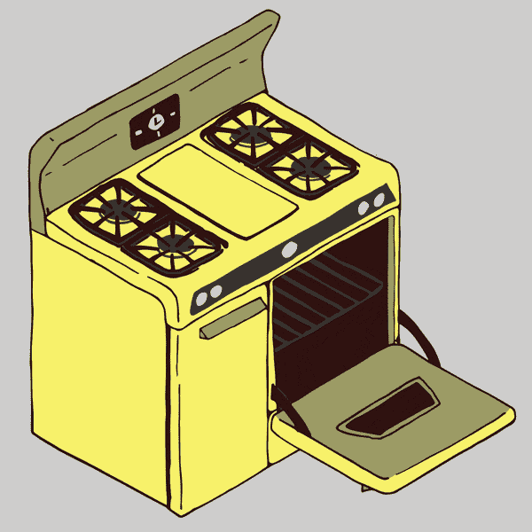](https://res.cloudinary.com/practicaldev/image/fetch/s--fxQeX4np--/c_limit%2Cf_auto%2Cfl_progressive%2Cq_auto%2Cw_880/https://lh3.googleusercontent.com/eOEsEwW7YbqtcFl8aHiJFaNqUSihRFNLyTMFZw92qzwI9-jdQdcZq_FNHknOr4pwUSo2G4HIdHnvk5_kVQvrifnMn07ue5oB47Vqt4pO6awulMPSBszGKr--2y5FqEd_kOk93XUDBHA)

React 背后的想法是让一切都在 Javascript 中。你可以用它来创建 SPA 或移动应用。它比 Angular 更容易，并使用虚拟 DOM 和推荐的 JSX。脸书保持着反应。

[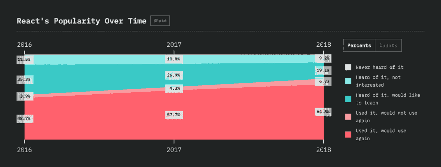](https://res.cloudinary.com/practicaldev/image/fetch/s--NMDUzPBX--/c_limit%2Cf_auto%2Cfl_progressive%2Cq_auto%2Cw_880/https://lh3.googleusercontent.com/mEYhDkdIM8HORtFAgmavgzXB2D-1x3wOGqUzMj4ORnwZNrpvNe3CCIQ_wrQx4PzWSOMBGn-J4IgD0RRj6XNoDyjC-qCGRY1RihtG22Bnxbu4McZXnMjTlnn7QpQwweMDs1xeRvJypKw)

在 React world 上的留存性要好得多:只有 7%的用户在使用后不会再使用。真好！如果你在一家生产单一产品的公司工作，需要经常更新用户界面，React 是最好的选择。你还需要一些高级开发经验。

## 视图

再看另外两个框架，很容易比较 Vue。有微波炉的 JS。比较好用，学习曲线小。Vue 是一台微波炉，它能让你快速启动并运行，让你的烹饪生活变得高效而简单。
你只需要汉堡的配料，它会很快煮熟。但是记住要按照正确的顺序分别烹饪所有的东西。
如果我是一家拥有年轻开发团队和严格期限的创业公司，我喜欢 Vue.js

[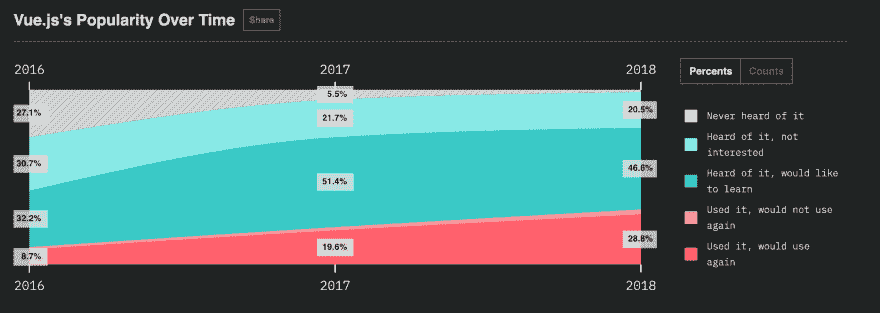](https://res.cloudinary.com/practicaldev/image/fetch/s--_hPdDMD1--/c_limit%2Cf_auto%2Cfl_progressive%2Cq_auto%2Cw_880/https://lh4.googleusercontent.com/p_v3iTrNG-l7vahTW4cxrJO3wd5cao2g3H1FT5Z1Gb5wSrSVUkI0eUQUEwt14iBmCVooPLX6AkHxz9XRP2YlVDvTBrrQjL1RP36CUhI2ckysV50NWLXDAwN4xA91oxEZyziiHQhdI14)

随着时间的推移，Vue.js 越来越受欢迎，保留率非常高，不到 1%的人不会再次使用它。

[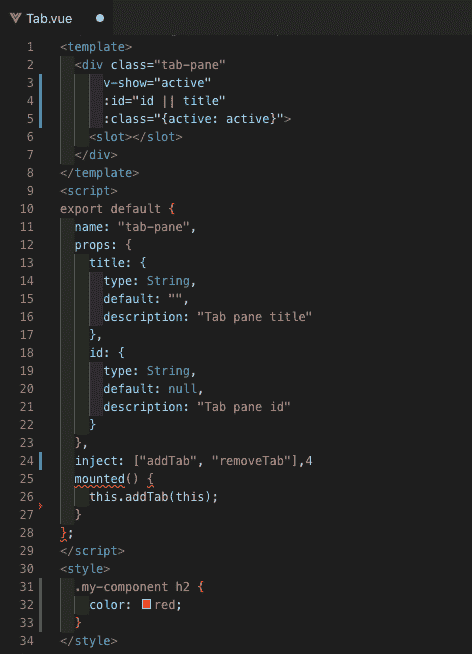](https://res.cloudinary.com/practicaldev/image/fetch/s--uXFODk7R--/c_limit%2Cf_auto%2Cfl_progressive%2Cq_auto%2Cw_880/https://lh5.googleusercontent.com/DYKvyRcPIGASBXkF1yCyBLZ5mrUY2YvNFAe4KLf5cPwQckdF63H6yD14Qlxr8I4MeKsuudaw03ksRWgNMETzMukVxMfaxdaEXzAhEy1ycNPxfCHsCRFi60tWGovN4Sw0d82RIclfGug)

向组件问好！您需要的只是样式、模板和脚本。就像 HTML 一样。这让 Vue 变得如此简单。

[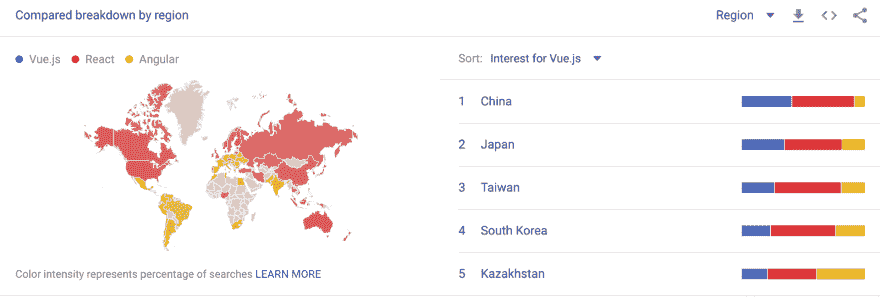](https://res.cloudinary.com/practicaldev/image/fetch/s--eo9EPSQg--/c_limit%2Cf_auto%2Cfl_progressive%2Cq_auto%2Cw_880/https://lh4.googleusercontent.com/tsdNt68rMra59vE8uOTzNd6O9x5MCTMscoO5lLR0Xjph8yU7UresaG3Ps9thQw__sfA2od0ClZMI5ARxrzDmMutEP2kL6igw21wPy1dXVlREM4qeplPWMIsyzIyPyb1gPPxqeKmmD4I)

关于 Vue 最有趣的是亚洲市场，尤其是中国对它非常感兴趣。真正的原因可能是 Angular 和 React 依赖于谷歌和脸书这样的美国巨头。Vue.js 是这 3 个顶级前端库之间唯一维护的真正开源。它们都是授权的开源软件。

## 工资差异

基于 frontend tech 的一些薪资见解。看起来 React 也在它上面，而且利润更高。

[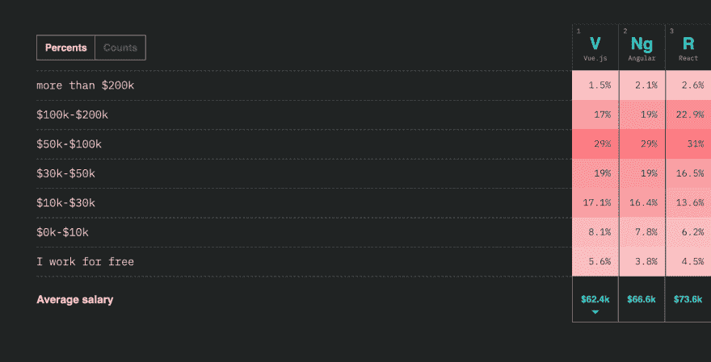](https://res.cloudinary.com/practicaldev/image/fetch/s--fmMD1Xzm--/c_limit%2Cf_auto%2Cfl_progressive%2Cq_auto%2Cw_880/https://lh6.googleusercontent.com/fPWvdWgCAXNslywT1gXF7E_yNGajUi_9Bf5SY6v6fbd5J2QOPEV0XagGieJMLFGoWsiLJYJLrv3FbXJiBgTzhD8FBqBVAHVi-fit7JGSk6Is0Sbxjh9fJUTeKqWMGGORzS-aJkZ0UU4)

如果你有正确的全栈技能，自由职业者的全栈收入会增长得更高。

Linkedin 有 12 万份工作，根据趋势，我会选择 React、Express、布尔玛和 Docker 的 K8S。但是如果我需要一个创业项目 Vue。JS(11K Linkedin jobs)是更好的选择，因为它的学习曲线更小。
如果我想在企业和外包领域发展，我会选择 Angular(Linkedin 上的 96K 份工作),以便能够在更大的团队中工作。

### 而我的 CSS 情绪呢？

你可以选择任何一个
Bootstrap，68kb/12kb 大小，49 个元素，
布尔玛，73kb/10kb 大小，53 个元素
基础，30kb/7kb，56 个元素
UIKit，33kb/6kb，51 个元素
从所有这些中，我会选择 Bulma，但是如果你想快速开始一个 CSS 框架，你有很多种选择。使用布尔玛的主要优势在于其盒子模型完全基于 Flexbox。(是的！不再有 CSS 浮动和百分比！)布尔玛声称其主要特点是:100%响应

[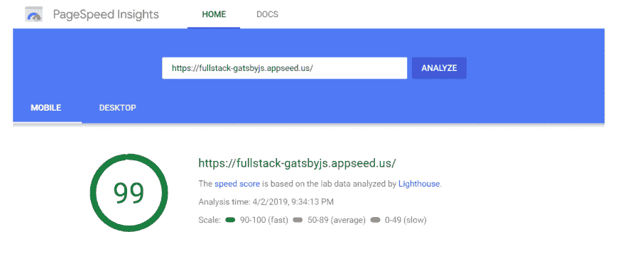](https://res.cloudinary.com/practicaldev/image/fetch/s--7lfR2HUy--/c_limit%2Cf_auto%2Cfl_progressive%2Cq_auto%2Cw_880/https://lh3.googleusercontent.com/YsW1W_cFEwCes9G2FDsvyBrt4xy-V0qYikFQWyT-uPl8IRpoKrnU-B-u4I5nCPx4YJSulprNCqp4yAoEq7Drtk9hOicQPjoRyHKyklebPD1FmwoQS2PTlqAEqcRKStPSxIfbrDvmpE0)

布尔玛的主要优势是它的反应灵敏。它得到了 99 分，而 bootstrap 得到了 90 分。这项功能胜过下载统计。

还记得我们在文章开头提到的普通 JSON 和 HTML 吗？
附加其中一个框架，获得更好的表示，简直易如反掌。

### 每个项目都是一个完整的堆栈

现在每个项目都至少需要少量的技能。
记住，通过做一些简单的事情来选择一个库或框架是很容易的:
检查 [google trends](https://trends.google.com/trends/explore)
检查 [npm trends](https://www.npmtrends.com/)
Github 项目页面，查看打开的问题、解决的问题、解决的速度
在 Twitter 上关注库的创建者，了解他们何时发布新的东西
免费试用准备好的[编码库](https://www.appseed.us/)

### 开源

我是一名构建开源全栈示例的自由开发人员。你可以把它想象成汉堡的食谱，但不完全是这样。基本上脚手架在反应，Vue，角，节点和烧瓶。您可以下载并

### 故事:陶艺课

当我想学东西的时候，我总是会想起这个故事。在一堂陶艺课上，老师把全班分成两部分。于是老师告诉右边的学生，谁创造的陶器最多，谁就赢。

然后老师转向左边的班级，告诉他们谁能创造出最漂亮的陶瓷，谁就能赢得这个班级。一周后，获胜者被选出。

### 你认为他来自班级的哪一边？

是注重数量的还是注重质量的？答案实际上非常误导人:那些为数量而建造的人创造了最美丽的陶器。

### 为什么会这样？

左边的学生拖拖拉拉，每天只创作一件陶瓷作品，花了更多的时间在计划上。右边的学生，数量一，更专注于做。所以在一天结束时，他们创作了 5-6 件作品。他们失败了很多，也学到了很多。一周结束时，他们体验了 30 件陶瓷作品，有很多可供选择。练习最多的人获胜。因此，请记住，每次你想学习更多知识时，都要尽可能多地去构建。到 2019 年底，你会比那些只会拖延的人强 10 倍。

## 结束

以上内容全部在 2019 年 5 月 11 日 Frontend Track[code camp Chisinau](https://codecamp.ro/chisinau)登台。公众很惊讶，我得到了积极的反馈来改进内容。
从这些了不起的人那里获得了一些灵感:

1.  安德烈·尼戈瓦的[篇文章](https://medium.com/zerotomastery/tech-trends-showdown-react-vs-angular-vs-vue-61ffaf1d8706)
2.  UI 是全栈[呈现](https://www.youtube.com/watch?v=0c9OC9NBsro)
3.  [JS](https://stateofjs.com/) 的状态
4.  Octoverse GitHub [统计数据](https://octoverse.github.com/)
5.  Linkedin [乔布斯](https://www.linkedin.com/jobs/search/)

这篇文章最初发表在 [Appseed.us 博客](https://blog.appseed.us/use-full-stack-to-increase-your-income/)上。