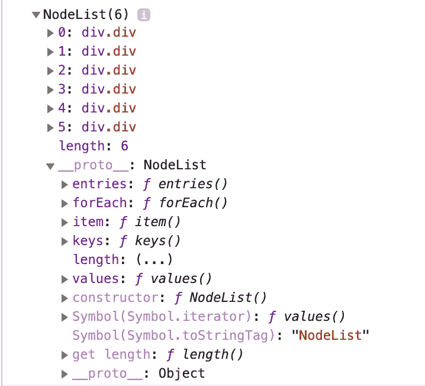

# NodeList 是数组吗？

> 原文：<https://dev.to/nabeelah/is-nodelist-an-array-36p3>

当我开始学习 Javascript 时，这是困扰我的众多问题之一。我可以在 NodeList 上使用. forEach()循环，但是不能使用其他数组方法，比如。map()，。过滤器()等。有什么大不了的？

让我们来看看这段代码。

```
<div class="divs">
    <div class="div"></div>
    <div class="div"></div>
    <div class="div"></div>
    <div class="div"></div>
    <div class="div"></div>
    <div class="div"></div>
</div>

<script>
const divs = document.querySelectorAll('.div');
console.log(divs);
</script> 
```

Enter fullscreen mode Exit fullscreen mode

为了获得所有具有“div”类的 div，我使用了 querySelectorAll()的 document 方法。反过来，这将返回一个类似数组的“div”列表，以及一些数组属性，例如长度，如下图所示。

[](https://res.cloudinary.com/practicaldev/image/fetch/s--_kXwsZyi--/c_limit%2Cf_auto%2Cfl_progressive%2Cq_auto%2Cw_880/https://thepracticaldev.s3.amazonaws.com/i/il4zanqwd74aaf40o9fo.png)

所以基本上，当我尝试运行数组方法时，为什么它会给出下面的错误。map()？

```
const individualDiv = divs.map(div => div);
console.log(individualDiv); 
```

Enter fullscreen mode Exit fullscreen mode

[](https://res.cloudinary.com/practicaldev/image/fetch/s--Q36v0Q0C--/c_limit%2Cf_auto%2Cfl_progressive%2Cq_auto%2Cw_880/https://thepracticaldev.s3.amazonaws.com/i/95pm5nsz6tc91q727m1x.png)

这是因为 NodeList 的外观和行为可能像数组，但它不能访问所有的数组属性和方法。

为了利用数组属性和方法，我们需要将其转换为数组。一种方法是使用 Array.from()方法。

```
const divs = document.querySelectorAll('.div');
let divArr = Array.from(divs); 
```

Enter fullscreen mode Exit fullscreen mode

如果您喜欢 ES6 方法，spread 操作符是将其转换为数组的一种非常简单的方法。

```
let divArr = [...document.querySelectorAll('.div')] 
```

Enter fullscreen mode Exit fullscreen mode

瞧...数组方法适用于以上两种方法中的任何一种。如果您想更深入地研究这个主题， [MDN 文档](https://developer.mozilla.org/en-US/docs/Web/API/NodeList)是一个很好的起点🙂。