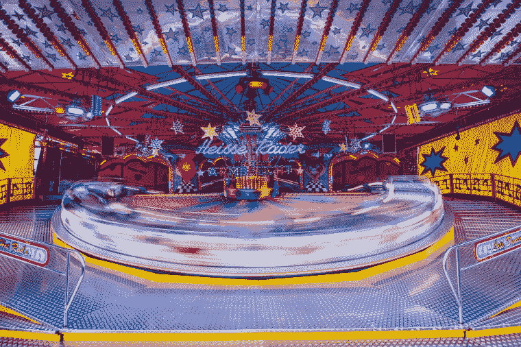
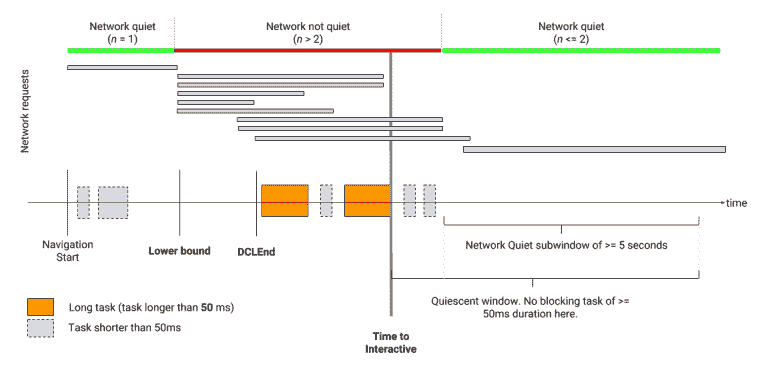
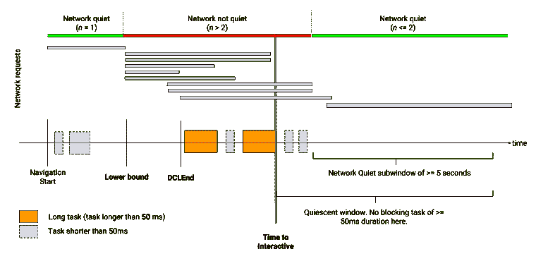

# 测量与 TTI 的交互性:(持续)交互的时间

> 原文：<https://dev.to/borisschapira/measuring-interactivity-with-tti-time-to-consistently-interactive-460l>

当我们谈论 web 性能测量时，我们实际上试图确定的是用户能够有效实现其目标的时刻。这意味着用户可以查阅他们正在寻找的内容和/或以令人满意的方式与页面进行交互。一些指标认可浏览器的渲染操作，另一些指标通过录制视频来衡量显示进度。然而，一个巨大的谜团仍然存在:如何恰当地度量交互性。

几年来，谷歌一直在推行一个模糊的衡量标准:**互动时间**。这是什么意思？我们来定义一下，解释一下怎么用，什么时候用(或者不用)。

<figure>

<figcaption>Measuring interactivity is like getting on a moving ride. When can we consider that the carousel is slow enough to consider that we can jump on it? There’s no precise answer.</figcaption>

</figure>

## TL；速度三角形定位法(dead reckoning)

对于网络
性能专家来说，交互性的测量是一个重大的挑战。尤其是合成监控解决方案供应商，他们发现
在没有用户输入的情况下很难提供可计算的指标。

谷歌的互动时间是一项复杂的措施，旨在通过监控 JS 主线程的活动和网络来确定互动的理想条件。这对于确定[一个你确信互动将会无缝的时间](#how-to-use-the-tti)非常有效。

然而，TTI 也是一个需要理解和利用的复杂指标，即[并不衡量大多数人认为它衡量的](#disambiguation)，即
页面变得可交互所需的时间。

真实用户监控(RUM)仍然是捕捉用户行为的唯一方式，即使如此，
[我们仍然没有一个单一的 KPI](#alternatives) ，它只是简单地
描述用户行为和
页面的交互性之间的关系。

* * *

## 寻求新的度量

### 我们在努力测量什么？

访问网页是一种体验，web performance world 通常将其描述为 4 个时刻:

1.  用户确认装载已经开始。
2.  用户面前有足够的信息让他们认为可以与页面交互。
3.  用户可以与页面交互(这个特定时刻取决于交互的类型)。
4.  用户与页面的交互轻松而直观，没有延迟和停顿。

几个信号给用户指示加载已经开始:url 和标题改变，浏览器可能动画显示标签和/或图标，第一个非空白像素出现，然后页面的其余部分…

[速度指数](https://blog.dareboost.com/en/2018/02/speed-index-web-performance/)和[第一幅令人满意的画](https://www.w3.org/TR/paint-timing/#first-contentful-paint)很好地展示了参观者的视觉感受。它们有助于理解页面的感知负载。它们有局限性，人类通过视频或电影可以一眼识别出来，因为它们的算法与显示的内容直接相关。

然而，当谈到衡量交互性时——第 3 点和第 4 点——事情变得更难了。事实上，我们并不知道如何去衡量它。我们唯一知道如何做好的事情是收集信息，让我们推断出这些特定的时刻。

例如，Akamai 多年来一直在寻找衡量用户活动的新方法。他们依靠菲利普·泰利斯创建的回旋镖图书馆。 [Philip 来到 We Love Speed 2018](https://www.welovespeed.com/en/2018/line-up/#ux-and-performance-metrics-that-matters) 展示回飞棒团队收集的新用户体验指标，以衡量页面响应度:愤怒点击、错过点击、死亡点击和光标丢弃。通过分析这些数据的分布情况，我们可以大致推断出用户期望页面或特定组件在什么时候是交互式的。

<figure>

<figcaption>There’s a clear linear correlation between rage clicks and 1.2 to 1.5× the time to Visually Ready (when the page would look to the user like they could interact with it – [see the full definition on Boomerang documentation](https://akamai.github.io/boomerang/BOOMR.plugins.Continuity.html#toc9__anchor)).</figcaption>

</figure>

这种类型的关联需要从真实用户那里收集大量数据，要么通过像 Boomerang 这样的 JavaScript 库，要么通过像 Chrome UX 报告这样的浏览器内 RUM。这些数据只能在有大量访问者的生产环境中收集。

在这种环境下测试优化是有风险的。如果没有事先测试，在生产环境中部署可能会带来倒退/减速，并损害您的业务。此外，您必须等待收集足够大的数据量，这将很难评估，因为 RUM 数据不太容易分析。

综合监控解决方案可以在所有环境中执行精确的性能测量，同时控制测试环境。如果它们能提供交互性指标，那就更有用了。

但是由于他们不涉及真正的用户，他们被迫参与恶作剧…

### 让我们介绍…时间到了(一致地)互动

***注***

*虽然有几种定义，但我们将重点介绍 Google 通过他们的工具和网站提出的定义。*

交互性可以从两个方面来考虑:要么作为两种状态(非交互和交互)之间的切换，要么作为一个连续体。知道一个页面何时第一次变得可交互是很有趣的，但是如果界面没有快速响应，UX 将会严重退化。这里的“交互性”指的是页面是交互式的，以及交互可以以令人满意的方式发生。

**交互时间**，以前被称为“持续交互时间”，是一个实验性的综合指标，试图测量您的 web 应用程序何时同时具有可视化渲染和交互功能。

<figure>

<figcaption>As moving things are difficult to grasp, we often rely on approximations and models.</figcaption>

</figure>

TTI 是一种不依赖于真实用户交互的交互性指标。相反，该算法通过考虑令人满意的交互只能在特定条件下发生来进行近似，并专注于确定这些条件的普遍性。

为了确定 TTI，算法沿着时间线前进，执行检查，并为 TTI 重新定义其候选值，直到找到满足所有条件的时刻。首先，当用户觉得页面的主要内容可见时，它选择作为下限。这里有几个度量标准:交互解释器的时间使用了第一个有意义的画图，但是你也可以使用第一个有内容的画图，就像网页测试使用的一样。

然后，TTI 算法验证浏览器能够处理交互。由于许多用户输入由客户端 JavaScript 处理，在单线程环境中工作，算法必须确保当前没有持久的 JavaScript 任务占用该线程，从而阻止 JS 立即处理用户输入。[对于 W3C](https://github.com/w3c/longtasks) ，如果一个任务持续的时间超过 50 毫秒，那么这个任务就是“长的”([长任务](https://github.com/w3c/longtasks))。TTI 将观察 JS 任务，并在没有长时间任务的情况下等待 5 秒钟。

然而，如果处理交互所需的 JS 代码还没有下载，所有这些都是无用的。交互时间算法将使用一个信号，而不是仔细观察每个 HTTP 响应来查看 JavaScript 资源是否被下载:它将等待，直到它观察到至少 5 秒钟的时间段，在此期间它从未看到并行下载超过 2 个资源(所有类型的组合)。

如果其中一个条件(长任务和网络)不满足，则该算法向前移动其 TTI 的候选值，并继续观察以找到另一个长任务和在最后观察到的长任务之后的另一个 5 秒网络安静窗口。此时，TTI 的候选值对应于最后观察到的长任务的结束。

但是我们还没完！最后，在浏览器完成对文档的解析之前，该算法不会认为页面是交互的，因此，如果 DOMContentLoadedEnd 事件发生在我们的 TTI 候选值之后，则该时刻被选为交互时间的最终值。

<figure>

<figcaption>Schematic diagram of the definition, in the "[Time To Interactive Explainer](https://github.com/WICG/time-to-interactive#definition)".</figcaption>

</figure>

如何使用 TTI？

当你开始从显示的角度来看性能时，你会很快发现视觉上的完整，也就是页面可视区域的整个渲染完成的时刻。

互动时间就像是视觉上的完成:一个标志着事情结束的时间标志。主要问题是“什么？”。蒂姆·德莱赛找到了最恰当的方式来定义这一点:TTI 是一个“不允许超越这一点”的指标，这是你想要监控和优化的东西，或者至少在没有充分理由的情况下不会恶化。

事实上，TTI 是通过间接观察 CPU(通过 JS 长任务)和网络活动来计算的。如果 TTI 增加，这肯定意味着在页面加载期间，JS Long 任务发生得比以前晚，知道原因很重要。新的长任务推出了吗？是一个以前已知的任务被一段新的代码推了回来？这是新实现的第三方依赖的结果吗？

正如我们将在本文后面演示的那样，这个长任务不一定对您的 UX 有害(例如，如果您[推迟您的脚本](https://blog.dareboost.com/en/2017/12/defer-scripts-to-speed-up-rendering/)，那么它们产生的长任务将在稍后发生)，但是您肯定可以优化以确保它们不会发生(例如，您可以将复杂的 JavaScript 算法委托给 [Web Workers](https://developer.mozilla.org/en-US/docs/Web/API/Web_Workers_API/Using_web_workers) ，使它们在后台任务中运行，因此不会占用 JavaScript 主线程)。

## 关于时间互动的常见误解

### 交互时间不是页面开始交互之前的时间

“互动时间”是一个非常模糊的名字。

甚至在 Lighthouse 文档中，你也可以读到简短的误导性定义，如:

> 互动时间(TTI)指标衡量页面变成互动状态所需的时间。

幸运的是，这句话后面是“交互”在这里的定义，但是对于不想继续阅读的人来说，伤害已经造成了。

事实上，交互时间并不是衡量一个页面变得可交互需要多长时间，而是衡量在一定条件下，一个交互能够以令人满意的方式发生需要多长时间，至少 5 秒。这就是为什么这个指标以前被称为持续互动的时间。

我们完全可以有一个非常快速和可用的页面，然而，有一个巨大的 TTI。要做到这一点，您所需要的就是让页面执行尽可能短时间的长任务，其速度足以中断 TTI 观察窗口。[比如这个页面](https://tests.boris.schapira.dev/longtask/)，每 2 秒执行一个 51 毫秒的任务，总共 20 秒，TTI 超过 19 秒。

尽管如此，该页面的完美互动比 TTI 建议的要快得多。

### 在 TTI 算法中，“网络安静”子窗口只是一个信号

TTI 总是链接到最后一个 JS 长任务。“安静网络”试探法只是一个信号。我见过有人问他们是否需要改进他们的瀑布，以人工创建包含少于两个同时请求的瀑布。如果这些要求都不涉及长时间的任务，你可以放松，你的 TTI 不会受到影响。

然而，由于这只是一个信号，它根本不能保证处理交互所需的 JS 代码是可用的。你可以有很好的时间来进行交互，而一个页面根本不像用户所期望的那样是交互的。

### 谷歌的 TTI 不是所有人的

谷歌每推出一个新概念，都有强大的市场需求。但是要注意，互动的时间不是一个标准！

Akamai 的 Boomerang 是最著名的真实用户监控解决方案之一，它有自己的交互时间定义，这与 Google 的定义有很大不同。他们使用不同的信号，如帧速率、长任务、页面繁忙(通过`setInterval`)和延迟的用户交互。即使他们保持 W3C 50ms 毫秒长的任务定义，他们的静止窗口也只有 500 毫秒长(而不是 5 秒)，这减轻了 tti 由于孤立的任务而被延长的情况。

在我的研究过程中，我还发现一些合成监控解决方案声称支持交互时间指标，但与[加载时间](https://blog.dareboost.com/en/2017/11/load-time-is-out/)一样，你应该始终验证它们的定义，因为一些解决方案毫不犹豫地在与谷歌的 TTI 毫无关系的其他指标(如[交互事件](https://developer.mozilla.org/en-US/docs/Web/API/PerformanceNavigationTiming/domInteractive))上打上“TTI”的标签。

### 互动的时间不易稳定

不可预测的指标很难理解。在研究这篇文章的过程中，我们收集了一些证据，这些证据表明 TTI 是一个很难稳定的复杂指标。

> 我试过了，这是一个太不稳定的衡量维基百科的标准。这里有一个例子:[https://phabricator.wikimedia.org/T176369](https://phabricator.wikimedia.org/T176369)
> T3】彼得·海登斯科格，维基媒体基金会的软件工程师(承包商)

### TTI 上反馈很少

关于 TTI 在野外的相关性的数据很少，而且没有一个数据允许我们说它比现有的指标更有趣。

基于 Deepanjan Roy 的第一份研究([一份 28 个网站的评分表](https://docs.google.com/spreadsheets/d/14xVEkk0yUV9kCaPERLzUpB057hjdV66KP24AyExayh0/edit#gid=0)),互动时间后来被蒂姆·德莱赛认证为[，但并不成功。老实说，这些相关性很难获得:正如我们从 Tim 的分析中可以看到的那样，更稳定的指标(如野生环境中的 FCP 与实验室中的)的相关性也不好。](https://docs.google.com/document/d/1g0J5JIcICFyXYM6ifBF6vNd_qUPIfpf6YAfFHE1TYRE/edit#heading=h.g1vxo77py7yu)

我找到了 2017 年的[一项研究，由 Nic Jansma](https://www.slideshare.net/nicjansma/reliably-measuring-responsiveness) ，[撰写，Addy Osmani](https://addyosmani.com/blog/usability/) 引用，他在其中解释说，改善 TTI 对真实用例中的转换率有真正的影响，但幻灯片没有提供数据和实验条件。

在线可用的其他用例通常包括从登录页面中删除所有 JavaScript，这是一个相当局部的举动，而其他解决方案(如下载 JS 并在服务工作器中进行字节缓存以供将来使用)本来是可以选择的。不要误解我的意思，我完全支持将 JavaScript 减少到最小的份额，但绝不会以牺牲用户旅程为代价。

Time To Interactive 正在进入一个已经提供多种指标的 Web 性能领域，其中一些指标更容易理解和评论。我读到的大多数关于交互时间的用例都没有阐明现有的度量标准是否足以限定这种情况。大多数网站所有者只监控和报告 3 或 4 个 web 性能指标。在我们让他们放弃其中一个来讨论这个问题之前，我认为让他们对各自的相关性有一个广泛的了解是很重要的。

### 长任务“50 毫秒”定义产生阈值效应

TTI 阈值具有提高对绩效预算重要性的认识的优点。TTI 是一种[性能预算](https://blog.dareboost.com/en/2015/10/performance-budget/):“主线程活动必须保持在 50 毫秒的预算之内”。

然而，任何阈值的定义都有影响。

让我们来看一个非常简单的博客文章页面，并用 WebPageTest 在桌面上测试它。该页面在视觉上已经准备好，并且在 1.2 秒内完全互动。在那一刻和几秒钟内，访问者可以自由阅读和滚动。大约 3.5 秒，reCaptcha 脚本执行创建了一个 150 毫秒长的任务(红色，在底部栏上)，将时间推进到交互。访客会察觉到这种延迟吗？顺便问一下，访问者需要多长时间才能感觉到延迟？

根据[RAIL 性能模型](https://developers.google.com/web/fundamentals/performance/rail)(响应、动画、空闲、负载)，用户对性能延迟的感知取决于延迟的性质。大约 100 毫秒后会感觉到交互延迟。根据米勒&卡德等人的研究，该值与[尼尔森 1993 年的报告一致。](https://www.nngroup.com/articles/response-times-3-important-limits/)

如果感觉到的延迟是 100 毫秒，为什么要考虑 50 毫秒的 JS 任务呢？解释在于长任务 API 规范:

> RAIL 性能模型建议应用程序应该在 100 毫秒内响应用户输入(对于触摸移动和滚动，在 16 毫秒内)。我们使用这个 API 的目标是显示关于可能阻止应用程序达到这些目标的任务的通知。我们表面的任务需要 50 毫秒或更长时间。没有这些任务的网站应该在 100 毫秒内响应用户输入:当接收到用户输入时，它将花费不到 50 毫秒来完成正在执行的任务，并且不到 50 毫秒来执行任务以对这样的用户输入做出反应。
> <cite>[龙任务 API 1](https://w3c.github.io/longtasks/#intro)</cite>

换句话说:处理交互既要求浏览器能够在不忙的情况下处理用户输入(交互性)，又要求能够足够快地处理由用户动作触发的潜在 JS 代码执行(响应性)。由于我们不知道浏览器处理触发处理的实际响应时间，我们认为这个时间应该小于 50 毫秒。这就给浏览器留出了 50 毫秒的时间来对输入做出反应。

但实际上，所有的浏览器和浏览环境都是不同的，有许多因素会影响浏览器处理任务的时间。

## 交互性测量:TTI 够了吗？

### TTI 作为新的参考指标？

创建和推广一个指标是一种行为，特别是当这个指标被定义为交互性的参考指标时:当被 Google 推出时，这个指标不仅评估了网络，还塑造了它。SEO/SEM 专家对他们的客户高度重视，公司在排名中使用它。很快，每个人都认为这个指标是一个参考，没有质疑它的基本原理。

然而，它的许多限制，与其基于许多近似的定义一致，使 TTI 成为一个相当二进制的度量。要么 TTI 很低，你可以很高兴，因为你绝对肯定网页提供了优质互动的最佳条件；或者不是，您需要进一步调查以了解发生了什么。一些任务可能会延迟 TTI 而不打扰最终用户，但页面也可能无法使用。在没有进一步调查的情况下，你根本没有办法区分这两种可能性。

<figure>

<figcaption>A bad TTI is a sign that not all conditions are perfect for interactivity. This does not mean that interactions will necessarily be degraded. More investigation is always needed.</figcaption>

</figure>

### 一个里程碑多一个连续体的评价

互动的时间是互动的视觉完整是要显示:一个最后的里程碑。我们所缺少的是“交互速度指数”,其中每个长任务将根据其持续时间和发生时间进行加权，并与其他指标(例如渲染指标)相关联，以推断用户的沮丧程度。

在前面提到的研究中，Nic Jansma 观察了长任务持续时间的分布，发现了与转换的相关性。我希望今后几年我们将在这个问题上取得进展。

<figure>

<figcaption>Nic’s study did not observe a decrease in conversion as long as the First Page Long Tasks were shorter than – not 50ms – but 100ms. Isn’t that interesting?</figcaption>

</figure>

与此同时，还存在许多关于交互性的其他指标，主要是在 RUM 中，在那里可以监控真实的用户活动。例如，我认为[第一次输入延迟](https://developers.google.com/web/updates/2018/05/first-input-delay)的分布是一个非常相关的不言自明的信息，但这将是另一篇博文的内容。

请记住:如果您需要了解您的 JavaScript 代码在合成监控中发生了什么，您仍然可以使用定制计时来部署完整的工具。这是掌握对您的业务至关重要的东西的最佳方式。

* * *

## 更多关于互动性和互动的时间:

### 一抹考古

*   [1993] " [响应时间:3 个重要限制](https://www.nngroup.com/articles/response-times-3-important-limits/)"，雅各布·尼尔森
*   [2015] " [使用铁路模型](https://developers.google.com/web/fundamentals/performance/rail)测量性能，Meggin Kearney，Addy Osmani，Kayce Basques，杰森·米勒
*   【2016 年 7 月】“[互动时间](https://docs.google.com/document/d/11sWqwdfd3u1TwyZhsc-fB2NcqMZ_59Kz4XKiivp1cIg/edit#heading=h.f294oh9v0jlx)”，蒂姆·德莱赛，保罗·爱尔兰，布伦丹·肯尼
*   [2016 年 12 月] " [关于定义 firstInteractive](https://docs.google.com/document/d/1jbvwxj_GJtiTTqFM8dsVzCIy5XeKL5qtIAvuimcXb1o/edit) 的更新"，Deepanjan Roy
*   [2017 年 1 月] " [评估 firstInteractive](https://docs.google.com/document/d/1pZsTKqcBUb1pc49J89QbZDisCmHLpMyUqElOwYqTpSI/edit) 的定义，迪潘詹·罗伊
*   【2017 年 8 月】“[第一次互动和持续互动](https://docs.google.com/document/d/1GGiI9-7KeY3TPqS3YT271upUVimo-XiL5mwWorDUD4c/edit#heading=h.k1h25blerz3i)”，迪潘詹·罗伊(TTI[定义的主持人)](https://docs.google.com/document/d/1GGiI9-7KeY3TPqS3YT271upUVimo-XiL5mwWorDUD4c/edit#bookmark=id.1d8nplewhcab)
*   【2018 年 2 月】“[到了互动讲解人](https://github.com/WICG/time-to-interactive#definition)的时间”，蒂姆·德莱赛，迪潘詹·罗伊
*   【2018 年 5 月】“[第一次输入延迟:与 TTI](https://docs.google.com/document/d/1g0J5JIcICFyXYM6ifBF6vNd_qUPIfpf6YAfFHE1TYRE/edit#heading=h.g1vxo77py7yu) 的相关性”，Tim Dresser
*   [2019 年 1 月] " [网页可用性问题](https://addyosmani.com/blog/usability/)"，Addy Osmani
*   [2019 年 2 月] " [以用户为中心的绩效指标](https://developers.google.com/web/fundamentals/performance/user-centric-performance-metrics)"，Philip Walton

* * *

感谢[亨利](https://twitter.com/henrihelvetica)、[菲利普](https://twitter.com/bluesmoon)、[彼得](https://twitter.com/soulislove)和[蒂姆](https://twitter.com/tkadlec)帮助我形成我的想法，感谢[达米恩](https://twitter.com/DamienJubeau)的多次校对和建议。