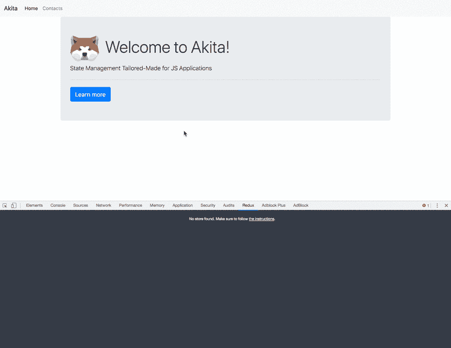

# Akita 和 Angular 简化了服务器端分页

> 原文：<https://dev.to/shaharkazaz/server-side-pagination-made-easy-with-akita-and-angular-26b>

## 简介

在开发应用程序时，我们经常需要处理大型数据集。想象一个场景，我们在数据库中有一百万条记录，我们需要在网页上显示它。

我们通常希望避免一次发送所有数据。原因是 1)我们想要更快的初始页面加载。2)我们不想膨胀用户的机器内存。

相反，使用服务器端分页，服务器一次只发送一个页面。

除此之外，我们还希望缓存已经获取的页面，以避免额外的请求。为了省去您的麻烦并帮助您管理整个事情，我们创建了 PaginatorPlugin。

## 分页器插件

分页器 API 提供了两个有用的特性:

1.  缓存已经提取的页面。
2.  分页功能，它为您提供了在应用程序中管理分页所需的所有东西。

下面是运行中的插件:

[](https://res.cloudinary.com/practicaldev/image/fetch/s--lAc0GJ31--/c_limit%2Cf_auto%2Cfl_progressive%2Cq_66%2Cw_880/https://thepracticaldev.s3.amazonaws.com/i/1ynmyurgmym0l3sx4hdm.gif)

让我们学习如何使用它。

## 创建脚手架

我们需要维护一个联系人集合，所以我们将使用一个`EntityStore`。您可以将实体存储视为数据库中的一个表，其中每个表代表一个实体的平面集合。

让我们创建一个联系人表，即一个`EntityStore`管理一个`Contact`对象:

```
/** contacts.store.ts */
export interface ContactsState extends EntityState<Contact> { }

@Injectable({ providedIn: 'root' })
@StoreConfig({ name: 'contacts' })
export class ContactsStore extends EntityStore<ContactsState, Contact> {
   constructor() {
     super();
   }
}

/** contacts.query.ts */
@Injectable({ providedIn: 'root' })
export class ContactsQuery extends QueryEntity<ContactsState, Contact> {
  constructor(protected store: ContactsStore) {
    super(store);
  }
}

/** contacts.model.ts */
import { ID } from '@datorama/akita';

export interface Contact {
  id: ID;
  email: string;
  name: string;
  address: string;
} 
```

Enter fullscreen mode Exit fullscreen mode

我们创造了秋田的基本构件。现在，让我们创建负责获取数据的`ContactsService`:

```
/** contacts.service.ts  */
@Injectable({ providedIn: 'root' })
export class ContactsService {
  get(params): Observable<PaginationResponse<Contact>> {
    return getContacts(params);
  }
} 
```

Enter fullscreen mode Exit fullscreen mode

`getContact`函数是一个模拟实现，它以一秒钟的延迟返回所需的服务器数据。

## 基本分页:

首先，我们需要为我们的联系人创建一个新的提供商:

```
/** contacts-paginator.ts */
import { inject, InjectionToken } from '@angular/core';
import { ContactsQuery } from './state/contacts.query';
import { PaginatorPlugin } from '@datorama/akita';

export const CONTACTS_PAGINATOR = new InjectionToken('CONTACTS_PAGINATOR', {
  providedIn: 'root',
  factory: () => {
    const contactsQuery = inject(ContactsQuery);
    return new PaginatorPlugin(contactsQuery).withControls().withRange();
  }
}); 
```

Enter fullscreen mode Exit fullscreen mode

您应该已经熟悉了上面的代码。这是在 Angular 中创建工厂提供者的常规过程。

我们正在创建一个`new PaginatorPlugin()`，传递我们想要在分页中使用的查询。

调用`withControls()`将会给我们一个页面数组，这样我们就可以在这些页面上使用`ngFor`和`withRange()`,后者将会给我们 from 和 to 值来显示给用户。

现在，我们可以在我们的组件中使用它:

```
/** contacts-page.component.ts */

import { CONTACTS_PAGINATOR } from '../contacts-paginator';
import { Contact } from '../state/contact.model';
import { PaginationResponse, PaginatorPlugin } from '@datorama/akita';

@Component({
   templateUrl: './contacts-page.component.html',
})
export class ContactsPageComponent {
  contacts$: Observable<PaginationResponse<Contact>>;

  constructor(@Inject(CONTACTS_PAGINATOR) private paginatorRef: PaginatorPlugin<Contact>,
     private contactsService: ContactsService
   ) { }

  ngOnInit() {
     this.contacts$ = this.paginatorRef.pageChanges.pipe(
       switchMap((page) => {
         const requestFn = () => this.contactsService.get({ page });
         return this.paginatorRef.getPage(requestFn);
       })
     );
   }
} 
```

Enter fullscreen mode Exit fullscreen mode

Paginator 公开一个`pageChanges` observable(立即触发第一个页面)。当这个 observable 发出时，我们调用`paginatorRef` `getPage()`方法，当页面在缓存中不存在时，传递我们想要初始化的 HTTP 请求

Paginator 希望从服务器获得以下字段作为响应的一部分(在我们的例子中是`request`服务方法):

```
/** paginator-request.interface.ts */
{
 "perPage": 10,
 "lastPage": "10",
 "currentPage": "3",
 "total": 150,
 "data": […]
} 
```

Enter fullscreen mode Exit fullscreen mode

除此之外，Paginator 还公开了你需要显示的所有数据以及从 UI 控制页面的方法，例如:
`isLoading$``isFirst``isLast``prevPage()``nextPage()``setPage()``isPageActive()``pageControls`等。

让我们看看如何在组件的模板中使用它:

```
/** contacts-page.component.html */
<div>
    <content-loader *ngIf="paginatorRef.isLoading$ | async"></content-loader>
    <ng-container *ngIf="(contacts$ | async) as contacts">
      <section [class.hide]="paginatorRef.isLoading$ | async">
        <table>
          <thead class="thead-dark">
            <tr>…</tr>
          </thead>
          <tbody>
            <tr *ngFor="let contact of contacts.data">
              <th>{{ contact.id }}</th>
              <td>{{ contact.name }}</td>
              <td>{{ contact.email }}</td>
              <td>{{ contact.address }}</td>
            </tr>
          </tbody>
        </table>
        <nav>
          <ul>
            <li [class.disabled]="paginatorRef.isFirst" 
                (click)="paginatorRef.prevPage()">
                <a>Previous</a>
            </li>
            <li [class.active]="paginatorRef.isPageActive(page)"  
                (click)="paginatorRef.setPage(page)"  
                *ngFor="let page of contacts.pageControls">
                <a>{{ page }}</a>
            </li>
            <li [class.disabled]="paginatorRef.isLast" 
                (click)="paginatorRef.nextPage()">
                <a>Next</a>
            </li>
          </ul>
        </nav>
      </section>
    </ng-container>
</div> 
```

Enter fullscreen mode Exit fullscreen mode

这就是获得完整的工作分页(包括缓存)所需的全部内容。

## 路由器集成

有些时候我们希望在 URL 地址中持久化当前页面，例如:`http://app.com/contact?page=3`。

下面是一个我们如何用插件实现它的例子:

```
/** contacts-page-router.component.ts */
export class ContactsPageComponent {
  contacts$: Observable<PaginationResponse<Contact>>;

  constructor(@Inject(CONTACTS_PAGINATOR) private paginatorRef: PaginatorPlugin<Contact>,
     private contactsService: ContactsService,
     private route: ActivatedRoute
   ) { }

  ngOnInit() {
     this.route.queryParamMap.pipe(
       map(params => +params.get('page')),
       untilDestroyed(this)
     ).subscribe(page => this.paginatorRef.setPage(page));

     this.contacts$ = this.paginatorRef.pageChanges.pipe(
       switchMap((page) => {
         const requestFn = () => this.contactsService.get({ page });
         return this.paginatorRef.getPage(requestFn);
       })
     );
   }
} 
```

Enter fullscreen mode Exit fullscreen mode

每次`page`查询参数改变时，我们通知插件当前页面。

## 高级分页

有时候，我们希望让用户能够过滤数据、对数据进行排序或更改每页的条目数。这里至关重要的一步是，当我们改变过滤器、排序等时。我们希望使缓存无效，因为它可能会改变服务器响应。

例如，让我们添加一个`sortBy`过滤器:

```
/** contacts-page-advanced.component.ts */
export class ContactsPageComponent {
  contacts$: Observable<PaginationResponse<Contact>>;
  sortByControl = new FormControl('name');

  constructor(@Inject(CONTACTS_PAGINATOR) private paginatorRef: PaginatorPlugin<Contact>,
    private contactsService: ContactsService
  ) { } pag

  ngOnInit() {
    const sortChanges$ = this.sortByControl.valueChanges.pipe(startWith('name'));
    this.contacts$ = combineLatest([
      sortChanges$.pipe(tap(() => this.paginatorRef.clearCache())),
      this.paginatorRef.pageChanges
    ]).pipe(
      switchMap(([sortBy, page]) => {
        const requestFn = () => this.contactsService.get({ page, sortBy });
        return this.paginatorRef.getPage(requestFn);
      })
    );
  }
} 
```

Enter fullscreen mode Exit fullscreen mode

当`sortBy`值改变时，我们需要使缓存无效，这样分页器就会知道它需要从服务器重新获取数据。

## 分页元数据

有时您希望保存当前过滤器，因此如果用户从当前路线导航并返回，您希望过滤器值保持不变。Paginator 公开了一个元数据属性，您可以在其中设置这些值。

例如:

```
/** contacts-page-metadata.component.ts */
import { startWith } from 'rxjs/operators';

export class ContactsPageComponent {
  ngOnInit() {
    const sortByValue = this.paginatorRef.metadata.get('sortBy') || 'name';
    this.sortByControl = new FormControl(sortByValue);
    const sort$ = this.sortByControl.valueChanges.pipe(startWith(sortByValue));

    this.contacts$ = combineLatest([
      sort$.pipe(tap(() => this.paginatorRef.clearCache())),
      this.paginatorRef.pageChanges
    ]).pipe(
      switchMap(([sortBy, page]) => {
        const requestFn = () => this.contactsService.get({ page, sortBy });
        this.paginatorRef.metadata.set('sortBy', sortBy);
        return this.paginatorRef.getPage(requestFn);
      })
    );
  }
} 
```

Enter fullscreen mode Exit fullscreen mode

感谢您的阅读！

如果你喜欢的文章点击了🧡 &🦄按钮并分享它🎉

* * *

[](https://docs.google.com/forms/d/e/1FAIpQLScZJsBWGDtyJ-izT9gKkIUU1Ig0VHfMjkUR3ikBjiD4x0Yidw/viewform)

我们正在寻找优秀的前端开发人员。如果你是他们中的一员，你对技术充满热情，你想为世界上最好的[公司](https://www.salesforce.com/blog/2018/02/salesforce-fortune-100-best-companies-to-work.html)工作，来加入我吧。