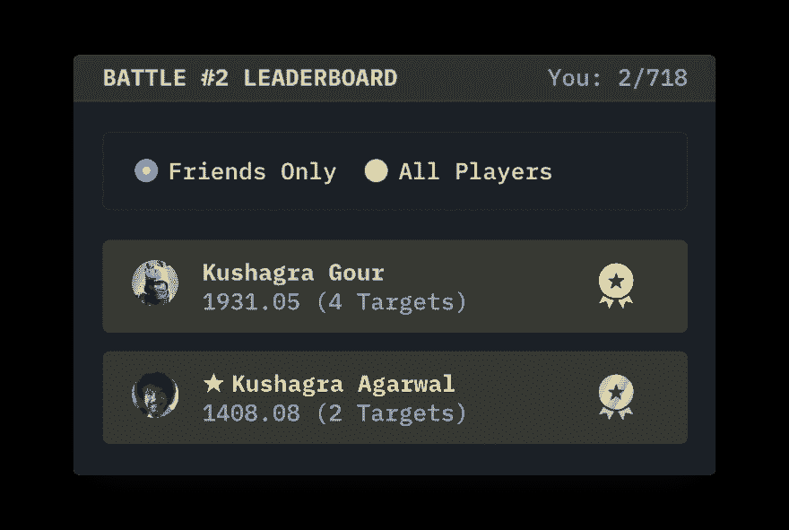

# 朋友和友好排行榜

> 原文：<https://dev.to/chinchang/friends-and-friendly-leaderboards-39ih>

*原贴于[https://cssbattle.dev/blog/introducing-friends/](https://cssbattle.dev/blog/introducing-friends/)T3】*

我们注意到，有时，当你刚刚开始参加 [CSSBattle](https://cssbattle.dev/) 时，全球排行榜会变得相当吓人。所以今天，我们很兴奋地宣布**的朋友**！🎉

有了朋友，你现在可以选择你想在排行榜上看到谁，并查看你在其中的排名。

要开始使用:

1.  访问您朋友的个人资料(通过点击他们的头像/姓名),然后点击`Add to Friends`按钮。
2.  转到任何有排行榜的页面，查看顶部的`Friends Only`。现在，所有排行榜将显示您在好友中的排名。

**注意**:添加某人为好友会向他们发送通知，这样他们就可以重新添加您了！

在我们的论坛上分享您的想法！