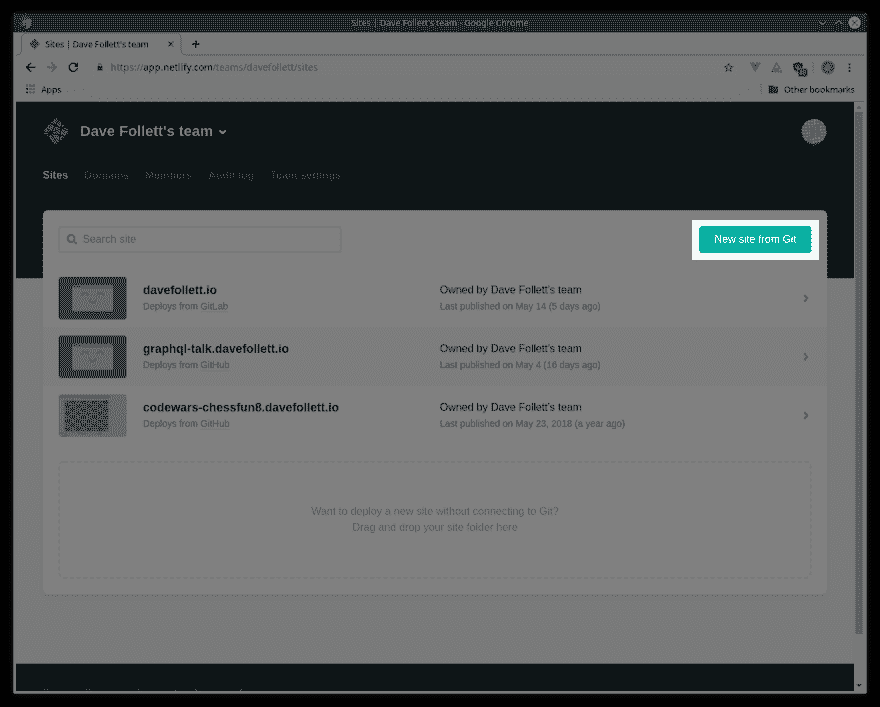
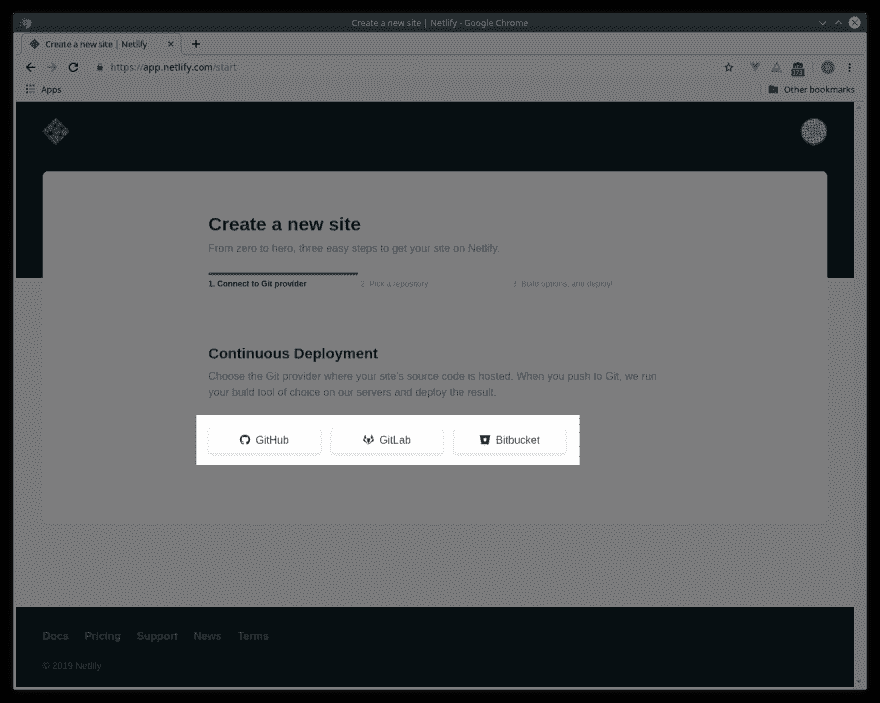
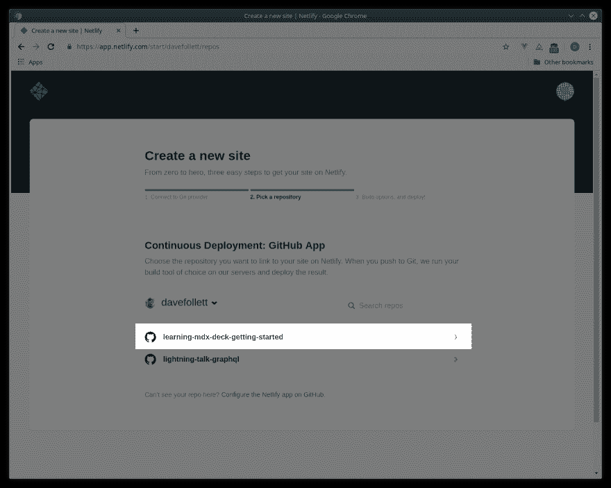
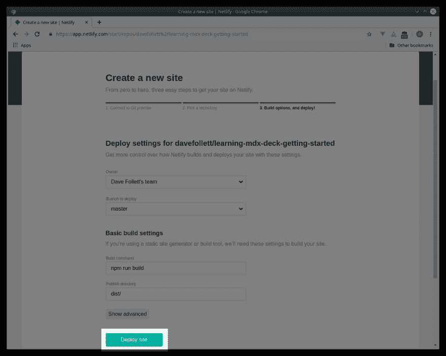
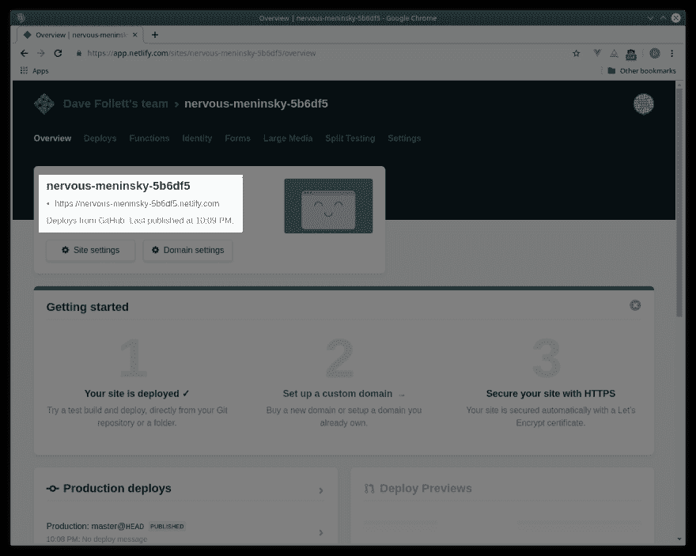

# 学习 MDX 资料:部署到网络

> 原文：<https://dev.to/davefollett/learning-mdx-deck-deploy-to-netlify-5e78>

在上一篇文章[学习 MDX Deck:入门](https://dev.to/davefollett/mdx-deck-getting-started-4hn3)中，我展示了如何使用 [MDX Deck](https://github.com/jxnblk/mdx-deck) 进行操作。MDX Deck 是一款使用 [MDX](https://mdxjs.com/) 创建演示平台网站的工具。但是，如果你不能轻松地向你的朋友炫耀，那么做一个超级甜蜜的演示又有什么用呢？让我们从[Learning MDX Deck:Getting Started](https://dev.to/davefollett/mdx-deck-getting-started-4hn3)中取出确切的代码，并将其部署到 [Netlify](https://netlify.com) 中。

## 1️⃣创建一个 Git 仓库

Netlify 有几个部署选项，但我最喜欢的是[连续部署](https://www.netlify.com/docs/continuous-deployment/)。Netlify 会监视你的 Git 库，当它检测到变化时，它会自动构建和重新部署你的站点。Netlify 目前支持以下 Git 提供程序进行连续部署:

1.  [GitHub](https://github.com/)
2.  [GitLab](https://gitlab.com)
3.  [Bitbucket](https://bitbucket.org/)

如何设置 Git 存储库在网上有很好的文档记录，所以我不会在这里介绍，但是我会提供所有三个选项的链接:

1.  [将现有项目添加到 GitHub](https://help.github.com/en/articles/adding-an-existing-project-to-github-using-the-command-line)
2.  [推送创建新的 GitLab 项目](https://docs.gitlab.com/ee/gitlab-basics/create-project.html#push-to-create-a-new-project)
3.  [将代码从现有项目导入 Bitbucket】](https://confluence.atlassian.com/bitbucketserver/importing-code-from-an-existing-project-776640909.html)

## 2️⃣添加一个构建脚本

现在项目已经在 Git 中设置好了，我们需要将下面的构建脚本添加到我们的`package.json`文件中。

```
"build": "mdx-deck build deck.mdx", 
```

构建脚本将把我们的演示板导出为一个静态 HTML 页面，带有 Netlify 可以部署的 JS 包。有了这个改变，`package.json`的`scripts`部分现在看起来会像这样。

```
"scripts": {
    "start": "mdx-deck deck.mdx",
    "build": "mdx-deck build deck.mdx",
    "test": "echo \"Error: no test specified\" && exit 1"
  }, 
```

现在可以使用下面的命令来运行构建脚本。

```
npm run build 
```

构建脚本的结果将被放入一个新创建的`dist/`文件夹中，因此请确保将它包含在您的`.gitignore`文件中。此外，确保将这些更改推送到您的存储库中。

## 3️⃣ Add a netlify.toml file

Netlify 使用选项配置文件来指导站点的构建和部署。对于这个项目，这不是严格要求的，但是它将使下一节中设置 Netlify 更加容易。我们的配置文件只包含两个选项；构建命令和要发布的目录。只需将下面几行放到项目根目录下名为`netlify.toml`的文件中。

```
[build]
  command = "npm run build"
  publish = "dist/" 
```

如果你有兴趣阅读更多关于`netlify.toml`的内容，你可以在 Netlify 的文档中找到[这里](https://www.netlify.com/docs/netlify-toml-reference/)。

## 4️⃣设置网络并部署

现在，我们已经在 Git 存储库中拥有了项目以及构建脚本和 Netlify 配置，我们已经准备好部署到 Netlify 了。如果您没有帐户，请在此注册[。登录后，在 sites 选项卡上，点击页面右上角的](https://app.netlify.com/signup) [new site from Git](https://app.netlify.com/start) 按钮。

<figure>

[](https://res.cloudinary.com/practicaldev/image/fetch/s--P2laLyvT--/c_limit%2Cf_auto%2Cfl_progressive%2Cq_auto%2Cw_880/https://davefollett.io/2019/05/20/mdx-deck-deploy-to-netlify/netlify-new-site-from-git.png)

<figcaption>Netlify's deploy new site button</figcaption>

</figure>

接下来，选择您的 Git 提供者:GitHub、GitLab 或 Bitbucket。

<figure>

[](https://res.cloudinary.com/practicaldev/image/fetch/s--gHlN2m81--/c_limit%2Cf_auto%2Cfl_progressive%2Cq_auto%2Cw_880/https://davefollett.io/2019/05/20/mdx-deck-deploy-to-netlify/netlify-select-git-provider.png)

<figcaption>Netlify's git provider options</figcaption>

</figure>

选择 Git 提供者后，现在选择您的存储库。注意，您*可能*必须配置您的 Git 提供程序来访问您的存储库，以便选择它进行部署。

<figure>

[](https://res.cloudinary.com/practicaldev/image/fetch/s--IOBOJgbe--/c_limit%2Cf_auto%2Cfl_progressive%2Cq_auto%2Cw_880/https://davefollett.io/2019/05/20/mdx-deck-deploy-to-netlify/netlify-select-git-repository.png)

<figcaption>Netlify's git repository selections</figcaption>

</figure>

部署的最后一步是选择我们的构建选项。因为我们包含了一个`netlify.toml`配置文件，所有的构建选项都已经设置好了，我们需要做的就是点击页面底部的`Deploy site`按钮。

<figure>

[](https://res.cloudinary.com/practicaldev/image/fetch/s--Nq2JkyC8--/c_limit%2Cf_auto%2Cfl_progressive%2Cq_auto%2Cw_880/https://davefollett.io/2019/05/20/mdx-deck-deploy-to-netlify/netlify-deploy-site.png)

<figcaption>Netlify's deploy site button</figcaption>

</figure>

大约一分钟后，下一个屏幕将显示您的站点已经部署，并提供其 URL，如下一个屏幕截图所示。

<figure>

[](https://res.cloudinary.com/practicaldev/image/fetch/s--cJOG3IAD--/c_limit%2Cf_auto%2Cfl_progressive%2Cq_auto%2Cw_880/https://davefollett.io/2019/05/20/mdx-deck-deploy-to-netlify/netlify-site-deployed.png)

<figcaption>Netlify's site deployed overview</figcaption>

</figure>

## 🏁结论

现在，您已经将 Netlify 配置为从您的 Git 存储库进行部署，每当您对 Git 提供程序上的主分支进行更改时，Netlify 都会自动重建您的 MDX Deck 站点并进行部署。

参考链接:

*   本文使用的所有代码都可以在 GitHub 上找到:
    *   [https://github . com/davefollett/learning-mdx-deck-getting-started](https://github.com/davefollett/learning-mdx-deck-getting-started)
*   我的 MDX Deck 站点的部署 URL 可以在以下位置找到:
    *   [https://learning-mdx-deck-getting-started . davefollett . io](https://learning-mdx-deck-getting-started.davefollett.io)

## 🔜下一个

接下来，在`Learning MDX Deck`系列中，我们将探索 MDX Deck 中每张幻灯片的内置布局选项。发表的时候我会在这里加一个链接。