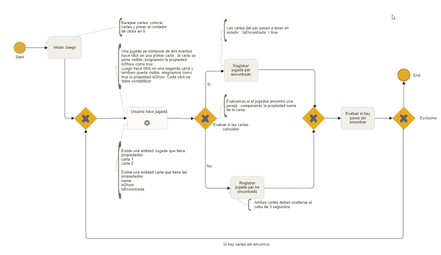
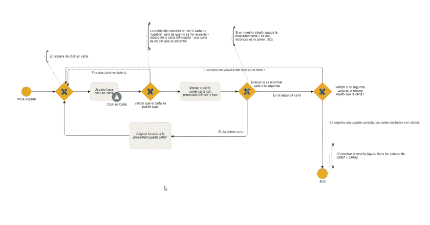
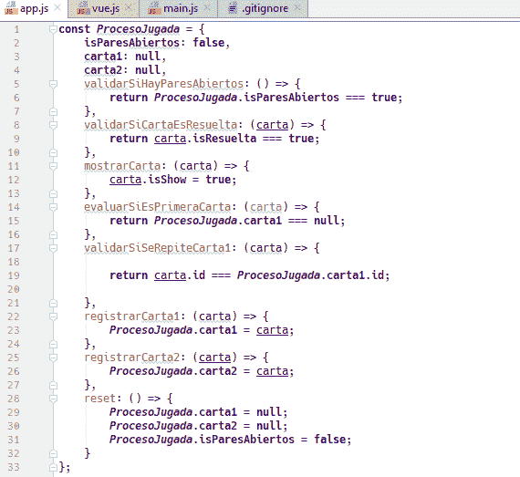

# 练习学习编程 02 -创建内存集

> [https://dev . to/iqadavidh/exercise-to-learn-a-programmer-02-create-un-rompuzzles-3cnj](https://dev.to/iqdavidh/ejercicio-para-aprender-a-programar-02-crear-un-rompecabezas-3cnj)

### 问题:

#### 为一个人做记忆游戏

### 做节目？

#### 步骤 1:了解问题。

我们需要创建一个表示备忘录信件的图形界面。游戏的方式是先翻牌，然后我们要通过点击两个不同的牌来寻找配对。如果信件匹配，则留下；如果信件不匹配，则返回其位置游戏结束时再也找不到配对的牌了。

#### 步骤 2:手动/亲自解决问题

游戏是一个过程，我们将在其中等待玩家点击一封信并对其进行评估，然后再等待他点击另一封信。直到我们有两张有效的牌，我们才能确定它们是否成对。我们只需要比较两封信，然后记下它们是否配对。每次找到一对，我们都会评估它们是否都是配对。如果我们都有舞伴的话，比赛就结束了。

比较信件时，我们会使用一个属性，例如 id、图像、名称等。

#### 步骤 3:定义我们如何解决问题的步骤。

我们定义了以下的步骤顺序:
1)是游戏准备的开始(作弊，得分开始)
2)游戏本身，也就是游戏的顺序
3)结束

#### 帕索 4。-决定让我们成为一个解决者

了解最困难的步骤是什么？
最复杂的步骤是□一，该局由两个要素组成:
牌 1 和牌 2，并有几个验证来确定牌的选择是否正确。

于是我们有了这个叫做“游戏”的实体，代表着玩家给我们提供两张有效牌的一个班次。

##### 是有效信件吗？

如果信件已经解决了，也就是说，如果已经找到了他的对，就不能玩了。
如果给我们的第二封信与第一封信相同也无效(在同一封信中双击)
当一对不匹配的信再次隐藏时，在显示这些信的这段时间内，用户不能选择信。如果我们看到一对不匹配的牌，则没有有效的牌。

下面我将介绍这一过程

这些规则我们可以用以下方式来表示 

单击有效信函将显示该信函-称为信函 1-然后单击下一个有效信函-我们将显示该信函-称为信函 2-。如果牌不一样，几秒钟后我们就把牌藏起来。

下一步要解决的是开始，在那里我们作弊并提交分数。

最简单的部分是游戏结束。

示例

#### 一封信的点击

