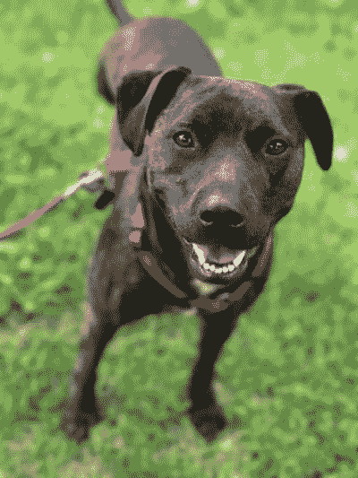

# 关于正念，你能从你的狗身上学到什么

> 原文：<https://dev.to/ashleemboyer/what-you-can-learn-from-your-dog-about-mindfulness-219o>

自从我在公寓里住了整整 3 年以来，我一直养着我的狗，Trooper，Zach 和我总是用皮带牵着它散步。我们目前的公寓有一个不错的树皮公园，这有助于他释放一些能量，但在大多数情况下，他被拴着。

牵着狗散步时很容易感到无聊。有时候，我会拿出手机快速浏览一个应用程序(这是完全不同的问题，真的😜)当它凝视太空或对其他狗/人发出小吼声时。

过了一会儿，他一动不动地站着，我(相当不耐烦地)想，“你在看*什么？你能不能只做你的生意？”*。事情是这样的:他别无选择，只能每时每刻都在场。他们的大脑不像我们的大脑那样思考未来。

<figure>

<figcaption>Bonus! Here's another picture of Trooper. :)</figcaption>

</figure>

士兵只能考虑他面前的事情。谁知道这是不是大自然的本意，但我认为动物如此是有原因的。野生动物没有时间去担心根本没有发生的事情——它们忙于在捕食者和饥饿中生存。

我们大多数人并不真的必须那样做，至少程度不同。Trooper 也不需要这样做，因为我们照顾他，但他仍然有一个有限的感知能力，最酷的副作用是什么？它是一只非常快乐的小狗。他满足于观察鸟类、嗅花和杆子、晒日光浴。

那么，关于正念，我们能从我们的狗身上学到什么呢？如果你练习它，你会快乐得多。在事情真正成为问题之前，尽量不要过于担心。尽量少用手机。向上看。环顾四周。看到你周围的美。

* * *

你知道我有时事通讯吗？📬

如果你想在我发布新的博客帖子或宣布重大项目时得到通知，请联系 https://ashleemboyer.com/newsletter。

* * *

*封面图片由我拍摄。那是士兵！*