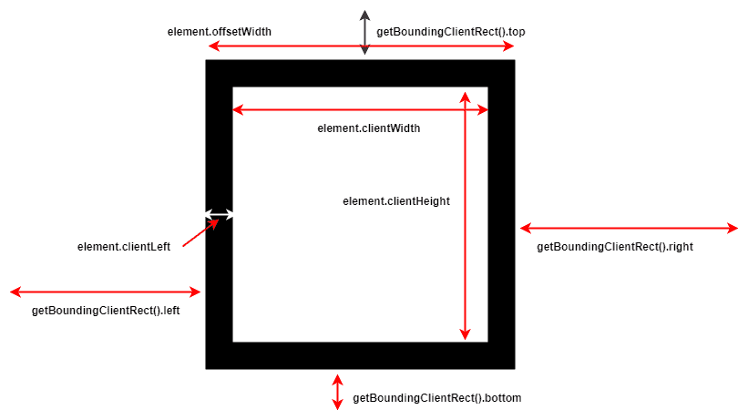

# 以下是我在完成#javascript30 后学到的一些东西

> 原文：<https://dev.to/shahidcodes/here-is-few-things-i-learnt-after-completing-javascript30-30ai>

我在 4 月 18 日做了#javascript30 challenge，但当我浏览挑战时，我发现它是为初学者准备的，我找到了工作的`console`对象，尝试了`.map`、`.reduce`等函数式编程组件。我认为这不值得，但是 10 天后我看到了一个关于#javscript30 的 twitter 帖子。这个人做了一个挑战，他必须操纵网络摄像头的像素。这立刻引起了我的兴趣，当我再次查看挑战列表时，我发现`Unreal web cam fun`已经列出。然后我决定让我们这样做。作为中级 css/javascript 开发人员，我学到了一些东西

*   *伸缩盒可以嵌套*。我从未充分使用 flex box 来正确理解它。在我们的日常工作或项目中，我们最有可能使用某种已经有一些预定义类的库，然后我们调整它使它看起来像我们自己的。在挑战中，我只使用了 flex box 来定位，相信我，它让定位像蛋糕一样简单。
*   *你永远不知道足够的浏览器 API* 。我想我知道最近发布的大部分新 API。但我未能意识到，在桌面 chrome 和 android/iOS chrome/safari 上使用它可能会很痛苦。当从事业余爱好项目或试图创造一些东西来学习一些概念时，我们倾向于在我们所学的范围内完成事情。但是如果你正在学习 API，并且在制作指南针时忽略了它在手机上坏掉的可能性，那该怎么办呢？对我来说，确实如此。在寻找解决方案的过程中，我了解了这么多只适用于 Android/iOS chrome 的新 API。
*   *生动而简单的*。我知道新的 CSS3 动画，但从来没有广泛地使用它来理解应用它时的常见问题。当我在挑战中导航时，我花了几个小时弄清楚为什么我的动画不起作用。喝了几杯咖啡后，我明白了原因。我们不能制作`display`或`width`的动画。所以我申请了黑客。我将元素从视口移开，并将其带回来。提示:`tranform: translateX(-500px);`可以成为生活的救星。

*   *JavaScript 坐标又好玩了*。我总是避免在 javascript 中使用坐标。所有的`clientX`、`offsetWidth`、`pageX`都让人摸不着头脑。但是在挑战中有一种情况，我必须计算一些图像元素的坐标，以确定它们何时进入和离开视口，这样我就可以添加进入和离开动画。这非常困难，但很快就变得轻而易举。感谢[http://javascript.info/coordinates](http://javascript.info/coordinates)。所以我为这些令人困惑的坐标属性创建了一个备忘单-
    

这是我认为值得分享的几件大事。如果你像我一样，那么你一定要试试#javascript30。他是个伟大的老师。

页（page 的缩写）我的第一个博客。忽略错误😎。建议将不胜感激。谢谢