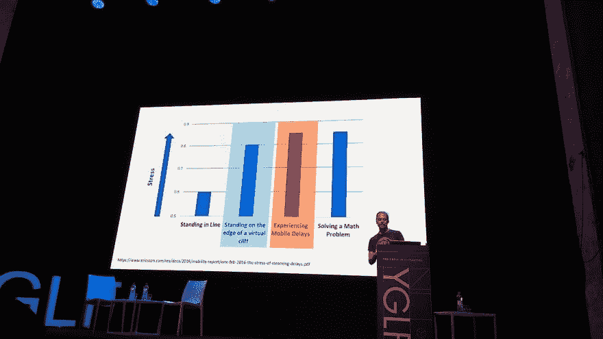
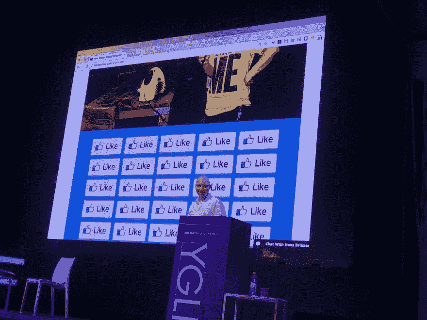
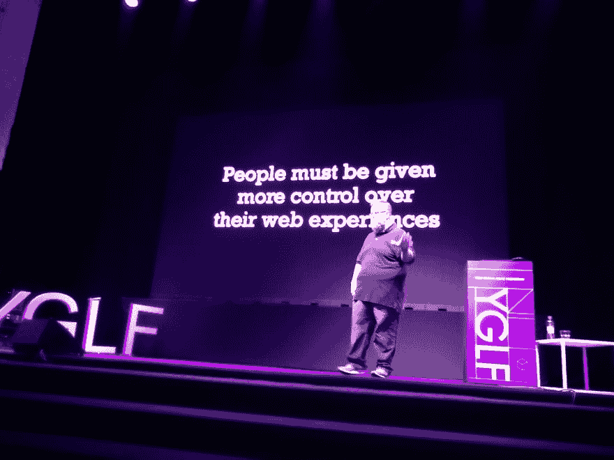

# YGLF 2019 回顾

> 原文：<https://dev.to/mkrup/recap-of-yglf-2019-keo>

最近，我参加了在维尔纽斯举行的第一次前端会议。

总的来说，这是一次精彩纷呈、内容丰富的会议。演讲者很棒，组织得很好，在演讲间隙有太多零食让我们吃。😋🍩

所以我只想分享一些亮点和我在活动中获得的有趣知识。只有几个支离破碎、可能过于简单的想法一直困扰着我。

我将这些想法分成三个主要部分:

*   易接近
*   表演
*   杂项开发位

## 可达性

这次活动由@hj_chen 主持，主题是语言和字体的难题。🌐🔠

有人提醒我们，我们是为*万维网*而不是*富裕的西方网络*开发的。

概括地说，只要确保使用了`lang`属性，指定内容的确切语言，并且您的字体系列具有您在站点上使用的字符的字形。

[@aardrian](https://twitter.com/aardrian) 讲了一个概念叫做*。😈*

 *让你的网站在各种禁用环境下可用，这是对你最有利的。手臂骨折，嘈杂的咖啡馆或明亮的阳光不应该使你的网站完全不可用，如果你考虑到这些因素，你会使你的网站无障碍。

此外，可访问性不是一个清单，而是一个持续的过程。

> Liv@ miss livirose不会说谎， [@aardrian](https://twitter.com/aardrian) 的 [#a11y](https://twitter.com/hashtag/a11y) 在 [#YGLF19](https://twitter.com/hashtag/YGLF19) 的谈吐已经让我泪流满面。技术的可访问性和包容性是如此重要和必要，我们在 XR 领域需要更加意识到我们在这里的责任。2019 年 5 月 16 日上午 11:21211

## 表现

[@DanShappir](https://twitter.com/DanShappir) 显示服务器端渲染带来了巨大的时间可见性降低。虽然没有技术上的挑战，但是测试在开发过程中帮助很大。

图片构成了网络流量的大部分。因此，对它们进行优化是有意义的，我们没有理由不这样做。 [@dougsillars](https://twitter.com/dougsillars) 展示了我们有像`webp`、`<picture>`标签和 lazyloading 解决方案这样的现代工具。👨‍💻

此外，对于网络上的动画，使用`.mp4`而不是`.gif`。

> 丹沙皮尔@丹沙皮尔。 [@dougsillars](https://dev.to/dougsillars) 显示慢加载网站比站在悬崖边还要有压力[@ yglf _ lt](https://twitter.com/yglf_lt)[# yglf 19](https://twitter.com/hashtag/yglf19)[# web perf](https://twitter.com/hashtag/webperf)2019 年 5 月 16 日下午 12:202[T35】8](https://twitter.com/intent/like?tweet_id=1128998591060697088)

## 杂开发位

你只要看看 [@smashingmag](https://twitter.com/smashingmag) 的主题演讲就知道了。在网站设计的广阔世界里，我们见证了什么是伟大的，什么是相当可怕的。🧙‍😲

> 托马斯·米利奥斯卡斯@ typeoftomas[@ smashingmag](https://twitter.com/smashingmag)在 [@yglf_lt](https://twitter.com/yglf_lt) ，[# YGLF](https://twitter.com/hashtag/YGLF)07:25AM-17 2019

@giltayar 证明了用视觉回归测试来测试你的 CSS 是可能的。

他还创造了术语*。这是对你自己的代码的恐惧，但是如果你正遭受这种恐惧，为你的代码编写优秀的测试肯定会有所帮助。*

 *可以在浏览器中运行、训练和再训练机器学习预测算法。有实际应用吗？肯定！ [@devdevcharlie](https://twitter.com/devdevcharlie) 表明你完全可以用 JavaScript 检测出*的威利斯*。😁

JavaScript 类有一些奇怪的行为。你可以使用函数让你的生活变得简单一点。 [@soyguijarro](https://twitter.com/soyguijarro)

你可以用浏览器做很多不同的事情，比如连接和使用 midi 控制器，通过网络蓝牙 API 与微控制器(运行 JavaScript)交谈，甚至拥有交互式和社交虚拟现实体验。[@ dashersw](https://twitter.com/dashersw)[@ html 5 test](https://twitter.com/html5test)[@ miss livirose](https://twitter.com/misslivirose)

[@sgrove](https://twitter.com/sgrove) 用 GraqhQL 和 ReasonML 做了一些快节奏的开发。这个技术组合看起来很强大。

> ᴡᴇɪ👩🏻‍🌾@ YGLF 维尔纽斯🇱🇹[@ wgao 19](https://dev.to/wgao19)我正在听 [@sgrove](https://twitter.com/sgrove) 关于 GraqhQL 和 ReasonML 的精彩演讲，所以天才我的大脑正在猛攻
> 
> [# yglf 19](https://twitter.com/hashtag/yglf19)09:52am-2019 年 5 月 17 日

[@rebekaka](https://twitter.com/rebekaka) 分享了一些很棒的调试技巧。🕵️‍

如果您使用`console.log(value)`来记录变量，您可以简单地通过形成和记录一个对象而不仅仅是值`console.log({ value })`来提高日志的可读性。这在记录多个变量时特别有用。

此外，如果你还没有为它创建一个片段，使你的生活更容易。

chrome 和 firefox 开发工具都有一些很棒的特性，比如可访问性和性能标签、调试器断点、本地覆盖、审计和源代码映射支持。我们有惊人的工具，值得学习使用它们。

[@getify](https://twitter.com/getify) 谈到了我们实际上是如何为人们而不仅仅是用户或客户进行开发的。他提出了一个网络忠诚度滑块，因为最终人们知道什么对他们最好。🤔

> HJ 陈@ YGLF 维尔纽斯@ HJ _ Chen用户比较了解。
> [# yglf 19](https://twitter.com/hashtag/YGLF19)2019 年 5 月 17 日下午 15:2439

* * *

我也想感谢组织者给我参加的机会和奖学金。

YGLF 2019 绝对是一场爆炸，我已经等不及 *YGLF 2020* 了！🎉🎉

* * *

这篇文章来自我的个人博客。看看吧！

封面图片归功于立陶宛 YGLF。**