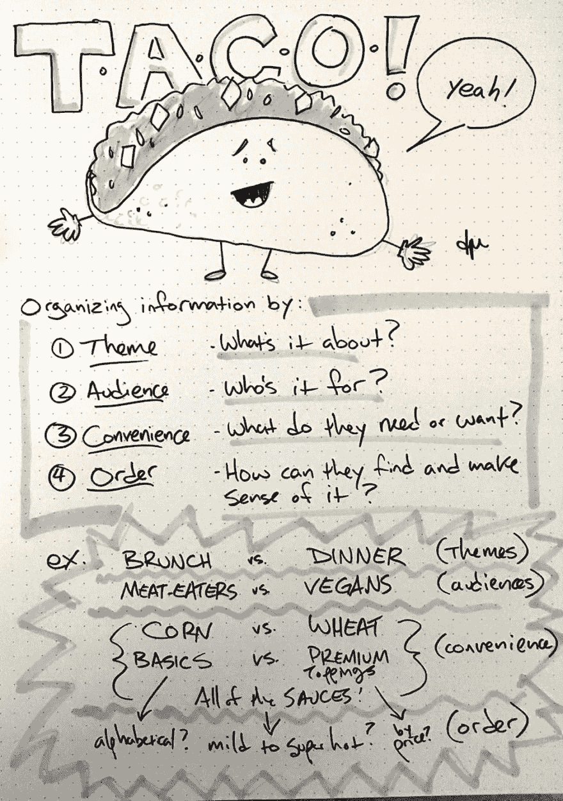

# 打造你自己的玉米卷

> 原文：<https://dev.to/denmch/build-your-own-taco-25i6>

我不会冒昧地说，对于非专业人员来说，这是无泪的信息架构，简单易用，当然也不是“为傻瓜准备的”。(我一直不喜欢那句话，也不觉得有什么帮助。)这或多或少是一个简单的模型，让我更接近于对信息架构感到舒适——这是对这个学科的一种入侵，它并不假装说什么新东西。但我希望它能以一种令人难忘的方式讲述一些有用的东西，并帮助其他人开始在组织信息方面取得进展。它在帮我。

所以事不宜迟，如何建立自己的 T.A.C.O。

我目前的任务是为一个学生门户网站制作线框，以取代一个多年拼凑而成的古老系统，通常很少甚至没有用户输入。我们最近与各种利益相关者进行了一系列讨论，最终形成了一份对不同群体和不同人群都很重要的事情清单。现在困难的部分开始了:你如何以一种有意义的、可用的方式来组织它？

你可能听说过 Richard Saul Wurman 组织信息的闩锁记忆法，将可用的模型限制在位置、字母、时间、类别和层次结构:L.A.T.C.H。

就我的目的而言，我只提出了四件事来关注，而不是五件。我给你一个临时指挥官:

*   主题
*   观众
*   便利
*   命令

TACO 解决了关于您的信息如何与访问它的人相关的四个最重要的问题:

1.  是关于什么的？
2.  是给谁的？
3.  他们想做什么？
4.  他们如何理解它？

我们从轮廓开始，以细节结束，LATCH 不加区别地对待它们，试图减少焦虑，这让我有些焦虑。

* * *

## 主题

**主题**是最广泛的一个类别，并且与上下文高度相关。它可以是一个组织中的一个部门，一个用于按主题对新闻进行分组的类别，一个学术主题，或者任何你可以想象为统一心智模型的东西。由于这个原因，它可以与其他组织方式有很大的重叠，并且最适合于最高级别。

示例:

*   种类
*   部门
*   问题
*   主题

* * *

## 观众

**受众**往往被忽视。你如何组织你的信息给内部和外部的观众，给初学者和专家，给学生和老师？它有时看起来像是主题或便利的子集，但从根本上说，它可能是组织信息的第一考虑因素，位于数据和访问数据的人的文字界面上。它是位于主题组织之上还是作为下面的过滤器，或者仅仅是一个伴随的考虑，这取决于你和你的需求。

示例:

*   管理员>编辑器>阅读器
*   初学者>专家
*   客户>供应商
*   学生>教师

* * *

## 方便

**便利性**是基于效用的组织方式，在给定的上下文中更倾向于有用性。这包括相关性、互动性和受欢迎程度。你可以首先或最显著地提供最相关的信息。您可以强调用户可以与之交互的内容，或者相对于静态内容的动态内容。这可以是一种等级制度，但那太抽象了。和观众一样，方便也是关注用户的。

示例:

*   交互性
*   流行
*   关联
*   有用

* * *

## 订单

顺序可能是组织信息的最后一个考虑因素，而且很可能违反直觉。这当然是从广角定位信息的最后手段，例如，一个网站地图，但它也可能是在粒度级别组织事物的最佳方式。当用户成功找到最热门、最个人化、最可行的信息时，你就可以专注于以逻辑或通用的方式排序。

示例:

*   位置
*   名字
*   等级
*   时间

* * *

您的组织、您的项目、您的内容和您的时间都有自己的特点和要求，但总的来说，您会想要查看您的数据并确定(1)大的图片主题或话题，(2)谁构成了受众，(3)您如何帮助他们找到他们正在寻找的东西，以及(4)在粒度级别上排序的最佳方式。

这是我思考的第一件事:

让我们尽可能地把这个东西拉长，用单独的菜单把玉米卷分为早午餐玉米卷和晚餐玉米卷，然后根据观众分支，把肉玉米卷和素食玉米卷分开。为了方便起见，我们将所有可选的浇头分组，然后可能我们将它们排列成等级组(例如，鳄梨色拉酱放在奖金“添加为 1 美元”组中)，然后在内部按字母顺序排列浇头。这是一种可以帮助任何人找到他们喜欢的玉米卷的树。

我可能会按照学位项目来组织我的信息，但是按照特定的学生群体来构建菜单，例如，被录取的学生，然后是一年级、二年级和三年级的学生。我可能会优先考虑他们最关心的信息，如班级排名、课程信息和考试时间表，或者在登录页面的显著位置显示时间敏感的信息，如截止日期和即将发生的事件。然后，当然，测试和迭代。

这就是你做玉米卷的方法。成分会有所不同，但过程基本相同。

如果你真的想学习一些东西，请和我一起阅读丽莎·玛丽·马丁的优秀的《T2 日常信息架构》(摘自《分开的一本书》),当这个墨西哥卷占据了我的大脑，让我停下来把它写在纸上时，我正在读这本书。我已经准备好回到书中，我希望下一页不会解释为什么我的愚蠢想法如此愚蠢。