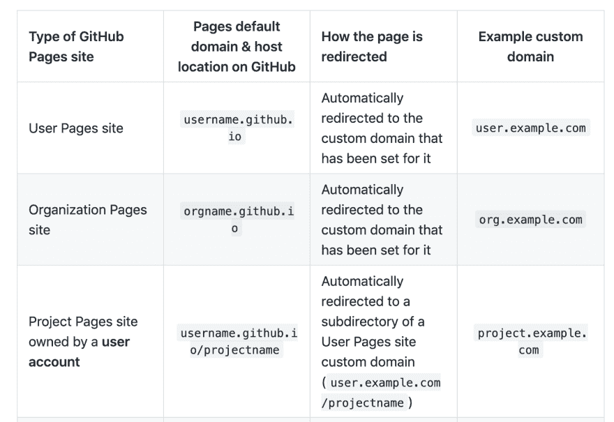
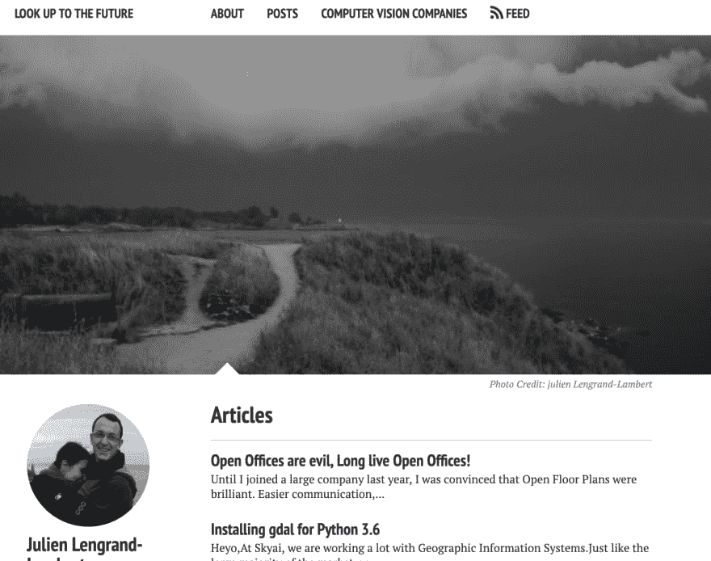

# 再见 Github 页面，欢迎幽灵！

> 原文：<https://dev.to/jlengrand/goodbye-github-pages-welcome-ghost-57pc>

最后几天，我终于开始做一些早该做的事情了！

在使用 [Github 页面](https://pages.github.com/)上的 [Jekyll](https://jekyllrb.com/) 多年后，我决定远离它，现在我在一个数字海洋水滴上使用 [Ghost](https://ghost.org/) 。我本来[听从了艾登](https://twitter.com/jlengrand/status/1127606596480241665)在 Twitter 上的建议，很快就服气了:)。

我去有几个原因。以下是^^.的一份非详尽清单

## HTTPS 和子域

第一个也是主要的问题实际上可能来自我。Github 允许你使用自定义域名，这很神奇。除了我从来没有让 HTTPS 很好地工作，导致证书问题。

我使用 Github 页面来避免服务器成本，但是我当前的提供商不允许没有服务器的 HTTPS 证书，这导致了无解。所以我的网站停留在 HTTP 上的时间比它应该停留的时间要长。

使用 Github 页面的另一个副作用是当你有其他的项目时。当 Github 为您的主页使用自定义 URL 时， [Github 也会为您的其他项目使用该自定义 URL](https://help.github.com/en/articles/custom-domain-redirects-for-github-pages-sites)。

<figure>

<figcaption>github 如何根据存储库类型重定向到您的自定义 URL 的列表</figcaption>

</figure>

问题是，我所有的项目现在都被重定向到 lengrand.fr URLs，导致了许多依赖关系找不到的问题(dist folders，...).我现在已经将 [lengrand.fr](http://lengrand.fr) 拆分为我的博客内容和电子邮件，将 [lengrand.dev](https://lengrand.dev/) 拆分为我的副业项目:)

## 时效设计

几年前 Jekyll 的最小设计非常棒。现在感觉有点老了。我肯定没有时间(还没有技能)从零开始构建我自己的响应式主题，我也从来没有找到另一个吸引我的 Jekyll 主题。

在网上找了一下，很快就找到了霍勒斯幽灵主题，真的很喜欢。这就是我们:)。

## 用户界面

Jekyll 博客相当不错，因为你基本上只需要写一个降价文件就可以在网上获得一个新帖子。我写的几乎所有东西都是减价格式的，所以对我来说这从来都不是问题。

现在，这不是我最初真正寻找的东西，但有一个用户界面来在线更改您的设置是很好的，例如您的个人资料或 Twitter 卡设置。给我额外的奖金！

## 离线使用

当时我选择 Github 页面的一个原因是，使用 Github repository 作为同步工具非常容易。你基本上可以离线浏览你的整个博客。那时候非常方便，因为我每天要花 3 个小时在火车上。

现在，我仍然希望能够离线写文章。但这不是问题，因为 ghost 支持 Markdown 输入。我可以简单地把我的文章写在某个文件上，然后上传。实际上我很少改变我的博客的实际设计，所以我实际上不需要让所有东西都在本地运行。如果我需要，我仍然可以使用 [ghost-cli](https://docs.ghost.org/install/local/) 来完成。

## 费用和设置

现在，拥有自己的博客有一个缺点。使用最便宜的数字海洋水滴，我每月 6 美元(备份 5 美元+ 1 美元)。从长远来看，它确实代表了相当多的钱。

然而，我完全被简单的，几乎是神奇的，使用市场的整个设置所诱惑。我的意思是，老实说，使用[市场上的幽灵水滴](https://marketplace.digitalocean.com/apps/ghost)你可以在 2 分钟内启动并运行， **HTTPS 证书包括**。

这种体验真是太棒了。脱帽致敬，数字海洋。

就这样，我更新了我的博客。总共花了大约一周的时间，在这个过程中出现了一些怪癖。但这将是改天的故事:)。

干杯