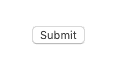
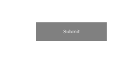
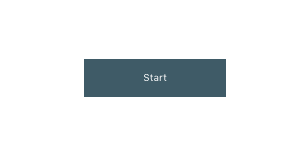
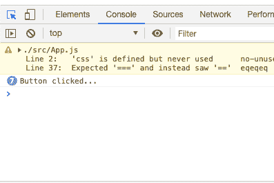

# 反应按钮备忘单

> 原文：<https://dev.to/bhavaniravi/reactjs-buttons-cheatsheet-1815>

#### 使用按钮？你把他们都带来了

大多数前端开发人员的生活都围绕着创建组件和设计它们的样式。作为一名后端开发人员，我发现自己在启动和运行一个按钮组件之前，要经历 4-5 个 StackOverflow 链接。下面是基本操作的列表。

#### 新建 React 项目

```
npx create-react-app react\_button\_cheatsheet 
```

#### 如何创建按钮

[](https://res.cloudinary.com/practicaldev/image/fetch/s--p1twOAUe--/c_limit%2Cf_auto%2Cfl_progressive%2Cq_auto%2Cw_880/https://cdn-images-1.medium.com/max/123/1%2ANH16OMNwflX1mvEJiBEmXA.png)T3】

```
class UpgradedButton extends React.Component{
     render(){
          <button>Submit</button>
     }
} 
```

#### 让它看起来漂亮

[](https://res.cloudinary.com/practicaldev/image/fetch/s--wTThW5Vy--/c_limit%2Cf_auto%2Cfl_progressive%2Cq_auto%2Cw_880/https://cdn-images-1.medium.com/max/270/1%2AjOvomCaEfQ158lLGUxtIkA.png)T3】

```
const StyledButton = styled.button`
    position: absolute;
    height: 10%;
    width: 10%;
    top: 50%;
    left:50%;
    font-size: 2.6vmin;
    cursor: pointer;
    box-shadow: rgba(255, 255, 255, 0.05) 0px 3px 20px;
    border-width: initial;
    background-color: grey;
    color: white;
    border-style: none;
    border-color: initial;
    border-image: initial;
    outline: none;
`

**// change this line in UpgradedButton**  
// <button>Submit</button>
<StyledButton>Submit</StyledButton> 
```

#### 在上方改变颜色

将它添加到样式组件的 CSS 字符串中

[](https://res.cloudinary.com/practicaldev/image/fetch/s--5aT0TqoK--/c_limit%2Cf_auto%2Cfl_progressive%2Cq_auto%2Cw_880/https://cdn-images-1.medium.com/max/306/1%2AgBVcIyGdJZKyqulwfMRQkw.png)T3】

```
const StyledButton = styled.button`
    ...
    ...
    ...
    &:hover {
       background-color: #445b65;
       color: white;
    }
` 
```

#### 处理 Onclick 事件

[](https://res.cloudinary.com/practicaldev/image/fetch/s--lRSR9yf1--/c_limit%2Cf_auto%2Cfl_progressive%2Cq_auto%2Cw_880/https://cdn-images-1.medium.com/max/397/1%2AvT7KSBiLDLEIRD5K-UMFKg.png)T3】

```
handleClick = () => {
    console.log("Button clicked...")
}

...
...

<Button onClick={this.handleClick}>Submit</Button> 
```

#### 改变文本 OnClick

```
handleClick = () => {
   buttonText = this.state.buttonText == "Start" ? "Stop" : "Start"      
   this.setState({buttonText: buttonText})
} 
```

#### 完整代码