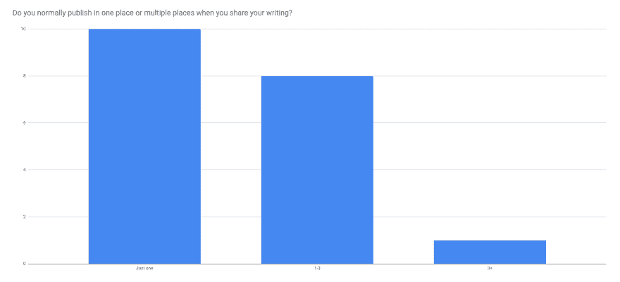
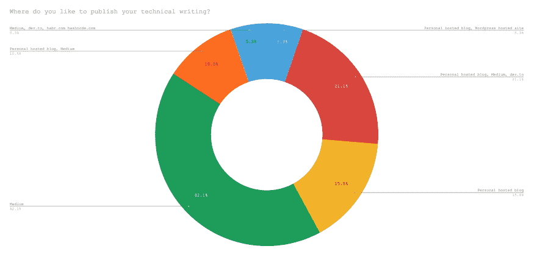
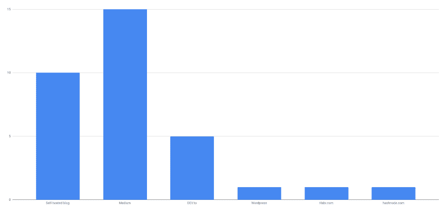
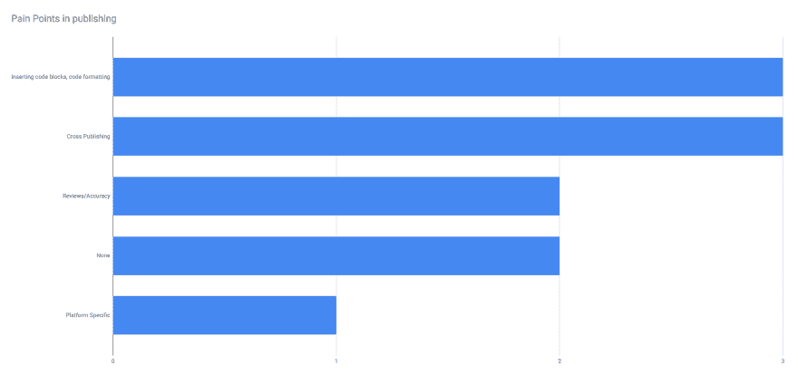
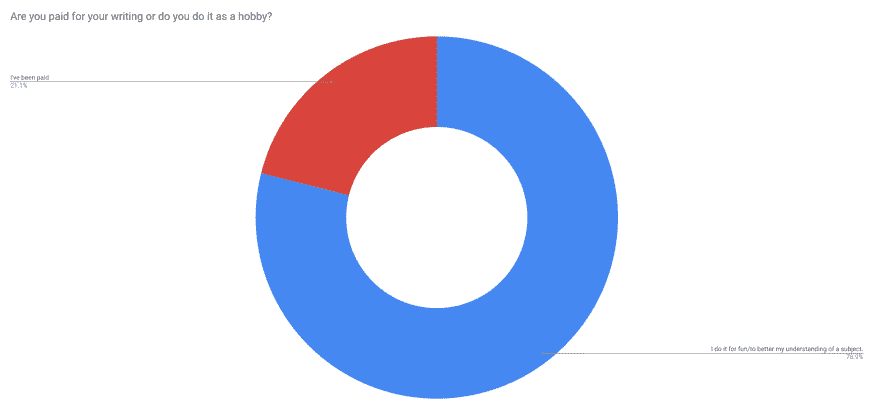

# 我们发表技术文章的地方

> 原文：<https://dev.to/nieds/where-we-publish-technical-writing-5dkg>

今年在 ng-conf，我参加了[技术作家峰会](https://github.com/wesleygrimes/technical-writers-summit)。我做了一个简短的演讲，我想谈谈发表我们所有与会者撰写的技术博客帖子的不同地方和策略。当我准备我的演讲并深入思考这个话题时，我意识到虽然我可以谈论我*做的事情，但这可能不完全代表其他人做的事情。因此，我在活动开始前一周左右做了一个小调查，收集了尽可能多的关于我们在哪里出版、我们为什么选择这些地方以及其他相关问题的信息。以下是我挖掘数据后发现的一些要点:*

# 最多只发布到一个平台

这第一个让我有点惊讶。人们可以有很多选择来发表他们的文章，我认为大多数会分散开来，就像很多人在社交媒体上做的那样。我怀疑这可能是由于跨发布到不同地方的困难(稍后将详细介绍)。

# 中等仍是生力军

在人们发帖的所有不同地方中，Medium 吸引了大多数只在一个地方发帖的人，其次是自主博客。这相当于说自己只在媒体上发帖的人和说自己在某种平台组合上发帖的人的总和。中号也是所有选项中使用最多的。

这也是有意义的，因为在回应中有一个共同的线索，那就是想把读者放在哪里。如果我们想让人们在某种程度上阅读我们写的东西，我们需要去找他们。现在，他们中的很多人都在媒体上。

# 痛点

我也对一些作家在出版他们的作品时遇到的困难感兴趣。不同平台上的博客文章中的代码块/格式/突出显示是经常被提及的要点之一。这是可以理解的，因为在一些平台上，用适当的高亮显示代码块是很容易的，而在其他平台上，比如 Medium，您经常需要在不高亮显示的情况下选择容易嵌入的代码块，或者管理一个或多个单独的 gists 来以您喜欢的方式嵌入代码示例。

另一个常见问题是不同平台之间的交叉发布有多困难。为帖子导入内容有时很麻烦，在某些情况下，如果处理不当，会导致流量远离你的预期目标，这是因为像 DEV.to 或 Medium 这样的东西相对于你自己的个人博客而言在 SEO 中的权重很大。

> 快速提示:DEV.to 和 Medium 都允许你为文章设置规范的 url。如果你是交叉发布的新手，这是一个很好的开始。

# 大多数人写作是因为他们喜欢

超过 21%的受访者曾因写作而获得报酬，而大约 79%的人表示，他们写技术文章是因为这有助于他们对概念的理解，或者只是因为他们喜欢这样做。这太棒了(两方面都是)！我认为这就是技术博客社区的伟大之处——这里充满了希望在发展自己技能的同时与他人分享知识的人。

# 结论

这是一个有趣的练习。鉴于回应的样本量相对较小，在回应中发现了一些有趣的信息。然而，这只是对更大的技术博客社区的一瞥。我想我想在一年后再尝试一次，看看我们是否能增加回复的数量，并对技术博客社区有一个更好的了解。

正如我在演讲中承诺的，我已经为其他人发布了响应数据。你可以找到下面的链接。看看有没有你能找到的其他外卖！

[https://docs . Google . com/spreadsheets/d/12pkxithkpbgm 4 L3 cdqfbesm 4 aj0p _ 7 xos safs _ z6Uw/edit？usp =共享](https://docs.google.com/spreadsheets/d/12PKxiThkpbgm4L3CdqfBesm4aJ0P_7XoSCsafS_z6Uw/edit?usp=sharing)