# 我如何将 Codesandbox 应用程序部署到 Heroku

> 原文：<https://dev.to/oyetoket/how-i-deployed-codesandbox-apps-to-heroku-ndo>

当我们在 Codesandbox 上配对代码并试图部署到 Heroku 时，我和一个朋友讨论了在 JavaScript 的帮助下 web 已经走了多远，以及一切将如何最终从浏览器运行。

是的，在 Codesandbox 上，你几乎可以在 Visual Studio 代码或任何其他代码编辑器上做任何你能做的事情。另一个好处是你可以直接部署到 Zeit，Netlify 和现在 Heroku 在我的 Codesandbox 分叉自定义部署脚本。

在我最近的一篇推文中，我提到了部署到 Heroku 的能力，我还谈到了 Heroku 可能的部署模式。

> 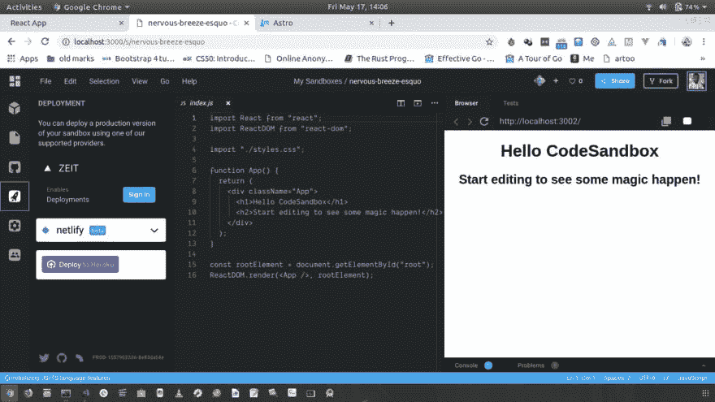oye toke Toby[@ oye toket](https://dev.to/oyetoket)从 codesandbox 部署到 heroku 现在几乎可以在我的 fork 上实现了。[@ code sandbox](https://twitter.com/codesandbox)[@ developer ayo](https://twitter.com/developerayo)[@ coder _ bl vck](https://twitter.com/coder_blvck)2019 年 5 月 17 日下午 13:30[](https://twitter.com/intent/tweet?in_reply_to=1129378697188990976)[](https://twitter.com/intent/retweet?tweet_id=1129378697188990976)6[](https://twitter.com/intent/like?tweet_id=1129378697188990976)51

## 部署方式

### 部署到 Heroku URL

这是将沙盒部署到 Heroku 的第一个也是最简单的方法。Heroku 通过使用一个 URL 使用户的部署变得更加容易，通过这个 URL，你可以提供一个模板，这个模板是你试图作为 URL 参数部署的代码的 git repo URL，并且这个 repo 必须包含一个 app.json 用于你的应用程序设置。您还必须在部署任何东西之前登录您的 Heroku 帐户。

以下是 url 格式的示例:

```
https://heroku.com/deploy?template=<github_url> 
```

下面是部署 react 应用程序的示例 app.json 文件:

```
{
  "name": "React Bare App",
  "description": "A barebones React app",
  "repository": "https://github.com/CITGuru/newTapp",
  "logo": "http://upload.wikimedia.org/wikipedia/commons/thumb/a/a7/React-icon.svg/220px-React-icon.svg.png",
  "keywords": ["node", "react", "static"],
  "buildpacks": [
    {
      "url": "heroku/nodejs"
    },
    {
      "url": "https://github.com/heroku/heroku-buildpack-static.git"
    }
  ],
  "scripts": {
    "postdeploy": "npm run build",
  }
} 
```

您可以查看关于 [app.json 模式](https://devcenter.heroku.com/articles/app-json-schema)文档的更多信息。

如果你了解 Heroku，这种方法很容易实现，而且它是我的 fork 中目前支持并准备使用的模式。

### 使用 Heroku Git CLI

这是第二种模式，需要一个特殊的服务器通过提供 GitHub url 或 Codesandbox 提供的代码压缩来托管您的沙箱。我目前在一个 Go 服务器上工作，该服务器执行这个部署任务并能够发送回日志。使用这种方法，您不需要离开 Codesandbox，甚至不需要将代码推送到 GitHub 来部署代码。

背景是您必须提供您的 Heroku 登录详细信息，因为 go 服务器将使用它来部署您的代码。出于安全原因，每次您想要部署时都会询问这个问题。

#### Go 服务器如何工作

它基本上是一个接受请求的基本 HTTP 服务器。您可以发送一个带有压缩代码或 Github url 和 Heroku 登录信息的请求。它已经有预定义的命令来更好地部署您的应用程序，甚至可以使用您在 app.json 甚至 Procfile 中定义的自定义构建脚本。它使用 Heroku 和 Git 来执行这些任务。

***我不知道这是不是最好的方法，但这肯定管用***

## 现在如何将沙盒部署到 Heroku

现在，让我们进入正题，看看如何使用我的 Consandbox fork 将沙箱部署到 Heroku。

继续派生/克隆我的 [Codesandbox fork](https://github.com/CITGuru/codesandbox-client) 并按照[贡献自述文件](https://github.com/CITGuru/codesandbox-client/blob/master/CONTRIBUTING.md)设置它供本地使用。确保您在 Codesandbox 上拥有一个帐户，并在本地登录到您的帐户(查看贡献指南以了解如何操作)。

一旦你完成设置并登录你的账户，你就可以开始了。

创建一个新的 react 沙箱，之后点击更多按钮，然后点击 **Fork 沙箱**。

[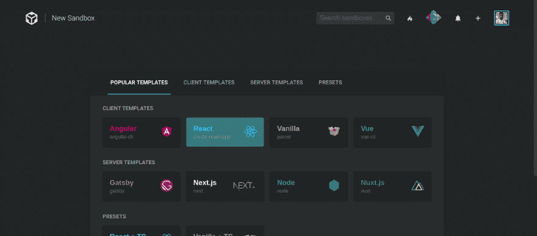](https://res.cloudinary.com/practicaldev/image/fetch/s--eApgP57v--/c_limit%2Cf_auto%2Cfl_progressive%2Cq_auto%2Cw_880/https://thepracticaldev.s3.amazonaws.com/i/m8q6sh9nt05ktv8vxox6.png)
[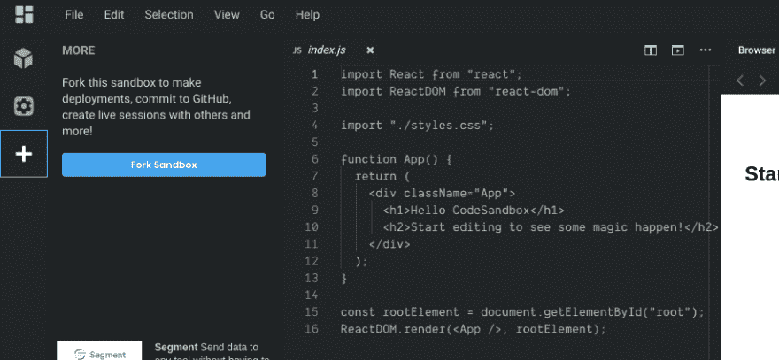T6】](https://res.cloudinary.com/practicaldev/image/fetch/s--tMzV6c-o--/c_limit%2Cf_auto%2Cfl_progressive%2Cq_auto%2Cw_880/https://thepracticaldev.s3.amazonaws.com/i/ikgjvh5fp4j0fw2yk5he.png)

添加一个名为 app.json 的新文件，设置如下:

```
{  "name":  "myaspp",  "logo":  "http://upload.wikimedia.org/wikipedia/commons/thumb/a/a7/React-icon.svg/220px-React-icon.svg.png",  "buildpacks":  [  {  "url":  "heroku/nodejs"  },  {  "url":  "https://github.com/heroku/heroku-buildpack-static.git"  }  ],  "scripts":  {  "postdeploy":  "npm run build"  }  } 
```

以上是我们将用于部署新 react 应用程序的设置。现在让我们解释一下 app.json 中的内容:

**名称**:应用的名称。
**logo**:app 的 logo。它出现在 favicon。
**buildpacks** :这是一个非常重要的设置，帮助我们定义我们的应用程序 buildpacks。`heroku/nodejs`是在 Heroku 上运行 nodejs 应用的官方 Heroku 构建包，而`https://github.com/heroku/heroku-buildpack-static.git`是通过提供构建文件夹来运行静态文件的非官方 Heroku 构建包。
**脚本**:这也非常重要，因为有了它，我们可以在 Heroku 部署你的应用之前运行定制命令和构建脚本。`postdeploy`是脚本的命令入口，所以要确保从那里调用其他命令。

[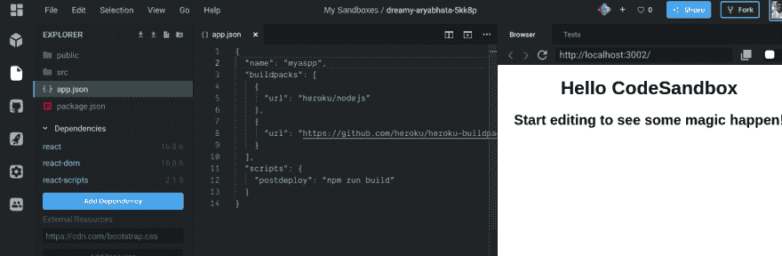](https://res.cloudinary.com/practicaldev/image/fetch/s--R8vgljII--/c_limit%2Cf_auto%2Cfl_progressive%2Cq_auto%2Cw_880/https://thepracticaldev.s3.amazonaws.com/i/4kcnxyortq7z7cb4sd37.png)

你可以在 app.json 中定义许多其他的东西，比如你的环境变量、附加组件、docker-images、dyno 以及其他你可以在 Heroku 中定制的东西。

您还可以为自定义的 dyno 进程添加一个`Procfile`。

现在我们需要为`heroku-build-static` :
添加一个设置文件`static.json`

```
{  "root":  "build/"  } 
```

这用来告诉`heroku-build-static`在哪里可以找到我们的构建文件。`heroku-build-static`带有一个 express 服务器，为构建文件夹中的静态文件提供服务。

现在接下来要做的是部署，但是我们需要先从 Codesandbox 把我们的代码推送到 GitHub。

所以点击 GitHub 图标，输入任意名称，然后点击 create repository 将代码推送到 GitHub。

[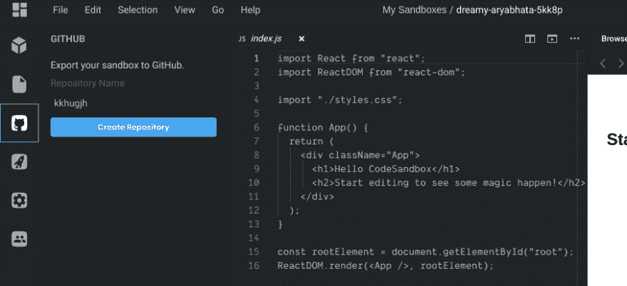](https://res.cloudinary.com/practicaldev/image/fetch/s--B0iCASS7--/c_limit%2Cf_auto%2Cfl_progressive%2Cq_auto%2Cw_880/https://thepracticaldev.s3.amazonaws.com/i/9idp31ecg5q8tyj62ebe.png)

一旦完成，点击更多按钮，然后点击沙盒。

[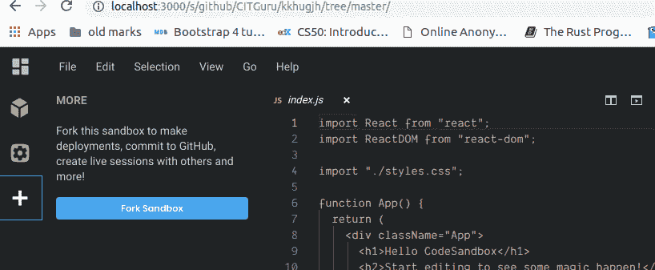](https://res.cloudinary.com/practicaldev/image/fetch/s--RVWQTLhd--/c_limit%2Cf_auto%2Cfl_progressive%2Cq_auto%2Cw_880/https://thepracticaldev.s3.amazonaws.com/i/el8uu4u6onvkk50pfmgk.png)

在此之后，我们现在可以使用新的 deploy to Heroku 特性来部署我们的应用程序。

点击 deployment，您应该会看到类似下面的内容，点击 Heroku，然后点击 deploy。

[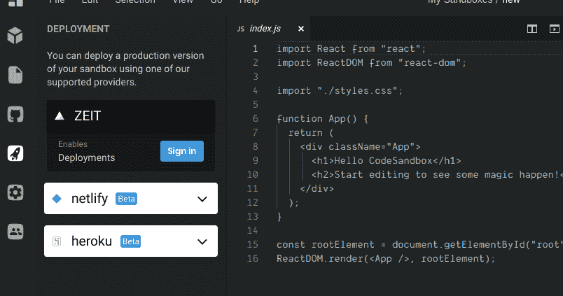](https://res.cloudinary.com/practicaldev/image/fetch/s--McRfpzZR--/c_limit%2Cf_auto%2Cfl_progressive%2Cq_auto%2Cw_880/https://thepracticaldev.s3.amazonaws.com/i/2zl6g5nmc84leev5966i.png)
[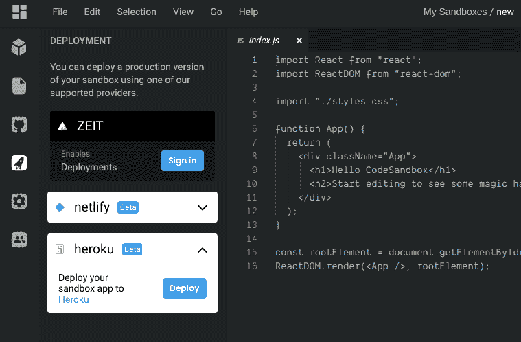T6】](https://res.cloudinary.com/practicaldev/image/fetch/s--FRWDunpN--/c_limit%2Cf_auto%2Cfl_progressive%2Cq_auto%2Cw_880/https://thepracticaldev.s3.amazonaws.com/i/7o523sdtub38mumrne6s.png)

将出现一个弹出窗口，单击 deploy，您将被带到 Heroku 页面，在那里您将开始部署过程并查看您的应用程序构建日志。

[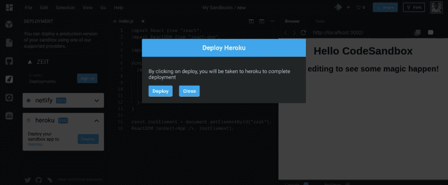](https://res.cloudinary.com/practicaldev/image/fetch/s--ZZ0IbfC3--/c_limit%2Cf_auto%2Cfl_progressive%2Cq_auto%2Cw_880/https://thepracticaldev.s3.amazonaws.com/i/qab27omri9p8rupzzc78.png)

如果您没有登录 Heroku，系统会提示您登录 Heroku 帐户。

页面打开后，输入您喜欢的 URL，然后单击部署应用程序。

[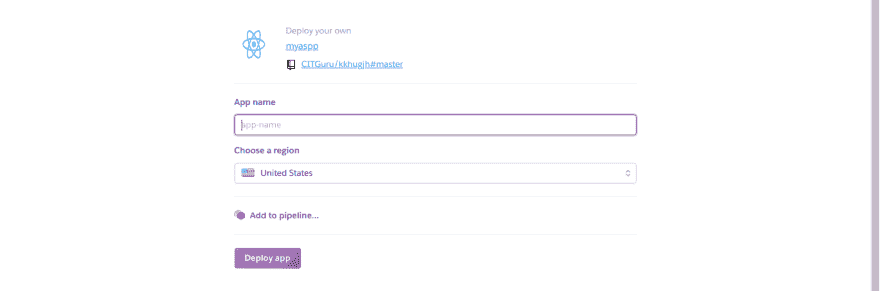](https://res.cloudinary.com/practicaldev/image/fetch/s--7YA_OkvZ--/c_limit%2Cf_auto%2Cfl_progressive%2Cq_auto%2Cw_880/https://thepracticaldev.s3.amazonaws.com/i/o66l0yzk9061liqdm177.png)

然后等待您的应用程序部署并构建日志和流程。

[](https://res.cloudinary.com/practicaldev/image/fetch/s--F6wBDLmo--/c_limit%2Cf_auto%2Cfl_progressive%2Cq_auto%2Cw_880/https://thepracticaldev.s3.amazonaws.com/i/kz9ufmac7txarfqkp893.png)

Tada，成功了！

[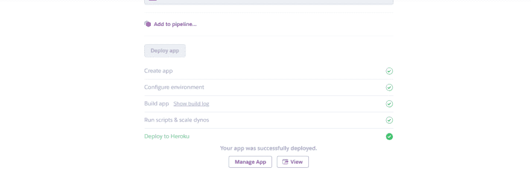](https://res.cloudinary.com/practicaldev/image/fetch/s--dWFpUU1V--/c_limit%2Cf_auto%2Cfl_progressive%2Cq_auto%2Cw_880/https://thepracticaldev.s3.amazonaws.com/i/kekvtlasa00yqkyps4jx.png)

这是我们的应用程序:[https://kkgugjh.herokuapp.com/](https://kkgugjh.herokuapp.com/)

我试过用这种方法部署 vue 和 angular 应用程序，一切都很好。

就像我之前说的，如果你了解赫罗库，这将会非常容易。

我已经爱上了 Codesandbox，并且愿意加入他们的开发团队。

我可能会在 Codesandbox 上写更多的文章，因为我也有一个不同的分支，我正在努力工作，以便能够在 Django 应用程序上工作，也许以后会在 Ruby 上工作。但这仍然是遥不可及的，没有足够的时间来研究它。

如果你喜欢这篇文章，请用心分享。