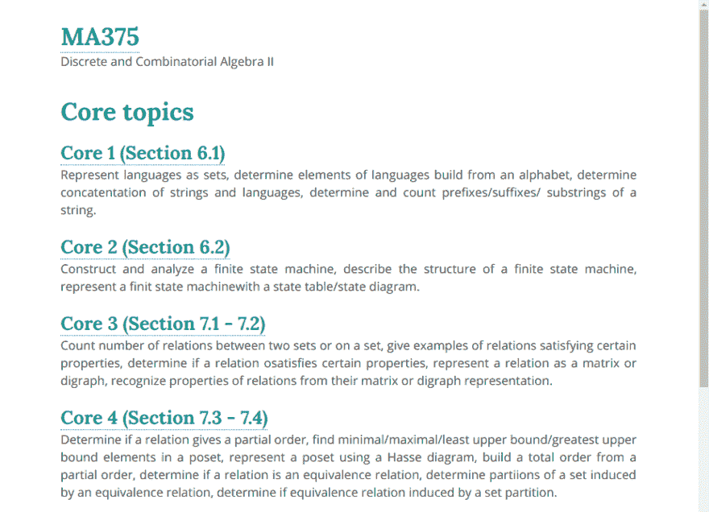
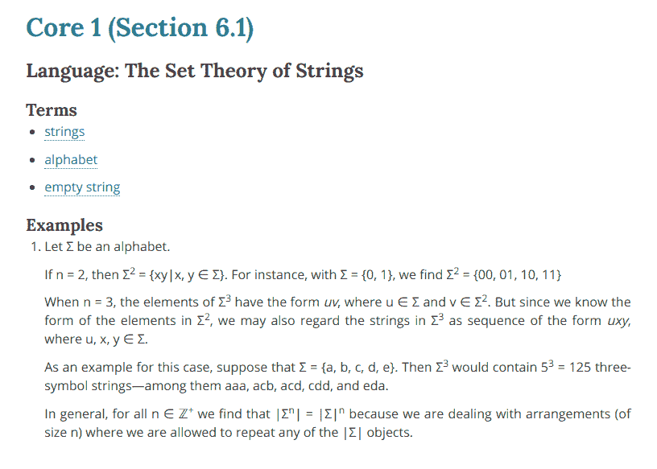
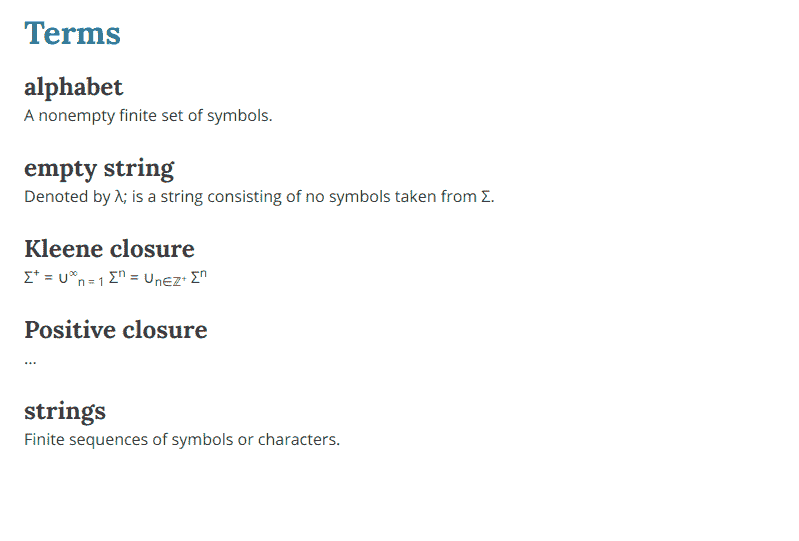

# 如何通过制作网站来准备考试

> 原文：<https://dev.to/ashleemboyer/how-to-study-for-a-test-by-making-a-website-4m4l>

由于我每周四天一节课，每天要开 1.5 个小时的车，我在工作之外没有太多时间写代码。我还在 Twitter 上看到很多人在谈论 React 或 Gatbsy，这让我更想深入了解他们。

所以，我正在做一个关于离散和组合数学 II 的信息网站，来学习*和*练习我的盖茨比技巧。😉课程材料已经被很好地分开了:7 个高级主题和 6 个核心主题。到目前为止，每个页面都有一个链接，从主页链接到一个简短的描述。

<figure>

<figcaption>Preview of the home page.</figcaption>

</figure>

在每一页上，我计划在相关教科书部分的重要术语和定义的顶部显示一个列表，并且我还插入了对我最有帮助的例子。

<figure>

<figcaption>Preview of a topic's page.</figcaption>

</figure>

最后，我还创建了一个术语表页面，所有重要的术语和定义都将在这里进行正式描述，并链接到任何其他网站页面。

<figure>

<figcaption>Preview of the terms page.</figcaption>

</figure>

我觉得这样做很无聊，实际上*非常有趣。我也在努力学习一些小东西，比如练习语义 HTML。在查找`<section>`和`<article>`元素之间的差异时，我发现了这个非常酷的帖子。*

 [## HTML 中 div 标签的 7 种替代方法

### Zac Heisey 2 月 20 日 195 分钟阅读

#html #webdev #beginners](/zac_heisey/7-alternatives-to-the-div-tag-in-html-62i)

我希望这篇文章能激励你不择手段去实现你的目标。找出对你有效的策略，然后[完成它](https://dev.to/ashleemboyer/just-do-the-thing-10el)。

* * *

你知道我有时事通讯吗？📬

如果你想在我发布新的博客帖子或宣布重大项目时得到通知，请联系 https://ashleemboyer.com/newsletter。

* * *

*[图片](https://unsplash.com/photos/YoadQb46v6k)由[克雷格·加纳](https://unsplash.com/@craiggarner)在[上 Unsplash](https://unsplash.com) 。*