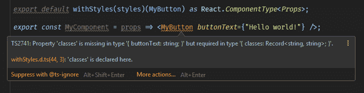

# 用 typescript 键入 React

> 原文：<https://dev.to/fredrikbergqvist/typing-react-with-typescript-53ma>

TypeScript 最近在 React 世界中真正起飞了，这是保持代码文档化并帮助您避免一些错误的好方法。

在过去的几年里，我在几个项目中使用过 TypeScript，都以某种形式涉及 Angular，但从未使用 React，所以当我使用 React 和 TypeScript 开始当前的项目时，我面临一些新的挑战。

## 功能组件

让我们从一个基本的功能组件开始:

```
interface OwnProps {
  myProp:string;
}

const MyButton: React.FC<OwnProps> = (props) => {
  return (<button />);
}

export default MyButton as React.ComponentType<OwnProps>; 
```

Enter fullscreen mode Exit fullscreen mode

我们创建了一个名为`OwnProps`的接口，在这里我们定义了我们希望组件拥有的所有属性。

然后用`OwnProps`来定义组件:`React.FC<OwnProps>`以及我们何时导出组件`as React.ComponentType<OwnProps>`来清楚地表明哪些道具可用。

在这个基本的例子中，这似乎是不必要的，但是，正如我们将进一步看到的，当组件变得更复杂时，这将使我们省去一些麻烦。
这种方法还有助于消除以下错误:

> 错误 TS2604: JSX 元素类型“MyComponent”没有任何构造或调用签名。

## 包装另一个组件

在某些情况下，您可能希望包装另一个组件，并将该组件接口包含在您自己的组件中。当使用库中的基本组件时，通常就是这种情况，因为我们使用 Material UI(简称 MUI)作为基本组件库，所以我将在示例中使用它。

```
interface OwnProps {
  buttonText:string;
}
type Props = OwnProps & ButtonProps;

const MyButton: React.FC<Props> = ({buttonText, ...rest}) => {
  return (<Button {...rest}>{buttonText}</Button>); };

export default MyButton as React.ComponentType<Props>; 
```

Enter fullscreen mode Exit fullscreen mode

`Props`类型可以看作是组件将包含的所有部分的总和。在这种情况下，我们想使用 MUIs 按钮组件中的`ButtonProps`,将其与我们自己的合并，并向组件的消费者公开这两个道具。

这仍然不是很先进，但是因为我们使用了 MUI，我们也使用了 JSS 进行造型，所以让我们把它添加到混合中！

## 使用 WithStyles 和 WithTheme

由于我们使用 MUI，我们用 JSS 处理样式，生成的 CSS 类通过`withStyles` HOC 注入。这导致了一些问题，因为包含类名的类对象被注入到你的道具中，要使用类，你需要在你的道具类型中包含该对象。

幸运的是，我们有 WithStyles 类型来帮助我们！
`WithStyles<typeof styles>`接受样式对象的泛型类型参数，因此您不必担心它会影响您的类型。

[材料 UI](https://material-ui.com/guides/typescript/) 的 typescript 部分更详细地解释了与 Styles 有关的问题，如果您打算使用 MUI 和 TypeScript，请做好准备。

```
const styles: (theme: Theme) => StyleRules<string> = theme =>
  createStyles({
    root: {
      margin: theme.spacing.unit
    }
  });
interface OwnProps {
  buttonText:string;
}
type PublicProps = OwnProps & ButtonProps;
type Props = PublicProps & WithStyles<typeof styles>;
const MyButton: React.FC<Props> = ({classes, buttonText, ...rest}) => {
  return (
    <Button {...rest} className={classes.root}>
      {buttonText}
    </Button>); };
export default withStyles(styles)(MyButton) as React.ComponentType<PublicProps>; 
```

Enter fullscreen mode Exit fullscreen mode

我们在这里添加了一个`PublicProps`类型，并在导出组件时使用它来代替 Props 类型。这当然是因为我们也想使用 WithStyles，但不想向任何使用按钮的人公开它。

如果我们使用 Props 类型而不是 PublicProps，我们会得到一个讨厌的 TypeScript 错误，抱怨 classes 属性丢失。

[](https://res.cloudinary.com/practicaldev/image/fetch/s--ZUExbiCe--/c_limit%2Cf_auto%2Cfl_progressive%2Cq_auto%2Cw_880/https://thepracticaldev.s3.amazonaws.com/i/yzbeicf42yxovopp1zfl.PNG)

## 还原连接和合成

但是没有状态处理会有什么反应呢？我们为此使用 Redux，因此让我们连接 MyButton 并从 state 中获取 buttonText 属性。

```
const styles: (theme: Theme) => StyleRules<string> = theme =>
  createStyles({
    root: {
      margin: theme.spacing.unit
    }
  });

interface StateProps {
  buttonText:string
}
interface DispatchProps {
  dispatch: ThunkDispatch<IAppState, undefined, Action>;
}
interface OwnProps {}
type PublicProps = OwnProps & ButtonProps;
type Props = PublicProps & 
             DispatchProps & 
             StateProps & 
             WithTheme &
             WithStyles<typeof styles>;

const MyButton: React.FC<Props> = ({classes, buttonText, ...rest}) => {
  return (
    <Button {...rest} className={classes.root}>
      {buttonText}
    </Button>); };

const mapStateToProps = (state: IAppState): StateProps => {
  return {
    buttonText: state.buttonText
  };
};

export default compose(
  withStyles(styles, { withTheme: true }),
  connect<StateProps, DispatchProps, OwnProps, IAppState>(mapStateToProps)
)(MyButton) as React.ComponentType<PublicProps>; 
```

Enter fullscreen mode Exit fullscreen mode

我们还没有开始为我们的州使用钩子，所以我们用旧的连接。因为我们现在同时使用了`connect`和`withStyles`，我们需要使用`compose`来合并它们。

我们创建`StateProps`作为`mapStateToProps`和`DispatchProps`的返回类型，如果我们不添加`mapDispatchToProps`函数，它们将默认返回调度函数。在这种情况下，我们使用 Thunk，所以如果你使用其他工具，你需要使用它。

我还添加了一个在组件中使用 MUI 主题的例子，这是通过添加`{ withTheme: true }`作为`withStyles`的第二个参数来完成的。
这将注入一个主题属性到你的道具中，所以我们需要使用来自 MUI 的`WithTheme`在我们的`Props`类型中指定它。

## 奖励:输入使用状态挂钩

不是真正的火箭科学，但很高兴知道！

```
const [state, setState] = useState<string>("Hello world!")` 
```

Enter fullscreen mode Exit fullscreen mode

## 结束注

当开始时出现许多不清楚的错误时，TypeScript 可能会非常令人沮丧，所以我希望这篇文章能够有所帮助或启发，我们花了一些时间来确定适合我们的 TypeScript 模式，并帮助我们减少在使用不同库时可能出现的大多数错误。

欢迎在评论栏留下任何建议。

GitHub 提供了代码示例的要点。