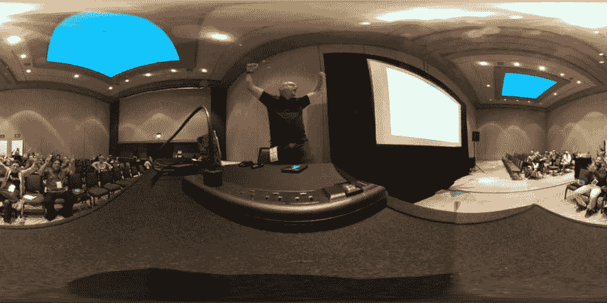

# 如何练习文学🔥介绍会；展示会

> 原文：<https://dev.to/azure/how-to-practice-for-a-lit-presentation-51n9>

我花了十年时间做技术报告，在此期间我学到了一些东西。这个系列的目的是与你分享这些经验。这些不是让你成为顶级演讲者的最佳实践或秘密提示，而是基于个人经验的实用建议。

在这个系列中:

*   [为什么说话？](https://dev.to/azure/a-guide-for-everyone-who-wants-to-give-technical-presentations-53bo)
*   [在哪里说话？](https://dev.to/azure/how-to-choose-where-to-give-your-technical-presentation-5g14)
*   [谈话格式](https://dev.to/azure/the-many-flavors-of-technical-presentations-3fjj)
*   [征集演示文稿](https://dev.to/azure/the-amazing-secret-to-crafting-conference-submissions-that-don-t-suck-hgf)
*   [制作您的演示文稿](https://dev.to/azure/build-a-bomb-diggity-technical-presentation-mic-drop-optional-1fhb)
*   练习和反馈(你在这里)
*   [准备出行](https://dev.to/azure/what-s-in-the-bag-packing-tips-for-technical-presentations-4k6n)
*   [你演讲的那天](https://dev.to/azure/it-s-time-to-talk-the-day-of-your-presentation-2kpl)
*   [演讲和总结后](https://dev.to/azure/after-your-talk-the-power-of-leverage-2enj)

# 👉🏻实践和反馈

你可能听过这样一句话:“熟能生巧。”我不期望完美，但每次我做技术报告时，我都在寻求进步。我的目标是对内容、时机以及每次站在观众面前可能出现的任何打嗝感到舒服。要做到这一点，需要一些练习，或许令人惊讶的是，即使是在我独自一人的时候，也要走出我的舒适区。

> Jeremy likness⚡️[@ Jeremy likness](https://dev.to/jeremylikness)我爱❤我从家人那里得到的支持。我刚刚完成了我即将到来的 [@CodeStock](https://twitter.com/CodeStock) 🗝主题演讲的排练。我妻子笑了🤣。我的鹦鹉🦜尖叫道😱对着我。我的狗🐕没什么印象。
> 
> 越⏲时间似乎是我想要的。
> 
> 几周后在那里见！2019 年 3 月 28 日下午 18:45021

这篇文章是关于我在练习发表技术演讲时开发的技术，所以我第一次演讲时就像第三次或第四次演讲时一样自信。

> 在我职业生涯的大部分时间里，我是一名全职软件开发人员和/或顾问，并在我的“空闲时间”准备/提交演示文稿，也就是说在几个小时后，通常是在最后一分钟。演示是我目前角色的一部分，所以我通常比其他“兼职”做演示的人有更多的时间来练习和准备。我分享了我所有的建议，但是请不要觉得你必须在你有限的时间内完成所有的事情。找到最有效的方法，切掉有意义的捷径*感谢*为他人的利益贡献你的时间。

## ✅ The Check List

我的一个好朋友和同事劳伦

## [洛朗·布戈尼](/lbugnion)

[Passionate about software, architecture, cloud. Dad. Biker. Drone flyer.](/lbugnion)

[LBugnion](https://twitter.com/LBugnion)[LBugnion](https://github.com/lbugnion)[http://galasoft . ch](http://galasoft.ch)

shared with me a brilliant technique for preparing technical presentations. It's simple but powerful. As you craft your presentation, create a checklist in the app of your choice (I prefer OneNote) with preparation steps. This ensures everything is setup appropriately. As you practice your presentation, you modify the checklist until everything is dialed in. It's not a walk-through of the demo, but setup steps and reminders to ensure everything is prepared.

<figure>

<figcaption>Example OneNote checklist</figcaption>

</figure>

我利用 [Windows 10 虚拟桌面](https://jlik.me/fvq)来安排我的演讲。我在主桌面上设置了我的演示文稿。我启动了一个名为 Windows Mobility Center 的应用程序，它通过抑制通知来帮助进行演示设置。我还使用一个名为 [ZoomIt](https://jlik.me/fvr) 的免费工具在演示过程中进行缩放和注释。如果我需要特别的提醒，我会把它们放在那里。

第二个桌面通常是我放置网络浏览器的地方。在示例中，我展示了两个开发环境，一个在第三个桌面上，另一个在第四个桌面上。这种方式消除了寻找正确窗口的需要，并允许我停留在演示模式。我简单地用`CTRL+Windows+➡`或`CTRL+Windows+⬅`在桌面间导航。

## 万物相同

用你将用来演示的同样的装置来练习是非常重要的。例如，我有一个三屏幕的设置，但是当我演示时，我经常必须复制我的桌面。所以，我练的是一屏而不是三屏。大多数投影仪都要求 1080p 分辨率，所以我总是把显示器设置为 1920x1080。实践你的目标决心是非常重要的！有些窗口在不同的分辨率下可能表现不一样，没有什么比打开一个页面发现它的一部分在该分辨率下无法呈现更令人沮丧的了。

确保设置的字体和主题在光线不足的情况下可以从房间后面看到。我使用 ZoomIt 来强调演示文稿的重要区域，但是使用大的、可见的字体总是最好的方法。尽管黑色主题很受欢迎，但在投影屏幕上却不容易阅读。除非我知道深色主题的颜色和字体足够大，对比度足够明显，否则我总是使用浅色或高对比度的主题。当你增加字体大小时，一些终端会变得不稳定，所以用你要展示的字体大小来练习。

## 🎦录像

这可能会让一些人感到惊讶，但 Wi-Fi 和互联网并不总是可用的。如果您的演示依赖于互联网，最好将其录制下来作为备份。有些主持人从来不做现场直播，总是呈现录制的内容，而像我这样的其他人则喜欢尽可能多地做现场直播，但有视频作为依靠。如果有一个过程需要很长时间，我也可以记录下来以压缩等待时间。如果你已经在练习你的视频了，为什么不录下来呢？Windows 10 具有内置的功能(从技术上讲，它是用于游戏的，但谁会关注它呢？)按下`Windows+G`。我用的是 Camtasia Studio。

我的偏好是录制没有音频的视频，然后作为演示的一部分练习播放。这样我就可以在他们演奏时现场解说，而不必担心会场上是否有音频。演示结束后，我可以随时回去给视频配音，然后发布给大家使用。

## 👥观众

大多数时候，自言自语是不受欢迎的，但这是我反对的时候。我已经学会了在一个空荡荡的房间里舒服地展示(或者，在某些情况下，我的德国牧羊犬是一个非常专注的听众)。向虚幻的观众展示可能看起来很奇怪，但是熟悉这种方法会有很大的帮助。首先，浏览实际的演示会让你了解过渡是什么感觉，可能会出现什么技术问题，最重要的是演示需要多长时间。每个人都是不同的，但我发现我自己比在观众面前表现得更快，所以如果我的目标时间段是 60 分钟，我会在个人练习中争取 50 分钟。其他人发现他们练习得更慢，因为在真正的演示过程中肾上腺素和兴奋占据了上风。

<figure>

<figcaption>Getting the audience excited for a talk</figcaption>

</figure>

> 查看 360 张会议照片的图库

从心理上来说，我对自己的表现越自如，我在舞台上就越自信。你的里程数可能会有所不同，但我相信这是因为在没有观众的情况下做这件事需要我对自己更舒服。这反过来让我在别人面前更自在。如果您选择这种方式，请考虑录制演示文稿。您可以与他人分享录音，以获得反馈，并在实际活动开始前完善您的会议。

最后，在我第一次站在舞台上之前，我会寻找每一个机会与我的同事分享我的演讲。我将建立一个屏幕分享或网上研讨会，并介绍这种方式。我更喜欢人们静音，这样我就能听到反馈(例如，当你开了一个玩笑并得到笑声时，这总是积极的)。向同事展示可能会令人生畏，但我发现他们为建设性的反馈提供了一个“安全的地方”。能够精炼我的讲话并解决问题建立了我的信心并提高了会议的整体质量。

## ⛔不要过度练习！

想要练习每一个单词、手势和细微差别是很诱人的。对一些人来说，这很有效，是感到自信和准备好的唯一方法。如果是你，请无视我的建议。你做你的！对我来说，我发现过度练习让我的演讲感觉不自然，更像是精心排练过的演讲。我的目标是建立联系，所以我想尽可能真实可信。所以，一个会话我只练几次。这是我的典型流程:

1.  为计时练习一次
2.  添加或删除内容并解决任何演示问题
3.  现场练习/网络研讨会/记录并分享反馈
4.  根据反馈进行修改
5.  再练习一次以验证结果

例外情况是当我的演示文稿有很多实时编码时。如果是这样的话，我会多练习几次来掌握演示部分的时间。

> 演讲中把握时机是一门艺术。我总是能够接近我的目标时间。演示是管理时间线的好方法。如果我发现时间不够了，我会展示一个已完成的产品，并遍历代码以节省时间。如果我发现我走得太快了，我会遍历更多的现场编码，并从头开始构建更多的应用程序。虽然我个人总是试图在目标时间的 5 分钟内完成，将时间留在问题的最后，但我也注意不要“填充”与演示不太相符的额外内容。如果你已经涵盖了所有相关的要点，提前结束也没关系。

我的一位导师曾经告诉我，“你知道你所知道的。”他的意思是，一场精彩演讲的关键是你在演讲前几周投入的内容，而不是前一天晚上。我很少在演讲的那个星期练习演讲。这给了我更多的时间放松和心理准备，我相信这提供了一个更真实和有机的体验。

🗣 **我们来讨论一下**你用什么技巧来练习演讲？有什么小技巧想补充？用下面的评论吧！

**上一篇** [打造你的简报](https://dev.to/azure/build-a-bomb-diggity-technical-presentation-mic-drop-optional-1fhb)
T5】下一篇 [准备旅行](https://dev.to/azure/what-s-in-the-bag-packing-tips-for-technical-presentations-4k6n)

> 我已经分享了用户组演示和网络研讨会的视频。本文的示例会话是我为一个用户组演示的网络研讨会。这是一种有趣的互动形式，允许我将准备好的演示与现场的无脚本对话结合起来。

[https://www.youtube.com/embed/xrzpYMstTvc](https://www.youtube.com/embed/xrzpYMstTvc)