# 学习 Kubernetes，第一部分，基础知识，部署和 Minikube

> 原文：<https://dev.to/azure/kubernetes-from-the-beginning-part-i-4ifd>

在 [Twitter](https://twitter.com/chris_noring) 上关注我，很乐意接受您对主题或改进的建议/Chris

> Kubernetes 是关于编排容器化应用的。Docker 非常适合你的前几个容器。一旦你需要在多台机器上运行，需要伸缩和分配负载等等，你就需要一个 orchestrator——你需要 Kubernetes

这是 Kubernetes 系列文章的第一部分，因为这个主题很大！。

*   第一部分-从头开始，第一部分，基础知识、部署和 Minikube **我们到了**
*   [第二部分介绍服务和标签](https://dev.to/azure/kubernetes-part-ii-revisiting-pods-and-nodes-and-introducing-services-and-labeling-5fi7)在这一部分中，我们加深了对 pod 和节点的了解。我们还引入了服务和标签，使用标签来查询我们的工件。
*   [第三部分扩展](https://dev.to/softchris/kubernetes-part-iii-scaling-1mmi)这里我们将介绍如何扩展我们的应用
*   [第四部分-自动缩放](https://dev.to/azure/kubernetes-from-the-beginning-part-iv-autoscaling-54l6)在这一部分中，我们将了解如何设置自动缩放，以便我们能够处理突然大量增加的传入请求

在这一部分，我希望涵盖以下内容:

*   **为什么 Kubernetes** 和一般的编排
*   **Hello world** : Minikube 基础知识，通过 Minikube 交流，简单部署示例
*   **集群和基本命令**，节点、
*   **部署**，什么是部署应用
*   **单元和节点**，解释概念和故障排除

## 为什么要编排

嗯，一切都是从容器开始的。容器让我们能够创建可重复的环境，因此开发、暂存和生产看起来和功能都一样。我们获得了可预测性，并且它们也是轻量级的，因为它们从主机操作系统中获取资源。对于开发人员和运营人员来说，这是一个巨大的突破，但是容器 API 实际上只适合一次管理几个容器。更大的系统可能由 100 个或 1000 多个容器组成，也需要进行管理，这样我们就可以做诸如*调度*、*负载平衡*、*分发*等事情。

此时，我们需要*编排*系统处理所有这些容器实例的能力。这就是 Kubernetes 的用武之地。

## 资源

*   了解 Kubernetes 的最佳资源之一是谷歌的这个官方网站。
*   [Kubernetes 概述](https://azure.microsoft.com/en-gb/topic/kubernetes/?wt.mc_id=devto-blog-chnoring)对 Kubernetes、其所有部件及其工作原理的概述
*   如果你想试用 AKS，Azure Kubernetes 服务，你需要一个免费的 Azure 账户
*   [云中的 Kubernetes](https://azure.microsoft.com/en-gb/services/kubernetes-service/?wt.mc_id=devto-blog-chnoring)你是否觉得自己已经了解了 Kubernetes 的一切，只是想学习如何使用托管服务？那么这个链接是给你的
*   [AK 上的文件，azure kublers 服务](https://docs.microsoft.com/en-gb/azure/aks/?wt.mc_id=devto-blog-chnoring)azure kublers 服务，一种托管 kublers 服务
*   [AKS 最佳实践](https://docs.microsoft.com/en-us/azure/aks/best-practices?wt.mc_id=devto-blog-chnoring)您已经了解 AKS，并想学习如何更好地使用它？

## Kubernetes

那么我们对 Kubernetes 了解多少？

> 这是一个用于自动化部署、扩展和管理容器化应用程序的开源系统

让我们从名字开始。在希腊语中是舵手的意思，也就是驾驶船只的人。这就是为什么商标看起来像这样，船上的方向盘:

[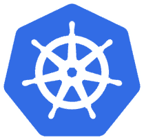](https://res.cloudinary.com/practicaldev/image/fetch/s--uZPqss9X--/c_limit%2Cf_auto%2Cfl_progressive%2Cq_auto%2Cw_880/https://thepracticaldev.s3.amazonaws.com/i/vku4umiwskzohzvl6uy7.png)

又叫 **K8s** 所以 **K** ubernete **s** ，中间的 8 个字去掉了。现在你可以让你的朋友知道为什么它被称为 K8 了。

这里有更多关于它起源的危险知识。Kubernetes 诞生于博格和欧米茄系统。它于 2014 年捐赠给云原生计算基金会 [CNCF](https://www.cncf.io/) 。是用 Go/Golang 写的。

如果我们看过去所有这些琐事知识，它是由谷歌建立的，作为对他们自己处理一吨集装箱的经验的回应。它也是开源的，并且经过了实战测试，可以处理真正的大型系统，比如行星级的大型系统。

所以销售口号是:

> Kubernetes 每周运行数十亿个集装箱，可以在不增加运营团队的情况下进行扩展

听起来很神奇吧，数十亿个容器，因为我们都是谷歌大小。没有吗？:)即使你有类似 10-100 集装箱的东西，那也是给你的。

## 入门

好吧，好吧，假设我买下了这一切，我该如何开始？

> 不耐烦的 ey，当然让我们开始用 Minikube 做一些实际的事情

好的，听起来不错。我是个程序员，我喜欢实用的东西。Minikube 是什么？

> Minikube 是一个让我们在本地运行 Kubernetes 的工具

哦，太好了，我的小机器上有几百万个容器？

> 嗯，不，让我们从几个开始，同时学习 Kubernetes 的基础知识。

### 安装

要安装 Minikube，请转到此[安装页面](https://kubernetes.io/docs/tasks/tools/install-minikube/)

只需几步，我们就可以安装

*   管理程序
*   Kubectl (Kube control tool)
*   迷你库贝

### 运行

通过键入:
让它启动并运行

```
minikube start 
```

Enter fullscreen mode Exit fullscreen mode

它应该是这样的:
[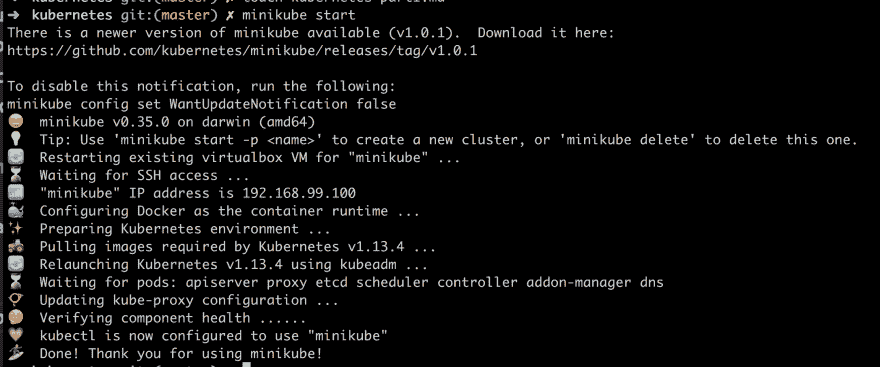](https://res.cloudinary.com/practicaldev/image/fetch/s--TRdRYKpT--/c_limit%2Cf_auto%2Cfl_progressive%2Cq_auto%2Cw_880/https://thepracticaldev.s3.amazonaws.com/i/oovr5vc6pyr0u382hnmo.png)

您还可以确保`kubectl`已经正确安装并运行:

```
kubectl version 
```

Enter fullscreen mode Exit fullscreen mode

应该给你这样的回应:
[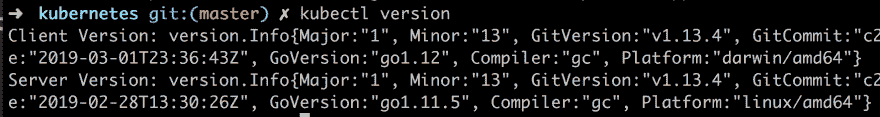](https://res.cloudinary.com/practicaldev/image/fetch/s--PjykpaF7--/c_limit%2Cf_auto%2Cfl_progressive%2Cq_auto%2Cw_880/https://thepracticaldev.s3.amazonaws.com/i/jhaxnc774rhtjx3omh9y.png)

好了，现在我们准备学习 Kubernetes。

## 学习 kubectl 和基本概念

在学习 Kubernetes 的过程中，让我们通过了解更多关于`kubectl`命令行程序来实现这一点，该程序允许我们与我们的集群进行交互，并允许我们在所述集群上部署和管理应用程序。

集群这个词只是指一组相似的东西，但是在 Kubernetes 的上下文中，它指的是一个`Master`和多个叫做`Nodes`的工作机。节点在历史上被称为爪牙
[](https://res.cloudinary.com/practicaldev/image/fetch/s--Wkqf_3FH--/c_limit%2Cf_auto%2Cfl_progressive%2Cq_66%2Cw_880/https://thepracticaldev.s3.amazonaws.com/i/ulp0pywus1ughch1pova.gif) 
，但现在不再这样了。

主节点决定在节点上运行什么，包括计划的工作负载或容器化的应用程序。这就引出了我们的下一个命令:

```
kubectl get nodes 
```

Enter fullscreen mode Exit fullscreen mode

这应该给我们一个这样的结果:
[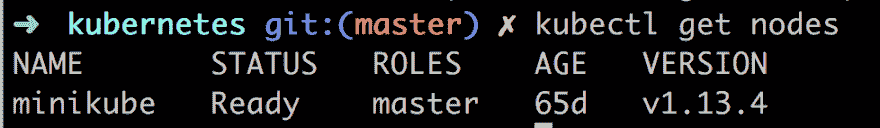](https://res.cloudinary.com/practicaldev/image/fetch/s--7MAteoGF--/c_limit%2Cf_auto%2Cfl_progressive%2Cq_auto%2Cw_880/https://thepracticaldev.s3.amazonaws.com/i/quf19x7deqbzzvm7ef0j.png) 
这告诉我们有哪些节点可以工作。

接下来，让我们试着在 Kubernetes 上用`run`命令运行我们的第一个应用程序，如下所示:

```
kubectl run kubernetes-first-app --image=gcr.io/google-samples/kubernetes-bootcamp:v1 --port=8080 
```

Enter fullscreen mode Exit fullscreen mode

这应该给我们这样的回应:
[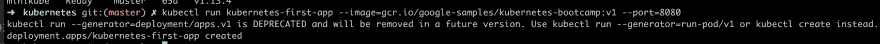](https://res.cloudinary.com/practicaldev/image/fetch/s--pr_BnfSJ--/c_limit%2Cf_auto%2Cfl_progressive%2Cq_auto%2Cw_880/https://thepracticaldev.s3.amazonaws.com/i/4xmdywacngw5gntydxvm.png)

接下来，让我们使用命令:
检查所有东西都启动并运行了

```
kubectl get deployments 
```

Enter fullscreen mode Exit fullscreen mode

这在终端中显示如下:
[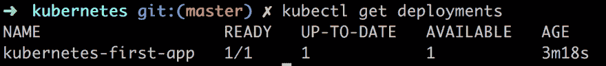](https://res.cloudinary.com/practicaldev/image/fetch/s--5NQg1yin--/c_limit%2Cf_auto%2Cfl_progressive%2Cq_auto%2Cw_880/https://thepracticaldev.s3.amazonaws.com/i/0y4q4f6ixkw3ehud1b6g.png)

在将我们的应用程序放到 Kluster 上时，通过调用`run`命令，Kubernetes 在幕后执行了一些事情，它:

*   **搜索**寻找可以运行应用程序实例的合适节点，只有一个节点，所以选择了它
*   **调度**应用程序在该节点上运行
*   **配置**集群在需要时在新节点上重新调度实例

接下来我们将介绍概念`Pod`，那么什么是 Pod 呢？

Pod 是最小的可部署单元，由一个或多个容器组成，例如 Docker 容器。这就是我们目前要说的关于豆荚的所有内容，但是如果你真的真的想知道更多，请阅读这里的

在这一点上提到 Pod 的原因是我们的容器和应用程序是放在 Pod 内部的。此外，Pods 运行在一个专用的隔离网络中，虽然从其他 Pods 和服务可以看到，但在网络之外无法访问。这意味着我们无法通过`curl`命令来访问我们的应用程序。

但是我们可以改变。现在有不止一种方法向外界公开我们的应用程序，但是我们将使用代理。

现在打开第二个终端窗口，输入:

```
kubectl proxy 
```

Enter fullscreen mode Exit fullscreen mode

这将把`kubectl`公开为一个 API，我们可以用 HTTP 请求进行查询。结果应该是这样的:
[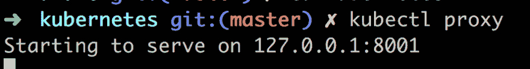](https://res.cloudinary.com/practicaldev/image/fetch/s--b1a9-6rm--/c_limit%2Cf_auto%2Cfl_progressive%2Cq_auto%2Cw_880/https://thepracticaldev.s3.amazonaws.com/i/wtfsul9d2adtwznty8ws.png) 
而不是键入`kubectl version`我们现在可以键入`curl http://localhost:8001/version`并得到相同的结果:
[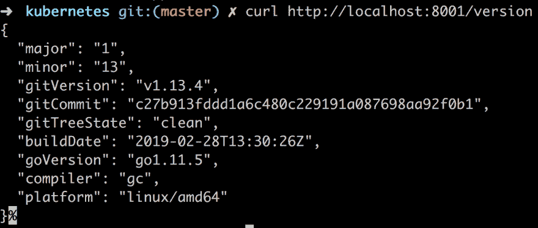](https://res.cloudinary.com/practicaldev/image/fetch/s--tX5BMMKH--/c_limit%2Cf_auto%2Cfl_progressive%2Cq_auto%2Cw_880/https://thepracticaldev.s3.amazonaws.com/i/76x5cvo242ua1d8u5wuz.png)

Kubernetes 内部的 API 服务器根据 pod 名称为每个 pod 创建了一个端点。所以下一步是找出 pod 名称:

```
kubectl get pods 
```

Enter fullscreen mode Exit fullscreen mode

这将列出您拥有的所有 pod，此时应该只有一个 pod，如下所示:
[](https://res.cloudinary.com/practicaldev/image/fetch/s--N-SifBrB--/c_limit%2Cf_auto%2Cfl_progressive%2Cq_auto%2Cw_880/https://thepracticaldev.s3.amazonaws.com/i/krb9t02drc4of97zjsj5.png)

然后你可以把它保存到一个变量里，就像这样:

[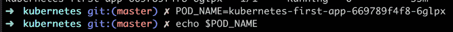](https://res.cloudinary.com/practicaldev/image/fetch/s--kzGzSS9G--/c_limit%2Cf_auto%2Cfl_progressive%2Cq_auto%2Cw_880/https://thepracticaldev.s3.amazonaws.com/i/zupuaoqzo57wosx6sdwr.png)

最后，我们现在可以做一个 HTTP 调用来了解更多关于我们的 pod:

```
curl http://localhost:8001/api/v1/namespaces/default/pods/$POD_NAME 
```

Enter fullscreen mode Exit fullscreen mode

这将给我们一个很长的 JSON 响应(我对它进行了一点修改，但它仍在继续...)

[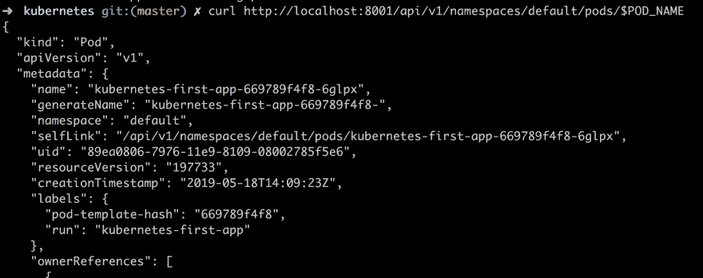](https://res.cloudinary.com/practicaldev/image/fetch/s--CejPXMI4--/c_limit%2Cf_auto%2Cfl_progressive%2Cq_auto%2Cw_880/https://thepracticaldev.s3.amazonaws.com/i/qudludvb4jm5khhpsjfq.png)

对于我们这些应用开发者来说，这可能并不太有趣。我们想知道我们的应用程序做得怎么样。最好的方法就是查看日志。让我们用这个命令来做这件事:

```
kubectl logs $POD_NAME 
```

Enter fullscreen mode Exit fullscreen mode

正如你在下面看到的，我们知道从我们的应用程序获取日志:

[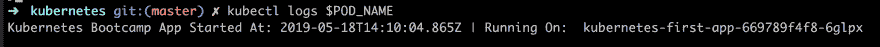](https://res.cloudinary.com/practicaldev/image/fetch/s--oTnBPbqN--/c_limit%2Cf_auto%2Cfl_progressive%2Cq_auto%2Cw_880/https://thepracticaldev.s3.amazonaws.com/i/i4f57ddfcxwq20xipzts.png)

现在我们知道了 Pods 的名称，我们可以做各种各样的事情，比如检查它的环境变量，甚至进入容器查看内容。

```
kubectl exec $POD_NAME env 
```

Enter fullscreen mode Exit fullscreen mode

这会产生以下结果:

[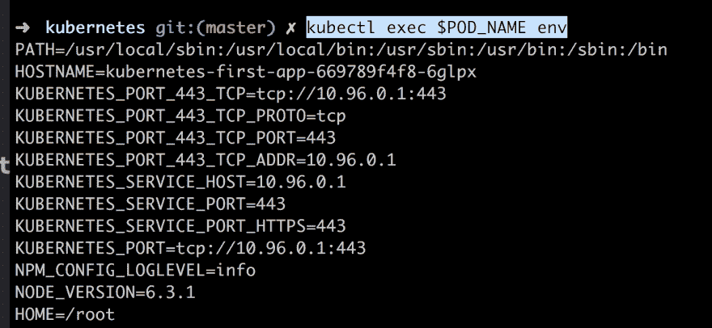](https://res.cloudinary.com/practicaldev/image/fetch/s--pQK7O7Sy--/c_limit%2Cf_auto%2Cfl_progressive%2Cq_auto%2Cw_880/https://thepracticaldev.s3.amazonaws.com/i/zzf260ecdpdrsw11y0th.png)

现在让我们进入容器:

```
kubectl exec -ti $POD_NAME bash 
```

Enter fullscreen mode Exit fullscreen mode

[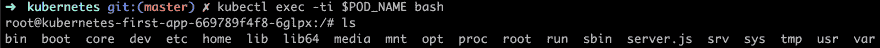](https://res.cloudinary.com/practicaldev/image/fetch/s--CS25W9hw--/c_limit%2Cf_auto%2Cfl_progressive%2Cq_auto%2Cw_880/https://thepracticaldev.s3.amazonaws.com/i/mhfy1iunshteitx8zelm.png)

我们在里面！这意味着我们甚至可以看到源代码的样子:

```
cat server.js 
```

Enter fullscreen mode Exit fullscreen mode

[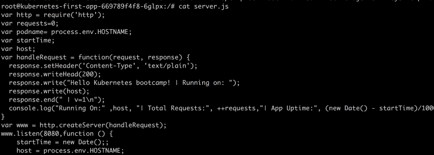](https://res.cloudinary.com/practicaldev/image/fetch/s--kbhXTJKv--/c_limit%2Cf_auto%2Cfl_progressive%2Cq_auto%2Cw_880/https://thepracticaldev.s3.amazonaws.com/i/pd7hlljsiust9uh8tfkg.png)

在我们的容器中，我们现在可以通过键入:
来访问正在运行的应用程序

```
curl http://localhost:8080 
```

Enter fullscreen mode Exit fullscreen mode

## 总结

这就是我们现在要停下来的地方。我们实际学到了什么？

*   Kubernetes，它的起源是什么
*   编排为什么你会很快需要它
*   像主节点、节点和单元这样的概念
*   Minikube、kubectl 以及如何在我们的集群上部署映像

感觉你还有很多东西要学？你说得对，这是一个大话题。

我希望您继续关注接下来的部分，在那里我们将了解更多关于节点、pod、服务、扩展、更新以及最终如何在云中使用托管服务的信息。

点击此处查看[下一部分](https://dev.to/azure/kubernetes-part-ii-revisiting-pods-and-nodes-and-introducing-services-and-labeling-5fi7)